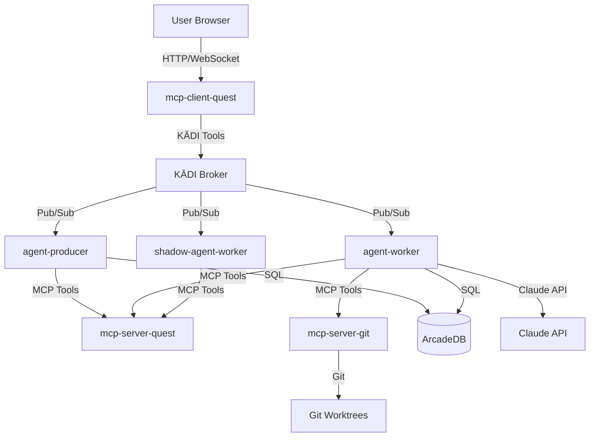

# M3 Design Document: Expand Task Type and Complexity + Dashboard Migration

## Overview

M3 introduces **CEO-style orchestration** where humans provide high-level direction and agent-producer handles multi-agent coordination. This milestone refactors core components to support generic worker/shadow agents with role-based configuration, migrates the dashboard to a dedicated MCP client, and refactors DaemonAgent's command system to use a registry pattern with JSON definitions.

The design focuses on **modularity**, **extensibility**, and **maintainability** by:
- Extracting the dashboard from mcp-server-quest into a dedicated mcp-client-quest
- Replacing hardcoded agent implementations with role-based configuration
- Replacing hardcoded DaemonAgent commands with a generic command registry
- Validating the system with 10+ multi-agent workflow scenarios

This milestone prepares the foundation for M5 (cross-language agents) and M6 (agent factory, advanced communication).

## Steering Document Alignment

### Technical Standards (tech.md)

**Architecture Patterns:**
- **Event-Driven Microservices**: Dashboard uses WebSocket for real-time updates, agents use KĀDI pub/sub
- **Git Worktree Isolation**: Worker agents continue to use isolated worktrees for parallel execution
- **MCP Protocol**: Dashboard invokes tools via KĀDI broker using MCP protocol
- **Human-in-the-Loop**: Dashboard provides approval gates for critical operations

**Technology Stack:**
- **React 19.2.0 + Vite 7.2.4**: Dashboard frontend (tech.md: Dashboard Framework)
- **Express**: Dashboard backend for WebSocket and API routes
- **TypeScript 5.9.3**: All agents and dashboard code
- **C++17 + CMake**: DaemonAgent command system refactoring
- **KĀDI Broker**: Message routing for all components

**Performance Requirements (tech.md):**
- Dashboard response time: Instant (under 100ms)
- Agent response time: Less than 5 seconds for task assignment
- Git operations: Less than 10 seconds for merge operations

### Project Structure (structure.md)

**Naming Conventions:**
- `mcp-client-quest`: Follows `mcp-client-*` naming pattern for MCP clients
- `agent-worker`: Follows `agent-*` naming pattern for agents
- `shadow-agent-worker`: Follows `shadow-agent-*` naming pattern for shadow agents
- Role configuration files: `config/roles/artist.json`, `programmer.json`, `designer.json`

**Directory Structure:**
- Dashboard follows React + Vite structure (structure.md: Dashboard Project Structure)
- Worker/shadow agents follow TypeScript structure (structure.md: Standard Project Structure)
- DaemonAgent follows C++ structure (structure.md: Standard Project Structure)

**Component Categories (structure.md):**
- **MCP Clients**: mcp-client-quest (dashboard)
- **Execution Layer**: agent-worker, shadow-agent-worker
- **MCP Servers**: mcp-server-quest (quest/task management)
- **Infrastructure**: KĀDI broker, ability-file-management

## Code Reuse Analysis

### Existing Components to Leverage

**Dashboard Migration:**
- **mcp-server-quest/src/dashboard/**: Existing React frontend to be extracted
  - Reuse: All React components, hooks, and utilities
  - Modify: Replace direct API calls with KĀDI broker tool invocation
  - New: Express backend for WebSocket and API routes

**Worker Agent Refactoring:**
- **agent-artist/src/**: Existing agent implementation to be generalized
  - Reuse: Core agent logic (task execution, git operations, Claude API integration)
  - Modify: Extract role-specific logic into configuration files
  - New: Role-based initialization system

**Shadow Agent Refactoring:**
- **shadow-agent-artist/src/**: Existing shadow agent implementation to be generalized
  - Reuse: Core monitoring logic (health checks, rollback, notifications)
  - Modify: Extract role-specific logic into configuration files
  - New: Shadow role-based initialization system

**DaemonAgent Command System:**
- **DaemonAgent/src/CommandHandler.cpp**: Existing hardcoded commands to be refactored
  - Reuse: Command execution logic and V8 JavaScript integration
  - Modify: Replace hardcoded commands with registry pattern
  - New: JSON command definitions, CommandRegistry class, validation layer

### Integration Points

**KĀDI Broker Integration:**
- Dashboard invokes tools via KĀDI broker (replaces direct HTTP calls)
- Worker/shadow agents continue to use KĀDI for pub/sub messaging
- All components use `@modelcontextprotocol/sdk` for MCP protocol

**ArcadeDB Integration:**
- Dashboard fetches quest/task data via mcp-server-quest tools
- Worker agents update task status via mcp-server-quest tools
- No direct ArcadeDB access from dashboard or agents

**Git Integration:**
- Worker agents use mcp-server-git tools for worktree operations
- Shadow agents monitor git state for rollback capability
- agent-producer merges branches via mcp-server-git tools

**Claude API Integration:**
- Worker agents use `@anthropic-ai/sdk` for task execution
- agent-producer uses Claude API for task verification
- No changes to existing Claude API integration

## Architecture

### Overall Architecture



**Note:** mcp-server-quest is a stateless MCP server that provides tools. It does NOT directly access ArcadeDB. agent-producer and agent-worker are responsible for persisting quest/task data to ArcadeDB after invoking mcp-server-quest tools.

**Deployment Flexibility:**
- **Local Development (Windows):** All components run on local machine
- **Remote Deployment (DigitalOcean):** All components can be deployed to DigitalOcean droplet
- **Hybrid Deployment:** Dashboard on remote, agents on local (or vice versa)
- **Key Requirement:** All components must be able to reach KĀDI broker (same network or exposed port)

The architecture supports flexible deployment because:
1. KĀDI broker provides network-based communication (not local-only)
2. WebSocket works over HTTP/HTTPS (supports remote access)
3. Dashboard is a standard web application (accessible via browser from anywhere)
4. All components communicate via KĀDI broker (location-independent)

### Modular Design Principles

**Single File Responsibility:**
- Each React component handles one UI concern (e.g., QuestList, TaskCard, ApprovalDialog)
- Each service handles one business domain (e.g., QuestService, TaskService, WebSocketService)
- Each role configuration file defines one agent role (artist.json, programmer.json, designer.json)

**Component Isolation:**
- Dashboard frontend (React) isolated from backend (Express)
- Worker agent core logic isolated from role-specific configuration
- DaemonAgent command definitions isolated from command execution logic

**Service Layer Separation:**
- Dashboard: React components (presentation) → Services (business logic) → KĀDI broker (data access)
- Worker agents: Task execution (business logic) → MCP tools (data access) → ArcadeDB/Git (storage)
- DaemonAgent: Command registry (business logic) → Command handlers (execution) → V8 runtime (scripting)

**Utility Modularity:**
- Dashboard utilities: WebSocket client, KĀDI tool invoker, error handler
- Worker agent utilities: Role loader, git helper, Claude API wrapper
- DaemonAgent utilities: JSON parser, command validator, parameter converter

## Components and Interfaces

### Component 1: mcp-client-quest (Dashboard)

**Purpose:** Web dashboard for quest/task management, real-time monitoring, and human approval workflow

**Architecture:**
```
mcp-client-quest/
├── client/                 # React frontend
│   ├── src/
│   │   ├── components/    # UI components
│   │   │   ├── QuestList.tsx
│   │   │   ├── TaskCard.tsx
│   │   │   ├── ApprovalDialog.tsx
│   │   │   └── AgentStatus.tsx
│   │   ├── services/      # Business logic
│   │   │   ├── QuestService.ts
│   │   │   ├── TaskService.ts
│   │   │   └── WebSocketService.ts
│   │   ├── hooks/         # Custom React hooks
│   │   │   ├── useQuests.ts
│   │   │   ├── useTasks.ts
│   │   │   └── useWebSocket.ts
│   │   └── utils/         # Utility functions
│   │       ├── kadiClient.ts
│   │       └── errorHandler.ts
├── server/                 # Express backend
│   ├── src/
│   │   ├── index.ts       # Entry point
│   │   ├── routes/        # API routes
│   │   │   ├── quests.ts
│   │   │   └── tasks.ts
│   │   └── websocket.ts   # WebSocket server
```

**Interfaces:**

**Frontend (React):**
```typescript
// QuestService.ts
interface QuestService {
  getQuests(): Promise<Quest[]>
  getQuest(id: string): Promise<Quest>
  createQuest(input: CreateQuestInput): Promise<Quest>
  approveQuest(id: string): Promise<void>
  rejectQuest(id: string, reason: string): Promise<void>
}

// WebSocketService.ts
interface WebSocketService {
  connect(): void
  disconnect(): void
  subscribe(event: string, callback: (data: any) => void): void
  unsubscribe(event: string): void
}
```

**Backend (Express):**
```typescript
// routes/quests.ts
GET /api/quests -> Quest[]
GET /api/quests/:id -> Quest
POST /api/quests -> Quest
POST /api/quests/:id/approve -> void
POST /api/quests/:id/reject -> void

// websocket.ts
WebSocket Events:
- quest.created
- quest.updated
- task.assigned
- task.completed
- approval.requested
```

**Dependencies:**
- KĀDI Broker (tool invocation)
- mcp-server-quest (quest/task data)
- React 19.2.0, Vite 7.2.4, Express, ws

**Reuses:**
- Existing React components from mcp-server-quest/src/dashboard/
- Existing quest/task data models
- Existing KĀDI broker integration patterns

### Component 2: agent-worker (Generic Worker Agent)

**Purpose:** Generic worker agent with role-based configuration supporting artist, programmer, designer roles

**Architecture:**
```
agent-worker/
├── src/
│   ├── index.ts           # Entry point with role initialization
│   ├── core/
│   │   ├── AgentCore.ts   # Core agent logic
│   │   ├── TaskExecutor.ts
│   │   └── GitHelper.ts
│   ├── roles/
│   │   ├── RoleLoader.ts  # Load role configuration
│   │   └── RoleValidator.ts
│   └── utils/
│       ├── claudeClient.ts
│       └── kadiClient.ts
├── config/
│   └── roles/
│       ├── artist.json
│       ├── programmer.json
│       └── designer.json
```

**Interfaces:**

```typescript
// RoleLoader.ts
interface RoleConfig {
  role: string
  capabilities: string[]
  maxConcurrentTasks: number
  worktreePath: string
  eventTopic: string
  commitFormat: string
}

interface RoleLoader {
  loadRole(roleName: string): RoleConfig
  validateRole(config: RoleConfig): boolean
}

// AgentCore.ts
interface AgentCore {
  initialize(roleConfig: RoleConfig): Promise<void>
  start(): Promise<void>
  stop(): Promise<void>
  executeTask(task: Task): Promise<void>
}

// TaskExecutor.ts
interface TaskExecutor {
  execute(task: Task, roleConfig: RoleConfig): Promise<TaskResult>
  createCommit(task: Task, roleConfig: RoleConfig): Promise<void>
}
```

**Dependencies:**
- KĀDI Broker (pub/sub messaging)
- mcp-server-quest (task data)
- mcp-server-git (worktree operations)
- ability-file-management (file operations)
- Claude API (task execution)

**Reuses:**
- Existing agent-artist core logic (task execution, git operations)
- Existing KĀDI broker integration
- Existing Claude API integration

### Component 3: shadow-agent-worker (Generic Shadow Agent)

**Purpose:** Generic shadow agent with role-based configuration for monitoring and rollback

**Architecture:**
```
shadow-agent-worker/
├── src/
│   ├── index.ts           # Entry point with shadow role initialization
│   ├── core/
│   │   ├── ShadowCore.ts  # Core shadow logic
│   │   ├── Monitor.ts     # Health monitoring
│   │   └── Rollback.ts    # Rollback capability
│   ├── roles/
│   │   ├── ShadowRoleLoader.ts
│   │   └── ShadowRoleValidator.ts
│   └── utils/
│       ├── gitHelper.ts
│       └── kadiClient.ts
├── config/
│   └── roles/
│       ├── artist.json
│       ├── programmer.json
│       └── designer.json
```

**Interfaces:**

```typescript
// ShadowRoleLoader.ts
interface ShadowRoleConfig {
  role: string
  workerWorktreePath: string
  shadowWorktreePath: string
  workerBranch: string
  shadowBranch: string
  monitoringInterval: number
}

interface ShadowRoleLoader {
  loadRole(roleName: string): ShadowRoleConfig
  validateRole(config: ShadowRoleConfig): boolean
}

// ShadowCore.ts
interface ShadowCore {
  initialize(roleConfig: ShadowRoleConfig): Promise<void>
  start(): Promise<void>
  stop(): Promise<void>
  monitorWorker(): Promise<void>
}

// Monitor.ts
interface Monitor {
  checkHealth(workerWorktreePath: string): Promise<HealthStatus>
  detectAnomaly(workerWorktreePath: string): Promise<boolean>
}

// Rollback.ts
interface Rollback {
  rollback(workerWorktreePath: string, shadowWorktreePath: string): Promise<void>
  notifyHuman(reason: string): Promise<void>
}
```

**Dependencies:**
- KĀDI Broker (pub/sub messaging)
- mcp-server-quest (task data)
- mcp-server-git (worktree operations)

**Reuses:**
- Existing shadow-agent-artist core logic (monitoring, rollback)
- Existing KĀDI broker integration
- Existing git helper utilities

### Component 4: DaemonAgent Generic Command System

**Purpose:** Generic command system with JSON command definitions and registry pattern

**Architecture:**
```
DaemonAgent/
├── src/
│   ├── core/
│   │   ├── CommandRegistry.cpp/h    # Command registry
│   │   ├── CommandHandler.cpp/h     # Command execution
│   │   ├── CommandValidator.cpp/h   # Parameter validation
│   │   └── CommandLoader.cpp/h      # Load JSON definitions
│   └── commands/
│       ├── EntitySpawnHandler.cpp/h
│       ├── CameraControlHandler.cpp/h
│       └── PhysicsHandler.cpp/h
├── config/
│   └── commands/
│       ├── spawn_entity.json
│       ├── control_camera.json
│       └── apply_physics.json
```

**Interfaces:**

```cpp
// CommandRegistry.h
class CommandRegistry {
public:
    static void Register(const std::string& name, ICommandHandler* handler);
    static void Execute(const std::string& name, const CommandParams& params);
    static void LoadFromJSON(const std::string& filePath);
    static bool IsRegistered(const std::string& name);
};

// ICommandHandler.h
class ICommandHandler {
public:
    virtual ~ICommandHandler() = default;
    virtual void Execute(const CommandParams& params) = 0;
    virtual bool Validate(const CommandParams& params) = 0;
};

// CommandValidator.h
class CommandValidator {
public:
    static bool ValidateParams(const CommandDefinition& def, const CommandParams& params);
    static std::string GetValidationError();
};

// CommandLoader.h
class CommandLoader {
public:
    static CommandDefinition LoadFromJSON(const std::string& filePath);
    static std::vector<CommandDefinition> LoadAllCommands(const std::string& dirPath);
};
```

**JSON Command Definition:**
```json
{
  "name": "spawn_entity",
  "description": "Spawn a game entity at specified position",
  "parameters": [
    {
      "name": "type",
      "type": "string",
      "required": true,
      "description": "Entity type (cube, sphere, etc.)"
    },
    {
      "name": "position",
      "type": "vector3",
      "default": [0, 0, 0],
      "description": "Spawn position (x, y, z)"
    },
    {
      "name": "color",
      "type": "color",
      "default": [1, 1, 1],
      "description": "Entity color (r, g, b)"
    }
  ],
  "handler": "EntitySpawnHandler"
}
```

**Dependencies:**
- V8 JavaScript runtime (scripting)
- Engine (game engine core)
- JSON parser (nlohmann/json or similar)

**Reuses:**
- Existing command execution logic
- Existing V8 JavaScript integration
- Existing game engine core

## Data Models

### Quest Model (Existing, No Changes)

```typescript
interface Quest {
  id: string
  title: string
  description: string
  status: 'pending' | 'in_progress' | 'completed' | 'failed'
  createdAt: Date
  updatedAt: Date
  createdBy: string
  tasks: Task[]
}
```

### Task Model (Existing, No Changes)

```typescript
interface Task {
  id: string
  questId: string
  title: string
  description: string
  status: 'pending' | 'assigned' | 'in_progress' | 'completed' | 'failed'
  assignedTo: string | null
  role: 'artist' | 'programmer' | 'designer'
  createdAt: Date
  updatedAt: Date
  completedAt: Date | null
}
```

### RoleConfig Model (New)

```typescript
interface RoleConfig {
  role: 'artist' | 'programmer' | 'designer'
  capabilities: string[]
  maxConcurrentTasks: number
  worktreePath: string
  eventTopic: string
  commitFormat: string
}
```

### ShadowRoleConfig Model (New)

```typescript
interface ShadowRoleConfig {
  role: 'artist' | 'programmer' | 'designer'
  workerWorktreePath: string
  shadowWorktreePath: string
  workerBranch: string
  shadowBranch: string
  monitoringInterval: number
}
```

### CommandDefinition Model (New)

```cpp
struct CommandParameter {
    std::string name;
    std::string type;
    bool required;
    std::string defaultValue;
    std::string description;
};

struct CommandDefinition {
    std::string name;
    std::string description;
    std::vector<CommandParameter> parameters;
    std::string handler;
};
```

### WebSocket Event Models (New)

```typescript
interface QuestCreatedEvent {
  type: 'quest.created'
  data: Quest
}

interface TaskAssignedEvent {
  type: 'task.assigned'
  data: {
    taskId: string
    assignedTo: string
    role: string
  }
}

interface ApprovalRequestedEvent {
  type: 'approval.requested'
  data: {
    questId: string
    reason: string
  }
}
```

## Error Handling

### Error Scenarios

**1. Dashboard Connection Failure**
- **Scenario:** KĀDI broker is offline or unreachable
- **Handling:** Display connection error banner, retry connection every 5 seconds
- **User Impact:** User sees "Connection lost. Retrying..." banner, dashboard is read-only until reconnected

**2. Role Configuration Invalid**
- **Scenario:** Role configuration file is missing or has invalid JSON
- **Handling:** Agent fails to start with clear error message, logs error details
- **User Impact:** Agent does not start, administrator sees error in logs

**3. Task Execution Failure**
- **Scenario:** Worker agent fails to execute task (LLM error, git error, file error)
- **Handling:** Agent publishes task.failed event, agent-producer retries or reassigns
- **User Impact:** User sees task status change to "failed" in dashboard, agent-producer handles retry

**4. Git Merge Conflict**
- **Scenario:** Multiple agents modify related files, causing merge conflict
- **Handling:** agent-producer detects conflict, requests human resolution via dashboard
- **User Impact:** User sees conflict notification in dashboard, must resolve manually

**5. Shadow Agent Rollback**
- **Scenario:** Worker agent produces invalid output, shadow agent triggers rollback
- **Handling:** Shadow agent restores previous git state, notifies human via dashboard
- **User Impact:** User sees rollback notification in dashboard, task is reassigned

**6. DaemonAgent Command Validation Failure**
- **Scenario:** Command parameters are invalid (wrong type, missing required parameter)
- **Handling:** CommandValidator returns validation error, command is not executed
- **User Impact:** Agent receives error message, retries with corrected parameters

**7. WebSocket Disconnection**
- **Scenario:** WebSocket connection drops during operation
- **Handling:** Client automatically reconnects, fetches latest state from server
- **User Impact:** User sees brief "Reconnecting..." message, dashboard updates with latest data

**8. Claude API Rate Limit**
- **Scenario:** Worker agent hits Claude API rate limit
- **Handling:** Agent waits and retries with exponential backoff
- **User Impact:** Task execution is delayed, user sees "Waiting for API..." status

## Testing Strategy

### Unit Testing

**Dashboard (React + Express):**
- Test React components in isolation (QuestList, TaskCard, ApprovalDialog)
- Test services (QuestService, TaskService, WebSocketService)
- Test utilities (kadiClient, errorHandler)
- Test Express routes (quests, tasks)
- Test WebSocket server (connection, events, disconnection)

**Worker Agent:**
- Test RoleLoader (load role, validate role)
- Test AgentCore (initialize, start, stop)
- Test TaskExecutor (execute task, create commit)
- Test utilities (claudeClient, kadiClient, gitHelper)

**Shadow Agent:**
- Test ShadowRoleLoader (load role, validate role)
- Test ShadowCore (initialize, start, stop, monitor)
- Test Monitor (check health, detect anomaly)
- Test Rollback (rollback, notify human)

**DaemonAgent:**
- Test CommandRegistry (register, execute, load from JSON)
- Test CommandValidator (validate params, get error)
- Test CommandLoader (load from JSON, load all commands)
- Test command handlers (EntitySpawnHandler, CameraControlHandler, PhysicsHandler)

**Testing Framework:**
- TypeScript: Jest or Vitest (planned, not yet implemented)
- C++: Google Test (planned, not yet implemented)

### Integration Testing

**Dashboard Integration:**
- Test dashboard → KĀDI broker → mcp-server-quest flow
- Test WebSocket real-time updates
- Test approval workflow (approve/reject)
- Test error handling (connection failure, invalid data)

**Worker Agent Integration:**
- Test worker agent → KĀDI broker → mcp-server-quest flow
- Test worker agent → mcp-server-git → git worktree flow
- Test worker agent → Claude API → task execution flow
- Test role-based initialization (artist, programmer, designer)

**Shadow Agent Integration:**
- Test shadow agent → worker agent monitoring flow
- Test shadow agent → rollback flow
- Test shadow agent → dashboard notification flow

**DaemonAgent Integration:**
- Test command registry → command handler flow
- Test JSON command loading → command execution flow
- Test command validation → error handling flow

### End-to-End Testing

**Scenario 1: Simple Quest Workflow**
1. User creates quest via dashboard
2. agent-producer breaks down into tasks
3. Worker agents execute tasks in parallel
4. Human approves via dashboard
5. agent-producer merges and pushes

**Scenario 2: Multi-Agent Collaboration**
1. User creates complex quest (5+ tasks)
2. agent-producer assigns to multiple agents (artist, programmer, designer)
3. Agents work in parallel in isolated worktrees
4. Human approves each task via dashboard
5. agent-producer merges all branches

**Scenario 3: Error Recovery**
1. User creates quest
2. Worker agent fails to execute task
3. agent-producer retries with different agent
4. Task completes successfully
5. Human approves via dashboard

**Scenario 4: Shadow Agent Rollback**
1. User creates quest
2. Worker agent produces invalid output
3. Shadow agent detects anomaly and triggers rollback
4. Human is notified via dashboard
5. Task is reassigned to different agent

**Scenario 5: DaemonAgent Command Execution**
1. User creates game scene quest
2. agent-producer assigns to DaemonAgent
3. DaemonAgent loads command definitions from JSON
4. DaemonAgent executes commands (spawn entities, control camera, apply physics)
5. Human approves via dashboard

**Testing Approach:**
- Manual testing via end-to-end workflow scenarios (M3 Week 2)
- LLM-based verification by agent-producer
- Shadow agent monitoring for redundancy
- Automated E2E tests (planned for post-thesis)

## Implementation Plan

### Phase 1: Dashboard Migration (2 days)

**Day 1:**
1. Create mcp-client-quest project structure
2. Extract React frontend from mcp-server-quest
3. Create Express backend with WebSocket server
4. Test dashboard loads and displays quest/task data

**Day 2:**
1. Replace direct API calls with KĀDI broker tool invocation
2. Implement real-time WebSocket updates
3. Test approval workflow (approve/reject)
4. Test error handling (connection failure)

### Phase 2: Worker Agent Refactoring (2 days)

**Day 1:**
1. Create role configuration files (artist.json, programmer.json, designer.json)
2. Implement RoleLoader and RoleValidator
3. Refactor AgentCore to use role configuration
4. Test role-based initialization

**Day 2:**
1. Test all three roles (artist, programmer, designer)
2. Test task execution with role-specific capabilities
3. Test git commit with role-specific format
4. Update documentation (README.md, CLAUDE.md)

### Phase 3: Shadow Agent Refactoring (1 day)

1. Create shadow role configuration files
2. Implement ShadowRoleLoader and ShadowRoleValidator
3. Refactor ShadowCore to use shadow role configuration
4. Test all three shadow roles
5. Test monitoring and rollback functionality

### Phase 4: DaemonAgent Command System (2 days)

**Day 1:**
1. Implement CommandRegistry class
2. Implement CommandValidator class
3. Implement CommandLoader class
4. Create JSON command definitions for existing commands

**Day 2:**
1. Refactor existing commands to use registry pattern
2. Test command registration and execution
3. Test command validation and error handling
4. Test JSON command loading

### Phase 5: Multi-Agent Workflow Scenarios (2 days)

**Day 1:**
1. Design 10+ workflow scenarios (parallel, sequential, cross-role, etc.)
2. Document each scenario (input, orchestration, expected behavior)
3. Test scenarios 1-5

**Day 2:**
1. Test scenarios 6-10
2. Document results and edge cases
3. Fix bugs discovered during testing

### Phase 6: KĀDI Abilities Verification (1 day)

1. Create comprehensive test suite for ability-file-management
2. Create comprehensive test suite for mcp-server-quest (34 tools)
3. Test all abilities with edge cases
4. Document ability usage patterns and known limitations

### Phase 7: Buffer and Documentation (2 days)

1. Fix bugs discovered during testing
2. Update README.md and CLAUDE.md for all components
3. Update spec-workflow documentation
4. Prepare for M4 (documentation and demo)

## Appendix

### Related Documents

- **requirements.md**: Detailed requirements and acceptance criteria
- **product.md**: Product vision, user stories, use cases
- **tech.md**: Technical architecture, design decisions
- **structure.md**: Project structure, component relationships
- **DEVELOPMENT-PLAN.md**: Detailed milestone plan (M2-M7)

### Key Design Decisions

**1. Dashboard as Dedicated MCP Client**
- **Decision:** Extract dashboard from mcp-server-quest into mcp-client-quest
- **Rationale:** Separation of concerns (server provides tools, client provides UI), better scalability
- **Trade-offs:** More complex deployment (two services instead of one), but better maintainability

**2. Role-Based Configuration**
- **Decision:** Use JSON configuration files for agent roles instead of separate implementations
- **Rationale:** Eliminates code duplication, easier to add new roles, better maintainability
- **Trade-offs:** More complex initialization logic, but much easier to extend

**3. DaemonAgent Command Registry**
- **Decision:** Replace hardcoded commands with registry pattern and JSON definitions
- **Rationale:** Easier to add new commands, better testability, supports command composition
- **Trade-offs:** More complex command system, but much more flexible and extensible

**4. WebSocket for Real-Time Updates**
- **Decision:** Use WebSocket for real-time dashboard updates instead of polling
- **Rationale:** Lower latency, better user experience, less server load
- **Trade-offs:** More complex connection management, but much better performance

### Migration Path

**Dashboard Migration:**
1. Create mcp-client-quest with Express backend
2. Copy React frontend from mcp-server-quest
3. Replace API calls with KĀDI broker tool invocation
4. Test all features work correctly
5. Keep mcp-server-quest dashboard as fallback during migration
6. Remove old dashboard after successful migration

**Worker Agent Migration:**
1. Create role configuration files
2. Implement role-based initialization
3. Test each role independently
4. Keep agent-artist as fallback during migration
5. Remove agent-artist after successful migration

**Shadow Agent Migration:**
1. Create shadow role configuration files
2. Implement shadow role-based initialization
3. Test each shadow role independently
4. Keep shadow-agent-artist as fallback during migration
5. Remove shadow-agent-artist after successful migration

**DaemonAgent Migration:**
1. Implement CommandRegistry, CommandValidator, CommandLoader
2. Create JSON command definitions for existing commands
3. Migrate commands one at a time to registry pattern
4. Test each command after migration
5. Keep old command system as fallback during migration
6. Remove old command system after successful migration
