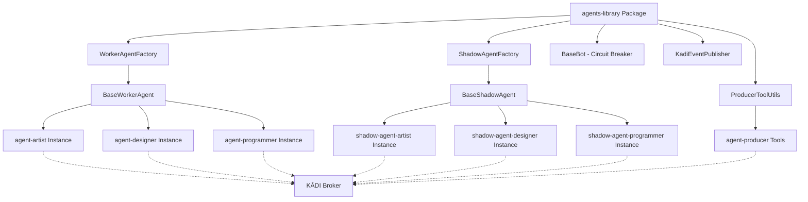

# Design Document: Agent System Refactoring

## Overview

This design document outlines the technical architecture for refactoring the KĀDI multi-agent orchestration system to eliminate code duplication through shared abstractions. The refactoring extracts 95-98% of duplicated logic from agent-artist, shadow-agent-artist, and agent-producer into a new `agents-library` package located at `C:\p4\Personal\SD\agents-library`.

The design introduces factory patterns, configuration-driven instantiation, and reusable utilities that enable creating new agents with minimal boilerplate (under 50 lines) while maintaining full backward compatibility with existing event-driven workflows.

## Steering Document Alignment

### Technical Standards (tech.md)

*Note: No steering documents currently exist. This design follows established patterns from the existing codebase:*

- **TypeScript with Strict Mode**: All code uses strict TypeScript (no `any` types)
- **ES Modules**: Use `.js` extensions in imports, `"type": "module"` in package.json
- **Zod for Validation**: Input validation uses Zod schemas
- **@kadi.build/core**: KĀDI client library for broker communication
- **Circuit Breaker Pattern**: Already implemented in BaseBot, will be reused
- **Event-Driven Architecture**: KĀDI event topics follow pattern `{role}.{event_type}.{identifier}`

### Project Structure (structure.md)

*Note: No steering documents currently exist. This design proposes:*

**New Package Location:**
```
C:\p4\Personal\SD\
├── agents-library/           # NEW: Shared agent abstractions
│   ├── src/
│   │   ├── index.ts          # Public exports
│   │   ├── base-bot.ts       # MOVED from AGENTS/shared
│   │   ├── kadi-event-publisher.ts  # MOVED from AGENTS/shared
│   │   ├── worker-agent-factory.ts  # NEW
│   │   ├── shadow-agent-factory.ts  # NEW
│   │   ├── producer-tool-utils.ts   # NEW
│   │   └── types/            # NEW: Shared TypeScript interfaces
│   ├── package.json
│   └── tsconfig.json
├── agent-artist/             # REFACTORED: Uses agents-library
├── agent-designer/           # NEW: Uses agents-library
├── agent-programmer/         # NEW: Uses agents-library
├── shadow-agent-artist/      # REFACTORED: Uses agents-library
└── agent-producer/           # REFACTORED: Uses agents-library utilities
```

## Code Reuse Analysis

### Existing Components to Leverage

**From `C:\p4\Personal\SD\AGENTS\shared\`** (will be moved to `agents-library`):

1. **BaseBot (base-bot.ts)**
   - **Purpose**: Abstract base class providing circuit breaker, retry logic, metrics tracking
   - **How Used**: WorkerAgentFactory and ShadowAgentFactory will extend or compose with BaseBot
   - **Key Features**:
     - Circuit breaker with configurable max failures (default: 5)
     - Exponential backoff retry logic
     - Anthropic Claude API client integration
     - KĀDI protocol tool invocation helpers

2. **KadiEventPublisher (kadi-event-publisher.ts)**
   - **Purpose**: Generic event publishing to KĀDI broker with graceful degradation
   - **How Used**: Both worker and shadow factories will use this for event publishing
   - **Key Features**:
     - Connection management with retry
     - Topic pattern validation: `{platform}.{event_type}.{bot_id}`
     - Graceful degradation (stub mode if broker unavailable)

3. **Dependencies from package.json**:
   - `@anthropic-ai/sdk`: Claude API integration
   - `@kadi.build/core`: KĀDI client library with KadiClient and Zod

### Existing Patterns to Extract and Generalize

**From `C:\p4\Personal\SD\agent-artist\src\index.ts` (868 lines):**

1. **KĀDI Client Setup** (lines 1-200):
   - Broker connection with configurable URL
   - Network registration (global, artist)
   - Tool registration (built-in + broker-provided)

2. **Task Assignment Subscription** (lines 409-500):
   - Subscribe to `{role}.task.assigned` events
   - Parse task payload with Zod validation
   - Handle invalid task format errors

3. **Task Execution Workflow** (lines 500-700):
   - Change directory to agent worktree
   - Execute task using Claude API (streaming)
   - Determine output filename with AI assistance
   - Create/modify files in worktree
   - Git add + commit with formatted message
   - Publish completion event

4. **Error Handling**:
   - Try-catch wrappers around all operations
   - Event publishing for failures
   - Graceful degradation

**From `C:\p4\Personal\SD\shadow-agent-artist\src\index.ts` (1,179 lines):**

1. **Filesystem Watching** (lines 200-400):
   - Chokidar setup for worktree monitoring
   - Debouncing (1000ms delay)
   - File operation type detection (add/change/unlink)

2. **Git Ref Monitoring** (lines 400-600):
   - Watch `.git/refs/heads/{branch}` file
   - Detect commit SHA changes
   - Trigger backup on new commits

3. **Shadow Backup Logic** (lines 600-800):
   - Parse git log for latest commit
   - Read changed files from git diff
   - Copy files to shadow worktree
   - Create mirror commit with shadow prefix
   - Circuit breaker for backup failures

4. **Event Publishing**:
   - `shadow-{role}.backup.completed`
   - `shadow-{role}.backup.failed`

**From `C:\p4\Personal\SD\agent-producer\src\tools\plan-task.ts`:**

1. **KĀDI Protocol Invocation**:
   - Load protocol with `client.load()`
   - Invoke tools via protocol
   - Parse response with Zod validation

2. **Option C Orchestration**:
   - Multi-turn Claude API interactions
   - Context accumulation across turns
   - Tool result formatting for Claude

3. **Event Publishing Pattern**:
   - Construct event payload with timestamp
   - Validate event schema
   - Publish to topic

### Integration Points

**KĀDI Broker Integration:**
- All agents connect to broker via WebSocket
- Event subscription: `{role}.task.assigned`, `{role}.task.completed`, `{role}.task.failed`
- Tool access: broker provides fs-mcp-server (global network), git-mcp-server (git network)

**Git Worktree Integration:**
- Each worker agent operates in separate worktree: `C:/p4/Personal/SD/agent-playground-{role}`
- Shadow agents mirror worker worktrees
- Commit messages must maintain format: `feat: create {type} for task {taskId}`

**Slack/Discord Bot Integration:**
- Bots already extend BaseBot
- No changes needed to bot integration
- Bots will continue using existing BaseBot methods

## Architecture

### Overall Architecture

The refactored system follows a **Factory + Strategy + Template Method** pattern:

1. **Factory Pattern**: Instantiate worker/shadow agents with configuration
2. **Strategy Pattern**: Role-specific behaviors injected as strategies
3. **Template Method Pattern**: Shared workflows with customizable hooks
4. **Dependency Injection**: Shared services (KĀDI client, Claude client) injected into factories



### Modular Design Principles

1. **Single File Responsibility**:
   - `worker-agent-factory.ts`: Only worker agent creation and lifecycle
   - `shadow-agent-factory.ts`: Only shadow agent creation and monitoring
   - `producer-tool-utils.ts`: Only tool invocation helpers

2. **Component Isolation**:
   - Each factory is independent and testable
   - Configuration-driven (no hardcoded values)
   - Dependency injection for external services

3. **Service Layer Separation**:
   - **Factory Layer**: Agent instantiation and configuration
   - **Agent Layer**: Task execution and event handling
   - **Utility Layer**: Reusable helpers (event publishing, tool invocation)

4. **Utility Modularity**:
   - Each utility function has single purpose
   - Pure functions where possible
   - Clear input/output contracts

## Components and Interfaces

### Component 1: WorkerAgentFactory

**Purpose:** Create and manage worker agents (artist/designer/programmer) with minimal configuration

**Interfaces:**

```typescript
// Configuration interface
interface WorkerAgentConfig {
  role: string;                    // Agent role: 'artist', 'designer', 'programmer'
  worktreePath: string;            // Git worktree path
  brokerUrl: string;               // KĀDI broker WebSocket URL
  networks: string[];              // KĀDI networks: ['global', role]
  anthropicApiKey: string;         // Claude API key
  claudeModel?: string;            // Optional: Claude model (default: 'claude-sonnet-4')
  customBehaviors?: WorkerBehaviors;  // Optional: Role-specific overrides
}

// Strategy pattern for role-specific behaviors
interface WorkerBehaviors {
  determineFilename?: (taskDescription: string, content: string) => Promise<string>;
  formatCommitMessage?: (taskId: string, operation: string) => string;
  preprocessTask?: (task: any) => Promise<any>;
}

// Public factory API
class WorkerAgentFactory {
  static createAgent(config: WorkerAgentConfig): BaseWorkerAgent;
}

// Generated agent class (not directly instantiated)
class BaseWorkerAgent {
  async start(): Promise<void>;
  async stop(): Promise<void>;
  protected async handleTaskAssignment(event: any): Promise<void>;
  protected async executeTask(task: any): Promise<void>;
  protected async publishCompletion(taskId: string, result: any): Promise<void>;
}
```

**Dependencies:**
- BaseBot (circuit breaker, retry logic)
- KadiEventPublisher (event publishing)
- @kadi.build/core (KadiClient)
- @anthropic-ai/sdk (Claude API)
- child_process (git operations)

**Reuses:**
- BaseBot.retryWithBackoff() for resilient operations
- KadiEventPublisher.publishEvent() for event publishing
- BaseBot circuit breaker state management

### Component 2: ShadowAgentFactory

**Purpose:** Create and manage shadow agents for backup and monitoring

**Interfaces:**

```typescript
// Configuration interface
interface ShadowAgentConfig {
  role: string;                    // Worker role to shadow: 'artist', 'designer', 'programmer'
  workerWorktreePath: string;      // Worker git worktree path
  shadowWorktreePath: string;      // Shadow git worktree path
  workerBranch: string;            // Worker branch name (e.g., 'artist')
  shadowBranch: string;            // Shadow branch name (e.g., 'shadow-artist')
  brokerUrl: string;               // KĀDI broker WebSocket URL
  networks: string[];              // KĀDI networks: ['global', 'shadow-{role}']
  debounceMs?: number;             // Debounce delay (default: 1000ms)
}

// Public factory API
class ShadowAgentFactory {
  static createAgent(config: ShadowAgentConfig): BaseShadowAgent;
}

// Generated shadow agent class
class BaseShadowAgent {
  async start(): Promise<void>;
  async stop(): Promise<void>;
  protected async setupFilesystemWatcher(): Promise<void>;
  protected async setupGitRefWatcher(): Promise<void>;
  protected async createShadowBackup(): Promise<void>;
  protected async publishBackupStatus(success: boolean, error?: Error): Promise<void>;
}
```

**Dependencies:**
- BaseBot (circuit breaker)
- KadiEventPublisher (event publishing)
- chokidar (filesystem watching)
- @kadi.build/core (KadiClient)
- child_process (git operations)
- fs/promises (file operations)

**Reuses:**
- BaseBot circuit breaker for backup operation resilience
- KadiEventPublisher for event publishing

### Component 3: ProducerToolUtils

**Purpose:** Shared utilities for agent-producer tool implementations

**Interfaces:**

```typescript
// Tool invocation helper
interface ToolInvocationResult {
  success: boolean;
  result?: any;
  error?: Error;
}

async function invokeShrimTool(
  client: KadiClient,
  toolName: string,
  args: any,
  timeout: number = 30000
): Promise<ToolInvocationResult>;

// Option C orchestration helper
interface OrchestrationContext {
  messages: any[];
  toolResults: any[];
}

async function orchestrateWithClaude(
  anthropic: Anthropic,
  systemPrompt: string,
  userPrompt: string,
  availableTools: any[],
  maxTurns: number = 5
): Promise<OrchestrationContext>;

// Event publishing helper
interface ToolEventPayload {
  timestamp: string;
  agentName: string;
  toolName: string;
  status: 'started' | 'completed' | 'failed';
  duration?: number;
  error?: string;
}

async function publishToolEvent(
  publisher: KadiEventPublisher,
  topic: string,
  payload: ToolEventPayload
): Promise<void>;

// Error classification
enum ErrorType {
  Transient = 'transient',  // Retry-able (network, timeout)
  Permanent = 'permanent'   // Non-retry-able (validation, not found)
}

function classifyToolError(error: Error): ErrorType;
```

**Dependencies:**
- @kadi.build/core (KadiClient)
- @anthropic-ai/sdk (Anthropic)
- KadiEventPublisher

**Reuses:**
- Existing error handling patterns from agent-producer

### Component 4: Shared Type Definitions

**Purpose:** Common TypeScript interfaces for configuration and events

**Interfaces:**

```typescript
// File: types/agent-config.ts
export interface AgentConfig {
  type: 'worker' | 'shadow';
  role: string;
  paths: PathConfig;
  broker: BrokerConfig;
  behaviors?: any;
}

export interface PathConfig {
  worktree: string;
  shadowWorktree?: string;  // Only for shadow agents
}

export interface BrokerConfig {
  url: string;
  networks: string[];
}

// File: types/event-schemas.ts
export interface TaskAssignedEvent {
  taskId: string;
  role: string;
  description: string;
  requirements: string[];
  timestamp: string;
}

export interface TaskCompletedEvent {
  taskId: string;
  role: string;
  result: {
    filesCreated: string[];
    filesModified: string[];
    commitSha: string;
  };
  timestamp: string;
}

export interface BackupEvent {
  role: string;
  operation: 'backup';
  status: 'completed' | 'failed';
  filesBackedUp?: string[];
  error?: string;
  timestamp: string;
}

// File: types/tool-schemas.ts
export interface ToolSchema {
  name: string;
  description: string;
  input: any;   // Zod schema
  output: any;  // Zod schema
}
```

## Data Models

### WorkerAgentConfig Model

Configuration for creating worker agents:

```typescript
{
  role: string;              // Required: 'artist' | 'designer' | 'programmer'
  worktreePath: string;      // Required: '/path/to/agent-playground-{role}'
  brokerUrl: string;         // Required: 'ws://localhost:8080'
  networks: string[];        // Required: ['global', role]
  anthropicApiKey: string;   // Required: From environment
  claudeModel: string;       // Optional: Default 'claude-sonnet-4'
  customBehaviors: {         // Optional: Role-specific overrides
    determineFilename?: Function;
    formatCommitMessage?: Function;
    preprocessTask?: Function;
  };
}
```

### ShadowAgentConfig Model

Configuration for creating shadow agents:

```typescript
{
  role: string;                 // Required: Worker role to shadow
  workerWorktreePath: string;   // Required: Worker worktree path
  shadowWorktreePath: string;   // Required: Shadow worktree path
  workerBranch: string;         // Required: 'artist' | 'designer' | 'programmer'
  shadowBranch: string;         // Required: 'shadow-artist' | etc.
  brokerUrl: string;            // Required: 'ws://localhost:8080'
  networks: string[];           // Required: ['global', 'shadow-{role}']
  debounceMs: number;           // Optional: Default 1000
}
```

### TaskAssignedEvent Model

Event payload for task assignments:

```typescript
{
  taskId: string;          // Unique task identifier
  role: string;            // Target agent role
  description: string;     // Task description
  requirements: string[];  // Task requirements
  timestamp: string;       // ISO 8601 timestamp
}
```

### BackupEvent Model

Event payload for shadow backup status:

```typescript
{
  role: string;                // Shadow agent role
  operation: 'backup';         // Always 'backup'
  status: 'completed' | 'failed';
  filesBackedUp: string[];     // Files successfully backed up
  error: string;               // Error message if failed
  timestamp: string;           // ISO 8601 timestamp
}
```

## Error Handling

### Error Scenarios

1. **Scenario: Worker agent task execution fails**
   - **Handling:**
     - Circuit breaker detects failure (BaseBot)
     - Retry with exponential backoff (up to 3 attempts)
     - If all retries fail, publish `{role}.task.failed` event
     - Log detailed error with stack trace
   - **User Impact:**
     - agent-producer receives failure event
     - Task can be reassigned to different agent
     - No data loss (worktree remains intact)

2. **Scenario: Shadow agent backup fails**
   - **Handling:**
     - Circuit breaker detects failure
     - Do NOT retry immediately (wait for next file change)
     - Publish `shadow-{role}.backup.failed` event
     - Log error with file paths
   - **User Impact:**
     - Worker agent continues unaffected
     - Shadow backup can be manually triggered
     - No impact on primary workflow

3. **Scenario: KĀDI broker disconnection**
   - **Handling:**
     - KadiEventPublisher enters stub mode
     - Events are logged but not sent
     - Automatic reconnection with exponential backoff
     - Resume normal operation when reconnected
   - **User Impact:**
     - Agents continue processing local tasks
     - Events queued in memory (up to limit)
     - No crash or restart required

4. **Scenario: Invalid task assignment payload**
   - **Handling:**
     - Zod validation detects schema mismatch
     - Reject event without processing
     - Publish `{role}.task.failed` with validation error
     - Log validation details
   - **User Impact:**
     - Task not executed (prevents corrupt state)
     - agent-producer notified of validation failure
     - Allows fixing task format

5. **Scenario: Git operation fails (commit, push)**
   - **Handling:**
     - Retry with backoff (up to 3 attempts)
     - If retries fail, publish failure event
     - Leave worktree in partially committed state
     - Log git error output
   - **User Impact:**
     - Task marked as failed
     - Manual git intervention may be needed
     - Prevents silent data corruption

6. **Scenario: Claude API rate limit**
   - **Handling:**
     - Detect 429 status code
     - Exponential backoff with jitter
     - Retry up to 5 times
     - If all retries fail, mark task as failed
   - **User Impact:**
     - Task execution delayed but automatic
     - No manual intervention needed
     - Graceful degradation under high load

## Testing Strategy

### Unit Testing

**Testing Framework:** Node.js built-in test runner (node:test) or Jest

**Components to Test:**

1. **WorkerAgentFactory**
   - Test agent creation with valid config
   - Test validation of required fields
   - Test custom behavior injection
   - Test default value assignment

2. **ShadowAgentFactory**
   - Test shadow agent creation
   - Test debounce configuration
   - Test path validation

3. **ProducerToolUtils**
   - Test invokeShrimTool with mock client
   - Test error classification logic
   - Test event payload construction
   - Test timeout handling

4. **Type Validation**
   - Test Zod schemas for all configurations
   - Test event schema validation
   - Test invalid payload rejection

**Mocking Strategy:**
- Mock KadiClient for event publishing tests
- Mock Anthropic client for Claude API tests
- Mock chokidar for filesystem watching tests
- Mock child_process.exec for git operation tests

### Integration Testing

**Testing Approach:** Docker Compose test environment with KĀDI broker

**Key Flows to Test:**

1. **End-to-End Worker Flow**
   - Create worker agent with factory
   - Publish task assignment event
   - Verify task execution in worktree
   - Verify completion event published
   - Verify git commit created

2. **End-to-End Shadow Flow**
   - Create shadow agent with factory
   - Trigger file change in worker worktree
   - Verify shadow backup created
   - Verify backup event published

3. **Circuit Breaker Flow**
   - Trigger repeated failures
   - Verify circuit opens after max failures
   - Verify automatic recovery after timeout

4. **Broker Reconnection Flow**
   - Start agent connected to broker
   - Stop broker
   - Verify graceful degradation
   - Restart broker
   - Verify automatic reconnection

**Test Environment:**
```yaml
# docker-compose.test.yml
services:
  kadi-broker:
    image: kadi-broker:latest
    ports:
      - "8080:8080"

  test-agent:
    build: ./agents-library
    depends_on:
      - kadi-broker
    environment:
      KADI_BROKER_URL: ws://kadi-broker:8080
      ANTHROPIC_API_KEY: test-key
```

### End-to-End Testing

**Testing Approach:** Full system test with multiple agents

**User Scenarios to Test:**

1. **Multi-Agent Orchestration**
   - Start agent-producer, agent-artist, agent-designer
   - Produce task requiring multiple agents
   - Verify task routing to correct agent
   - Verify task completion from each agent

2. **Shadow Agent Monitoring**
   - Start worker and shadow agents
   - Execute tasks in worker
   - Verify shadow creates backups
   - Verify shadow branch stays in sync

3. **Failure Recovery**
   - Trigger task failure in worker
   - Verify failure event published
   - Verify circuit breaker engages
   - Verify recovery after cooldown

4. **Hot Reload Configuration** (if implemented)
   - Update agent configuration file
   - Verify agent reloads without restart
   - Verify new configuration applied

**Acceptance Criteria:**
- All tests pass with zero manual intervention
- Test coverage greater than 80% for agents-library
- No breaking changes to existing agents
- Performance within 10% of current baseline
