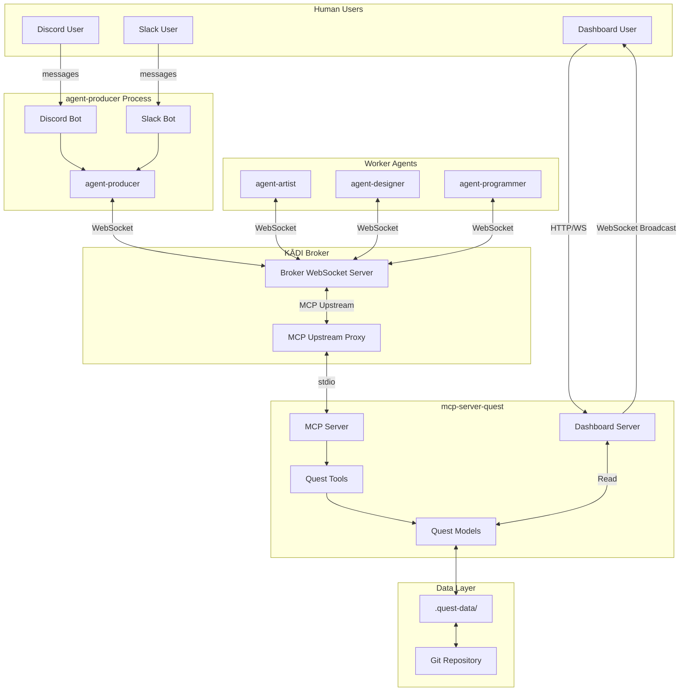
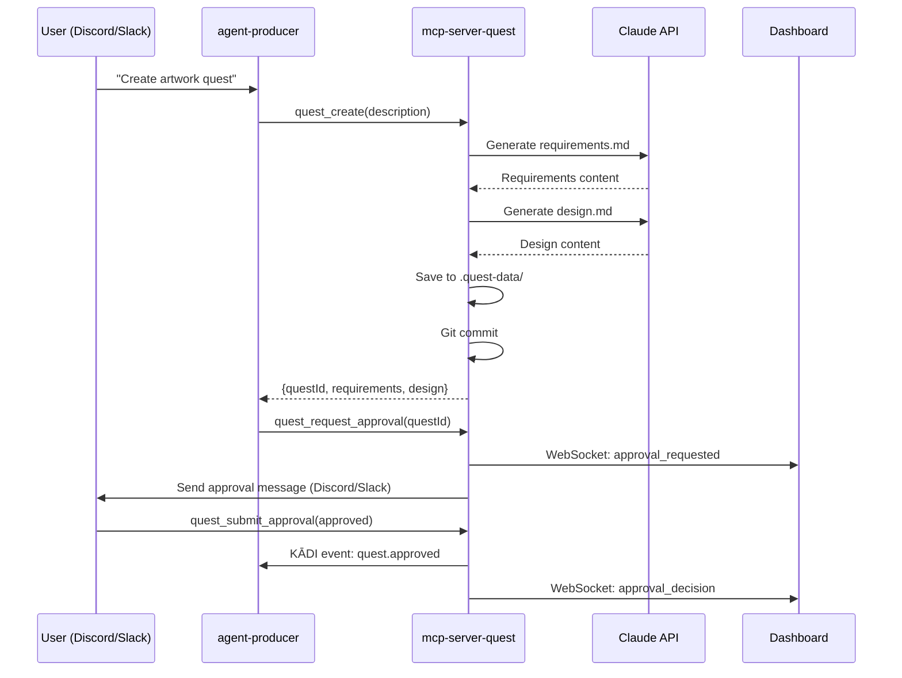
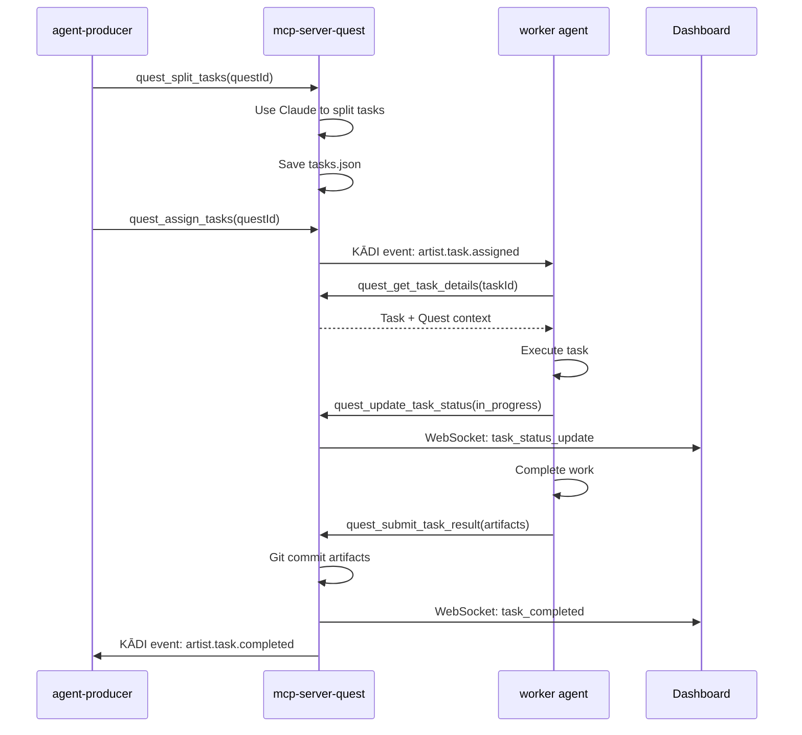

# mcp-server-quest - Design Document

**Version:** 1.0.0
**Date:** 2026-01-19
**Status:** Draft
**Author:** System Architect

## Overview

**mcp-server-quest** is a comprehensive MCP server that orchestrates multi-agent workflows with human-in-the-loop approval, serving as the central coordination system for the KĀDI agent ecosystem. The system combines Shrimp's task execution engine with spec-workflow's approval system, providing real-time monitoring via web dashboard and multi-channel (Discord, Slack, Dashboard) approval capabilities.

This design builds upon two proven systems:
- **mcp-shrimp-task-manager**: Provides task splitting, dependency tracking, and Git versioning patterns
- **spec-workflow-mcp**: Provides approval workflow and real-time dashboard architecture

The system will **completely replace** mcp-shrimp-task-manager while adding enhanced human collaboration features.

## Steering Document Alignment

### Technical Standards (tech.md)

This project follows TypeScript strict mode conventions with comprehensive type safety:
- **Language**: TypeScript 5.3+ with strict configuration
- **Runtime**: Node.js 18+ with ES modules
- **MCP Protocol**: @modelcontextprotocol/sdk for MCP server implementation
- **API Integration**: Anthropic SDK for Claude API calls (task splitting, document generation)
- **Architecture**: Event-driven with KĀDI broker integration

### Project Structure (structure.md)

mcp-server-quest is a standalone project (not a submodule in AGENTS):
```
C:\GitHub\
  mcp-server-quest/           # Standalone MCP server project
    src/
      index.ts                # MCP server entry point
      tools/                  # MCP tool implementations
      models/                 # Data models and persistence
      dashboard/              # Web dashboard (Fastify + React)
      prompts/                # Claude API prompts
      utils/                  # Shared utilities
    .quest-data/              # Quest data storage (gitignored in repo, created at runtime)
    package.json
    tsconfig.json

  AGENTS/                     # Separate repo containing agent submodules
    agent-producer/           # Submodule
    agent-artist/             # Submodule
    agent-designer/           # Submodule
```

## Code Reuse Analysis

### Existing Components to Leverage

**From mcp-shrimp-task-manager**:
- **Task Model**: `taskModel.ts` - CRUD operations with Git versioning
  - Reuse: Git commit patterns, file structure approach
  - Extend: Add quest-specific metadata (requirements.md, design.md)
- **Task Splitting Logic**: Prompts for plan → analyze → reflect → split workflow
  - Reuse: Exact same Claude API prompt structure
  - Extend: Quest template integration
- **Dependency Validation**: Task dependency graph validation
  - Reuse: Direct port with minimal changes

**From spec-workflow-mcp**:
- **Approval System**: `approvals.ts` - Approval workflow state machine
  - Reuse: Approval state transitions, history tracking
  - Extend: Multi-channel support (Discord, Slack, Dashboard)
- **Dashboard Architecture**: `server.ts` + `client/` - Fastify + React + WebSocket
  - Reuse: WebSocket broadcasting, real-time updates
  - Extend: Quest-specific UI components, agent monitoring
- **Document Templates**: Requirements/design/tasks template structure
  - Reuse: Template loading and substitution patterns
  - Extend: Composite templates for quests

### Integration Points

**KĀDI Broker**:
- **MCP Upstream Configuration**: mcp-server-quest registered in broker's `mcp-upstreams.json`
- **Protocol**: KĀDI broker proxies MCP protocol via stdio transport
- **WebSocket Events**: Broker also handles agent coordination events
- **Critical**: All agent MCP tool calls are routed through broker, not direct connections

**agent-producer**:
- **Current Pattern**: Calls mcp-shrimp via `invokeShrimTool()` through KĀDI broker
- **Migration Pattern**: Replace with broker-proxied calls to quest tools via `client.load('mcp-server-quest', 'broker')`
- **MCP Calls**: `quest_create()`, `quest_split_tasks()`, `quest_assign_tasks()` - all via broker
- **WebSocket Events**: Listen for `quest.approved`, publish `{role}.task.assigned`

**Worker Agents** (agent-artist, agent-designer, etc.):
- **Current Pattern**: Listen to `{role}.task.assigned` KĀDI event
- **New Pattern**: Call quest tools via broker using `client.load('mcp-server-quest', 'broker')`
- **MCP Calls**: `quest_get_task_details()`, `quest_update_task_status()`, `quest_submit_task_result()` - all via broker
- **WebSocket Events**: Listen to `{role}.task.assigned`, publish `{role}.task.completed`
- **Git Worktree**: Each agent works in separate worktree (inherited pattern from agent-artist)

**Discord/Slack Bots** (hosted in agent-producer):
- **Current Integration**: Bots send messages via Discord.js / Slack SDK
- **New Integration**: agent-producer calls quest tools via broker → bots send formatted messages → user clicks button → agent-producer calls `quest_submit_approval()` via broker

## Architecture

### System Architecture



**Key Architecture Points**:
- ✅ **All agent MCP calls go through KĀDI broker** - No direct calls to mcp-server-quest
- ✅ **KĀDI broker acts as MCP upstream** - Proxies MCP protocol via stdio transport
- ✅ **WebSocket for KĀDI events** - Agent coordination and task assignment
- ✅ **Separate dashboard HTTP/WS** - Human users access dashboard directly

### Modular Design Principles

**Single Responsibility**:
- Each MCP tool handles one specific operation (e.g., `quest_create`, `quest_split_tasks`)
- Models focus solely on data persistence and retrieval
- Dashboard components are UI-focused without business logic

**Component Isolation**:
- Tools layer: Pure MCP tool implementations
- Models layer: Data access and Git operations
- Dashboard layer: Presentation and real-time updates
- Prompts layer: Claude API prompt management

**Service Layer Separation**:
- **Data Access**: Models handle `.quest-data/` file I/O
- **Business Logic**: Tools implement quest lifecycle logic
- **Presentation**: Dashboard renders UI and handles user interactions

### Core Components

#### 1. MCP Server (`src/index.ts`)

**Purpose**: MCP server entry point exposing quest management tools

**Implementation**:
```typescript
import { Server } from "@modelcontextprotocol/sdk/server/index.js";
import { StdioServerTransport } from "@modelcontextprotocol/sdk/server/stdio.js";
import { questTools } from "./tools/index.js";

const server = new Server(
  {
    name: "mcp-server-quest",
    version: "1.0.0",
  },
  {
    capabilities: {
      tools: {},
    },
  }
);

// Register all quest tools
questTools.forEach(tool => {
  server.setRequestHandler(CallToolRequestSchema, async (request) => {
    if (request.params.name === tool.name) {
      return await tool.handler(request.params.arguments);
    }
  });
});

const transport = new StdioServerTransport();
await server.connect(transport);
```

**Dependencies**: @modelcontextprotocol/sdk

**How Agents Call These Tools** (through KĀDI broker):

```typescript
// In agent-producer or worker agents
import { KADIClient } from '@kadi.build/core';

const client = new KADIClient({
  brokerUrl: 'ws://localhost:8080',
  agentId: 'agent-producer'
});

// Load mcp-server-quest tools through broker
const questTools = await client.load('mcp-server-quest', 'broker');

// Call quest_create through broker
const result = await questTools.quest_create({
  description: "Create hero character artwork",
  requestedBy: userId,
  channel: channelId,
  platform: 'discord'
});

// Broker routes this call via stdio to mcp-server-quest
// No direct connection between agent and mcp-server-quest
```

**Important**: All agent→quest communication flows through KĀDI broker's MCP upstream proxy.

#### 2. Quest Tools (`src/tools/`)

**Structure**:
```
src/tools/
  quest/
    create.ts              # quest_create
    revise.ts              # quest_revise
    status.ts              # quest_get_status, quest_list_quests
  approval/
    request.ts             # quest_request_approval
    submit.ts              # quest_submit_approval
  tasks/
    split.ts               # quest_split_tasks
    assign.ts              # quest_assign_tasks
    details.ts             # quest_get_task_details
    status.ts              # quest_update_task_status
    submit.ts              # quest_submit_task_result
    verify.ts              # quest_verify_task
  agents/
    register.ts            # quest_register_agent
    list.ts                # quest_list_agents
  templates/
    list.ts                # quest_list_templates
    create-from.ts         # quest_create_from_template
  index.ts                 # Export all tools
```

**Tool Pattern**:
```typescript
// src/tools/quest/create.ts
export const questCreateTool = {
  name: "quest_create",
  description: "Create a new quest with AI-generated requirements and design",
  inputSchema: {
    type: "object",
    properties: {
      description: { type: "string" },
      requestedBy: { type: "string" },
      channel: { type: "string" },
      platform: { type: "string", enum: ["discord", "slack", "dashboard"] }
    },
    required: ["description", "requestedBy", "channel", "platform"]
  },
  handler: async (args: QuestCreateArgs) => {
    const questId = generateUUID();

    // Use Claude API to generate requirements.md and design.md
    const requirements = await generateRequirements(args.description);
    const design = await generateDesign(args.description, requirements);

    // Save to .quest-data/
    await QuestModel.create({
      questId,
      requirements,
      design,
      status: "draft",
      conversationContext: {
        platform: args.platform,
        channelId: args.channel,
        userId: args.requestedBy
      }
    });

    return {
      content: [{
        type: "text",
        text: JSON.stringify({
          questId,
          requirements,
          design,
          status: "draft"
        })
      }]
    };
  }
};
```

#### 3. Quest Model (`src/models/questModel.ts`)

**Purpose**: Quest CRUD operations with Git versioning

**Data Structure**:
```typescript
interface Quest {
  questId: string;
  questName: string;
  status: QuestStatus;
  description: string;
  requirements: string;           // File content of requirements.md
  design: string;                 // File content of design.md
  tasks: Task[];                  // Parsed from tasks.json
  conversationContext: {
    platform: "discord" | "slack" | "dashboard";
    channelId: string;
    threadId?: string;
    userId: string;
  };
  approvalHistory: ApprovalDecision[];
  createdAt: Date;
  updatedAt: Date;
  revisionNumber: number;
}

type QuestStatus =
  | "draft"
  | "pending_approval"
  | "approved"
  | "in_progress"
  | "completed"
  | "rejected"
  | "cancelled";
```

**Key Methods**:
```typescript
class QuestModel {
  static async create(quest: Quest): Promise<void> {
    const questDir = path.join(DATA_DIR, "quests", quest.questId);
    await fs.mkdir(questDir, { recursive: true });

    // Write files
    await fs.writeFile(
      path.join(questDir, "requirements.md"),
      quest.requirements
    );
    await fs.writeFile(
      path.join(questDir, "design.md"),
      quest.design
    );
    await fs.writeFile(
      path.join(questDir, "tasks.json"),
      JSON.stringify(quest.tasks, null, 2)
    );
    await fs.writeFile(
      path.join(questDir, "approval-history.json"),
      JSON.stringify([], null, 2)
    );

    // Git commit
    await commitQuestChanges(
      DATA_DIR,
      `feat: create quest ${quest.questName}`,
      `Quest ID: ${quest.questId}\nRequested by: ${quest.conversationContext.userId}`
    );
  }

  static async revise(questId: string, feedback: string): Promise<Quest> {
    const quest = await this.load(questId);

    // Regenerate with feedback
    const newRequirements = await regenerateRequirements(
      quest.description,
      feedback,
      quest.requirements
    );
    const newDesign = await regenerateDesign(
      quest.description,
      feedback,
      newRequirements,
      quest.design
    );

    // Update in place (not versioned files)
    quest.requirements = newRequirements;
    quest.design = newDesign;
    quest.revisionNumber++;

    await this.save(quest);

    // Git commit
    await commitQuestChanges(
      DATA_DIR,
      `feat: revise quest ${quest.questName} (revision #${quest.revisionNumber})`,
      `Feedback: ${feedback}`
    );

    return quest;
  }

  static async load(questId: string): Promise<Quest> {
    const questDir = path.join(DATA_DIR, "quests", questId);

    const requirements = await fs.readFile(
      path.join(questDir, "requirements.md"),
      "utf-8"
    );
    const design = await fs.readFile(
      path.join(questDir, "design.md"),
      "utf-8"
    );
    const tasks = JSON.parse(
      await fs.readFile(path.join(questDir, "tasks.json"), "utf-8")
    );
    const approvalHistory = JSON.parse(
      await fs.readFile(path.join(questDir, "approval-history.json"), "utf-8")
    );

    return {
      questId,
      requirements,
      design,
      tasks,
      approvalHistory,
      // ... other fields parsed from metadata
    };
  }
}
```

**Reuses**: Git commit pattern from mcp-shrimp's `taskModel.ts`

#### 4. Task Model (`src/models/taskModel.ts`)

**Purpose**: Task data operations (inherits from Shrimp)

**Data Structure**:
```typescript
interface Task {
  id: string;
  questId: string;
  name: string;
  description: string;
  status: "pending" | "in_progress" | "completed" | "failed";
  assignedAgent?: string;
  implementationGuide: string;
  verificationCriteria: string;
  dependencies: string[];
  relatedFiles: RelatedFile[];
  createdAt: Date;
  updatedAt: Date;
  startedAt?: Date;
  completedAt?: Date;
  artifacts?: {
    files: string[];
    metadata: any;
  };
}

interface RelatedFile {
  path: string;
  type: "TO_MODIFY" | "REFERENCE" | "CREATE" | "DEPENDENCY" | "OTHER";
  description: string;
  lineStart?: number;  // Must be > 0
  lineEnd?: number;    // Must be > 0
}
```

**Key Methods**:
```typescript
class TaskModel {
  static async updateStatus(
    taskId: string,
    status: TaskStatus
  ): Promise<void> {
    const quest = await QuestModel.loadByTaskId(taskId);
    const task = quest.tasks.find(t => t.id === taskId);

    task.status = status;
    if (status === "in_progress") task.startedAt = new Date();
    if (status === "completed") task.completedAt = new Date();

    await QuestModel.save(quest);

    // Git commit
    await commitQuestChanges(
      DATA_DIR,
      `chore: update task ${task.name} status to ${status}`,
      `Task ID: ${taskId}`
    );
  }

  static validateDependencies(tasks: Task[]): ValidationResult {
    // Detect circular dependencies
    const graph = buildDependencyGraph(tasks);
    const cycles = detectCycles(graph);

    if (cycles.length > 0) {
      return {
        valid: false,
        errors: cycles.map(cycle =>
          `Circular dependency: ${cycle.join(" -> ")}`
        )
      };
    }

    return { valid: true, errors: [] };
  }
}
```

**Reuses**: Shrimp's task validation logic

#### 5. Approval System (`src/models/approvalModel.ts`)

**Purpose**: Multi-channel approval workflow

**Data Structure**:
```typescript
interface ApprovalDecision {
  approvalId: string;
  questId: string;
  decision: "approved" | "revision_requested" | "rejected";
  approvedBy: string;
  approvedVia: "discord" | "slack" | "dashboard";
  feedback?: string;
  timestamp: Date;
}

interface ApprovalState {
  questId: string;
  status: "pending" | "approved" | "rejected" | "needs_revision";
  requestedAt: Date;
  respondedAt?: Date;
  conversationContext: ConversationContext;
}
```

**Key Methods**:
```typescript
class ApprovalModel {
  static async requestApproval(questId: string): Promise<ApprovalState> {
    const quest = await QuestModel.load(questId);

    // Update quest status
    quest.status = "pending_approval";
    await QuestModel.save(quest);

    // Create approval state
    const approvalState: ApprovalState = {
      questId,
      status: "pending",
      requestedAt: new Date(),
      conversationContext: quest.conversationContext
    };

    // Broadcast to dashboard via WebSocket
    dashboardServer.broadcast("approval_requested", {
      questId,
      questName: quest.questName,
      requirements: quest.requirements,
      design: quest.design
    });

    return approvalState;
  }

  static async submitApproval(
    questId: string,
    decision: ApprovalDecision
  ): Promise<void> {
    const quest = await QuestModel.load(questId);

    // Record decision
    quest.approvalHistory.push(decision);

    // Update quest status
    if (decision.decision === "approved") {
      quest.status = "approved";
      // Publish KĀDI event for agent-producer
      await publishKADIEvent("quest.approved", { questId });
    } else if (decision.decision === "revision_requested") {
      // Trigger quest revision
      await QuestModel.revise(questId, decision.feedback);
      // Re-request approval
      await this.requestApproval(questId);
    } else {
      quest.status = "rejected";
    }

    await QuestModel.save(quest);

    // Broadcast to dashboard
    dashboardServer.broadcast("approval_decision", {
      questId,
      decision: decision.decision,
      approvedBy: decision.approvedBy
    });

    // Git commit
    await commitQuestChanges(
      DATA_DIR,
      `chore: ${decision.decision} quest ${quest.questName}`,
      `Decided by: ${decision.approvedBy} via ${decision.approvedVia}`
    );
  }
}
```

**Reuses**: Approval state machine from spec-workflow's `approvals.ts`

#### 6. Dashboard Server (`src/dashboard/server.ts`)

**Purpose**: Real-time web interface with WebSocket updates

**Architecture**:
```typescript
import Fastify from "fastify";
import fastifyStatic from "@fastify/static";
import fastifyWebsocket from "@fastify/websocket";

const app = Fastify();

// Serve React dashboard
app.register(fastifyStatic, {
  root: path.join(__dirname, "client/dist"),
  prefix: "/",
});

// WebSocket for real-time updates
app.register(fastifyWebsocket);

const connections = new Set<WebSocket>();

app.get("/ws", { websocket: true }, (connection) => {
  connections.add(connection.socket);

  connection.socket.on("close", () => {
    connections.delete(connection.socket);
  });
});

// Broadcast helper
export function broadcast(event: string, data: any) {
  const message = JSON.stringify({ event, data });
  connections.forEach(socket => {
    if (socket.readyState === WebSocket.OPEN) {
      socket.send(message);
    }
  });
}

// REST endpoints
app.get("/api/quests", async (request, reply) => {
  const quests = await QuestModel.listAll();
  return { quests };
});

app.get("/api/quests/:questId", async (request, reply) => {
  const { questId } = request.params;
  const quest = await QuestModel.load(questId);
  return quest;
});

app.get("/api/agents", async (request, reply) => {
  const agents = await AgentModel.listAll();
  return { agents };
});

app.post("/api/approvals/:questId", async (request, reply) => {
  const { questId } = request.params;
  const { decision, feedback } = request.body;

  await ApprovalModel.submitApproval(questId, {
    decision,
    approvedBy: "dashboard-user",  // TODO: Add auth
    approvedVia: "dashboard",
    feedback,
    timestamp: new Date()
  });

  return { success: true };
});

app.listen({ port: 8888, host: "localhost" });
```

**Dashboard Components** (`src/dashboard/client/src/`):
```
components/
  QuestList.tsx           # Quest cards with status
  QuestDetail.tsx         # Quest detail view with tasks
  ApprovalForm.tsx        # Approval decision form
  TaskList.tsx            # Task list with dependencies
  AgentMonitor.tsx        # Agent status monitoring
```

**Reuses**:
- Fastify + WebSocket pattern from spec-workflow
- Real-time broadcasting architecture

#### 7. Template System (`src/models/templateModel.ts`)

**Purpose**: Load and apply quest templates

**Template Structure** (`.quest-data/templates/`):
```
templates/
  art-project/
    requirements-template.md
    design-template.md
    tasks-template.json
  code-feature/
    requirements-template.md
    design-template.md
    tasks-template.json
```

**Implementation**:
```typescript
class TemplateModel {
  static async loadTemplate(templateName: string): Promise<QuestTemplate> {
    const templateDir = path.join(DATA_DIR, "templates", templateName);

    const requirementsTemplate = await fs.readFile(
      path.join(templateDir, "requirements-template.md"),
      "utf-8"
    );
    const designTemplate = await fs.readFile(
      path.join(templateDir, "design-template.md"),
      "utf-8"
    );
    const tasksTemplate = JSON.parse(
      await fs.readFile(
        path.join(templateDir, "tasks-template.json"),
        "utf-8"
      )
    );

    return {
      name: templateName,
      requirementsTemplate,
      designTemplate,
      tasksTemplate
    };
  }

  static applyTemplate(
    template: QuestTemplate,
    variables: Record<string, string>
  ): { requirements: string; design: string; tasks: any[] } {
    // Replace {{VARIABLE}} placeholders
    let requirements = template.requirementsTemplate;
    let design = template.designTemplate;
    let tasks = JSON.parse(JSON.stringify(template.tasksTemplate));

    for (const [key, value] of Object.entries(variables)) {
      const placeholder = `{{${key}}}`;
      requirements = requirements.replaceAll(placeholder, value);
      design = design.replaceAll(placeholder, value);
      tasks = JSON.parse(
        JSON.stringify(tasks).replaceAll(placeholder, value)
      );
    }

    return { requirements, design, tasks };
  }
}
```

## Components and Interfaces

### Quest Creation Flow



### Task Execution Flow



## Data Models

### Quest Directory Structure

```
.quest-data/
  quests/
    {quest-id}/
      requirements.md          # Generated from Claude API or template
      design.md                # Generated from Claude API or template
      tasks.json               # Task list with dependencies
      approval-history.json    # All approval decisions
      metadata.json            # Quest metadata (status, dates, etc.)
  templates/
    art-project/
      requirements-template.md
      design-template.md
      tasks-template.json
    code-feature/
      requirements-template.md
      design-template.md
      tasks-template.json
  agents.json                  # Agent registry
  .git/                        # Git repository for versioning
```

### Quest Metadata (`metadata.json`)

```json
{
  "questId": "uuid",
  "questName": "Create Hero Artwork",
  "status": "in_progress",
  "description": "Create fantasy hero character artwork",
  "conversationContext": {
    "platform": "discord",
    "channelId": "123456789",
    "threadId": "987654321",
    "userId": "user123"
  },
  "createdAt": "2026-01-19T10:00:00Z",
  "updatedAt": "2026-01-19T10:30:00Z",
  "revisionNumber": 1,
  "assignedAgents": ["artist"],
  "progress": {
    "totalTasks": 5,
    "completedTasks": 2,
    "percentage": 40
  }
}
```

### Tasks.json Structure

```json
[
  {
    "id": "task-uuid-1",
    "name": "Create concept sketches",
    "description": "Initial character concept exploration",
    "status": "completed",
    "assignedAgent": "artist",
    "implementationGuide": "Research fantasy art styles. Create 3-5 rough sketches exploring different character designs...",
    "verificationCriteria": "Sketches show clear character silhouette. At least 3 distinct design variations...",
    "dependencies": [],
    "relatedFiles": [
      {
        "path": "artworks/hero-concept-01.png",
        "type": "CREATE",
        "description": "First concept sketch"
      }
    ],
    "createdAt": "2026-01-19T10:05:00Z",
    "startedAt": "2026-01-19T10:10:00Z",
    "completedAt": "2026-01-19T10:25:00Z",
    "artifacts": {
      "files": ["artworks/hero-concept-01.png", "artworks/hero-concept-02.png"],
      "metadata": {
        "artStyle": "fantasy",
        "resolution": "2048x2048"
      }
    }
  },
  {
    "id": "task-uuid-2",
    "name": "Refine selected concept",
    "description": "Develop chosen concept into detailed artwork",
    "status": "in_progress",
    "assignedAgent": "artist",
    "implementationGuide": "Based on approved concept, create high-resolution artwork with full details...",
    "verificationCriteria": "Final artwork is 4K resolution. All details match approved concept...",
    "dependencies": ["task-uuid-1"],
    "relatedFiles": [],
    "createdAt": "2026-01-19T10:05:00Z",
    "startedAt": "2026-01-19T10:26:00Z"
  }
]
```

### Approval History (`approval-history.json`)

```json
[
  {
    "approvalId": "approval-uuid-1",
    "decision": "revision_requested",
    "approvedBy": "user123",
    "approvedVia": "discord",
    "feedback": "Please add more details about the art style",
    "timestamp": "2026-01-19T10:01:00Z"
  },
  {
    "approvalId": "approval-uuid-2",
    "decision": "approved",
    "approvedBy": "user123",
    "approvedVia": "dashboard",
    "timestamp": "2026-01-19T10:03:00Z"
  }
]
```

### Agent Registry (`agents.json`)

```json
{
  "agents": [
    {
      "agentId": "artist-001",
      "name": "agent-artist",
      "role": "artist",
      "status": "available",
      "capabilities": ["image-generation", "character-design", "concept-art"],
      "maxConcurrentTasks": 3,
      "currentTasks": [],
      "lastSeen": "2026-01-19T10:30:00Z",
      "statistics": {
        "completedTasks": 42,
        "failedTasks": 2,
        "averageCompletionTime": "25 minutes"
      }
    }
  ]
}
```

## Error Handling

### Error Scenarios

#### 1. Quest Creation Failure

**Scenario**: Claude API fails during requirements/design generation

**Handling**:
```typescript
try {
  const requirements = await generateRequirements(description);
} catch (error) {
  if (error.code === "rate_limit") {
    return {
      error: "Claude API rate limit exceeded. Please try again in a few minutes.",
      retryAfter: error.retryAfter
    };
  }
  if (error.code === "api_error") {
    return {
      error: "Claude API temporarily unavailable. Quest saved as draft without generated documents.",
      questId,
      status: "draft"
    };
  }
  throw error;
}
```

**User Impact**: User receives error message in Discord/Slack, quest is saved as draft

#### 2. Circular Task Dependencies

**Scenario**: Task splitting results in circular dependencies

**Handling**:
```typescript
const validation = TaskModel.validateDependencies(tasks);
if (!validation.valid) {
  // Retry with feedback to Claude
  const fixedTasks = await regenerateTasksWithFeedback(
    tasks,
    `Fix circular dependencies: ${validation.errors.join(", ")}`
  );
  return fixedTasks;
}
```

**User Impact**: Transparent to user, system auto-corrects

#### 3. Git Commit Failure

**Scenario**: Git repository not initialized or permission error

**Handling**:
```typescript
async function commitQuestChanges(message: string) {
  try {
    await execAsync(`cd "${DATA_DIR}" && git commit -m "${message}"`);
  } catch (error) {
    console.error("Git commit failed:", error);
    // Don't fail the operation, just log
    // Data is still saved to filesystem
  }
}
```

**User Impact**: No impact, operation continues without versioning

#### 4. Worker Agent Offline

**Scenario**: Task assigned to offline agent

**Handling**:
```typescript
async function assignTask(taskId: string, agentRole: string) {
  const agent = await AgentModel.findByRole(agentRole);

  if (!agent || agent.status === "offline") {
    // Store in pending queue
    await TaskModel.updateStatus(taskId, "pending");

    // Notify via dashboard
    dashboardServer.broadcast("agent_offline", {
      taskId,
      agentRole,
      message: `Waiting for ${agentRole} to come online`
    });

    return { success: false, reason: "agent_offline" };
  }

  // Assign normally
  await publishKADIEvent(`${agentRole}.task.assigned`, { taskId });
}
```

**User Impact**: Dashboard shows task as pending, user can manually reassign

#### 5. Approval Request Lost

**Scenario**: Discord/Slack message fails to send

**Handling**:
```typescript
async function requestApprovalViaDiscord(questId: string) {
  try {
    await discordBot.sendMessage(channelId, approvalMessage);
  } catch (error) {
    console.error("Discord message failed:", error);

    // Fallback: Dashboard notification only
    dashboardServer.broadcast("approval_requested", {
      questId,
      fallbackMode: true,
      message: "Discord notification failed, please check dashboard"
    });

    // Store retry info
    await ApprovalModel.markForRetry(questId, "discord");
  }
}
```

**User Impact**: User can still approve via dashboard

## Testing Strategy

### Unit Testing

**Framework**: Vitest

**Key Components to Test**:

1. **Quest Model**:
```typescript
describe("QuestModel", () => {
  test("creates quest with generated documents", async () => {
    const quest = await QuestModel.create({
      description: "Test quest",
      requestedBy: "user1"
    });

    expect(quest.questId).toBeDefined();
    expect(quest.requirements).toContain("# Requirements");
    expect(quest.status).toBe("draft");
  });

  test("revises quest with feedback", async () => {
    const quest = await QuestModel.revise(questId, "Add more details");

    expect(quest.revisionNumber).toBe(2);
    expect(quest.requirements).not.toBe(originalRequirements);
  });
});
```

2. **Task Validation**:
```typescript
describe("TaskModel.validateDependencies", () => {
  test("detects circular dependencies", () => {
    const tasks = [
      { id: "1", dependencies: ["2"] },
      { id: "2", dependencies: ["1"] }
    ];

    const result = TaskModel.validateDependencies(tasks);
    expect(result.valid).toBe(false);
    expect(result.errors[0]).toContain("Circular dependency");
  });
});
```

3. **Template System**:
```typescript
describe("TemplateModel", () => {
  test("applies variables to template", () => {
    const template = {
      requirementsTemplate: "# {{PROJECT_NAME}}\n{{DESCRIPTION}}"
    };
    const variables = {
      PROJECT_NAME: "Test",
      DESCRIPTION: "Test description"
    };

    const result = TemplateModel.applyTemplate(template, variables);
    expect(result.requirements).toBe("# Test\nTest description");
  });
});
```

### Integration Testing

**Framework**: Vitest with test MCP server

**Key Flows to Test**:

1. **Complete Quest Workflow**:
```typescript
describe("Quest Workflow Integration", () => {
  test("full quest lifecycle from creation to completion", async () => {
    // 1. Create quest
    const createResult = await mcpClient.call("quest_create", {
      description: "Test artwork"
    });
    const questId = createResult.questId;

    // 2. Request approval
    await mcpClient.call("quest_request_approval", { questId });

    // 3. Submit approval
    await mcpClient.call("quest_submit_approval", {
      questId,
      decision: "approved"
    });

    // 4. Split tasks
    await mcpClient.call("quest_split_tasks", { questId });

    // 5. Assign tasks
    await mcpClient.call("quest_assign_tasks", { questId });

    // 6. Worker gets task
    const task = await mcpClient.call("quest_get_task_details", {
      taskId: "task-1"
    });
    expect(task.implementationGuide).toBeDefined();

    // 7. Submit result
    await mcpClient.call("quest_submit_task_result", {
      taskId: "task-1",
      artifacts: { files: ["test.png"] }
    });

    // 8. Verify final status
    const finalQuest = await mcpClient.call("quest_get_status", { questId });
    expect(finalQuest.status).toBe("completed");
  });
});
```

2. **Multi-Channel Approval**:
```typescript
describe("Multi-Channel Approval", () => {
  test("approval from dashboard updates all channels", async () => {
    const questId = await createQuest();
    await requestApproval(questId);

    // Submit via dashboard
    await dashboardClient.post("/api/approvals/" + questId, {
      decision: "approved"
    });

    // Verify WebSocket broadcast
    expect(wsMessages).toContainEqual({
      event: "approval_decision",
      data: { questId, decision: "approved" }
    });

    // Verify KĀDI event
    expect(kadiEvents).toContainEqual({
      type: "quest.approved",
      data: { questId }
    });
  });
});
```

### End-to-End Testing

**Framework**: Playwright for dashboard, mock Discord/Slack

**User Scenarios to Test**:

1. **Discord User Creates Quest**:
```typescript
test("Discord user creates and approves quest", async () => {
  // 1. User sends message in Discord
  await mockDiscordBot.receiveMessage(
    "Create a hero character artwork"
  );

  // 2. agent-producer creates quest
  await waitFor(() => {
    expect(mockQuestServer.quests).toHaveLength(1);
  });

  // 3. User receives approval message
  const approvalMessage = await mockDiscordBot.getLastMessage();
  expect(approvalMessage).toContain("Approve");

  // 4. User clicks approve button
  await mockDiscordBot.clickButton("approve");

  // 5. Dashboard shows approved quest
  await page.goto("http://localhost:8888");
  await expect(page.locator(".quest-status")).toHaveText("Approved");
});
```

2. **Dashboard Monitoring**:
```typescript
test("Dashboard shows real-time task updates", async ({ page }) => {
  await page.goto("http://localhost:8888");

  // Create quest and tasks
  const questId = await createQuestViaAPI();
  await splitTasksViaAPI(questId);

  // Wait for WebSocket update
  await expect(page.locator(".task-list")).toBeVisible();
  await expect(page.locator(".task-item")).toHaveCount(5);

  // Worker completes task
  await completeTaskViaAPI("task-1");

  // Verify real-time update (no page refresh)
  await expect(
    page.locator(".task-item:first-child .status")
  ).toHaveText("Completed");
});
```

## Security Considerations

### Localhost-Only by Default

```typescript
// src/dashboard/server.ts
const host = process.env.QUEST_DASHBOARD_HOST || "localhost";
const port = parseInt(process.env.QUEST_DASHBOARD_PORT || "8888");

app.listen({ host, port }, (err, address) => {
  if (host !== "localhost" && host !== "127.0.0.1") {
    console.warn(
      "WARNING: Dashboard is exposed to network. Consider adding authentication."
    );
  }
  console.log(`Dashboard listening on ${address}`);
});
```

### Input Validation

```typescript
// Validate all MCP tool inputs
function validateQuestCreateArgs(args: unknown): QuestCreateArgs {
  const schema = z.object({
    description: z.string().min(10).max(5000),
    requestedBy: z.string().min(1),
    channel: z.string().min(1),
    platform: z.enum(["discord", "slack", "dashboard"])
  });

  return schema.parse(args);
}
```

### Git Commit Message Sanitization

```typescript
async function commitQuestChanges(message: string, details?: string) {
  // Sanitize to prevent command injection
  const sanitizedMessage = message
    .replace(/"/g, '\\"')
    .replace(/\$/g, "\\$")
    .replace(/`/g, "\\`");

  await execAsync(
    `cd "${DATA_DIR}" && git commit -m "${sanitizedMessage}"`
  );
}
```

## Performance Optimizations

### Lazy Loading Quest Data

```typescript
class QuestModel {
  // Only load full quest when needed
  static async loadSummary(questId: string): Promise<QuestSummary> {
    const metadataPath = path.join(
      DATA_DIR,
      "quests",
      questId,
      "metadata.json"
    );
    return JSON.parse(await fs.readFile(metadataPath, "utf-8"));
  }

  // Full load for detail view
  static async load(questId: string): Promise<Quest> {
    // Load all files
  }
}
```

### WebSocket Connection Pooling

```typescript
// Limit concurrent WebSocket connections
const MAX_CONNECTIONS = 20;

app.get("/ws", { websocket: true }, (connection) => {
  if (connections.size >= MAX_CONNECTIONS) {
    connection.socket.close(1008, "Too many connections");
    return;
  }
  connections.add(connection.socket);
});
```

### Task Splitting Caching

```typescript
// Cache task splitting results to avoid regeneration
const taskSplitCache = new Map<string, Task[]>();

async function splitTasks(questId: string): Promise<Task[]> {
  const cacheKey = `${questId}-${quest.revisionNumber}`;

  if (taskSplitCache.has(cacheKey)) {
    return taskSplitCache.get(cacheKey);
  }

  const tasks = await claudeAPI.splitTasks(quest);
  taskSplitCache.set(cacheKey, tasks);

  return tasks;
}
```

## Deployment

### Development Mode

```bash
# Start dashboard dev server
cd src/dashboard/client
npm run dev  # Vite on port 5173

# Start MCP server with hot reload
cd ../../..
tsx watch src/index.ts
```

### Production Build

```bash
# Build dashboard
cd src/dashboard/client
npm run build  # Output to dist/

# Compile TypeScript
cd ../../..
npm run build  # Output to dist/

# Run production server
node dist/index.js
```

### KĀDI Broker Configuration

Add to `kadi-broker/mcp-upstreams.json`:
```json
{
  "mcp-server-quest": {
    "command": "node",
    "args": ["C:/GitHub/mcp-server-quest/dist/index.js"],
    "env": {
      "QUEST_DATA_DIR": "C:/GitHub/mcp-server-quest/.quest-data",
      "QUEST_DASHBOARD_PORT": "8888"
    }
  }
}
```

## Migration from mcp-shrimp-task-manager

### Phase 1: Parallel Deployment (Week 1-2)

1. **Install mcp-server-quest** alongside mcp-shrimp
2. **agent-producer** continues using Shrimp for existing tasks
3. **New quests** use mcp-server-quest
4. **Testing** in parallel to ensure feature parity

### Phase 2: Migration Script (Week 3)

```typescript
// scripts/migrate-from-shrimp.ts
async function migrateShrimToQuest() {
  const shrimpData = await loadShrimData();

  for (const shrimpTask of shrimpData.tasks) {
    // Convert Shrimp task to Quest
    const quest = {
      questId: uuidv4(),
      questName: shrimpTask.name,
      status: mapStatus(shrimpTask.status),
      tasks: [shrimpTask],  // Single task per quest initially
      // Generate requirements/design from task description
      requirements: await generateFromTask(shrimpTask),
      design: await generateFromTask(shrimpTask)
    };

    await QuestModel.create(quest);
  }

  // Archive Shrimp data
  await fs.rename(
    "shrimp_data",
    ".quest-data/legacy/shrimp_data_backup"
  );
}
```

### Phase 3: Full Cutover (Week 4+)

1. **Update agent-producer** to use Quest tools exclusively
2. **Remove Shrimp** from kadi-broker configuration
3. **Update documentation** and agent code
4. **Monitor** for any issues

## Open Questions

1. **Authentication**: Should dashboard have optional auth for production? (OAuth, basic auth?)
2. **Multi-user approval**: Should we support requiring multiple approvers? (Out of scope for MVP)
3. **Quest templates**: Should templates be user-customizable or admin-only?
4. **Dashboard port**: Confirmed as 8888, but should this be configurable?
5. **Agent capabilities**: How dynamic should capability matching be? (Simple string match vs. semantic matching)

## Revision History

| Version | Date       | Author            | Changes                          |
|---------|------------|-------------------|----------------------------------|
| 1.0.0   | 2026-01-19 | System Architect  | Initial design document          |
