# mcp-server-quest - Implementation Tasks

**Version:** 1.0.0
**Date:** 2026-01-19
**Status:** Draft
**Based on:** requirements.md v1.0.0, design.md v1.0.0

## Overview

This document breaks down the implementation of mcp-server-quest into logical, executable tasks. Each task includes file locations, implementation guidance, verification criteria, and dependencies to ensure systematic development.

**Project Location:** `C:\GitHub\mcp-server-quest\`

**Total Estimated Tasks:** 45 tasks across 8 major components

## Task Organization

Tasks are organized by component and numbered for dependency tracking:
- **1.x**: Project Setup & Infrastructure
- **2.x**: Core Data Models
- **3.x**: MCP Tools - Quest Management
- **4.x**: MCP Tools - Task Management
- **5.x**: MCP Tools - Agent & Template Management
- **6.x**: Dashboard Backend
- **7.x**: Dashboard Frontend
- **8.x**: Testing & Documentation

## Phase 1: Project Setup & Infrastructure

### Task 1.1: Initialize Project Structure

- **File:** Create project at `C:\GitHub\mcp-server-quest\`
- **Description:** Initialize standalone TypeScript project with MCP server configuration
- **Purpose:** Establish project foundation with proper tooling and dependencies
- **Leverage:** Reference spec-workflow and mcp-shrimp package.json structures
- **Requirements:** Technical Constraints 5.1, 5.2, 5.3
- **Dependencies:** None
- **Prompt:**
  ```
  Role: Senior TypeScript Developer specializing in MCP server development

  Task: Initialize a new TypeScript project for mcp-server-quest at C:\GitHub\mcp-server-quest\

  Requirements:
  1. Create package.json with:
     - name: "mcp-server-quest"
     - type: "module"
     - engines: { "node": ">=18.0.0" }
     - Dependencies: @modelcontextprotocol/sdk, @anthropic-ai/sdk, fastify, @fastify/static, @fastify/websocket
     - DevDependencies: typescript@^5.3.0, tsx, @types/node
     - Scripts: dev (tsx watch src/index.ts), build (tsc), start (node dist/index.js)

  2. Create tsconfig.json with:
     - target: ES2022
     - module: ESNext
     - moduleResolution: bundler
     - strict: true
     - outDir: dist
     - rootDir: src

  3. Create directory structure:
     - src/
       - index.ts (MCP server entry)
       - tools/ (MCP tool implementations)
       - models/ (Data models)
       - dashboard/ (Web dashboard)
       - prompts/ (Claude API prompts)
       - utils/ (Shared utilities)
     - .quest-data/ (add to .gitignore)
     - tests/

  4. Create .gitignore:
     - node_modules/
     - dist/
     - .quest-data/
     - *.log

  5. Create README.md with:
     - Project overview
     - Installation instructions
     - Quick start guide

  Restrictions:
  - Do not install dependencies yet
  - Do not create implementation files, only structure
  - Ensure all paths use forward slashes for cross-platform compatibility

  Success Criteria:
  - Project structure matches design.md specifications
  - package.json includes all required dependencies
  - tsconfig.json configured for strict TypeScript
  - Directory structure ready for implementation
  ```

### Task 1.2: Create Type Definitions

- **File:** `src/types/index.ts`
- **Description:** Define TypeScript interfaces for all data models
- **Purpose:** Establish type safety for quest, task, agent, and approval data structures
- **Leverage:** Task and Agent interfaces from mcp-shrimp; Approval interfaces from spec-workflow
- **Requirements:** FR-1.1, FR-3.1, FR-4.1, FR-6.1
- **Dependencies:** 1.1
- **Prompt:**
  ```
  Role: TypeScript Type System Architect

  Task: Create comprehensive TypeScript type definitions for mcp-server-quest

  Requirements:
  1. Define Quest interface:
     - questId: string
     - questName: string
     - description: string
     - status: 'draft' | 'pending_approval' | 'approved' | 'rejected' | 'in_progress' | 'completed' | 'cancelled'
     - requirements: string (markdown content)
     - design: string (markdown content)
     - tasks: Task[]
     - approvalHistory: ApprovalDecision[]
     - conversationContext: ConversationContext
     - createdAt: Date
     - updatedAt: Date
     - revisionNumber: number

  2. Define Task interface (inherit from Shrimp):
     - id: string
     - questId: string
     - name: string
     - description: string
     - status: 'pending' | 'in_progress' | 'completed' | 'failed'
     - assignedAgent?: string
     - implementationGuide: string
     - verificationCriteria: string
     - dependencies: string[]
     - relatedFiles: RelatedFile[]
     - createdAt: Date
     - updatedAt: Date
     - startedAt?: Date
     - completedAt?: Date
     - artifacts?: TaskArtifacts

  3. Define RelatedFile interface:
     - path: string
     - type: 'TO_MODIFY' | 'REFERENCE' | 'CREATE' | 'DEPENDENCY' | 'OTHER'
     - description: string
     - lineStart?: number (must be > 0 if specified)
     - lineEnd?: number (must be > 0 if specified)

  4. Define Agent interface:
     - agentId: string
     - name: string
     - role: 'artist' | 'designer' | 'programmer'
     - capabilities: string[]
     - status: 'available' | 'busy' | 'offline'
     - currentTasks: string[]
     - maxConcurrentTasks: number
     - lastSeen: Date

  5. Define ApprovalDecision interface:
     - approvalId: string
     - questId: string
     - decision: 'approved' | 'revision_requested' | 'rejected'
     - approvedBy: string
     - approvedVia: 'discord' | 'slack' | 'dashboard'
     - feedback?: string
     - timestamp: Date

  6. Define ConversationContext interface:
     - platform: 'discord' | 'slack' | 'dashboard'
     - channelId: string
     - threadId?: string
     - userId: string

  7. Define QuestTemplate interface:
     - name: string
     - requirementsTemplate: string
     - designTemplate: string
     - tasksTemplate: any[]

  Restrictions:
  - Use strict TypeScript types (no any except for metadata fields)
  - All Date fields must be Date type, not string
  - Enums should use string literal unions, not TypeScript enums
  - Export all interfaces

  Success Criteria:
  - All interfaces compile without errors
  - Types match requirements.md specifications exactly
  - JSDoc comments explain each interface and field
  - Type safety enforced for all nullable fields
  ```

### Task 1.3: Setup Git Utilities

- **File:** `src/utils/git.ts`
- **Description:** Implement Git commit functions for quest data versioning
- **Purpose:** Enable Git-based audit trail following Shrimp's pattern
- **Leverage:** Git commit logic from mcp-shrimp's taskModel.ts
- **Requirements:** FR-6.1
- **Dependencies:** 1.1, 1.2
- **Prompt:**
  ```
  Role: DevOps Engineer specializing in Git automation

  Task: Create Git utility functions for quest data versioning

  Requirements:
  1. Export function `initQuestDataRepo(dataDir: string): Promise<void>`:
     - Check if .git exists in dataDir
     - If not, run `git init`
     - Create initial commit if repo is empty
     - Handle errors gracefully (warn if git not available)

  2. Export function `commitQuestChanges(dataDir: string, message: string, body?: string): Promise<void>`:
     - Stage all changes in dataDir using `git add .`
     - Create commit with message and optional body
     - Use child_process.execSync for git commands
     - Handle errors gracefully (continue if git unavailable)

  3. Export function `getQuestHistory(questId: string, dataDir: string): Promise<GitCommit[]>`:
     - Run `git log --format="%H|%an|%ae|%ai|%s" -- quests/{questId}/`
     - Parse output into GitCommit[] array
     - Return empty array if git unavailable

  4. Define GitCommit interface:
     - hash: string
     - author: string
     - email: string
     - date: Date
     - message: string

  5. Add error handling:
     - Catch ENOENT if git command not found
     - Log warnings but don't throw errors
     - Allow system to run without git (degraded mode)

  Restrictions:
  - Use child_process.execSync for synchronous execution
  - Do not use external git libraries (nodegit, isomorphic-git)
  - Ensure Windows compatibility (use forward slashes in paths)
  - Never fail operations if git is unavailable

  Success Criteria:
  - Git commits created with descriptive messages
  - Functions handle missing git binary gracefully
  - Windows and Unix paths both work correctly
  - JSDoc comments explain each function
  ```

### Task 1.4: Setup Environment Configuration

- **File:** `src/utils/config.ts`
- **Description:** Load environment variables and configuration
- **Purpose:** Centralize configuration management for data directory, ports, and API keys
- **Leverage:** Environment variable patterns from spec-workflow
- **Requirements:** NFR-4.3.1, Technical Constraints 5.3
- **Dependencies:** 1.1
- **Prompt:**
  ```
  Role: Configuration Management Specialist

  Task: Create environment configuration loader for mcp-server-quest

  Requirements:
  1. Export Config interface:
     - questDataDir: string (default: "./.quest-data")
     - dashboardPort: number (default: 8888)
     - dashboardHost: string (default: "localhost")
     - anthropicApiKey: string | undefined
     - kadibrokerUrl: string (default: "ws://localhost:8080")

  2. Export function `loadConfig(): Config`:
     - Read from process.env variables:
       - QUEST_DATA_DIR
       - QUEST_DASHBOARD_PORT
       - QUEST_DASHBOARD_HOST
       - ANTHROPIC_API_KEY
       - KADI_BROKER_URL
     - Apply defaults for missing values
     - Resolve relative paths to absolute paths
     - Validate anthropicApiKey is set (warn if missing)

  3. Export singleton instance:
     - `export const config = loadConfig();`
     - Single source of truth for configuration

  4. Add validation:
     - Ensure dashboardPort is valid number (1-65535)
     - Ensure questDataDir path is valid
     - Warn if ANTHROPIC_API_KEY not set

  Restrictions:
  - Do not use external config libraries (dotenv is optional)
  - Keep configuration simple and flat
  - Do not throw errors for missing optional config
  - All paths must be absolute after resolution

  Success Criteria:
  - Configuration loads from environment variables
  - Defaults applied correctly
  - Validation warns but doesn't crash
  - JSDoc comments explain each config field
  ```

## Phase 2: Core Data Models

### Task 2.1: Implement Quest Model

- **File:** `src/models/questModel.ts`
- **Description:** CRUD operations for quest data with Git versioning
- **Purpose:** Core quest persistence layer with file-based storage
- **Leverage:** File I/O and Git patterns from mcp-shrimp's taskModel.ts
- **Requirements:** FR-1.1, FR-1.3, FR-6.1
- **Dependencies:** 1.2, 1.3, 1.4
- **Prompt:**
  ```
  Role: Backend Developer specializing in data persistence

  Task: Implement QuestModel class for quest CRUD operations

  Requirements:
  1. Export QuestModel class with static methods:

     a. `async create(params: CreateQuestParams): Promise<Quest>`
        - Generate UUID for questId
        - Create directory: {dataDir}/quests/{questId}/
        - Write requirements.md (markdown)
        - Write design.md (markdown)
        - Write tasks.json (empty array initially)
        - Write approval-history.json (empty array)
        - Git commit: "feat: create quest {questName}"
        - Return Quest object

     b. `async load(questId: string): Promise<Quest>`
        - Read requirements.md, design.md, tasks.json, approval-history.json
        - Parse JSON files
        - Return Quest object with all data
        - Throw error if quest not found

     c. `async save(quest: Quest): Promise<void>`
        - Update quest.updatedAt = new Date()
        - Write requirements.md, design.md (in place, not versioned files)
        - Write tasks.json, approval-history.json
        - No git commit (caller decides when to commit)

     d. `async listAll(): Promise<Quest[]>`
        - Read all directories in {dataDir}/quests/
        - Load each quest using load()
        - Return array of quests
        - Sort by createdAt descending

     e. `async revise(questId: string, feedback: string, newRequirements: string, newDesign: string): Promise<Quest>`
        - Load existing quest
        - Update requirements and design in place
        - Increment revisionNumber
        - Save quest
        - Git commit: "feat: revise quest {questName} (revision #{revisionNumber})"
        - Return updated quest

  2. Use fs.promises for async file I/O
  3. Use path.join for cross-platform paths
  4. Ensure directory exists before writing files
  5. Handle file not found errors gracefully

  Restrictions:
  - Do not create versioned files (requirements-v2.md, etc.)
  - Update files in place following Shrimp pattern
  - Throw clear errors with quest ID in message
  - Use JSDoc comments for all public methods

  Success Criteria:
  - All CRUD operations work correctly
  - Git commits created with descriptive messages
  - Files updated in place, not versioned
  - Error messages are clear and actionable
  - Type safety enforced throughout
  ```

### Task 2.2: Implement Task Model

- **File:** `src/models/taskModel.ts`
- **Description:** Task CRUD operations and dependency validation
- **Purpose:** Task persistence and validation logic
- **Leverage:** Task validation and dependency graph logic from mcp-shrimp
- **Requirements:** FR-3.1, FR-3.3, FR-3.4
- **Dependencies:** 1.2, 1.3, 2.1
- **Prompt:**
  ```
  Role: Backend Developer specializing in graph algorithms

  Task: Implement TaskModel class for task operations and dependency validation

  Requirements:
  1. Export TaskModel class with static methods:

     a. `async updateStatus(taskId: string, questId: string, status: TaskStatus): Promise<void>`
        - Load quest from QuestModel
        - Find task by taskId
        - Update task.status
        - Update task.startedAt if status = 'in_progress'
        - Update task.completedAt if status = 'completed'
        - Save quest
        - Git commit: "chore: update task {taskName} status to {status}"

     b. `async submitResult(taskId: string, questId: string, artifacts: TaskArtifacts, summary: string): Promise<void>`
        - Load quest
        - Find task
        - Update task.artifacts
        - Update task.status = 'completed'
        - Update task.completedAt
        - Save quest
        - Git commit: "feat: complete task {taskName} - {summary}"

     c. `validateDependencies(tasks: Task[]): ValidationResult`
        - Build dependency graph from tasks
        - Detect circular dependencies using DFS
        - Return { valid: boolean, errors: string[] }

     d. `getTaskById(taskId: string, questId: string): Promise<Task>`
        - Load quest
        - Find and return task
        - Throw error if not found

  2. Implement dependency graph utilities:
     - `buildDependencyGraph(tasks: Task[]): Map<string, string[]>`
     - `detectCycles(graph: Map<string, string[]>): string[][]`
     - Use depth-first search for cycle detection

  3. Define ValidationResult interface:
     - valid: boolean
     - errors: string[]

  Restrictions:
  - Use efficient graph algorithms (O(V+E) complexity)
  - Do not modify quest data outside of specified methods
  - Throw clear errors if task or quest not found
  - Use JSDoc comments for all methods

  Success Criteria:
  - Task status updates work correctly
  - Dependency validation detects circular dependencies
  - Git commits created for task changes
  - Error handling is robust
  - Algorithm performance is efficient
  ```

### Task 2.3: Implement Agent Model

- **File:** `src/models/agentModel.ts`
- **Description:** Agent registry CRUD operations
- **Purpose:** Track agent capabilities, status, and workload
- **Leverage:** Simple JSON persistence pattern
- **Requirements:** FR-4.1, FR-4.2
- **Dependencies:** 1.2, 1.4
- **Prompt:**
  ```
  Role: Backend Developer specializing in agent coordination

  Task: Implement AgentModel class for agent registry management

  Requirements:
  1. Export AgentModel class with static methods:

     a. `async register(agent: Agent): Promise<void>`
        - Load agents.json from {dataDir}/agents.json
        - Check if agent with same agentId exists
        - If exists, update existing record (upsert pattern)
        - If new, add to array
        - Set agent.status = 'available'
        - Set agent.lastSeen = new Date()
        - Write agents.json
        - No git commit (agents are transient)

     b. `async listAll(filters?: AgentFilters): Promise<Agent[]>`
        - Load agents.json
        - Apply optional filters (status, role)
        - Return filtered agents

     c. `async updateStatus(agentId: string, status: AgentStatus): Promise<void>`
        - Load agents.json
        - Find agent by agentId
        - Update agent.status
        - Update agent.lastSeen = new Date()
        - Write agents.json

     d. `async addTaskToAgent(agentId: string, taskId: string): Promise<void>`
        - Load agents.json
        - Find agent
        - Add taskId to agent.currentTasks
        - Update status to 'busy' if at capacity
        - Write agents.json

     e. `async removeTaskFromAgent(agentId: string, taskId: string): Promise<void>`
        - Load agents.json
        - Find agent
        - Remove taskId from agent.currentTasks
        - Update status to 'available' if under capacity
        - Write agents.json

     f. `async markOfflineAgents(timeoutMinutes: number): Promise<void>`
        - Load agents.json
        - Check each agent.lastSeen
        - If > timeoutMinutes ago, set status = 'offline'
        - Write agents.json

  2. Define AgentFilters interface:
     - status?: AgentStatus
     - role?: string

  3. Initialize agents.json if not exists (empty array)

  Restrictions:
  - Do not use Git for agent data (transient state)
  - Handle missing agents.json file gracefully
  - Ensure atomic writes (write to temp file, then rename)
  - Use JSDoc comments for all methods

  Success Criteria:
  - Agent registration supports upsert pattern
  - Status tracking works correctly
  - Offline detection logic is accurate
  - File I/O is atomic and safe
  ```

### Task 2.4: Implement Approval Model

- **File:** `src/models/approvalModel.ts`
- **Description:** Approval workflow state machine
- **Purpose:** Manage multi-channel approval decisions
- **Leverage:** Approval state machine from spec-workflow's approvals.ts
- **Requirements:** FR-2.1, FR-2.2, FR-2.3
- **Dependencies:** 1.2, 2.1
- **Prompt:**
  ```
  Role: Backend Developer specializing in workflow automation

  Task: Implement ApprovalModel class for approval workflow management

  Requirements:
  1. Export ApprovalModel class with static methods:

     a. `async requestApproval(questId: string): Promise<ApprovalState>`
        - Load quest from QuestModel
        - Update quest.status = 'pending_approval'
        - Save quest
        - Return approval state object
        - Do NOT send notifications (caller's responsibility)

     b. `async submitApproval(questId: string, decision: ApprovalDecision): Promise<ApprovalResult>`
        - Load quest
        - Add decision to quest.approvalHistory
        - Update quest status based on decision:
          - 'approved' → quest.status = 'approved'
          - 'revision_requested' → quest.status = 'draft' (ready for revision)
          - 'rejected' → quest.status = 'rejected'
        - Save quest
        - Git commit: "chore: {decision} quest {questName}"
        - Return { success: true, nextAction, questStatus }

     c. `async getApprovalHistory(questId: string): Promise<ApprovalDecision[]>`
        - Load quest
        - Return quest.approvalHistory

  2. Define ApprovalState interface:
     - questId: string
     - status: 'pending' | 'approved' | 'rejected' | 'needs_revision'
     - requestedAt: Date
     - conversationContext: ConversationContext

  3. Define ApprovalResult interface:
     - success: boolean
     - nextAction: 'execute' | 'revise' | 'cancel'
     - questStatus: QuestStatus

  Restrictions:
  - Do not handle notifications in this model (separation of concerns)
  - Do not call QuestModel.revise() here (caller decides)
  - Keep approval logic pure and testable
  - Use JSDoc comments for all methods

  Success Criteria:
  - Approval workflow state transitions are correct
  - Git commits track all approval decisions
  - Approval history persists correctly
  - Separation of concerns maintained
  ```

### Task 2.5: Implement Template Model

- **File:** `src/models/templateModel.ts`
- **Description:** Load and apply quest templates
- **Purpose:** Support template-based quest creation
- **Leverage:** Template substitution patterns
- **Requirements:** FR-6.2
- **Dependencies:** 1.2, 1.4
- **Prompt:**
  ```
  Role: Backend Developer specializing in template systems

  Task: Implement TemplateModel class for quest template management

  Requirements:
  1. Export TemplateModel class with static methods:

     a. `async loadTemplate(templateName: string): Promise<QuestTemplate>`
        - Read from {dataDir}/templates/{templateName}/
        - Load requirements-template.md
        - Load design-template.md
        - Load tasks-template.json
        - Return QuestTemplate object
        - Throw error if template not found

     b. `applyTemplate(template: QuestTemplate, variables: Record<string, string>): AppliedTemplate`
        - Replace {{VARIABLE}} placeholders in requirements
        - Replace {{VARIABLE}} placeholders in design
        - Replace {{VARIABLE}} placeholders in tasks (JSON)
        - Return { requirements, design, tasks }

     c. `async listTemplates(): Promise<string[]>`
        - Read {dataDir}/templates/ directory
        - Return array of template directory names
        - Filter out non-directories

     d. `async initBuiltInTemplates(): Promise<void>`
        - Create {dataDir}/templates/ if not exists
        - Create art-project/ template with example files
        - Create code-feature/ template with example files
        - Create design-system/ template with example files
        - Only create if templates don't already exist

  2. Define AppliedTemplate interface:
     - requirements: string
     - design: string
     - tasks: any[]

  3. Placeholder syntax: {{VARIABLE_NAME}}
     - Case-sensitive matching
     - Support nested placeholders in JSON

  Restrictions:
  - Use simple string replacement (no template engine library)
  - Validate template structure (all three files must exist)
  - Handle missing variables gracefully (leave placeholder if not provided)
  - Use JSDoc comments for all methods

  Success Criteria:
  - Templates load correctly from directory structure
  - Placeholder substitution works for all file types
  - Built-in templates initialized on first run
  - Error handling for missing templates is clear
  ```

## Phase 3: MCP Tools - Quest Management

### Task 3.1: Implement quest_create Tool

- **File:** `src/tools/questCreate.ts`
- **Description:** MCP tool for creating new quests with AI-generated docs
- **Purpose:** Enable agent-producer to create quests from descriptions
- **Leverage:** Claude API prompt patterns from mcp-shrimp
- **Requirements:** FR-1.1
- **Dependencies:** 2.1, 2.5
- **Prompt:**
  ```
  Role: MCP Tool Developer with Claude API expertise

  Task: Implement quest_create MCP tool

  Requirements:
  1. Tool name: "quest_create"
  2. Tool description: "Create a new quest with AI-generated requirements and design documents"
  3. Input schema:
     - description: string (required) - Quest description
     - requestedBy: string (required) - User ID
     - channel: string (required) - Channel ID
     - platform: 'discord' | 'slack' | 'dashboard' (required)
     - templateName?: string (optional) - Template to use

  4. Implementation logic:
     a. If templateName provided:
        - Load template from TemplateModel
        - Apply template with description as {{DESCRIPTION}}
        - Use template-generated requirements and design
     b. If no template:
        - Call Claude API to generate requirements.md
        - Call Claude API to generate design.md
        - Use prompts similar to spec-workflow's document generation

  5. Claude API prompts:
     - Requirements prompt: "Generate detailed requirements document for: {description}"
     - Design prompt: "Generate technical design document based on requirements: {requirements}"
     - Use Anthropic SDK with proper error handling

  6. Create quest using QuestModel.create()
  7. Return:
     - questId: string
     - questName: string (extracted from requirements)
     - status: 'draft'

  Restrictions:
  - Do not call approval workflow (caller decides)
  - Handle Claude API errors gracefully (retry once)
  - Validate all required input parameters
  - Use proper MCP tool schema format

  Success Criteria:
  - Tool registers with MCP server correctly
  - Claude API generates quality documents
  - Quest created with proper file structure
  - Error handling is robust
  ```

### Task 3.2: Implement quest_revise Tool

- **File:** `src/tools/questRevise.ts`
- **Description:** MCP tool for revising quest documents based on feedback
- **Purpose:** Support revision workflow after human feedback
- **Leverage:** Claude API prompts for document revision
- **Requirements:** FR-1.3
- **Dependencies:** 2.1
- **Prompt:**
  ```
  Role: MCP Tool Developer with AI document generation expertise

  Task: Implement quest_revise MCP tool

  Requirements:
  1. Tool name: "quest_revise"
  2. Tool description: "Revise quest requirements and design based on feedback"
  3. Input schema:
     - questId: string (required)
     - feedback: string (required) - Revision feedback from human

  4. Implementation:
     a. Load existing quest using QuestModel.load()
     b. Call Claude API to regenerate requirements.md:
        - Prompt: "Revise requirements based on feedback: {feedback}"
        - Include original requirements for context
     c. Call Claude API to regenerate design.md:
        - Prompt: "Revise design based on feedback: {feedback}"
        - Include original design and new requirements
     d. Call QuestModel.revise() with new documents

  5. Return:
     - success: boolean
     - revisionNumber: number
     - updatedAt: Date

  Restrictions:
  - Preserve quest metadata (questId, createdAt, etc.)
  - Update files in place (not versioned files)
  - Handle Claude API errors with retry logic
  - Validate feedback is non-empty

  Success Criteria:
  - Revised documents reflect feedback accurately
  - Revision number incremented correctly
  - Git commit created with revision message
  - API error handling is robust
  ```

### Task 3.3: Implement quest_request_approval Tool

- **File:** `src/tools/questRequestApproval.ts`
- **Description:** MCP tool for requesting human approval
- **Purpose:** Initiate approval workflow for quest
- **Leverage:** Approval request pattern from spec-workflow
- **Requirements:** FR-2.1
- **Dependencies:** 2.1, 2.4
- **Prompt:**
  ```
  Role: MCP Tool Developer specializing in approval workflows

  Task: Implement quest_request_approval MCP tool

  Requirements:
  1. Tool name: "quest_request_approval"
  2. Tool description: "Request human approval for quest plans"
  3. Input schema:
     - questId: string (required)

  4. Implementation:
     a. Load quest using QuestModel.load()
     b. Validate quest status (must be 'draft')
     c. Call ApprovalModel.requestApproval(questId)
     d. Generate approval message with:
        - Summary of quest
        - Estimated task count (placeholder: 0 until tasks split)
        - Key requirements highlights
     e. Return approval state and formatted message

  5. Return:
     - approvalId: string
     - message: { summary, requirements, design, estimates }
     - conversationContext: { platform, channelId, threadId, userId }

  6. Message formatting:
     - Truncate long documents for platform display
     - Discord: Max 2000 chars per field
     - Slack: Max 3000 chars per block
     - Dashboard: Full content (no truncation)

  Restrictions:
  - Do not send actual messages (caller's responsibility)
  - Do not publish KĀDI events (caller handles)
  - Validate quest exists before requesting approval
  - Use proper error messages for invalid states

  Success Criteria:
  - Approval request updates quest status
  - Formatted messages fit platform limits
  - Conversation context preserved correctly
  - Error handling for invalid states
  ```

### Task 3.4: Implement quest_submit_approval Tool

- **File:** `src/tools/questSubmitApproval.ts`
- **Description:** MCP tool for submitting approval decisions
- **Purpose:** Record human approval/rejection/revision decisions
- **Leverage:** Approval decision logic from spec-workflow
- **Requirements:** FR-2.2
- **Dependencies:** 2.1, 2.4
- **Prompt:**
  ```
  Role: MCP Tool Developer specializing in workflow state machines

  Task: Implement quest_submit_approval MCP tool

  Requirements:
  1. Tool name: "quest_submit_approval"
  2. Tool description: "Submit approval decision for quest"
  3. Input schema:
     - questId: string (required)
     - decision: 'approved' | 'revision_requested' | 'rejected' (required)
     - approvedBy: string (required) - User ID
     - approvedVia: 'discord' | 'slack' | 'dashboard' (required)
     - feedback?: string (required if decision is not 'approved')
     - timestamp: string (required)

  4. Implementation:
     a. Validate decision and feedback (feedback required for revision/rejection)
     b. Create ApprovalDecision object
     c. Call ApprovalModel.submitApproval()
     d. If decision = 'revision_requested':
        - Call quest_revise internally with feedback
        - Re-request approval automatically
     e. If decision = 'approved':
        - Return success with nextAction = 'execute'
     f. If decision = 'rejected':
        - Return success with nextAction = 'cancel'

  5. Return:
     - success: boolean
     - nextAction: 'execute' | 'revise' | 'cancel'
     - questStatus: QuestStatus

  Restrictions:
  - Validate quest is in 'pending_approval' status
  - Do not publish KĀDI events (caller handles)
  - Ensure feedback provided for revision/rejection
  - Use atomic operations for state changes

  Success Criteria:
  - Approval decisions recorded in history
  - Quest status transitions correctly
  - Automatic revision on revision_requested
  - Validation prevents invalid decisions
  ```

### Task 3.5: Implement quest_split_tasks Tool

- **File:** `src/tools/questSplitTasks.ts`
- **Description:** MCP tool for splitting quest into tasks using Claude API
- **Purpose:** Break down approved quest into executable tasks
- **Leverage:** Task splitting prompts from mcp-shrimp (plan → analyze → reflect → split)
- **Requirements:** FR-3.1
- **Dependencies:** 2.1, 2.2
- **Prompt:**
  ```
  Role: MCP Tool Developer with expertise in AI-powered task planning

  Task: Implement quest_split_tasks MCP tool using Shrimp's splitting workflow

  Requirements:
  1. Tool name: "quest_split_tasks"
  2. Tool description: "Split approved quest into executable tasks with dependencies"
  3. Input schema:
     - questId: string (required)

  4. Implementation (follow Shrimp's 4-phase approach):
     a. Load quest using QuestModel.load()
     b. Validate quest.status = 'approved'
     c. Call Claude API with 4-phase prompts:
        - Phase 1 (Plan): "Create task breakdown plan for quest"
        - Phase 2 (Analyze): "Analyze task breakdown for technical feasibility"
        - Phase 3 (Reflect): "Reflect on task breakdown and identify improvements"
        - Phase 4 (Split): "Generate final task list with dependencies"
     d. Each phase uses previous phase output as context
     e. Final output: Task[] array with all required fields
     f. Validate task dependencies using TaskModel.validateDependencies()
     g. Write tasks to quest.tasks
     h. Save quest
     i. Git commit: "feat: split quest {questName} into {N} tasks"

  5. Task granularity rules (enforce in prompts):
     - Each task = 1-2 day work unit
     - Maximum 3-level depth
     - Clear dependencies
     - No circular dependencies

  6. Return:
     - taskCount: number
     - tasks: Task[]
     - dependencyGraph: string (visual representation)

  Restrictions:
  - Use exact Shrimp prompt structure (reference mcp-shrimp prompts)
  - Validate all tasks before saving
  - Reject if circular dependencies detected
  - Handle Claude API errors with detailed messages

  Success Criteria:
  - Tasks follow Shrimp's granularity rules
  - Dependencies validated (no cycles)
  - Git commit created with task count
  - 4-phase splitting produces quality tasks
  ```

### Task 3.6: Implement quest_list Tool

- **File:** `src/tools/questList.ts`
- **Description:** MCP tool for listing quests with filters
- **Purpose:** Query quests by status or other criteria
- **Leverage:** Simple query pattern
- **Requirements:** FR-5.1
- **Dependencies:** 2.1
- **Prompt:**
  ```
  Role: MCP Tool Developer

  Task: Implement quest_list MCP tool

  Requirements:
  1. Tool name: "quest_list"
  2. Tool description: "List all quests with optional status filter"
  3. Input schema:
     - status?: QuestStatus (optional) - Filter by status
     - limit?: number (optional, default: 50)
     - offset?: number (optional, default: 0)

  4. Implementation:
     a. Call QuestModel.listAll()
     b. Filter by status if provided
     c. Sort by createdAt descending
     d. Apply pagination (offset, limit)
     e. Return quest summaries (not full quest data)

  5. Return:
     - quests: Array<{
         questId: string
         questName: string
         status: QuestStatus
         createdAt: Date
         taskCount: number
         approvalCount: number
       }>
     - total: number

  Restrictions:
  - Do not return full requirements/design (too large)
  - Validate limit <= 100 (prevent abuse)
  - Return empty array if no quests found (not error)

  Success Criteria:
  - Quest listing works with and without filters
  - Pagination implemented correctly
  - Performance acceptable for 100+ quests
  ```

### Task 3.7: Implement quest_get_details Tool

- **File:** `src/tools/questGetDetails.ts`
- **Description:** MCP tool for retrieving full quest details
- **Purpose:** Get complete quest data including requirements and design
- **Leverage:** Simple load operation
- **Requirements:** FR-5.3
- **Dependencies:** 2.1
- **Prompt:**
  ```
  Role: MCP Tool Developer

  Task: Implement quest_get_details MCP tool

  Requirements:
  1. Tool name: "quest_get_details"
  2. Tool description: "Get complete quest details including documents and tasks"
  3. Input schema:
     - questId: string (required)

  4. Implementation:
     a. Load quest using QuestModel.load()
     b. Return full Quest object

  5. Return: Complete Quest object with all fields

  Restrictions:
  - Throw clear error if quest not found
  - Return full markdown content (no truncation)

  Success Criteria:
  - Full quest data returned correctly
  - Error message clear when quest not found
  ```

## Phase 4: MCP Tools - Task Management

### Task 4.1: Implement quest_assign_tasks Tool

- **File:** `src/tools/questAssignTasks.ts`
- **Description:** MCP tool for assigning tasks to agents
- **Purpose:** Match tasks with capable agents and publish KĀDI events
- **Leverage:** Agent capability matching logic
- **Requirements:** FR-3.2
- **Dependencies:** 2.2, 2.3
- **Prompt:**
  ```
  Role: MCP Tool Developer with distributed systems expertise

  Task: Implement quest_assign_tasks MCP tool with capability matching

  Requirements:
  1. Tool name: "quest_assign_tasks"
  2. Tool description: "Assign tasks to agents based on capabilities"
  3. Input schema:
     - questId: string (required)
     - assignments?: Array<{ taskId: string, agentRole: string }> (optional manual overrides)

  4. Implementation:
     a. Load quest and all tasks
     b. Load available agents using AgentModel.listAll({ status: 'available' })
     c. For each task:
        - If manual assignment provided, use it
        - Else, match task to agent by:
          * Agent role (artist, designer, programmer)
          * Agent availability (not at maxConcurrentTasks)
          * Agent capabilities matching task requirements
     d. Update task.assignedAgent
     e. Update agent.currentTasks using AgentModel.addTaskToAgent()
     f. Save quest
     g. Return assignment results (do NOT publish KĀDI events here - caller handles)

  5. Capability matching algorithm:
     - Extract keywords from task.description
     - Match against agent.capabilities array
     - Score each agent (higher score = better match)
     - Prefer available agents over busy ones

  6. Return:
     - assignments: Array<{
         taskId: string
         taskName: string
         assignedTo: string
         reason: string
       }>

  Restrictions:
  - Do not assign tasks if no suitable agent found (leave unassigned)
  - Do not publish KĀDI events (caller's responsibility)
  - Respect agent maxConcurrentTasks limit
  - Handle edge case where no agents registered

  Success Criteria:
  - Task assignment respects agent capabilities
  - Workload distributed evenly among agents
  - Manual overrides work correctly
  - Unassignable tasks remain in pending state
  ```

### Task 4.2: Implement quest_get_task_details Tool

- **File:** `src/tools/questGetTaskDetails.ts`
- **Description:** MCP tool for worker agents to get task execution details
- **Purpose:** Provide full context for task execution
- **Leverage:** Simple data retrieval
- **Requirements:** FR-3.3
- **Dependencies:** 2.1, 2.2
- **Prompt:**
  ```
  Role: MCP Tool Developer

  Task: Implement quest_get_task_details MCP tool

  Requirements:
  1. Tool name: "quest_get_task_details"
  2. Tool description: "Get full task details including quest context for execution"
  3. Input schema:
     - taskId: string (required)

  4. Implementation:
     a. Load quest containing this task (search all quests if needed)
     b. Find task by taskId using TaskModel.getTaskById()
     c. Return task + quest context

  5. Return:
     - task: Task (full task object)
     - questContext: {
         questId: string
         questName: string
         requirements: string (full requirements.md)
         design: string (full design.md)
       }

  Restrictions:
  - Include full requirements and design (worker needs context)
  - Throw error if task not found
  - Return complete task data (no truncation)

  Success Criteria:
  - Worker agents receive all context needed for execution
  - Full requirements and design included
  - Error handling clear and actionable
  ```

### Task 4.3: Implement quest_update_task_status Tool

- **File:** `src/tools/questUpdateTaskStatus.ts`
- **Description:** MCP tool for updating task status
- **Purpose:** Allow worker agents to mark tasks in_progress/completed/failed
- **Leverage:** TaskModel status update logic
- **Requirements:** FR-3.3
- **Dependencies:** 2.2
- **Prompt:**
  ```
  Role: MCP Tool Developer

  Task: Implement quest_update_task_status MCP tool

  Requirements:
  1. Tool name: "quest_update_task_status"
  2. Tool description: "Update task status (in_progress, completed, failed)"
  3. Input schema:
     - taskId: string (required)
     - status: 'in_progress' | 'completed' | 'failed' (required)
     - agentId: string (required)

  4. Implementation:
     a. Validate agent owns this task (agentId matches task.assignedAgent)
     b. Validate status transition is valid:
        - pending → in_progress ✓
        - in_progress → completed ✓
        - in_progress → failed ✓
        - Other transitions invalid ✗
     c. Call TaskModel.updateStatus()
     d. If status = completed or failed, remove task from agent using AgentModel.removeTaskFromAgent()

  5. Return:
     - success: boolean
     - updatedAt: Date

  Restrictions:
  - Validate agent authorization
  - Prevent invalid status transitions
  - Update agent workload on completion
  - Use clear error messages for invalid transitions

  Success Criteria:
  - Status updates only by assigned agent
  - Invalid transitions rejected
  - Git commits created for status changes
  - Agent workload updated correctly
  ```

### Task 4.4: Implement quest_submit_task_result Tool

- **File:** `src/tools/questSubmitTaskResult.ts`
- **Description:** MCP tool for submitting completed task artifacts
- **Purpose:** Record task completion with deliverables
- **Leverage:** TaskModel result submission
- **Requirements:** FR-3.3
- **Dependencies:** 2.2
- **Prompt:**
  ```
  Role: MCP Tool Developer

  Task: Implement quest_submit_task_result MCP tool

  Requirements:
  1. Tool name: "quest_submit_task_result"
  2. Tool description: "Submit task completion with artifacts"
  3. Input schema:
     - taskId: string (required)
     - agentId: string (required)
     - artifacts: { files: string[], metadata?: any } (required)
     - summary: string (required)

  4. Implementation:
     a. Validate agent owns this task
     b. Validate task.status = 'in_progress'
     c. Call TaskModel.submitResult()
     d. Remove task from agent using AgentModel.removeTaskFromAgent()

  5. Return:
     - success: boolean
     - completedAt: Date

  Restrictions:
  - Require at least one artifact file
  - Validate summary is non-empty
  - Only allow submission if task in_progress
  - Update agent status automatically

  Success Criteria:
  - Artifacts recorded correctly
  - Git commit includes summary
  - Task marked completed
  - Agent workload updated
  ```

### Task 4.5: Implement quest_verify_task Tool

- **File:** `src/tools/questVerifyTask.ts`
- **Description:** MCP tool for verifying completed tasks
- **Purpose:** Quality gate for task completion
- **Leverage:** Verification logic
- **Requirements:** FR-3.4
- **Dependencies:** 2.2
- **Prompt:**
  ```
  Role: MCP Tool Developer with QA expertise

  Task: Implement quest_verify_task MCP tool

  Requirements:
  1. Tool name: "quest_verify_task"
  2. Tool description: "Verify completed task against criteria (score 0-100)"
  3. Input schema:
     - taskId: string (required)
     - score: number (required, 0-100)
     - summary: string (required)
     - verifiedBy: string (required) - agent-producer or human user ID

  4. Implementation:
     a. Load task
     b. Validate task.status = 'completed'
     c. Record verification result in task metadata
     d. If score >= 80:
        - Keep task.status = 'completed'
        - Mark as verified
     e. If score < 80:
        - Update task.status = 'needs_revision'
        - Add feedback to task
     f. Save quest
     g. Git commit: "chore: verify task {taskName} - score {score}"

  5. Return:
     - success: boolean
     - taskStatus: 'completed' | 'needs_revision'
     - message: string

  Restrictions:
  - Validate score is 0-100
  - Require non-empty summary
  - Only verify completed tasks
  - Store verification history in task metadata

  Success Criteria:
  - Verification scores recorded
  - Tasks with score < 80 marked for revision
  - Git commits track verifications
  - Clear feedback for failed verifications
  ```

## Phase 5: MCP Tools - Agent & Template Management

### Task 5.1: Implement quest_register_agent Tool

- **File:** `src/tools/questRegisterAgent.ts`
- **Description:** MCP tool for worker agents to register capabilities
- **Purpose:** Dynamic agent registration on startup
- **Leverage:** AgentModel registration
- **Requirements:** FR-4.1
- **Dependencies:** 2.3
- **Prompt:**
  ```
  Role: MCP Tool Developer

  Task: Implement quest_register_agent MCP tool

  Requirements:
  1. Tool name: "quest_register_agent"
  2. Tool description: "Register agent with capabilities"
  3. Input schema:
     - agentId: string (required)
     - name: string (required)
     - role: 'artist' | 'designer' | 'programmer' (required)
     - capabilities: string[] (required)
     - maxConcurrentTasks: number (required, default: 3)

  4. Implementation:
     a. Create Agent object
     b. Call AgentModel.register() (upsert pattern)
     c. Return success confirmation

  5. Return:
     - success: boolean
     - agentId: string
     - registered: boolean (true if new, false if updated)

  Restrictions:
  - Validate role is one of allowed values
  - Validate capabilities is non-empty array
  - Validate maxConcurrentTasks > 0
  - Support duplicate registrations (upsert)

  Success Criteria:
  - Agent registration persists to agents.json
  - Duplicate registrations update existing record
  - Validation prevents invalid data
  ```

### Task 5.2: Implement quest_list_agents Tool

- **File:** `src/tools/questListAgents.ts`
- **Description:** MCP tool for querying registered agents
- **Purpose:** Agent discovery for task assignment
- **Leverage:** AgentModel listing
- **Requirements:** FR-4.2
- **Dependencies:** 2.3
- **Prompt:**
  ```
  Role: MCP Tool Developer

  Task: Implement quest_list_agents MCP tool

  Requirements:
  1. Tool name: "quest_list_agents"
  2. Tool description: "List registered agents with optional filters"
  3. Input schema:
     - status?: 'available' | 'busy' | 'offline' (optional)
     - role?: string (optional)

  4. Implementation:
     a. Call AgentModel.markOfflineAgents(5) to update offline status
     b. Call AgentModel.listAll(filters)
     c. Return agent list

  5. Return:
     - agents: Array<{
         agentId: string
         name: string
         role: string
         status: string
         currentTasks: string[]
         capabilities: string[]
         lastSeen: Date
       }>

  Restrictions:
  - Update offline agents before listing
  - Return empty array if no agents (not error)
  - Include full agent data

  Success Criteria:
  - Agent listing works with filters
  - Offline detection is accurate
  - Performance acceptable for 20+ agents
  ```

### Task 5.3: Implement quest_create_from_template Tool

- **File:** `src/tools/questCreateFromTemplate.ts`
- **Description:** MCP tool for creating quest from template
- **Purpose:** Speed up quest creation with predefined templates
- **Leverage:** TemplateModel application
- **Requirements:** FR-6.2
- **Dependencies:** 2.1, 2.5
- **Prompt:**
  ```
  Role: MCP Tool Developer

  Task: Implement quest_create_from_template MCP tool

  Requirements:
  1. Tool name: "quest_create_from_template"
  2. Tool description: "Create quest from predefined template"
  3. Input schema:
     - templateName: string (required)
     - variables: Record<string, string> (required)
     - requestedBy: string (required)
     - channel: string (required)
     - platform: 'discord' | 'slack' | 'dashboard' (required)

  4. Implementation:
     a. Load template using TemplateModel.loadTemplate()
     b. Apply variables using TemplateModel.applyTemplate()
     c. Create quest using QuestModel.create() with applied template
     d. Return quest details

  5. Return:
     - questId: string
     - questName: string
     - status: 'draft'

  Restrictions:
  - Validate template exists before creating quest
  - Validate all required variables provided
  - Handle missing variables gracefully (warn but proceed)

  Success Criteria:
  - Template application works correctly
  - Quest created with template-generated documents
  - Variable substitution accurate
  ```

### Task 5.4: Implement quest_list_templates Tool

- **File:** `src/tools/questListTemplates.ts`
- **Description:** MCP tool for listing available templates
- **Purpose:** Template discovery
- **Leverage:** TemplateModel listing
- **Requirements:** FR-6.2
- **Dependencies:** 2.5
- **Prompt:**
  ```
  Role: MCP Tool Developer

  Task: Implement quest_list_templates MCP tool

  Requirements:
  1. Tool name: "quest_list_templates"
  2. Tool description: "List available quest templates"
  3. Input schema: None

  4. Implementation:
     a. Call TemplateModel.listTemplates()
     b. Return template names

  5. Return:
     - templates: string[]

  Restrictions:
  - Return empty array if no templates (not error)

  Success Criteria:
  - Template listing works correctly
  - Built-in templates always present
  ```

## Phase 6: Dashboard Backend

### Task 6.1: Implement Dashboard Server

- **File:** `src/dashboard/server.ts`
- **Description:** Fastify server with WebSocket support
- **Purpose:** Serve dashboard UI and provide real-time updates
- **Leverage:** Fastify + WebSocket pattern from spec-workflow
- **Requirements:** FR-5.1, NFR-4.1.1
- **Dependencies:** 1.4, 2.1, 2.2, 2.3, 2.4
- **Prompt:**
  ```
  Role: Backend Developer specializing in real-time web applications

  Task: Implement Fastify dashboard server with WebSocket broadcasting

  Requirements:
  1. Export DashboardServer class

  2. Initialize Fastify app:
     - Register @fastify/static for serving React build
     - Register @fastify/websocket for real-time updates
     - Configure CORS for localhost

  3. Implement REST endpoints:
     a. GET /api/quests - List all quests
     b. GET /api/quests/:questId - Get quest details
     c. GET /api/agents - List all agents
     d. POST /api/approvals/:questId - Submit approval decision
     e. GET /api/tasks/:taskId - Get task details

  4. Implement WebSocket endpoint:
     - GET /ws - WebSocket connection
     - Track all connected clients in Set
     - Handle client disconnect cleanup

  5. Implement broadcast function:
     - broadcast(event: string, data: any): void
     - Send JSON message to all connected clients
     - Skip clients with closed connections

  6. Export singleton instance for use by models

  7. Start server on configured port and host

  Restrictions:
  - Use async/await for all route handlers
  - Add proper error handling for all endpoints
  - Validate request parameters
  - Use TypeScript types for request/response

  Success Criteria:
  - Server starts on port 8888
  - REST endpoints work correctly
  - WebSocket connections established
  - Broadcasting reaches all clients
  - Static files served correctly
  ```

### Task 6.2: Implement Dashboard REST Endpoints

- **File:** `src/dashboard/routes.ts`
- **Description:** Route handlers for dashboard API
- **Purpose:** Provide data access for dashboard UI
- **Leverage:** Model layer for data access
- **Requirements:** FR-5.1, FR-5.2, FR-5.3, FR-5.4
- **Dependencies:** 2.1, 2.2, 2.3, 2.4, 6.1
- **Prompt:**
  ```
  Role: API Developer

  Task: Implement dashboard REST API route handlers

  Requirements:
  1. Implement route handlers:

     a. GET /api/quests
        - Query parameter: status (optional)
        - Call QuestModel.listAll()
        - Filter by status if provided
        - Return quest summaries

     b. GET /api/quests/:questId
        - Path parameter: questId
        - Call QuestModel.load()
        - Return full quest data
        - 404 if not found

     c. GET /api/agents
        - Query parameters: status, role (optional)
        - Call AgentModel.listAll()
        - Return agent list

     d. POST /api/approvals/:questId
        - Path parameter: questId
        - Body: { decision, feedback }
        - Call ApprovalModel.submitApproval()
        - Broadcast approval_decision event
        - Return success

     e. GET /api/tasks/:taskId
        - Path parameter: taskId
        - Call TaskModel.getTaskById()
        - Return task details
        - 404 if not found

  2. Error handling:
     - 400 for validation errors
     - 404 for not found
     - 500 for server errors
     - Include error message in response

  3. Response format:
     - Success: { success: true, data: ... }
     - Error: { success: false, error: string }

  Restrictions:
  - Use proper HTTP status codes
  - Validate all input parameters
  - Add request logging
  - Use TypeScript types for request/response schemas

  Success Criteria:
  - All endpoints work correctly
  - Error responses are clear
  - Validation prevents invalid requests
  - WebSocket broadcasts on state changes
  ```

### Task 6.3: Implement WebSocket Event Broadcasting

- **File:** `src/dashboard/events.ts`
- **Description:** WebSocket event types and broadcasting utilities
- **Purpose:** Real-time updates for dashboard clients
- **Leverage:** Broadcasting pattern from spec-workflow
- **Requirements:** FR-5.1, FR-2.3
- **Dependencies:** 6.1
- **Prompt:**
  ```
  Role: Real-time Systems Developer

  Task: Implement WebSocket event system for dashboard

  Requirements:
  1. Define event types:
     - quest_created: { questId, questName, status }
     - quest_updated: { questId, status, updatedAt }
     - approval_requested: { questId, questName }
     - approval_decision: { questId, decision, approvedBy }
     - task_assigned: { taskId, taskName, assignedTo }
     - task_status_changed: { taskId, status, updatedAt }
     - agent_registered: { agentId, name, role }
     - agent_status_changed: { agentId, status }

  2. Export helper functions:
     - broadcastQuestCreated(quest: Quest)
     - broadcastQuestUpdated(questId: string, status: QuestStatus)
     - broadcastApprovalRequested(questId: string, questName: string)
     - broadcastApprovalDecision(questId: string, decision: ApprovalDecision)
     - broadcastTaskAssigned(taskId: string, taskName: string, agentId: string)
     - broadcastTaskStatusChanged(taskId: string, status: TaskStatus)
     - broadcastAgentRegistered(agent: Agent)
     - broadcastAgentStatusChanged(agentId: string, status: AgentStatus)

  3. Each helper calls dashboardServer.broadcast() with event name and data

  4. Add to models:
     - QuestModel: Call broadcast helpers after create/save
     - TaskModel: Call broadcast helpers after status updates
     - AgentModel: Call broadcast helpers after registration
     - ApprovalModel: Call broadcast helpers after approval

  Restrictions:
  - Keep event payloads small (no full documents)
  - Handle broadcast failures gracefully (log, don't throw)
  - Ensure events sent after database commits

  Success Criteria:
  - Dashboard receives real-time updates
  - Event payloads match client expectations
  - No duplicate broadcasts for same event
  - Broadcasting doesn't block operations
  ```

## Phase 7: Dashboard Frontend

### Task 7.1: Setup React Dashboard Project

- **File:** `src/dashboard/client/`
- **Description:** Initialize React + TypeScript + Vite project
- **Purpose:** Frontend framework setup
- **Leverage:** Modern React patterns
- **Requirements:** FR-5.1, NFR-4.4.1
- **Dependencies:** 6.1
- **Prompt:**
  ```
  Role: Frontend Developer specializing in React

  Task: Initialize React dashboard frontend with Vite

  Requirements:
  1. Create src/dashboard/client/ directory

  2. Initialize Vite + React + TypeScript:
     - Template: react-ts
     - Dependencies: react, react-dom, react-router-dom
     - DevDependencies: vite, @vitejs/plugin-react, typescript

  3. Configure vite.config.ts:
     - Server port: 5173
     - Proxy /api and /ws to http://localhost:8888

  4. Setup project structure:
     - src/
       - components/ (React components)
       - pages/ (Page components)
       - hooks/ (Custom hooks)
       - api/ (API client)
       - types/ (TypeScript types)
       - App.tsx (Main app component)
       - main.tsx (Entry point)

  5. Install UI library (optional):
     - Recommend: shadcn/ui or Tailwind CSS
     - Dark mode support

  6. Configure TypeScript:
     - Strict mode
     - Path aliases (@/ for src/)

  Restrictions:
  - Use functional components (no class components)
  - Use TypeScript for all files
  - Follow React best practices

  Success Criteria:
  - React app runs on port 5173
  - Hot reload works
  - TypeScript compilation succeeds
  - Proxy to backend works
  ```

### Task 7.2: Implement API Client

- **File:** `src/dashboard/client/src/api/client.ts`
- **Description:** API client for backend communication
- **Purpose:** Centralized API access and WebSocket connection
- **Leverage:** Fetch API and WebSocket API
- **Requirements:** FR-5.1
- **Dependencies:** 7.1
- **Prompt:**
  ```
  Role: Frontend Developer

  Task: Implement API client with REST and WebSocket support

  Requirements:
  1. Export ApiClient class:

     a. REST methods:
        - async getQuests(status?: string): Promise<Quest[]>
        - async getQuestDetails(questId: string): Promise<Quest>
        - async getAgents(filters?: AgentFilters): Promise<Agent[]>
        - async submitApproval(questId: string, decision: ApprovalDecision): Promise<void>
        - async getTaskDetails(taskId: string): Promise<Task>

     b. WebSocket methods:
        - connect(): void - Connect to /ws
        - disconnect(): void - Close connection
        - on(event: string, handler: (data: any) => void): void - Subscribe to event
        - off(event: string, handler: (data: any) => void): void - Unsubscribe

  2. Error handling:
     - Throw clear errors for HTTP errors
     - Auto-retry WebSocket connection on disconnect
     - Timeout for requests (30s)

  3. Export singleton instance:
     - export const apiClient = new ApiClient();

  Restrictions:
  - Use native fetch (no axios)
  - Use native WebSocket API
  - Handle JSON parsing errors
  - Add request/response logging

  Success Criteria:
  - All REST endpoints accessible
  - WebSocket connection stable
  - Auto-reconnect works
  - Error handling is robust
  ```

### Task 7.3: Implement Quest List Page

- **File:** `src/dashboard/client/src/pages/QuestListPage.tsx`
- **Description:** Main dashboard page showing all quests
- **Purpose:** Quest overview with status filtering
- **Leverage:** React hooks and components
- **Requirements:** FR-5.1
- **Dependencies:** 7.1, 7.2
- **Prompt:**
  ```
  Role: Frontend Developer specializing in React

  Task: Implement QuestListPage component

  Requirements:
  1. Component features:
     - Display quests in card layout
     - Filter by status (tabs or dropdown)
     - Real-time updates via WebSocket
     - Click quest card to navigate to detail page

  2. Quest card displays:
     - Quest name
     - Status badge (color-coded)
     - Creation date
     - Task count
     - Assigned agents

  3. Use hooks:
     - useState for quests and filters
     - useEffect for initial load and WebSocket subscription
     - useNavigate for navigation

  4. WebSocket subscriptions:
     - quest_created: Add to list
     - quest_updated: Update in list

  5. Loading and error states:
     - Show spinner while loading
     - Show error message if fetch fails
     - Empty state if no quests

  Restrictions:
  - Use functional component
  - TypeScript for all types
  - Clean up WebSocket subscriptions on unmount

  Success Criteria:
  - Quest list displays correctly
  - Real-time updates work
  - Navigation to detail page works
  - UI is responsive
  ```

### Task 7.4: Implement Quest Detail Page

- **File:** `src/dashboard/client/src/pages/QuestDetailPage.tsx`
- **Description:** Detailed quest view with tasks
- **Purpose:** View quest requirements, design, and task list
- **Leverage:** Markdown rendering
- **Requirements:** FR-5.2, FR-5.3
- **Dependencies:** 7.1, 7.2
- **Prompt:**
  ```
  Role: Frontend Developer

  Task: Implement QuestDetailPage component

  Requirements:
  1. Component sections:
     - Quest header (name, status, dates)
     - Requirements section (rendered markdown)
     - Design section (rendered markdown)
     - Task list section (with status indicators)
     - Approval section (if pending approval)

  2. Task list displays:
     - Task name
     - Status badge
     - Assigned agent
     - Dependencies (if any)
     - Click task to view details

  3. Approval section (if status = pending_approval):
     - Approve button
     - Request Revision button (opens feedback modal)
     - Reject button (opens feedback modal)

  4. Use markdown library:
     - Install react-markdown
     - Render requirements.md and design.md

  5. WebSocket subscriptions:
     - quest_updated: Refresh quest
     - task_status_changed: Update task status

  Restrictions:
  - Use functional component
  - Sanitize markdown (prevent XSS)
  - Handle long documents (scrollable)

  Success Criteria:
  - Quest details display correctly
  - Markdown renders properly
  - Task list shows dependencies
  - Approval actions work
  ```

### Task 7.5: Implement Approval Form

- **File:** `src/dashboard/client/src/components/ApprovalForm.tsx`
- **Description:** Approval decision form with feedback
- **Purpose:** Submit approval decisions
- **Leverage:** React forms
- **Requirements:** FR-5.2
- **Dependencies:** 7.1, 7.2
- **Prompt:**
  ```
  Role: Frontend Developer

  Task: Implement ApprovalForm component

  Requirements:
  1. Component props:
     - questId: string
     - onSubmit: () => void
     - onCancel: () => void

  2. Form fields:
     - Decision: Approve | Request Revision | Reject (radio buttons)
     - Feedback: textarea (required if not Approve)

  3. Validation:
     - Feedback required for revision/rejection
     - Show error if validation fails

  4. Submit logic:
     - Call apiClient.submitApproval()
     - Show loading state during submission
     - Call onSubmit on success
     - Show error message on failure

  5. UI:
     - Clear action buttons
     - Feedback textarea expands if needed
     - Confirmation dialog for rejection

  Restrictions:
  - Use controlled form inputs
  - Validate before submission
  - Prevent double submission

  Success Criteria:
  - Form validation works
  - Approval submission succeeds
  - Feedback required for revision/rejection
  - UI is intuitive
  ```

### Task 7.6: Implement Agent Monitor Page

- **File:** `src/dashboard/client/src/pages/AgentMonitorPage.tsx`
- **Description:** Agent status monitoring page
- **Purpose:** View all registered agents and their workload
- **Leverage:** Real-time agent status
- **Requirements:** FR-5.4
- **Dependencies:** 7.1, 7.2
- **Prompt:**
  ```
  Role: Frontend Developer

  Task: Implement AgentMonitorPage component

  Requirements:
  1. Component features:
     - Display agents in card or table layout
     - Real-time status updates
     - Filter by status or role

  2. Agent card displays:
     - Agent name
     - Role badge
     - Status indicator (🟢 Available, 🟡 Busy, 🔴 Offline)
     - Current task count
     - Capabilities list
     - Last seen timestamp

  3. WebSocket subscriptions:
     - agent_registered: Add to list
     - agent_status_changed: Update status

  4. Empty state if no agents registered

  Restrictions:
  - Use functional component
  - Handle real-time updates efficiently
  - Show relative time for lastSeen

  Success Criteria:
  - Agent list displays correctly
  - Status updates in real-time
  - UI clearly shows agent availability
  ```

## Phase 8: Testing & Documentation

### Task 8.1: Setup Testing Framework

- **File:** `tests/setup.ts`
- **Description:** Configure Jest or Vitest for unit testing
- **Purpose:** Enable automated testing
- **Leverage:** Standard testing setup
- **Requirements:** NFR-4.5.1
- **Dependencies:** 1.1
- **Prompt:**
  ```
  Role: QA Engineer

  Task: Setup testing framework for mcp-server-quest

  Requirements:
  1. Install testing dependencies:
     - vitest (or jest)
     - @types/node
     - tsx (for TypeScript execution)

  2. Create vitest.config.ts:
     - Configure test environment: node
     - Setup test file patterns: **/*.test.ts
     - Configure coverage: src/**/*.ts

  3. Add test scripts to package.json:
     - test: vitest
     - test:coverage: vitest --coverage
     - test:watch: vitest --watch

  4. Create tests/ directory structure:
     - unit/ (unit tests)
     - integration/ (integration tests)
     - fixtures/ (test data)

  5. Create test utilities:
     - Mock data generators
     - Test database setup/teardown
     - Mock API clients

  Restrictions:
  - Use Vitest for better TypeScript support
  - Ensure tests can run in CI/CD
  - Isolate test data from production data

  Success Criteria:
  - Tests run with npm test
  - Coverage reporting works
  - Test isolation ensured
  ```

### Task 8.2: Write Model Unit Tests

- **File:** `tests/unit/models/`
- **Description:** Unit tests for all model classes
- **Purpose:** Ensure data layer correctness
- **Leverage:** Test fixtures
- **Requirements:** NFR-4.5.1
- **Dependencies:** 8.1, 2.1, 2.2, 2.3, 2.4, 2.5
- **Prompt:**
  ```
  Role: QA Engineer

  Task: Write comprehensive unit tests for data models

  Requirements:
  1. Test files:
     - questModel.test.ts
     - taskModel.test.ts
     - agentModel.test.ts
     - approvalModel.test.ts
     - templateModel.test.ts

  2. For each model, test:
     - CRUD operations (create, load, save, list)
     - Validation logic
     - Error handling
     - Edge cases

  3. Example test cases for QuestModel:
     - Create quest successfully
     - Load existing quest
     - Load non-existent quest (should throw)
     - Revise quest updates files in place
     - List all quests returns correct data

  4. Use test fixtures:
     - Mock quest data
     - Mock task data
     - Mock agent data

  5. Mock dependencies:
     - Mock file system (fs.promises)
     - Mock Git operations
     - Mock Claude API

  Restrictions:
  - Each test should be isolated
  - Clean up test data after each test
  - Use descriptive test names
  - Aim for 80%+ code coverage

  Success Criteria:
  - All model methods tested
  - Edge cases covered
  - Circular dependency detection verified
  - Tests run fast and reliably
  ```

### Task 8.3: Write MCP Tool Integration Tests

- **File:** `tests/integration/tools/`
- **Description:** Integration tests for MCP tools
- **Purpose:** Ensure tool workflows work end-to-end
- **Leverage:** MCP test client
- **Requirements:** NFR-4.5.1
- **Dependencies:** 8.1, 3.1-3.7, 4.1-4.5, 5.1-5.4
- **Prompt:**
  ```
  Role: QA Engineer specializing in integration testing

  Task: Write integration tests for MCP tools

  Requirements:
  1. Test files:
     - questTools.test.ts (quest_create, quest_revise, etc.)
     - taskTools.test.ts (quest_assign_tasks, quest_update_task_status, etc.)
     - agentTools.test.ts (quest_register_agent, quest_list_agents)

  2. Example test workflow:
     - Create quest using quest_create
     - Request approval using quest_request_approval
     - Submit approval using quest_submit_approval
     - Split tasks using quest_split_tasks
     - Assign tasks using quest_assign_tasks
     - Verify end-to-end workflow works

  3. Test scenarios:
     - Happy path (all operations succeed)
     - Error cases (invalid input, missing data)
     - Edge cases (empty quests, no agents)

  4. Use real file system:
     - Create temporary test directory
     - Initialize test .quest-data/
     - Clean up after tests

  5. Mock Claude API:
     - Return predefined responses
     - Test error handling

  Restrictions:
  - Tests should be independent
  - Use isolated test data directory
  - Clean up test data after each test
  - Mock external APIs (Claude, KĀDI broker)

  Success Criteria:
  - All tool workflows tested
  - Tests cover error cases
  - Tests run reliably
  - End-to-end workflows verified
  ```

### Task 8.4: Write Dashboard E2E Tests

- **File:** `tests/e2e/dashboard.test.ts`
- **Description:** End-to-end tests for dashboard UI
- **Purpose:** Verify dashboard functionality
- **Leverage:** Playwright or Cypress
- **Requirements:** NFR-4.4.1
- **Dependencies:** 8.1, 7.1-7.6
- **Prompt:**
  ```
  Role: QA Automation Engineer with expertise in Playwright and E2E testing

  Task: Create E2E tests in tests/e2e/dashboard.test.ts using Playwright to test dashboard at http://localhost:8888, verify quest list displays, quest detail page shows all sections, approval form submits decisions, WebSocket updates appear without page refresh, agent monitor shows real-time status

  Requirements:
  1. Install E2E testing framework:
     - playwright (recommended)
     - Or cypress

  2. Test scenarios:
     - Load quest list page
     - Filter quests by status
     - Click quest card to view details
     - Submit approval decision
     - View agent monitor page
     - Verify real-time updates work

  3. Test setup:
     - Start backend server before tests
     - Seed test data
     - Start frontend dev server
     - Clean up after tests

  4. Example test:
     ```typescript
     test('should approve quest from dashboard', async ({ page }) => {
       await page.goto('http://localhost:5173');
       await page.click('text=Quest 1');
       await page.click('text=Approve');
       await expect(page.locator('.status-badge')).toHaveText('Approved');
     });
     ```

  5. Test WebSocket updates:
     - Create quest via API
     - Verify it appears in dashboard
     - Update status via API
     - Verify status updates in dashboard

  Restrictions:
  - Use headless mode for CI/CD
  - Handle async operations (wait for elements)
  - Take screenshots on failure

  Success Criteria:
  - All UI workflows tested
  - Real-time updates verified
  - Tests run in CI/CD
  - Tests detect UI regressions
  ```

### Task 8.5: Write API Documentation

- **File:** `docs/api.md`
- **Description:** Comprehensive MCP tool documentation
- **Purpose:** Developer reference for all tools
- **Leverage:** Existing tool implementations
- **Requirements:** NFR-4.5.2
- **Dependencies:** 3.1-3.7, 4.1-4.5, 5.1-5.4
- **Prompt:**
  ```
  Role: Technical Writer

  Task: Write comprehensive API documentation for all MCP tools

  Requirements:
  1. Document structure:
     - Overview
     - Tool categories (Quest, Task, Agent, Template)
     - For each tool:
       * Tool name
       * Description
       * Input schema (with types)
       * Return schema (with types)
       * Example usage
       * Error cases

  2. Example tool documentation:
     ```markdown
     ### quest_create

     Create a new quest with AI-generated requirements and design documents.

     **Input:**
     - `description` (string, required): Quest description
     - `requestedBy` (string, required): User ID
     - `channel` (string, required): Channel ID
     - `platform` ('discord' | 'slack' | 'dashboard', required): Platform
     - `templateName` (string, optional): Template to use

     **Returns:**
     - `questId` (string): Unique quest identifier
     - `questName` (string): Generated quest name
     - `status` (string): Always 'draft'

     **Example:**
     ```json
     {
       "description": "Create hero character artwork for RPG game",
       "requestedBy": "user123",
       "channel": "channel456",
       "platform": "discord"
     }
     ```

     **Errors:**
     - `Invalid platform`: Platform must be discord, slack, or dashboard
     - `Claude API error`: Failed to generate documents
     ```

  3. Include:
     - Quick start guide
     - Common workflows
     - Troubleshooting section

  Restrictions:
  - Use markdown format
  - Keep examples realistic
  - Document all error cases

  Success Criteria:
  - All 15 tools documented
  - Examples are accurate
  - Error cases explained
  - Formatting consistent
  ```

### Task 8.6: Write Architecture Documentation

- **File:** `docs/architecture.md`
- **Description:** System architecture documentation
- **Purpose:** High-level system overview for developers
- **Leverage:** Design document
- **Requirements:** NFR-4.5.2
- **Dependencies:** All implementation tasks
- **Prompt:**
  ```
  Role: Technical Writer with architecture expertise

  Task: Write architecture documentation for mcp-server-quest

  Requirements:
  1. Document sections:
     - System Overview
     - Component Diagram (Mermaid)
     - Data Flow Diagrams
     - Technology Stack
     - Directory Structure
     - Integration Points (KĀDI broker, agents, bots)
     - Deployment Architecture
     - Scalability Considerations

  2. Include diagrams:
     - System architecture (reuse from design.md)
     - Data flow for quest creation
     - Data flow for task execution
     - WebSocket event flow

  3. Explain key decisions:
     - Why file-based storage?
     - Why Git versioning?
     - Why mixed .md + .json formats?
     - Why WebSocket for real-time updates?

  4. Document extension points:
     - Adding new MCP tools
     - Adding new templates
     - Adding new approval channels

  Restrictions:
  - Use markdown with Mermaid diagrams
  - Keep language clear and concise
  - Avoid implementation details (covered in code)

  Success Criteria:
  - Architecture clearly explained
  - Diagrams are accurate
  - Integration points documented
  - Extension points described
  ```

### Task 8.7: Write Deployment Guide

- **File:** `docs/deployment.md`
- **Description:** Deployment and operations guide
- **Purpose:** Help users deploy and run mcp-server-quest
- **Leverage:** Configuration setup
- **Requirements:** NFR-4.5.2, Technical Constraints 5.3
- **Dependencies:** All implementation tasks
- **Prompt:**
  ```
  Role: DevOps Engineer

  Task: Write deployment guide for mcp-server-quest

  Requirements:
  1. Document sections:
     - Prerequisites
     - Installation
     - Configuration
     - Running the server
     - KĀDI broker integration
     - Dashboard setup
     - Production deployment
     - Monitoring and logs
     - Backup and recovery
     - Troubleshooting

  2. Installation steps:
     - Clone repository
     - Install dependencies
     - Build TypeScript
     - Initialize .quest-data/
     - Configure environment variables

  3. Configuration guide:
     - Environment variables explained
     - KĀDI broker mcp-upstreams.json configuration
     - Dashboard port and host configuration
     - Claude API key setup

  4. KĀDI broker integration:
     ```json
     {
       "mcp-server-quest": {
         "command": "node",
         "args": ["C:/GitHub/mcp-server-quest/dist/index.js"],
         "env": {
           "QUEST_DATA_DIR": "C:/GitHub/mcp-server-quest/.quest-data",
           "QUEST_DASHBOARD_PORT": "8888",
           "ANTHROPIC_API_KEY": "sk-..."
         }
       }
     }
     ```

  5. Production checklist:
     - Set QUEST_DASHBOARD_HOST to 0.0.0.0 for remote access
     - Configure firewall rules
     - Setup log rotation
     - Enable Git versioning
     - Backup .quest-data/ regularly

  6. Troubleshooting common issues:
     - Port already in use
     - Git not found
     - Claude API rate limits
     - WebSocket connection failures

  Restrictions:
  - Use markdown format
  - Include platform-specific notes (Windows vs Unix)
  - Keep instructions step-by-step

  Success Criteria:
  - Installation steps complete
  - Configuration explained
  - Integration guide clear
  - Troubleshooting covers common issues
  ```

### Task 8.8: Write Migration Guide from Shrimp

- **File:** `docs/migration-from-shrimp.md`
- **Description:** Guide for migrating from mcp-shrimp-task-manager
- **Purpose:** Help users transition from Shrimp to Quest
- **Leverage:** Requirements migration section
- **Requirements:** Section 6.1, 6.2
- **Dependencies:** All implementation tasks
- **Prompt:**
  ```
  Role: Technical Writer

  Task: Write migration guide from mcp-shrimp-task-manager to mcp-server-quest

  Requirements:
  1. Document sections:
     - Why migrate?
     - Feature comparison
     - Breaking changes
     - Migration phases
     - Tool mapping (shrimp_* → quest_*)
     - Data migration
     - agent-producer code updates
     - Testing migration
     - Rollback plan

  2. Feature comparison table:
     | Feature | Shrimp | Quest |
     |---------|--------|-------|
     | Task splitting | ✓ | ✓ |
     | Git versioning | ✓ | ✓ |
     | Human approval | ✗ | ✓ |
     | Multi-channel | ✗ | ✓ |
     | Dashboard | ✗ | ✓ |
     | Quest planning | ✗ | ✓ |

  3. Tool mapping:
     - shrimp_plan_task → quest_create + quest_split_tasks
     - shrimp_split_tasks → quest_split_tasks
     - shrimp_execute_task → quest_get_task_details
     - (etc. for all tools)

  4. Migration phases:
     - Phase 1: Parallel deployment (both running)
     - Phase 2: Feature parity testing
     - Phase 3: Switch agent-producer to Quest
     - Phase 4: Deprecate Shrimp

  5. Code update examples:
     ```typescript
     // Before (Shrimp)
     await client.invokeShrimTool('shrimp_plan_task', { description });

     // After (Quest)
     await questTools.quest_create({ description, requestedBy, channel, platform });
     await questTools.quest_request_approval({ questId });
     // Wait for approval...
     await questTools.quest_split_tasks({ questId });
     ```

  6. Data migration:
     - Optional script to convert shrimp_data/ to .quest-data/
     - How to preserve task history
     - Archive vs migration decision

  Restrictions:
  - Be clear about breaking changes
  - Provide rollback instructions
  - Include testing checklist

  Success Criteria:
  - Migration path is clear
  - Breaking changes documented
  - Code examples accurate
  - Rollback plan provided
  ```

## Task Dependencies Summary

```mermaid
graph TD
    subgraph "Phase 1: Setup"
        1.1[1.1 Initialize Project]
        1.2[1.2 Type Definitions]
        1.3[1.3 Git Utilities]
        1.4[1.4 Config]
    end

    subgraph "Phase 2: Models"
        2.1[2.1 Quest Model]
        2.2[2.2 Task Model]
        2.3[2.3 Agent Model]
        2.4[2.4 Approval Model]
        2.5[2.5 Template Model]
    end

    subgraph "Phase 3: Quest Tools"
        3.1[3.1 quest_create]
        3.2[3.2 quest_revise]
        3.3[3.3 quest_request_approval]
        3.4[3.4 quest_submit_approval]
        3.5[3.5 quest_split_tasks]
        3.6[3.6 quest_list]
        3.7[3.7 quest_get_details]
    end

    subgraph "Phase 4: Task Tools"
        4.1[4.1 quest_assign_tasks]
        4.2[4.2 quest_get_task_details]
        4.3[4.3 quest_update_task_status]
        4.4[4.4 quest_submit_task_result]
        4.5[4.5 quest_verify_task]
    end

    subgraph "Phase 5: Agent/Template Tools"
        5.1[5.1 quest_register_agent]
        5.2[5.2 quest_list_agents]
        5.3[5.3 quest_create_from_template]
        5.4[5.4 quest_list_templates]
    end

    subgraph "Phase 6: Dashboard Backend"
        6.1[6.1 Dashboard Server]
        6.2[6.2 REST Endpoints]
        6.3[6.3 WebSocket Events]
    end

    subgraph "Phase 7: Dashboard Frontend"
        7.1[7.1 React Setup]
        7.2[7.2 API Client]
        7.3[7.3 Quest List Page]
        7.4[7.4 Quest Detail Page]
        7.5[7.5 Approval Form]
        7.6[7.6 Agent Monitor Page]
    end

    subgraph "Phase 8: Testing & Docs"
        8.1[8.1 Testing Setup]
        8.2[8.2 Model Tests]
        8.3[8.3 Tool Tests]
        8.4[8.4 E2E Tests]
        8.5[8.5 API Docs]
        8.6[8.6 Architecture Docs]
        8.7[8.7 Deployment Guide]
        8.8[8.8 Migration Guide]
    end

    1.1 --> 1.2
    1.1 --> 1.3
    1.1 --> 1.4

    1.2 --> 2.1
    1.3 --> 2.1
    1.4 --> 2.1

    1.2 --> 2.2
    1.3 --> 2.2
    2.1 --> 2.2

    1.2 --> 2.3
    1.4 --> 2.3

    1.2 --> 2.4
    2.1 --> 2.4

    1.2 --> 2.5
    1.4 --> 2.5

    2.1 --> 3.1
    2.5 --> 3.1

    2.1 --> 3.2
    2.1 --> 3.3
    2.4 --> 3.3

    2.1 --> 3.4
    2.4 --> 3.4

    2.1 --> 3.5
    2.2 --> 3.5

    2.1 --> 3.6
    2.1 --> 3.7

    2.2 --> 4.1
    2.3 --> 4.1

    2.1 --> 4.2
    2.2 --> 4.2

    2.2 --> 4.3
    2.2 --> 4.4
    2.2 --> 4.5

    2.3 --> 5.1
    2.3 --> 5.2

    2.1 --> 5.3
    2.5 --> 5.3

    2.5 --> 5.4

    1.4 --> 6.1
    2.1 --> 6.1
    2.2 --> 6.1
    2.3 --> 6.1
    2.4 --> 6.1

    6.1 --> 6.2
    6.1 --> 6.3

    6.1 --> 7.1
    7.1 --> 7.2
    7.2 --> 7.3
    7.2 --> 7.4
    7.2 --> 7.5
    7.2 --> 7.6

    1.1 --> 8.1

    8.1 --> 8.2
    2.1 --> 8.2
    2.2 --> 8.2
    2.3 --> 8.2
    2.4 --> 8.2
    2.5 --> 8.2

    8.1 --> 8.3
    3.1 --> 8.3
    3.2 --> 8.3
    3.3 --> 8.3
    3.4 --> 8.3
    3.5 --> 8.3
    3.6 --> 8.3
    3.7 --> 8.3
    4.1 --> 8.3
    4.2 --> 8.3
    4.3 --> 8.3
    4.4 --> 8.3
    4.5 --> 8.3
    5.1 --> 8.3
    5.2 --> 8.3
    5.3 --> 8.3
    5.4 --> 8.3

    8.1 --> 8.4
    7.1 --> 8.4
    7.2 --> 8.4
    7.3 --> 8.4
    7.4 --> 8.4
    7.5 --> 8.4
    7.6 --> 8.4
```



## Implementation Notes

### Critical Path

The critical path for MVP implementation (minimum viable product):

1. **Core Infrastructure** (1.1 → 1.4): Project setup, types, utilities
2. **Data Layer** (2.1 → 2.4): Quest, Task, Agent, Approval models
3. **Quest Tools** (3.1, 3.3, 3.4, 3.5): Create, approve, split workflow
4. **Task Tools** (4.1, 4.2, 4.3): Assign, get details, update status
5. **Agent Tools** (5.1): Register agents
6. **Dashboard** (6.1, 7.1, 7.2, 7.3, 7.4): Basic UI for monitoring

### Parallelization Opportunities

These tasks can be developed in parallel:

- **Phase 2**: All models (2.1-2.5) can be built concurrently
- **Phase 3**: Quest tools (3.1-3.7) are independent after models complete
- **Phase 4**: Task tools (4.1-4.5) are independent after models complete
- **Phase 5**: Agent/template tools (5.1-5.4) are independent
- **Phase 7**: Frontend pages (7.3-7.6) can be built concurrently after API client

### Code Reuse Strategy

- **From mcp-shrimp**: Git utilities, task splitting prompts, dependency validation
- **From spec-workflow**: Dashboard architecture, WebSocket pattern, approval workflow
- **Shared patterns**: File I/O, JSON persistence, error handling

### Testing Strategy

1. **Unit tests** (8.2): Test models in isolation with mocked dependencies
2. **Integration tests** (8.3): Test MCP tools with real file system
3. **E2E tests** (8.4): Test dashboard UI workflows
4. **Target coverage**: 80%+ for critical paths

### Documentation Priority

1. **API docs** (8.5): Critical for agent-producer integration
2. **Deployment** (8.7): Critical for users to run the system
3. **Architecture** (8.6): Important for contributors
4. **Migration** (8.8): Important for Shrimp users

## Revision History

| Version | Date       | Author           | Changes                     |
|---------|------------|------------------|-----------------------------|
| 1.0.0   | 2026-01-19 | System Architect | Initial tasks document      |

**End of Tasks Document**
