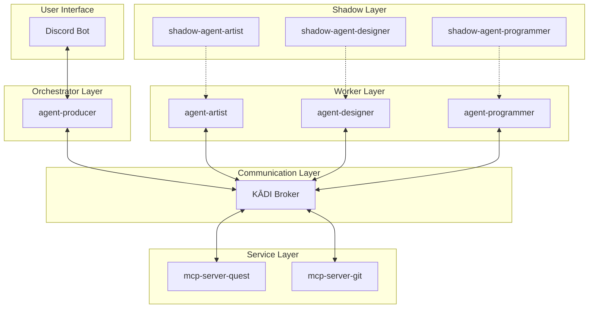
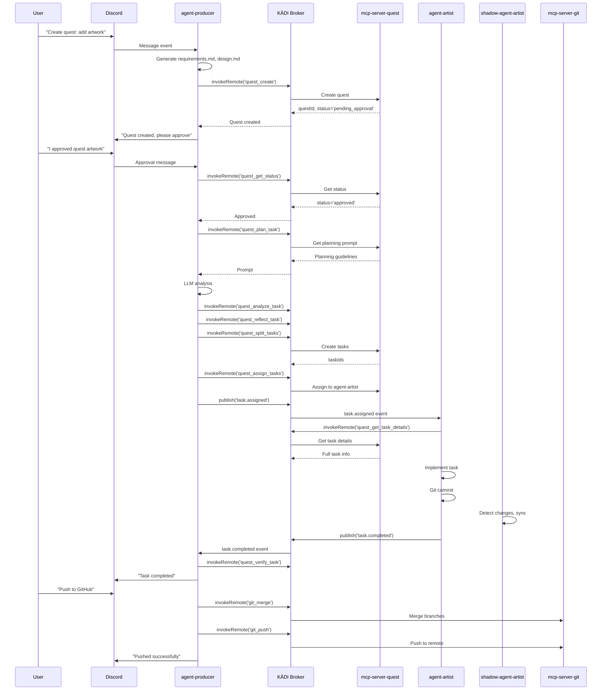

# Design Document

## Overview

The Quest Workflow Enhancement creates a comprehensive multi-agent orchestration system that enables Discord-driven quest creation, automated task decomposition using a four-step workflow (plan → analyze → reflect → split), intelligent task assignment to specialized worker agents, and automated git operations. The system leverages KĀDI broker for event-driven communication, mcp-server-quest for quest/task management, and follows established patterns from mcp-shrimp-task-manager and existing agent implementations.

**Core Value Proposition**: Transform natural language requests in Discord into fully executed, version-controlled implementations through coordinated multi-agent collaboration.

## Steering Document Alignment

### Technical Standards (tech.md)
*Note: No tech.md exists yet. This design follows TypeScript best practices and KĀDI event-driven patterns observed in reference projects.*

- **Language**: TypeScript with strict type checking
- **Event System**: KĀDI broker with RabbitMQ for reliable message delivery
- **Validation**: Zod schemas for all events and tool parameters
- **Architecture**: Factory pattern for agent creation (WorkerAgentFactory, ShadowAgentFactory)
- **Communication**: Event-driven with standardized schemas, remote tool invocation via KĀDI

### Project Structure (structure.md)
*Note: No structure.md exists yet. This design follows patterns from agent-producer and mcp-server-quest.*

**Project Organization** (Absolute Paths):

**Core Agent Projects**:
- `C:\GitHub\agent-producer`: Orchestrator agent with Discord bot
- `C:\GitHub\agent-artist`: Worker agent for creative/artistic tasks
- `C:\GitHub\agents-library`: Shared factories, utilities, and types

**Shadow Agent Projects**:
- `C:\GitHub\shadow-agent-artist`: Shadow agent for backup and monitoring

**MCP Server Projects**:
- `C:\GitHub\mcp-server-quest`: Quest and task management MCP server
- `C:\GitHub\mcp-server-git`: Git operations MCP server
- `C:\GitHub\mcp-server-discord`: Discord integration server
- `C:\GitHub\mcp-client-discord`: Discord client implementation

**Playground Repositories**:
- `C:\GitHub\agent-playground`: Main repository for agent work
- `C:\GitHub\agent-playground-artist`: Artist agent worktree
- `C:\GitHub\shadow-agent-playground-artist`: Shadow agent worktree

**Template Projects**:
- `C:\GitHub\template-agent-typescript`: Agent template and patterns

**KĀDI Infrastructure**:
- `C:\GitHub\kadi\kadi-broker`: KĀDI broker for event-driven communication
- `C:\GitHub\kadi\kadi-core`: KĀDI core libraries
- `C:\GitHub\kadi\kadi-by-example`: KĀDI usage examples

## Code Reuse Analysis

### Existing Components to Leverage

- **WorkerAgentFactory** (agents-library): Factory for creating worker agents with KĀDI client, LLM provider, and event handlers
- **ShadowAgentFactory** (agents-library): Factory for creating shadow agents with file watching and sync capabilities
- **BaseBot** (agents-library): Base Discord bot implementation with command handling
- **KadiEventPublisher** (agents-library): Utility for publishing events to KĀDI broker
- **ProducerToolUtils** (agents-library): Utilities for remote tool invocation via KĀDI
- **mcp-shrimp-task-manager prompts**: Four-step workflow prompts (plan, analyze, reflect, split)

### Integration Points

- **KĀDI Broker**: All agents connect to KĀDI broker for event publishing/subscription and remote tool calls
- **mcp-server-quest**: Provides quest/task CRUD operations, agent registration, and four-step workflow tools
- **mcp-server-git**: Provides git operations (merge, push) accessible via KĀDI broker
- **Discord API**: agent-producer uses Discord.js for bot interface
- **Claude API**: All agents use Claude API for LLM operations (via Anthropic SDK)
- **Git Worktrees**: Each worker agent operates in isolated worktree (agent-playground-artist, etc.)

## Architecture

The system follows an **event-driven microservices architecture** with clear separation of concerns:

1. **Orchestrator Layer**: agent-producer coordinates workflow, manages Discord interactions
2. **Worker Layer**: Specialized agents (artist, designer, programmer) execute tasks independently
3. **Shadow Layer**: Shadow agents provide backup and monitoring
4. **Service Layer**: MCP servers provide stateful services (quest management, git operations)
5. **Communication Layer**: KĀDI broker enables decoupled event-driven communication

### Modular Design Principles

- **Single File Responsibility**: Each agent has focused entry point (index.ts), handlers separated by concern
- **Component Isolation**: Worker agents are independent, communicate only via events
- **Service Layer Separation**: MCP servers handle data persistence, agents handle execution logic
- **Utility Modularity**: Shared utilities in agents-library, no code duplication



### Workflow Sequence



## Components and Interfaces

### Component 1: agent-producer (Orchestrator)

- **Purpose:** Orchestrates quest workflow, manages Discord interactions, coordinates task assignment and verification
- **Interfaces:**
  - Discord bot commands (natural language processing)
  - KĀDI event publisher/subscriber
  - Remote tool invocation for mcp-server-quest and mcp-server-git
- **Dependencies:**
  - agents-library (BaseBot, KadiEventPublisher, ProducerToolUtils)
  - Discord.js for bot functionality
  - Anthropic SDK for LLM operations
  - KĀDI client for broker connection
- **Reuses:**
  - BaseBot for Discord command handling
  - ProducerToolUtils for remote tool calls
  - KadiEventPublisher for event publishing

**Key Methods:**
```typescript
class AgentProducer {
  // Quest creation
  async handleQuestCreation(message: string): Promise<void>
  async generateRequirementsAndDesign(description: string): Promise<{requirements: string, design: string}>

  // Four-step workflow
  async executePlanTask(questId: string): Promise<string>
  async executeAnalyzeTask(questId: string, summary: string, initialConcept: string): Promise<string>
  async executeReflectTask(questId: string, summary: string, analysis: string): Promise<string>
  async executeSplitTasks(questId: string, tasks: Task[], globalAnalysis: string): Promise<string[]>

  // Task management
  async assignTasksToAgent(questId: string, agentId: string): Promise<void>
  async publishTaskAssignedEvents(taskIds: string[]): Promise<void>

  // Event handlers
  async handleTaskCompleted(event: TaskCompletedEvent): Promise<void>
  async handleTaskFailed(event: TaskFailedEvent): Promise<void>

  // Git operations
  async mergeAndPush(questId: string): Promise<void>
}
```

### Component 2: Worker Agents (agent-artist, agent-designer, agent-programmer)

- **Purpose:** Execute assigned tasks independently using specialized capabilities
- **Interfaces:**
  - KĀDI event subscriber (task.assigned)
  - KĀDI event publisher (task.completed, task.failed)
  - Remote tool invocation for mcp-server-quest
  - Local git operations in worktree
- **Dependencies:**
  - agents-library (WorkerAgentFactory)
  - Anthropic SDK for LLM operations
  - KĀDI client for broker connection
  - File system access for worktree
- **Reuses:**
  - WorkerAgentFactory for agent initialization
  - KadiEventPublisher for event publishing

**Key Methods:**
```typescript
class WorkerAgent {
  // Event handlers
  async handleTaskAssigned(event: TaskAssignedEvent): Promise<void>

  // Task execution
  async executeTask(taskId: string): Promise<void>
  async fetchTaskDetails(taskId: string): Promise<TaskDetails>
  async implementTask(task: TaskDetails): Promise<{filesCreated: string[], filesModified: string[]}>

  // Git operations
  async commitChanges(message: string): Promise<string>

  // Event publishing
  async publishTaskCompleted(taskId: string, result: TaskResult): Promise<void>
  async publishTaskFailed(taskId: string, error: Error): Promise<void>
}
```

### Component 3: Shadow Agents (shadow-agent-artist, etc.)

- **Purpose:** Monitor worker agent file changes and maintain backup copies in separate worktrees
- **Interfaces:**
  - File system watcher for worker agent worktree
  - Git operations for shadow worktree
- **Dependencies:**
  - agents-library (ShadowAgentFactory)
  - chokidar for file watching
  - Git for backup commits
- **Reuses:**
  - ShadowAgentFactory for agent initialization
  - File watching patterns from existing shadow agents

**Key Methods:**
```typescript
class ShadowAgent {
  // File monitoring
  async watchWorkerDirectory(path: string): Promise<void>
  async handleFileChange(filePath: string, changeType: 'add' | 'change' | 'unlink'): Promise<void>

  // Backup operations
  async syncToShadowWorktree(files: string[]): Promise<void>
  async commitBackup(message: string): Promise<void>
}
```

### Component 4: mcp-server-quest (Quest Management Service)

- **Purpose:** Manage quest lifecycle, task CRUD operations, agent registration, and provide four-step workflow prompts
- **Interfaces:**
  - MCP tool interface (quest_create, quest_get_status, quest_plan_task, etc.)
  - Dashboard web interface for visualization
  - File-based storage for quests, tasks, agents
- **Dependencies:**
  - @modelcontextprotocol/sdk for MCP server
  - Express for dashboard
  - Zod for validation
- **Reuses:**
  - Prompt patterns from mcp-shrimp-task-manager
  - Dashboard patterns from existing implementation

**Key Tools:**
```typescript
// Quest management
quest_create(name: string, requirements: string, design: string): Promise<{questId: string, status: string}>
quest_get_status(questId: string): Promise<{status: string, tasks: Task[]}>
quest_submit_approval(questId: string): Promise<void>

// Four-step workflow
quest_plan_task(questId: string, description: string): Promise<{prompt: string}>
quest_analyze_task(questId: string, summary: string, initialConcept: string): Promise<{prompt: string}>
quest_reflect_task(questId: string, summary: string, analysis: string): Promise<{prompt: string}>
quest_split_tasks(questId: string, tasks: Task[], globalAnalysisResult: string): Promise<{taskIds: string[]}>

// Task management
quest_assign_tasks(questId: string, agentId: string, taskIds?: string[]): Promise<{assignedCount: number, blockedCount: number}>
quest_get_task_details(taskId: string): Promise<TaskDetails>
quest_verify_task(taskId: string, summary: string, score: number): Promise<void>
quest_submit_task_result(taskId: string, result: TaskResult): Promise<void>

// Agent management
quest_register_agent(agentId: string, role: string, capabilities: string[], status: string): Promise<void>
quest_agent_heartbeat(agentId: string): Promise<void>
quest_unregister_agent(agentId: string): Promise<void>
```

### Component 5: mcp-server-git (Git Operations Service)

- **Purpose:** Provide git operations accessible via KĀDI broker for merge and push workflows
- **Interfaces:**
  - MCP tool interface (git_merge, git_push)
  - Direct git command execution
- **Dependencies:**
  - @modelcontextprotocol/sdk for MCP server
  - simple-git for git operations
- **Reuses:**
  - Git operation patterns from existing implementations

**Key Tools:**
```typescript
git_merge(path: string, branch: string, message: string, noFastForward?: boolean): Promise<{success: boolean, commitSha: string}>
git_push(path: string, branch: string, remote: string): Promise<{success: boolean, remote: string, branch: string, pushedRefs: string[]}>
```

## Data Models

### Quest Model
```typescript
interface Quest {
  id: string;                    // UUID
  name: string;                  // Quest name (kebab-case)
  description: string;           // Original user request
  requirements: string;          // Generated requirements.md content
  design: string;                // Generated design.md content
  status: 'pending_approval' | 'approved' | 'in_progress' | 'completed' | 'failed';
  createdAt: string;             // ISO timestamp
  updatedAt: string;             // ISO timestamp
  createdBy: string;             // Agent ID (e.g., 'agent-producer')
  tasks: string[];               // Array of task IDs
}
```

### Task Model
```typescript
interface Task {
  id: string;                    // UUID
  questId: string;               // Parent quest ID
  name: string;                  // Task name
  description: string;           // Task description
  implementationGuide: string;   // Detailed implementation steps
  verificationCriteria: string;  // How to verify completion
  dependencies: string[];        // Array of task IDs that must complete first
  relatedFiles: RelatedFile[];   // Files involved in this task
  status: 'pending' | 'assigned' | 'in_progress' | 'completed' | 'failed' | 'skipped';
  assignedTo?: string;           // Agent ID
  assignedAt?: string;           // ISO timestamp
  completedAt?: string;          // ISO timestamp
  result?: TaskResult;           // Completion details
}
```

### RelatedFile Model
```typescript
interface RelatedFile {
  path: string;                  // File path relative to worktree
  type: 'TO_MODIFY' | 'REFERENCE' | 'CREATE' | 'DEPENDENCY' | 'OTHER';
  description?: string;          // Optional description
  lineStart?: number;            // Optional line range
  lineEnd?: number;
}
```

### TaskResult Model
```typescript
interface TaskResult {
  filesCreated: string[];        // Paths of created files
  filesModified: string[];       // Paths of modified files
  commitSha: string;             // Git commit SHA
  summary: string;               // Completion summary
  score: number;                 // Verification score (0-100)
}
```

### Agent Model
```typescript
interface Agent {
  id: string;                    // Agent ID (e.g., 'agent-artist')
  role: 'producer' | 'artist' | 'designer' | 'programmer';
  capabilities: string[];        // Array of capability strings
  status: 'online' | 'offline' | 'busy';
  lastHeartbeat: string;         // ISO timestamp
  registeredAt: string;          // ISO timestamp
}
```

### Event Schemas

#### TaskAssignedEvent
```typescript
interface TaskAssignedEvent {
  type: 'task.assigned';
  taskId: string;
  questId: string;
  role: string;                  // Target agent role
  description: string;
  requirements: string;
  timestamp: string;             // ISO timestamp
  assignedBy: string;            // Agent ID
  networkId: string;             // 'utility'
}
```

#### TaskCompletedEvent
```typescript
interface TaskCompletedEvent {
  type: 'task.completed';
  taskId: string;
  questId: string;
  role: string;
  status: 'completed';
  filesCreated: string[];
  filesModified: string[];
  commitSha: string;
  timestamp: string;
  agent: string;                 // Agent ID
  networkId: string;
}
```

#### TaskFailedEvent
```typescript
interface TaskFailedEvent {
  type: 'task.failed';
  taskId: string;
  questId: string;
  role: string;
  error: string;
  errorDetails?: any;
  timestamp: string;
  agent: string;
  networkId: string;
}
```

## Error Handling

### Error Scenarios

1. **Quest Creation Failure**
   - **Scenario:** LLM fails to generate requirements/design, or mcp-server-quest is unavailable
   - **Handling:**
     - Retry LLM generation up to 3 times with exponential backoff
     - If mcp-server-quest unavailable, queue operation and notify user
     - Log error details for debugging
   - **User Impact:** Discord message: "Failed to create quest: {error}. Please try again or check system status."

2. **Quest Approval Mismatch**
   - **Scenario:** User claims approval but quest status is not 'approved' in mcp-server-quest
   - **Handling:**
     - Call quest_get_status to verify actual status
     - If mismatch, notify user with clear instructions
   - **User Impact:** Discord message: "Quest is not approved in dashboard. Please approve at http://localhost:3000/quests/{questId}"

3. **Task Assignment to Offline Agent**
   - **Scenario:** User tries to assign tasks to agent that is offline or unregistered
   - **Handling:**
     - Check agent status via mcp-server-quest before assignment
     - If offline, notify user and suggest alternatives
   - **User Impact:** Discord message: "agent-artist is offline. Available agents: agent-designer (online), agent-programmer (online)"

4. **Task Execution Failure**
   - **Scenario:** Worker agent encounters error during task implementation (file access, git error, LLM error)
   - **Handling:**
     - Worker agent publishes task.failed event with error details
     - agent-producer notifies user immediately
     - User can choose: retry, skip, or abort
   - **User Impact:** Discord message: "Task 'create-artwork' failed: Permission denied writing to C:/GitHub/agent-playground-artist/artwork.png. Reply 'retry', 'skip', or 'abort'."

5. **Git Merge Conflict**
   - **Scenario:** Merging worker agent branch causes conflicts
   - **Handling:**
     - git_merge tool detects conflict and returns error
     - agent-producer notifies user with conflict details
     - Wait for manual resolution
   - **User Impact:** Discord message: "Merge conflict in agent-artist branch. Files: artwork.png, config.json. Please resolve manually and reply 'continue' when ready."

6. **Git Push Failure**
   - **Scenario:** Push fails due to network error, authentication, or remote rejection
   - **Handling:**
     - git_push tool returns error with details
     - agent-producer notifies user
     - Suggest manual push or retry
   - **User Impact:** Discord message: "Push failed: Authentication failed. Please check GitHub credentials and reply 'retry' or 'manual'."

7. **KĀDI Broker Disconnection**
   - **Scenario:** Agent loses connection to KĀDI broker
   - **Handling:**
     - Automatic reconnection with exponential backoff
     - Queue events during disconnection
     - Replay queued events after reconnection
   - **User Impact:** Transparent to user if reconnection succeeds within 30 seconds. Otherwise: "System temporarily unavailable. Reconnecting..."

8. **Task Dependency Deadlock**
   - **Scenario:** Circular dependencies or all tasks blocked
   - **Handling:**
     - mcp-server-quest validates dependencies during quest_split_tasks
     - Detect cycles and reject invalid task graphs
     - If detected after creation, notify user
   - **User Impact:** Discord message: "Task dependency error: Task A depends on Task B, which depends on Task A. Please review task dependencies."

9. **LLM Rate Limit or Timeout**
   - **Scenario:** Claude API rate limit exceeded or request timeout
   - **Handling:**
     - Implement exponential backoff with jitter
     - Queue operations during rate limit
     - Notify user if delay exceeds 5 minutes
   - **User Impact:** Discord message: "High system load. Your request is queued and will be processed in ~3 minutes."

10. **Shadow Agent Sync Failure**
    - **Scenario:** Shadow agent fails to sync changes to backup worktree
    - **Handling:**
      - Log error but don't block worker agent
      - Retry sync on next file change
      - Alert user if sync fails for 3 consecutive attempts
    - **User Impact:** Discord message: "Warning: Backup sync failed for agent-artist. Work is saved in main worktree but backup may be outdated."

## Testing Strategy

### Manual Testing via Discord Bot

**Approach**: Manual verification through Discord bot interactions to validate all functionality in real-world usage scenarios.

**Testing Environment**:
- Discord bot connected to agent-producer
- All agents (agent-artist, shadow-agent-artist) running
- KĀDI broker active with 'utility' network configured
- mcp-server-quest and mcp-server-git accessible
- Git worktrees properly set up

**Key Scenarios to Test**:

1. **Quest Creation and Requirements Generation**
   - Send Discord message: "Create quest: add artwork to homepage"
   - Verify agent-producer generates requirements.md and design.md
   - Verify quest created in mcp-server-quest with status='pending_approval'
   - Verify Discord notification with quest details
   - **Expected Result**: Quest appears in dashboard, documents are well-formed

2. **Quest Approval Workflow**
   - Approve quest in mcp-server-quest dashboard
   - Send Discord message: "I approved quest artwork"
   - Verify agent-producer validates approval status
   - Verify quest status changes to 'approved'
   - **Expected Result**: Agent-producer confirms approval and proceeds

3. **Four-Step Task Generation**
   - Send Discord message: "Create tasks for quest artwork"
   - Verify agent-producer executes: plan → analyze → reflect → split
   - Monitor Discord for progress updates
   - Verify tasks created with proper dependencies
   - **Expected Result**: Tasks appear in dashboard with dependency graph

4. **Task Assignment**
   - Send Discord message: "Assign tasks to agent-artist"
   - Verify only ready tasks (no unresolved dependencies) are assigned
   - Verify Discord notification shows assigned count and blocked count
   - **Expected Result**: Tasks marked as 'assigned' to agent-artist

5. **Task Execution by Worker Agent**
   - Send Discord message: "Start implementing tasks"
   - Verify task.assigned events published to KĀDI broker
   - Verify agent-artist receives events and starts execution
   - Monitor agent-artist logs for task implementation
   - Verify files created/modified in C:\GitHub\agent-playground-artist
   - Verify git commits in agent-playground-artist worktree
   - **Expected Result**: Tasks complete, files committed, task.completed events published

6. **Shadow Agent Backup**
   - Monitor shadow-agent-artist during task execution
   - Verify file changes detected in agent-playground-artist
   - Verify changes synced to C:\GitHub\shadow-agent-playground-artist
   - Verify backup commits created
   - **Expected Result**: Shadow worktree mirrors main worktree

7. **Task Completion and Verification**
   - Verify agent-producer receives task.completed events
   - Verify agent-producer calls quest_verify_task
   - Verify Discord notification: "Task {name} completed successfully"
   - Verify task status updated to 'completed' in dashboard
   - **Expected Result**: All tasks marked complete, quest status updates

8. **Git Merge and Push**
   - Send Discord message: "Push to GitHub"
   - Verify agent-producer asks for confirmation
   - Reply: "yes"
   - Verify agent-producer merges agent-artist branch to main
   - Verify agent-producer pushes to remote
   - Verify Discord notification with push result
   - **Expected Result**: Commits appear in GitHub repository

9. **Error Handling - Task Failure**
   - Trigger task failure (e.g., invalid file path)
   - Verify agent-artist publishes task.failed event
   - Verify Discord notification with error details
   - Reply: "retry"
   - Verify task re-executed successfully
   - **Expected Result**: Graceful error recovery

10. **Error Handling - Git Conflict**
    - Create conflicting changes in main branch
    - Attempt merge via Discord: "Push to GitHub"
    - Verify agent-producer detects conflict
    - Verify Discord notification with conflict details
    - Manually resolve conflict
    - Reply: "continue"
    - **Expected Result**: Merge completes after manual resolution

11. **Agent Registration and Heartbeat**
    - Start agent-artist
    - Verify agent appears as 'online' in dashboard
    - Monitor heartbeat updates (every 30 seconds)
    - Stop agent-artist
    - Verify agent marked as 'offline' after 90 seconds
    - **Expected Result**: Agent status accurately reflects availability

12. **Multi-Task Dependencies**
    - Create quest with dependent tasks (Task B depends on Task A)
    - Assign tasks to agent-artist
    - Verify Task B blocked until Task A completes
    - Verify Task B automatically becomes ready after Task A completion
    - **Expected Result**: Dependency chain executes in correct order

**Verification Checklist**:
- [ ] All Discord commands respond within 5 seconds
- [ ] All events flow through KĀDI broker correctly
- [ ] All file operations succeed in correct worktrees
- [ ] All git operations (commit, merge, push) succeed
- [ ] All error scenarios handled gracefully
- [ ] Dashboard updates reflect real-time status
- [ ] All 10 requirements from requirements.md satisfied

**Test Documentation**:
- Record Discord conversation logs for each test scenario
- Capture screenshots of dashboard states
- Document any unexpected behaviors or edge cases
- Note performance metrics (response times, event latency)

### Integration Testing

**Approach**: End-to-end tests with real KĀDI broker and MCP servers

**Key Flows to Test**:

1. **Quest Creation Flow**
   - Discord message → agent-producer → mcp-server-quest → quest created
   - Verify quest stored with correct status
   - Verify Discord notification sent

2. **Four-Step Workflow**
   - Execute plan → analyze → reflect → split sequence
   - Verify each step calls correct tool
   - Verify tasks created with dependencies

3. **Task Assignment and Execution**
   - Assign tasks → publish task.assigned events → worker receives → executes → publishes task.completed
   - Verify event flow through KĀDI broker
   - Verify task status updates in mcp-server-quest

4. **Git Operations**
   - Worker commits → agent-producer merges → pushes to remote
   - Verify commits in correct branches
   - Verify merge creates merge commit
   - Verify push updates remote

5. **Error Recovery**
   - Simulate task failure → verify task.failed event → user retry → task succeeds
   - Simulate git conflict → verify error notification → manual resolution → continue

6. **Agent Registration and Heartbeat**
   - Agent starts → registers → sends heartbeats → stops → unregisters
   - Verify agent status updates in mcp-server-quest
   - Verify offline detection after missed heartbeats

### End-to-End Testing

**Approach**: Manual testing with real Discord bot and full system

**User Scenarios to Test**:

1. **Complete Quest Workflow**
   - User: "Create quest: add logo to homepage"
   - System generates requirements/design
   - User approves in dashboard
   - User: "Create tasks for quest logo"
   - System executes four-step workflow
   - User: "Assign tasks to agent-designer"
   - User: "Start implementing tasks"
   - agent-designer completes tasks
   - User: "Push to GitHub"
   - Verify logo appears in repository

2. **Multi-Agent Collaboration**
   - User: "Create quest: build landing page"
   - System creates quest with multiple tasks
   - User assigns tasks to different agents (designer, programmer)
   - Verify agents work independently
   - Verify all commits merged correctly

3. **Error Handling**
   - User: "Create quest: invalid request"
   - Verify graceful error handling
   - User: "Assign tasks to offline-agent"
   - Verify error message with alternatives

4. **Dashboard Interaction**
   - User approves quest in dashboard
   - User monitors task progress in dashboard
   - User views agent status in dashboard
   - Verify real-time updates

**Acceptance Criteria**: All 10 requirements from requirements.md must pass E2E tests

## Implementation Notes

### Phase 1: Core Infrastructure (Week 1)
- Implement mcp-server-quest with quest/task CRUD
- Implement four-step workflow tools (plan, analyze, reflect, split)
- Set up KĀDI broker integration
- Create agent registration system

### Phase 2: agent-producer Enhancement (Week 2)
- Implement Discord bot quest creation
- Implement four-step workflow execution
- Implement task assignment logic
- Implement event handlers

### Phase 3: Worker Agent Implementation (Week 3)
- Enhance agent-artist with task execution
- Implement agent-designer and agent-programmer
- Implement event publishing
- Test task execution flow

### Phase 4: Git Integration (Week 4)
- Implement mcp-server-git
- Implement merge/push workflow in agent-producer
- Test multi-agent git operations
- Implement shadow agent sync

### Phase 5: Testing and Refinement (Week 5)
- Complete unit tests
- Complete integration tests
- Perform E2E testing
- Fix bugs and optimize performance

### Critical Dependencies
- KĀDI broker must be running and accessible
- RabbitMQ must be configured for 'utility' network
- All agents must have valid Claude API keys
- Git worktrees must be set up correctly
- Discord bot token must be configured

### Performance Considerations
- LLM operations are slowest (5-30 seconds per call)
- Git operations can be slow for large repositories
- Event delivery through KĀDI adds ~50-100ms latency
- Task execution time varies by complexity (1 minute to 1 hour)

### Security Considerations
- Discord bot token must be kept secret
- Claude API keys must be environment variables
- Git operations require proper authentication
- KĀDI broker should use authentication in production
- File system access must be restricted to worktrees
