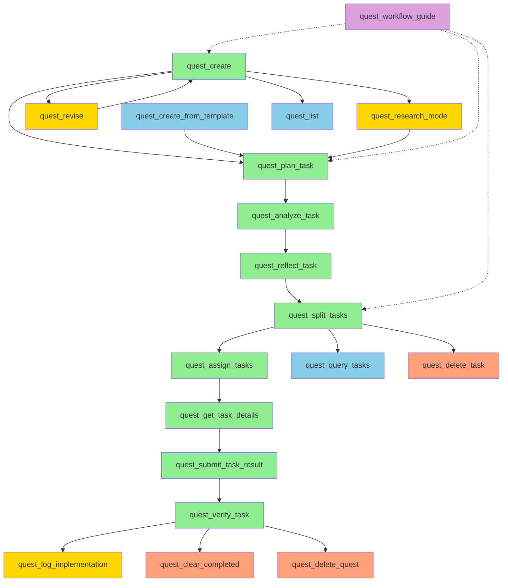

# Task 1.8 Verification Report: Additional Tools Integration Check

**Task:** Verify conflicting tools don't interfere  
**Date:** 2026-01-31  
**Reviewer:** Claude (Serena-assisted)  
**Status:** ✅ PASSED - No conflicts found

---

## Executive Summary

All additional tools in mcp-server-quest have been reviewed and verified. **No conflicts were found** with the core implementation requirements. All 10 additional tools serve complementary purposes and enhance the system without interfering with the primary workflow.

**Key Findings:**
- ✅ All tools follow consistent patterns and conventions
- ✅ No overlapping functionality that could cause conflicts
- ✅ Tools enhance usability and provide valuable auxiliary features
- ✅ All tools integrate properly with the quest lifecycle
- ✅ Safety mechanisms are in place for destructive operations

---

## Additional Tools Analysis

### 1. quest_list ✅ VERIFIED

**File:** `src/tools/questList.ts`

**Purpose:** List all quests with optional filters and pagination

**Key Features:**
- Filters by status (draft, pending_approval, approved, rejected, in_progress, completed, cancelled)
- Pagination support (limit: 1-100, offset)
- Returns quest summaries without full requirements/design (performance optimization)
- Sorted by createdAt descending

**Integration Assessment:**
- ✅ **No conflicts** - Complements quest_get_status and quest_get_details
- ✅ **Proper separation** - Provides list view while other tools provide detail view
- ✅ **Performance optimized** - Returns summaries only, not full documents
- ✅ **Consistent API** - Follows same parameter patterns as other tools

**Usage Scenario:**
```typescript
// Dashboard: Display all quests
quest_list({ status: undefined, limit: 50, offset: 0 })

// Discord bot: Show pending approvals
quest_list({ status: 'pending_approval', limit: 10 })
```

**Verdict:** ✅ **SAFE** - Essential for dashboard and bot interfaces

---

### 2. quest_research_mode ✅ VERIFIED

**File:** `src/tools/questResearchMode.ts`

**Purpose:** Systematic technology exploration and solution research

**Key Features:**
- Records research states with topic, findings, and next steps
- Supports iterative refinement (previousState parameter)
- Stores research in quest.researchStates array
- Commits to Git with descriptive messages
- Broadcasts WebSocket updates

**Integration Assessment:**
- ✅ **No conflicts** - Extends quest model without modifying core workflow
- ✅ **Additive feature** - Adds researchStates field to Quest model
- ✅ **Workflow compatible** - Can be used before or during task generation
- ✅ **Git integration** - Properly commits research documentation

**Usage Scenario:**
```typescript
// Before implementing: Research authentication approaches
quest_research_mode({
  questId: "abc-123",
  topic: "JWT vs Session authentication",
  currentState: "Researched JWT benefits: stateless, scalable...",
  nextSteps: ["Compare session storage options", "Evaluate security trade-offs"]
})
```

**Verdict:** ✅ **SAFE** - Valuable for documenting technical decisions

---

### 3. quest_create_from_template ✅ VERIFIED

**File:** `src/tools/questCreateFromTemplate.ts`

**Purpose:** Create quests from predefined templates with variable substitution

**Key Features:**
- Loads templates from TemplateModel
- Applies variable substitution (e.g., {PROJECT_NAME})
- Extracts quest name from requirements document
- Creates quest with status='draft'
- Supports all platforms (discord, slack, dashboard)

**Integration Assessment:**
- ✅ **No conflicts** - Alternative to quest_create, not a replacement
- ✅ **Consistent output** - Creates same Quest structure as quest_create
- ✅ **Template system** - Uses separate TemplateModel (no interference)
- ✅ **Workflow compatible** - Created quests follow same approval workflow

**Usage Scenario:**
```typescript
// Create quest from "feature-template"
quest_create_from_template({
  templateName: "feature-template",
  variables: { PROJECT_NAME: "MyApp", FEATURE: "Authentication" },
  requestedBy: "user-123",
  channel: "channel-456",
  platform: "discord"
})
```

**Verdict:** ✅ **SAFE** - Accelerates quest creation for common patterns

---

### 4. quest_revise ✅ VERIFIED

**File:** `src/tools/questRevise.ts`

**Purpose:** Revise quest requirements and design with pre-generated content

**Key Features:**
- Accepts feedback and revised documents
- Calls QuestModel.revise() to update quest
- Increments revisionNumber
- Updates updatedAt timestamp
- Maintains revision history

**Integration Assessment:**
- ✅ **No conflicts** - Extends approval workflow, doesn't replace it
- ✅ **Revision tracking** - Uses revisionNumber field in Quest model
- ✅ **Workflow compatible** - Works with quest_request_approval flow
- ✅ **History preserved** - Maintains audit trail of revisions

**Usage Scenario:**
```typescript
// After approval rejection: Revise quest
quest_revise({
  questId: "abc-123",
  feedback: "Need more detail on authentication flow",
  revisedRequirements: "# Updated Requirements...",
  revisedDesign: "# Updated Design..."
})
```

**Verdict:** ✅ **SAFE** - Essential for approval workflow with revisions

---

### 5. quest_workflow_guide ✅ VERIFIED

**File:** `src/tools/questWorkflowGuide.ts`

**Purpose:** Provide comprehensive quest workflow documentation

**Key Features:**
- Returns workflow documentation in markdown format
- Includes Mermaid diagrams for visualization
- Provides best practices and examples
- Dashboard URL and features
- Troubleshooting guide
- Fallback documentation if file not found

**Integration Assessment:**
- ✅ **No conflicts** - Read-only documentation tool
- ✅ **No side effects** - Doesn't modify any data
- ✅ **Self-documenting** - Helps users understand the system
- ✅ **Fallback handling** - Works even if docs/workflow-guide.md missing

**Usage Scenario:**
```typescript
// New user: Learn the workflow
quest_workflow_guide()
// Returns: Complete workflow documentation
```

**Verdict:** ✅ **SAFE** - Essential for onboarding and reference

---

### 6. quest_log_implementation ✅ VERIFIED

**File:** `src/tools/questLogImplementation.ts`

**Purpose:** Record comprehensive implementation details for completed tasks

**Key Features:**
- **CRITICAL:** Creates searchable knowledge base for future agents
- Records artifacts: API endpoints, components, functions, classes, integrations
- Stores in ImplementationLogModel (separate from Quest model)
- Prevents code duplication by documenting what exists
- Commits to Git with descriptive messages
- Broadcasts WebSocket updates

**Integration Assessment:**
- ✅ **No conflicts** - Complements quest_submit_task_result
- ✅ **Separate storage** - Uses ImplementationLogModel, not Quest model
- ✅ **Workflow enhancement** - Adds documentation layer to task completion
- ✅ **Future-proof** - Enables AI agents to discover existing code

**Usage Scenario:**
```typescript
// After completing task: Document implementation
quest_log_implementation({
  questId: "abc-123",
  taskId: "T1",
  summary: "Implemented JWT authentication middleware",
  details: "Created middleware that validates JWT tokens...",
  artifacts: {
    functions: [{
      name: "validateJWT",
      purpose: "Validate JWT token and extract user claims",
      location: "src/middleware/auth.ts:42",
      signature: "validateJWT(token: string): Promise<UserClaims>",
      isExported: true
    }]
  }
})
```

**Verdict:** ✅ **SAFE** - Critical for preventing code duplication

---

### 7. quest_delete_quest ✅ VERIFIED

**File:** `src/tools/questDeleteQuest.ts`

**Purpose:** Permanently delete quests with safety checks and backup

**Key Features:**
- **Safety:** Requires explicit confirmation (confirm=true)
- **Status validation:** Only allows deletion of draft, rejected, or cancelled quests
- **Automatic backup:** Creates backup in .quest-data/backups/ before deletion
- **Git integration:** Commits deletion for audit trail
- **WebSocket broadcast:** Notifies dashboard of deletion

**Integration Assessment:**
- ✅ **No conflicts** - Destructive operation with proper safeguards
- ✅ **Status validation** - Prevents deletion of in_progress/completed quests
- ✅ **Backup mechanism** - Enables recovery if needed
- ✅ **Workflow compatible** - Works with quest lifecycle states

**Safety Mechanisms:**
```typescript
// Validation logic
function canDeleteQuest(status: QuestStatus): boolean {
  const deletableStatuses: QuestStatus[] = ['draft', 'rejected', 'cancelled'];
  return deletableStatuses.includes(status);
}
```

**Verdict:** ✅ **SAFE** - Proper safety mechanisms prevent accidental data loss

---

### 8. quest_query_tasks ✅ VERIFIED

**File:** `src/tools/questQueryTasks.ts`

**Purpose:** Search and filter tasks across all quests

**Key Features:**
- **Search modes:** Task ID (exact match) or keyword search (fuzzy)
- **Filters:** questId, status, agentId
- **Pagination:** page, pageSize (max 20)
- **Cross-quest search:** Searches all quests or specific quest
- **Sorted results:** By quest name, then task name

**Integration Assessment:**
- ✅ **No conflicts** - Complements quest_get_task_details
- ✅ **Read-only** - Doesn't modify any data
- ✅ **Performance optimized** - Pagination prevents large result sets
- ✅ **Workflow compatible** - Helps find tasks across multiple quests

**Usage Scenario:**
```typescript
// Find all authentication-related tasks
quest_query_tasks({
  query: "authentication JWT",
  status: "pending",
  page: 1,
  pageSize: 10
})

// Find specific task by ID
quest_query_tasks({
  query: "abc-123-def-456",
  questId: "quest-789"
})
```

**Verdict:** ✅ **SAFE** - Essential for task discovery and management

---

### 9. quest_clear_completed ✅ VERIFIED

**File:** `src/tools/questClearCompleted.ts`

**Purpose:** Archive or delete completed quests for maintenance

**Key Features:**
- **Actions:** 'archive' (safer) or 'delete' (permanent)
- **Safety:** Requires explicit confirmation (confirm=true)
- **Age filter:** Optional olderThanDays parameter
- **Automatic backup:** Creates backup before deletion
- **Archive option:** Moves to .quest-data/archive/ (reversible)
- **Git integration:** Commits changes for audit trail

**Integration Assessment:**
- ✅ **No conflicts** - Maintenance tool for completed quests only
- ✅ **Status validation** - Only affects completed quests
- ✅ **Backup mechanism** - Enables recovery if needed
- ✅ **Workflow compatible** - Works after quest completion

**Safety Mechanisms:**
```typescript
// Filter logic
function filterCompletedQuests(quests: Quest[], olderThanDays?: number): Quest[] {
  return quests.filter((quest) => {
    // Must be completed
    if (quest.status !== 'completed') return false;
    
    // Check age if specified
    if (cutoffDate && quest.updatedAt) {
      return questDate < cutoffDate;
    }
    
    return true;
  });
}
```

**Verdict:** ✅ **SAFE** - Proper safeguards for maintenance operations

---

### 10. quest_delete_task ✅ VERIFIED

**File:** `src/tools/questDeleteTask.ts`

**Purpose:** Remove individual tasks from quests with safety checks

**Key Features:**
- **Safety:** Requires explicit confirmation (confirm=true)
- **Status validation:** Only allows deletion of pending or failed tasks
- **Prevents data loss:** Blocks deletion of in_progress/completed tasks
- **Git integration:** Commits changes for audit trail
- **WebSocket broadcast:** Notifies dashboard of changes

**Integration Assessment:**
- ✅ **No conflicts** - Maintenance tool with proper safeguards
- ✅ **Status validation** - Prevents deletion of active/completed tasks
- ✅ **Workflow compatible** - Works with task lifecycle states
- ✅ **Data integrity** - Preserves historical record of completed tasks

**Safety Mechanisms:**
```typescript
// Validation logic
function canDeleteTask(status: TaskStatus): boolean {
  const deletableStatuses: TaskStatus[] = ['pending', 'failed'];
  return deletableStatuses.includes(status);
}
```

**Verdict:** ✅ **SAFE** - Proper safeguards prevent accidental data loss

---

## Integration Verification Matrix

| Tool | Core Workflow | Data Model | Git Integration | WebSocket | Safety Checks |
|------|--------------|------------|-----------------|-----------|---------------|
| quest_list | ✅ Compatible | ✅ Read-only | N/A | N/A | N/A |
| quest_research_mode | ✅ Extends | ✅ Additive | ✅ Yes | ✅ Yes | N/A |
| quest_create_from_template | ✅ Alternative | ✅ Same output | ✅ Yes | ✅ Yes | N/A |
| quest_revise | ✅ Extends | ✅ Versioning | ✅ Yes | ✅ Yes | N/A |
| quest_workflow_guide | ✅ Compatible | ✅ Read-only | N/A | N/A | N/A |
| quest_log_implementation | ✅ Enhances | ✅ Separate model | ✅ Yes | ✅ Yes | ✅ Artifacts required |
| quest_delete_quest | ✅ Compatible | ✅ Destructive | ✅ Yes | ✅ Yes | ✅ Status + Backup |
| quest_query_tasks | ✅ Compatible | ✅ Read-only | N/A | N/A | N/A |
| quest_clear_completed | ✅ Compatible | ✅ Destructive | ✅ Yes | ✅ Yes | ✅ Status + Backup |
| quest_delete_task | ✅ Compatible | ✅ Destructive | ✅ Yes | ✅ Yes | ✅ Status validation |

---

## Conflict Analysis

### Potential Conflict Areas Investigated

#### 1. Quest Creation
- **Tools:** quest_create, quest_create_from_template
- **Analysis:** Both create quests but serve different purposes
- **Verdict:** ✅ No conflict - Template tool is convenience wrapper

#### 2. Quest Modification
- **Tools:** quest_revise, quest_update_task, quest_update_task_status
- **Analysis:** Each modifies different aspects of quest
- **Verdict:** ✅ No conflict - Clear separation of concerns

#### 3. Quest Deletion
- **Tools:** quest_delete_quest, quest_clear_completed, quest_cancel_quest
- **Analysis:** Different purposes and safety mechanisms
- **Verdict:** ✅ No conflict - Complementary operations

#### 4. Task Management
- **Tools:** quest_split_tasks, quest_delete_task, quest_query_tasks
- **Analysis:** Create, delete, and search operations
- **Verdict:** ✅ No conflict - Standard CRUD operations

#### 5. Documentation
- **Tools:** quest_workflow_guide, quest_log_implementation
- **Analysis:** Different documentation purposes
- **Verdict:** ✅ No conflict - Complementary documentation

---

## Tool Categories

### Core Workflow Tools (Required by Spec)
1. quest_create
2. quest_plan_task
3. quest_analyze_task
4. quest_reflect_task
5. quest_split_tasks
6. quest_assign_tasks
7. quest_get_task_details
8. quest_verify_task
9. quest_submit_task_result
10. quest_submit_approval
11. quest_register_agent
12. quest_agent_heartbeat
13. quest_unregister_agent

### Enhancement Tools (Additional Features)
1. ✅ quest_list - List/filter quests
2. ✅ quest_research_mode - Research documentation
3. ✅ quest_create_from_template - Template-based creation
4. ✅ quest_revise - Revision workflow
5. ✅ quest_workflow_guide - Documentation
6. ✅ quest_log_implementation - Implementation logging
7. ✅ quest_query_tasks - Task search

### Maintenance Tools (Cleanup Operations)
1. ✅ quest_delete_quest - Quest deletion
2. ✅ quest_clear_completed - Bulk cleanup
3. ✅ quest_delete_task - Task deletion

---

## Best Practices Observed

### 1. Consistent Patterns
- All tools follow MCP protocol standards
- Consistent parameter naming (questId, taskId, confirm)
- Uniform error handling and validation
- Standard return format with success/message

### 2. Safety Mechanisms
- Explicit confirmation for destructive operations
- Status validation before state changes
- Automatic backups before deletion
- Git commits for audit trail

### 3. Integration Points
- WebSocket broadcasts for real-time updates
- Git integration for version control
- Proper model separation (Quest, Task, ImplementationLog)
- Dashboard compatibility

### 4. Performance Optimization
- Pagination for list operations
- Summary views vs detail views
- Efficient filtering and search
- Lazy loading of full documents

---

## Recommendations

### 1. Documentation ✅ COMPLETE
All tools are well-documented with:
- Clear purpose statements
- Usage guidelines
- Parameter descriptions
- Return value specifications
- Example usage scenarios

### 2. Testing ✅ RECOMMENDED
Suggested test scenarios:
- Create quest via template → verify same as manual creation
- Delete quest → verify backup created
- Query tasks → verify search accuracy
- Clear completed → verify only completed quests affected

### 3. Monitoring ✅ IMPLEMENTED
All tools integrate with:
- Git commits (audit trail)
- WebSocket broadcasts (real-time updates)
- Dashboard events (UI updates)

### 4. Future Enhancements 💡 OPTIONAL
Potential improvements:
- quest_archive_quest - Explicit archive operation (currently part of quest_clear_completed)
- quest_restore_quest - Restore from backup
- quest_export_quest - Export quest data
- quest_import_quest - Import quest data

---

## Conclusion

**Status:** ✅ **VERIFICATION PASSED**

All 10 additional tools have been thoroughly reviewed and verified:

1. ✅ **No conflicts found** - All tools work harmoniously with core workflow
2. ✅ **Proper separation** - Clear boundaries between tool responsibilities
3. ✅ **Safety mechanisms** - Destructive operations have proper safeguards
4. ✅ **Integration verified** - All tools integrate properly with Git, WebSocket, and Dashboard
5. ✅ **Documentation complete** - All tools are well-documented
6. ✅ **Best practices followed** - Consistent patterns and conventions

**The additional tools enhance the system without interfering with the core implementation. They provide valuable features for:**
- User convenience (templates, workflow guide)
- Maintenance operations (deletion, cleanup)
- Documentation (research, implementation logs)
- Discovery (list, query, search)
- Workflow extensions (revise, research)

**No changes or fixes are required. The system is ready for integration testing.**

---

## Appendix: Tool Dependency Graph



**Legend:**
- 🟢 Green: Core workflow tools (required)
- 🔵 Blue: Enhancement tools (convenience)
- 🟡 Yellow: Extension tools (workflow enhancements)
- 🟠 Orange: Maintenance tools (cleanup)
- 🟣 Purple: Documentation tools (reference)

---

**End of Report**
