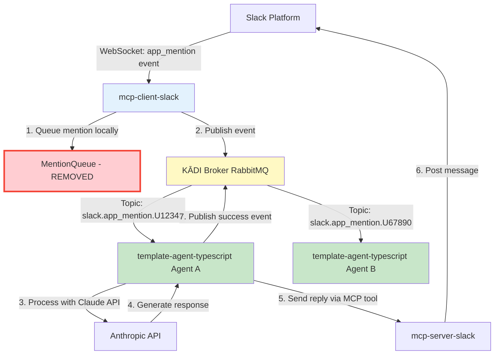
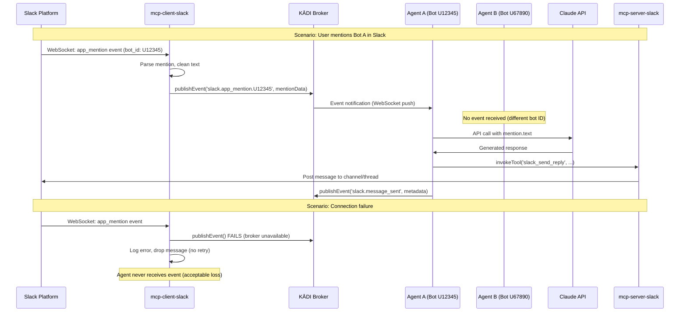

# Design Document

## Overview

This design outlines the migration from a polling-based to an event-based architecture for Slack message handling in the KĀDI ecosystem. The solution leverages KĀDI's existing RabbitMQ infrastructure to deliver real-time push notifications from `mcp-client-slack` to `template-agent-typescript`, eliminating the 5-10 second polling latency and reducing resource overhead by >90%. The design maintains zero changes to `kadi-broker` while achieving <100ms message delivery latency.

**Key Design Principles:**
- Event-driven architecture using existing KĀDI event system
- Bot ID-based topic routing for multi-agent isolation
- Fail-fast error handling with structured logging
- Clean removal of legacy polling infrastructure

## Steering Document Alignment

### Technical Standards (tech.md)

*(Note: No tech.md exists in current project. Following industry best practices.)*

- **Event-Driven Architecture**: Aligns with modern microservices patterns using message brokers
- **Separation of Concerns**: Publishers (mcp-client-slack) and subscribers (agents) are decoupled
- **Idempotency**: Event handlers designed to be safely retriable (future enhancement)
- **Observability**: Structured logging with correlation IDs for event tracing

### Project Structure (structure.md)

*(Note: No structure.md exists in current project. Following observed conventions.)*

- **Monorepo Structure**: Changes isolated to specific packages (`mcp-client-slack`, `template-agent-typescript`)
- **Independent Deployments**: Each component maintains its own build and deployment pipeline
- **Shared Dependencies**: Both components use `@kadi.build/core` for KĀDI client functionality
- **Configuration Management**: Environment-based configuration via `.env` files

## Code Reuse Analysis

### Existing Components to Leverage

- **KadiClient (`@kadi.build/core`)**:
  - Already used in `template-agent-typescript` for broker communication
  - Provides `publishEvent()` and `subscribeToEvent()` methods
  - No new dependency needed for agents; add to `mcp-client-slack` only

- **SlackManager (mcp-client-slack/src/index.ts:145-220)**:
  - Extend `handleMention()` method to publish events after queuing
  - Reuse existing Slack SDK integration (`@slack/bolt` Socket Mode)
  - Leverage existing `SlackMention` interface (lines 71-84)

- **SlackBot (template-agent-typescript/src/slack-bot.ts:1-250)**:
  - Replace polling logic with event subscription in `initialize()` method
  - Reuse existing `handleMention()` processing logic with Claude API
  - Maintain existing error handling and circuit breaker patterns

### Integration Points

- **KĀDI Broker (RabbitMQ)**:
  - Use existing topic exchanges (`kadi.events.{networkId}`)
  - Event routing via `slack.app_mention.{BOT_USER_ID}` topic pattern
  - No broker configuration changes required

- **Slack SDK (`@slack/bolt`)**:
  - Continue using Socket Mode for real-time Slack event delivery
  - No changes to `app_mention` event listener setup
  - Maintain existing authentication (bot token, app token)

- **Claude API (Anthropic SDK)**:
  - No changes to integration in `template-agent-typescript`
  - Continue using existing prompt construction and response handling

## Architecture

The architecture follows an **event-driven publish-subscribe pattern** with bot ID-based topic routing for multi-agent isolation.

### Modular Design Principles

- **Single File Responsibility**:
  - `mcp-client-slack/src/index.ts`: Slack event ingestion + KĀDI event publishing
  - `template-agent-typescript/src/slack-bot.ts`: Event subscription + mention processing
  - No shared queue or state between components

- **Component Isolation**:
  - Publisher (mcp-client-slack) has zero knowledge of subscribers
  - Subscribers (agents) have zero knowledge of publisher implementation
  - RabbitMQ broker mediates all communication

- **Service Layer Separation**:
  - **Event Layer**: KĀDI event publishing/subscription
  - **Business Logic Layer**: Claude API invocation, response generation
  - **Integration Layer**: Slack SDK Socket Mode, MCP tool invocations

- **Utility Modularity**:
  - KĀDI connection logic encapsulated in separate initialization function
  - Event payload validation using existing Zod schemas
  - Logging utilities for structured event tracing

### Architecture Diagram



### Event Flow Sequence



## Components and Interfaces

### Component 1: KadiEventPublisher (mcp-client-slack)

- **Purpose:** Connect to KĀDI broker as a client and publish Slack mention events in real-time

- **Interfaces:**
  ```typescript
  class KadiEventPublisher {
    constructor(config: KadiClientConfig)
    async connect(): Promise<void>
    async publishMention(mention: SlackMention, botUserId: string): Promise<void>
    async disconnect(): Promise<void>
  }
  ```

- **Dependencies:**
  - `@kadi.build/core` - KadiClient library
  - `SlackMention` interface (existing)
  - Environment variables: `KADI_BROKER_URL`, `SLACK_BOT_USER_ID`

- **Reuses:**
  - Existing `SlackMention` interface (lines 71-84 of mcp-client-slack/src/index.ts)
  - Existing Slack SDK integration in `SlackManager`

### Component 2: SlackEventSubscriber (template-agent-typescript)

- **Purpose:** Subscribe to bot-specific Slack mention events and process them with Claude API

- **Interfaces:**
  ```typescript
  class SlackEventSubscriber {
    constructor(kadiClient: KadiClient, botUserId: string)
    async subscribe(): Promise<void>
    private async handleMentionEvent(eventData: SlackMentionEvent): Promise<void>
    async unsubscribe(): Promise<void>
  }
  ```

- **Dependencies:**
  - `KadiClient` (already available in template-agent-typescript)
  - Anthropic SDK for Claude API calls (existing)
  - `slack-server` MCP tool for sending replies (existing)

- **Reuses:**
  - Existing KadiClient instance in main agent initialization
  - Existing `invokeToolWithRetry()` method with circuit breaker pattern
  - Existing Claude API integration and prompt construction

### Component 3: SlackMention Event Model (Shared)

- **Purpose:** Define the event payload structure published by mcp-client-slack and consumed by agents

- **Schema:**
  ```typescript
  interface SlackMentionEvent {
    id: string;              // Event timestamp
    user: string;            // Slack user ID who mentioned
    text: string;            // Message text (bot mention removed)
    channel: string;         // Slack channel ID
    thread_ts: string;       // Thread timestamp for replies
    ts: string;              // Event timestamp
    bot_id: string;          // Bot user ID (matches topic suffix)
    timestamp: string;       // ISO 8601 publish timestamp
  }
  ```

- **Validation:**
  - Zod schema for runtime validation at publisher and subscriber
  - Required fields enforce non-null constraints
  - `bot_id` must match topic pattern `slack.app_mention.{bot_id}`

## Data Models

### SlackMentionEvent (Event Payload)

```typescript
import { z } from 'zod';

const SlackMentionEventSchema = z.object({
  id: z.string().describe('Event timestamp'),
  user: z.string().describe('Slack user ID who mentioned the bot'),
  text: z.string().describe('Message text with bot mention removed'),
  channel: z.string().describe('Slack channel ID'),
  thread_ts: z.string().describe('Thread timestamp for reply context'),
  ts: z.string().describe('Event timestamp'),
  bot_id: z.string().describe('Bot user ID for routing'),
  timestamp: z.string().datetime().describe('ISO 8601 publish timestamp'),
});

type SlackMentionEvent = z.infer<typeof SlackMentionEventSchema>;
```

**Usage:**
- Published by `mcp-client-slack` to topic `slack.app_mention.{bot_id}`
- Consumed by agents subscribed to matching bot ID topic
- Validated on both publish and receive for data integrity

### KadiClientConfig (Configuration)

```typescript
interface KadiClientConfig {
  name: string;                // Client identifier (e.g., 'mcp-client-slack')
  version: string;             // Semantic version
  role: 'agent' | 'client';   // Role in KĀDI ecosystem
  broker: string;              // WebSocket URL (e.g., 'ws://localhost:8080')
  networks: string[];          // Networks to join (e.g., ['slack'])
}
```

**Usage:**
- Instantiate KadiClient for event publishing (mcp-client-slack)
- Already configured in template-agent-typescript (no changes needed)

## Error Handling

### Error Scenarios

1. **Scenario: KĀDI Broker Connection Failed on Startup**
   - **Handling:**
     - Log error: `ERROR: Failed to connect to KĀDI broker at ${brokerUrl}: ${error.message}`
     - Continue Slack SDK operation (graceful degradation)
     - Retry connection every 30 seconds in background
   - **User Impact:**
     - Slack mentions NOT delivered to agents until connection restored
     - No user-facing error (agents simply don't receive messages)

2. **Scenario: Event Publish Failed (Broker Temporarily Unavailable)**
   - **Handling:**
     - Log error: `ERROR: Failed to publish slack.app_mention.${botId} event: ${error.message}`
     - Drop message (no retry, no queue)
     - Increment failure counter for monitoring
   - **User Impact:**
     - Specific mention lost (acceptable loss per requirements)
     - No agent response to that Slack message

3. **Scenario: Invalid Event Payload (Schema Validation Failed)**
   - **Handling:**
     - Log error: `ERROR: Invalid SlackMentionEvent payload: ${validationError}`
     - Reject event (subscriber skips processing)
     - Publish error event to `slack.error` topic
   - **User Impact:**
     - Mention not processed by agent
     - No response sent to Slack

4. **Scenario: Agent Processing Failed (Claude API Error)**
   - **Handling:**
     - Log error: `ERROR: Failed to process mention ${mentionId}: ${error.message}`
     - Publish error event to `slack.error` topic with context
     - Existing circuit breaker pattern prevents cascade failures
   - **User Impact:**
     - No response sent to Slack for that mention
     - User may retry by mentioning bot again

5. **Scenario: Multiple Agents Subscribe to Same Bot ID**
   - **Handling:**
     - RabbitMQ fan-out delivers event to ALL subscribers (by design)
     - Each agent processes independently (duplicate responses)
     - Log warning if duplicate subscriptions detected (future enhancement)
   - **User Impact:**
     - User receives multiple responses to same mention
     - Configuration error (should be prevented at deployment level)

## Testing Strategy

### Unit Testing

**mcp-client-slack:**
- `KadiEventPublisher.connect()` - Mock KadiClient, verify connection success/failure
- `KadiEventPublisher.publishMention()` - Mock `publishEvent()`, verify correct topic and payload
- `SlackManager.handleMention()` - Verify event publishing integration (spy on publisher)

**template-agent-typescript:**
- `SlackEventSubscriber.subscribe()` - Mock KadiClient, verify subscription to correct topic pattern
- `SlackEventSubscriber.handleMentionEvent()` - Mock Claude API, verify mention processing logic
- Event payload validation - Test Zod schema with valid/invalid payloads

**Test Coverage Target:** >80% for new event handling code

### Integration Testing

**End-to-End Event Flow:**
1. Start mock KĀDI broker (RabbitMQ in Docker)
2. Start `mcp-client-slack` with test Slack bot token
3. Start `template-agent-typescript` subscribed to test bot ID
4. Simulate Slack `app_mention` event via Slack SDK mock
5. Verify event published to correct topic
6. Verify agent receives event and processes with Claude API mock
7. Verify reply sent via `mcp-server-slack` mock

**Multi-Agent Isolation:**
1. Start two agents with different bot IDs (U11111, U22222)
2. Publish event to topic `slack.app_mention.U11111`
3. Verify only Agent 1 receives event (Agent 2 does not)

**Error Handling:**
1. Stop KĀDI broker mid-test
2. Verify `mcp-client-slack` logs error and drops message
3. Restart broker, verify reconnection and event delivery resumes

### End-to-End Testing

**User Scenarios:**

**Scenario 1: Single Agent Responds to Mention**
1. User mentions bot in Slack channel: `@bot what's the weather?`
2. Verify agent receives event within 100ms
3. Verify Claude API called with correct prompt
4. Verify reply sent to Slack thread within 2 seconds

**Scenario 2: Multiple Agents Operate Independently**
1. User mentions Bot A in Slack: `@botA hello`
2. User mentions Bot B in Slack: `@botB hello`
3. Verify Agent A receives only Bot A mention
4. Verify Agent B receives only Bot B mention
5. Verify both agents respond independently

**Scenario 3: Polling Code Removed (Negative Test)**
1. Start agent without event subscription (misconfiguration)
2. User mentions bot in Slack
3. Verify agent does NOT poll `get_slack_mentions` tool
4. Verify agent does NOT receive mention (expected failure)

**Performance Benchmarks:**
- Event latency (Slack → Agent): <100ms (p99)
- Agent CPU usage when idle: <5% (vs. >50% with polling)
- Network requests when idle: 0 req/min (vs. 12 req/min with polling)
- Throughput: >1000 mentions/second without message loss

---

## Implementation Files

**mcp-client-slack:**
- `src/index.ts` - Add KadiEventPublisher, integrate with SlackManager.handleMention()
- `src/types.ts` - Define SlackMentionEvent schema (new file)
- `package.json` - Add dependency: `@kadi.build/core`
- `.env.example` - Add: `KADI_BROKER_URL`, `SLACK_BOT_USER_ID`

**template-agent-typescript:**
- `src/slack-bot.ts` - Replace polling with SlackEventSubscriber
- `src/index.ts` - Remove MentionQueue references, clean up imports
- No new dependencies (already has `@kadi.build/core`)

**Removed Files:**
- `mcp-client-slack/src/index.ts` - Remove `MentionQueue` class (lines 106-139)
- `mcp-client-slack/src/index.ts` - Remove `handleGetMentions()` tool handler (lines 311-334)

**Configuration Changes:**
- Both projects require `KADI_BROKER_URL` environment variable
- `mcp-client-slack` requires `SLACK_BOT_USER_ID` (detect from Slack SDK if possible)
