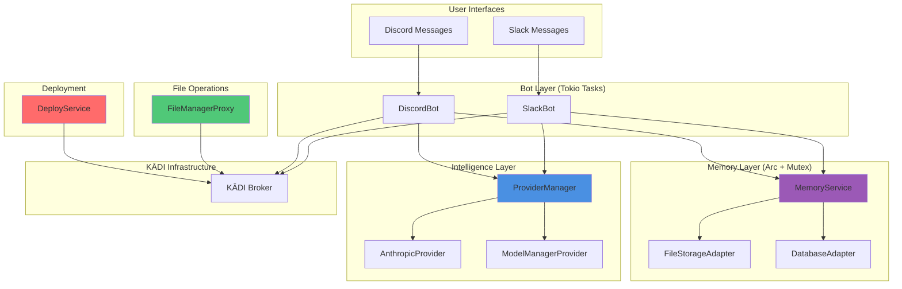

# Design Document: Template Agent Rust

## Overview

This document specifies the technical design for **template-agent-rust**, a production-ready Rust implementation of the KĀDI agent template. The design mirrors the architecture of template-agent-typescript while leveraging Rust's unique strengths: zero-cost abstractions, memory safety without garbage collection, fearless concurrency, and compile-time guarantees.

The agent will provide a high-performance foundation for building intelligent agents within the KĀDI ecosystem, supporting multi-LLM providers, hybrid memory systems, comprehensive file management, and autonomous deployment capabilities.

## Steering Document Alignment

### Technical Standards (tech.md)

*Note: If steering documents exist, they will be consulted. This design follows Rust best practices:*

- **Cargo Workspace**: Organize crates for modularity and code reuse
- **Async Runtime**: Use Tokio for async/await with proper task management
- **Error Handling**: Custom error types per module using `thiserror` crate
- **Type Safety**: Leverage Rust's type system to prevent invalid states
- **Testing**: Unit tests with `#[cfg(test)]`, integration tests in `tests/` directory
- **Documentation**: Comprehensive rustdoc comments for public APIs

### Project Structure (structure.md)

*Note: If steering documents exist, they will be consulted. This design proposes:*

```
template-agent-rust/
├── Cargo.toml                    # Workspace manifest
├── crates/
│   ├── template-agent/           # Main binary crate
│   │   ├── src/
│   │   │   ├── main.rs           # Entry point
│   │   │   └── config.rs         # Configuration loading
│   │   └── Cargo.toml
│   ├── providers/                # LLM provider system
│   │   ├── src/
│   │   │   ├── lib.rs
│   │   │   ├── types.rs
│   │   │   ├── anthropic.rs
│   │   │   ├── model_manager.rs
│   │   │   └── manager.rs
│   │   └── Cargo.toml
│   ├── memory/                   # Hybrid memory system
│   │   ├── src/
│   │   │   ├── lib.rs
│   │   │   ├── types.rs
│   │   │   ├── file_storage.rs
│   │   │   ├── database.rs
│   │   │   └── service.rs
│   │   └── Cargo.toml
│   ├── file-management/          # File operations
│   │   ├── src/
│   │   │   ├── lib.rs
│   │   │   └── proxy.rs
│   │   └── Cargo.toml
│   ├── deployment/               # Deployment service
│   │   ├── src/
│   │   │   ├── lib.rs
│   │   │   └── service.rs
│   │   └── Cargo.toml
│   ├── bot/                      # Bot implementations
│   │   ├── src/
│   │   │   ├── lib.rs
│   │   │   ├── slack.rs
│   │   │   └── discord.rs
│   │   └── Cargo.toml
│   └── common/                   # Shared utilities
│       ├── src/
│       │   ├── lib.rs
│       │   ├── result.rs
│       │   └── error.rs
│       └── Cargo.toml
├── examples/                     # Usage examples
│   ├── basic_chat.rs
│   ├── slack_bot.rs
│   └── memory_demo.rs
├── tests/                        # Integration tests
│   ├── provider_flow.rs
│   └── memory_flow.rs
└── docs/                         # Documentation
    ├── architecture.md
    └── deployment-guide.md
```

## Code Reuse Analysis

### Existing Components to Leverage

**From template-agent-typescript:**
- **Architecture Patterns**: Provider manager orchestration, hybrid memory layering, bot resilience patterns
- **API Contracts**: KĀDI protocol message formats, event schemas, tool interfaces
- **Configuration Model**: Environment variable structure, feature flags, deployment parameters

### Integration Points

**KĀDI Broker Integration:**
- WebSocket connection using `tokio-tungstenite` crate
- Tool registration and discovery via KĀDI protocol
- Event subscription using async message handlers
- Automatic reconnection with exponential backoff

**External Services:**
- **Anthropic API**: HTTP/2 client using `reqwest` with streaming support
- **Model Manager Gateway**: OpenAI-compatible REST API client
- **ArcadeDB**: HTTP-based graph database client for long-term memory
- **Digital Ocean API**: Droplet management for autonomous deployment

## Architecture

### High-Level System Architecture



### Modular Design Principles

- **Single File Responsibility**: Each module (`.rs` file) handles one specific domain or concern
- **Component Isolation**: Providers, memory, deployment are separate crates with defined boundaries
- **Service Layer Separation**: Bot → Provider → Memory → Storage layers with clear interfaces
- **Trait-Based Abstraction**: Use traits for polymorphism (e.g., `LLMProvider` trait, `StorageAdapter` trait)
- **Ownership and Borrowing**: Leverage Rust's ownership for thread-safe concurrency without locks where possible
- **Arc + Mutex Pattern**: Shared state wrapped in `Arc<Mutex<T>>` for safe concurrent access

## Components and Interfaces

### Component 1: Provider System

**Purpose:** Abstract multiple LLM providers behind unified interface with routing, fallback, and health monitoring

**Public Interface (Trait):**
```rust
#[async_trait]
pub trait LLMProvider: Send + Sync {
    fn name(&self) -> &str;

    async fn chat(
        &self,
        messages: &[Message],
        options: Option<&ChatOptions>,
    ) -> Result<String, ProviderError>;

    async fn stream_chat(
        &self,
        messages: &[Message],
        options: Option<&ChatOptions>,
    ) -> Result<Pin<Box<dyn Stream<Item = Result<String, ProviderError>>>>, ProviderError>;

    async fn get_available_models(&self) -> Result<Vec<String>, ProviderError>;

    async fn is_healthy(&self) -> bool;

    fn reset_health(&mut self);
}
```

**ProviderManager API:**
```rust
pub struct ProviderManager {
    providers: HashMap<String, Arc<RwLock<Box<dyn LLMProvider>>>>,
    health_status: Arc<RwLock<HashMap<String, ProviderHealth>>>,
    config: ProviderConfig,
}

impl ProviderManager {
    pub fn new(providers: Vec<Box<dyn LLMProvider>>, config: ProviderConfig) -> Self;

    pub async fn chat(
        &self,
        messages: &[Message],
        options: Option<&ChatOptions>,
    ) -> Result<String, ProviderError>;

    pub async fn stream_chat(
        &self,
        messages: &[Message],
        options: Option<&ChatOptions>,
    ) -> Result<Pin<Box<dyn Stream<Item = Result<String, ProviderError>>>>, ProviderError>;

    pub async fn get_health_status(&self) -> HashMap<String, ProviderHealth>;

    fn select_provider(&self, model: Option<&str>) -> &str;
}
```

**Dependencies:**
- `reqwest` for HTTP clients
- `tokio` for async runtime
- `futures` for stream combinators
- `serde` for JSON serialization

**Reuses:** N/A (new implementation)

---

### Component 2: Memory Service

**Purpose:** Hybrid memory system with JSON file storage (short-term) and database (long-term) with automatic archival

**Public Interface:**
```rust
pub struct MemoryService {
    file_storage: Arc<FileStorageAdapter>,
    db_adapter: Option<Arc<DatabaseAdapter>>,
    is_db_available: AtomicBool,
    archive_threshold: usize,
    provider_manager: Arc<ProviderManager>,
}

impl MemoryService {
    pub async fn new(
        memory_path: PathBuf,
        db_url: Option<String>,
        provider_manager: Arc<ProviderManager>,
    ) -> Result<Self, MemoryError>;

    pub async fn store_message(
        &self,
        user_id: &str,
        channel_id: &str,
        message: ConversationMessage,
    ) -> Result<(), MemoryError>;

    pub async fn retrieve_context(
        &self,
        user_id: &str,
        channel_id: &str,
        limit: Option<usize>,
    ) -> Result<Vec<ConversationMessage>, MemoryError>;

    pub async fn store_preference(
        &self,
        user_id: &str,
        key: &str,
        value: serde_json::Value,
    ) -> Result<(), MemoryError>;

    pub async fn get_preference(
        &self,
        user_id: &str,
        key: &str,
    ) -> Result<Option<serde_json::Value>, MemoryError>;

    pub async fn search_long_term(
        &self,
        user_id: &str,
        query: &str,
    ) -> Result<Vec<MemoryEntry>, MemoryError>;
}
```

**StorageAdapter Trait:**
```rust
#[async_trait]
pub trait StorageAdapter: Send + Sync {
    async fn read_conversation(
        &self,
        user_id: &str,
        channel_id: &str,
    ) -> Result<Vec<ConversationMessage>, FileError>;

    async fn write_conversation(
        &self,
        user_id: &str,
        channel_id: &str,
        messages: &[ConversationMessage],
    ) -> Result<(), FileError>;
}
```

**Dependencies:**
- `tokio::fs` for async file I/O
- `serde_json` for JSON serialization
- `reqwest` for database HTTP client
- `dashmap` for concurrent HashMap

**Reuses:** Architecture pattern from TypeScript implementation

---

### Component 3: Bot System

**Purpose:** Event-driven bot implementations for Slack and Discord with resilience patterns

**Public Interface:**
```rust
pub struct SlackBot {
    client: Arc<KadiClient>,
    provider_manager: Arc<ProviderManager>,
    memory_service: Arc<MemoryService>,
    bot_user_id: String,
    circuit_breaker: Arc<RwLock<CircuitBreaker>>,
}

impl SlackBot {
    pub fn new(
        client: Arc<KadiClient>,
        provider_manager: Arc<ProviderManager>,
        memory_service: Arc<MemoryService>,
        bot_user_id: String,
    ) -> Self;

    pub async fn start(&self) -> Result<(), BotError>;

    pub async fn stop(&self) -> Result<(), BotError>;

    async fn handle_mention(&self, event: SlackMentionEvent) -> Result<(), BotError>;

    async fn extract_model_preference(&self, text: &str) -> Option<String>;
}
```

**CircuitBreaker Pattern:**
```rust
pub struct CircuitBreaker {
    failure_count: usize,
    max_failures: usize,
    state: CircuitState,
    last_failure_time: Option<Instant>,
    reset_timeout: Duration,
}

pub enum CircuitState {
    Closed,      // Normal operation
    Open,        // Preventing requests
    HalfOpen,    // Testing recovery
}
```

**Dependencies:**
- `kadi-core` (Rust KĀDI client library - to be created or FFI'd)
- `tokio` for async event handling
- `serde` for event deserialization

**Reuses:** Resilience patterns from TypeScript BaseBot

---

### Component 4: File Management Proxy

**Purpose:** Unified interface to file management abilities via KĀDI broker

**Public Interface:**
```rust
pub struct FileManagerProxy {
    client: Arc<KadiClient>,
}

impl FileManagerProxy {
    pub fn new(client: Arc<KadiClient>) -> Self;

    pub async fn start_file_server(
        &self,
        directory: PathBuf,
        port: Option<u16>,
    ) -> Result<FileServerInfo, FileError>;

    pub async fn upload_to_cloud(
        &self,
        provider: &str,
        local_path: PathBuf,
        remote_path: &str,
    ) -> Result<(), FileError>;

    pub async fn share_container(
        &self,
        container_name: &str,
    ) -> Result<ContainerRegistryInfo, FileError>;

    pub async fn upload_via_ssh(
        &self,
        host: &str,
        local_path: PathBuf,
        remote_path: &str,
    ) -> Result<(), FileError>;
}
```

**Dependencies:**
- `kadi-core` for tool invocation
- `serde` for request/response serialization

**Reuses:** KĀDI protocol contracts from TypeScript implementation

---

### Component 5: Deployment Service

**Purpose:** Programmatic deployment of Model Manager Gateway to Digital Ocean

**Public Interface:**
```rust
pub struct DeployService {
    config: DeployConfig,
    http_client: reqwest::Client,
}

impl DeployService {
    pub fn new(config: DeployConfig) -> Self;

    pub async fn deploy_model_manager(&self) -> Result<DeploymentResult, DeployError>;

    pub async fn generate_api_key(
        &self,
        gateway_url: &str,
        admin_key: &str,
    ) -> Result<String, DeployError>;

    pub async fn register_openai_models(
        &self,
        gateway_url: &str,
        admin_key: &str,
        openai_key: &str,
    ) -> Result<Vec<String>, DeployError>;
}
```

**Dependencies:**
- `reqwest` for HTTP client
- `serde_json` for API payloads

**Reuses:** Deployment workflows from TypeScript implementation

---

### Component 6: Common Utilities

**Purpose:** Shared types and utilities across all crates

**Result Type:**
```rust
pub type Result<T, E> = std::result::Result<T, E>;

// Custom result wrapper with context
pub struct ResultExt<T, E> {
    inner: Result<T, E>,
}

impl<T, E> ResultExt<T, E> {
    pub fn context(self, msg: &str) -> Self;
}
```

**Error Types:**
```rust
#[derive(Debug, thiserror::Error)]
pub enum ProviderError {
    #[error("Authentication failed: {message}")]
    AuthFailed { message: String, provider: String },

    #[error("Rate limit exceeded: {message}")]
    RateLimit { message: String, retry_after: Option<u64> },

    #[error("Request timeout: {message}")]
    Timeout { message: String },

    #[error("Provider unavailable: {provider}")]
    Unavailable { provider: String },

    #[error("Model not found: {model}")]
    ModelNotFound { model: String, provider: String },

    #[error("Invalid request: {message}")]
    InvalidRequest { message: String },

    #[error("Unknown error: {message}")]
    Unknown { message: String },
}
```

**Dependencies:**
- `thiserror` for error derivation
- `serde` for serialization

**Reuses:** Error taxonomy from TypeScript implementation

## Data Models

### Message
```rust
#[derive(Debug, Clone, Serialize, Deserialize)]
pub struct Message {
    pub role: MessageRole,
    pub content: String,
    #[serde(skip_serializing_if = "Option::is_none")]
    pub name: Option<String>,
}

#[derive(Debug, Clone, Serialize, Deserialize)]
#[serde(rename_all = "lowercase")]
pub enum MessageRole {
    System,
    User,
    Assistant,
}
```

### ChatOptions
```rust
#[derive(Debug, Clone, Default, Serialize, Deserialize)]
pub struct ChatOptions {
    #[serde(skip_serializing_if = "Option::is_none")]
    pub model: Option<String>,

    #[serde(skip_serializing_if = "Option::is_none")]
    pub max_tokens: Option<u32>,

    #[serde(skip_serializing_if = "Option::is_none")]
    pub temperature: Option<f32>,

    #[serde(skip_serializing_if = "Option::is_none")]
    pub tools: Option<Vec<Tool>>,
}
```

### ConversationMessage
```rust
#[derive(Debug, Clone, Serialize, Deserialize)]
pub struct ConversationMessage {
    pub role: MessageRole,
    pub content: String,
    pub timestamp: u64, // Unix timestamp in milliseconds
    #[serde(skip_serializing_if = "Option::is_none")]
    pub metadata: Option<HashMap<String, serde_json::Value>>,
}
```

### ProviderConfig
```rust
#[derive(Debug, Clone, Serialize, Deserialize)]
pub struct ProviderConfig {
    pub primary_provider: String,
    pub fallback_provider: Option<String>,
    pub retry_attempts: usize,
    pub retry_delay_ms: u64,
    pub health_check_interval_ms: u64,
}
```

### ProviderHealth
```rust
#[derive(Debug, Clone)]
pub struct ProviderHealth {
    pub is_healthy: bool,
    pub consecutive_failures: usize,
    pub last_check: SystemTime,
}
```

### FileServerInfo
```rust
#[derive(Debug, Clone, Serialize, Deserialize)]
pub struct FileServerInfo {
    pub server_id: String,
    pub local_url: String,
    pub tunnel_url: Option<String>,
    pub port: u16,
}
```

### DeploymentResult
```rust
#[derive(Debug, Clone, Serialize, Deserialize)]
pub struct DeploymentResult {
    pub gateway_url: String,
    pub api_key: String,
    pub deployment_id: String,
    pub registered_models: Vec<String>,
}
```

## Error Handling

### Error Scenarios

#### 1. Provider Authentication Failure
- **Handling:** Return `ProviderError::AuthFailed` immediately, no retry
- **User Impact:** Clear error message with instructions to check API key in `.env`
- **Implementation:** Detect 401/403 HTTP status codes, map to error variant

#### 2. Provider Rate Limit
- **Handling:** Retry with exponential backoff (5s, 10s, 20s), return `ProviderError::RateLimit`
- **User Impact:** Automatic retry with logging, eventual error if exhausted
- **Implementation:** Detect 429 status code, parse `retry-after` header

#### 3. Database Connection Failure
- **Handling:** Graceful degradation to file-only mode, log warning
- **User Impact:** System continues operating, no long-term search available
- **Implementation:** Catch connection errors during initialization, set `is_db_available = false`

#### 4. WebSocket Disconnection
- **Handling:** Automatic reconnection with exponential backoff (1s, 2s, 4s, 8s, max 60s)
- **User Impact:** Temporary message loss during reconnection, automatic recovery
- **Implementation:** Tokio task that monitors connection state, triggers reconnect on drop

#### 5. Circuit Breaker Open
- **Handling:** Fast-fail requests without attempting provider call
- **User Impact:** Error response indicating system is recovering
- **Implementation:** Check circuit state before operation, return early if open

#### 6. File I/O Permission Error
- **Handling:** Return `MemoryError::FileError` with detailed path and permission info
- **User Impact:** Clear error message with troubleshooting steps
- **Implementation:** Catch `std::io::Error`, wrap with context

#### 7. Invalid Configuration
- **Handling:** Fail fast during initialization with detailed validation errors
- **User Impact:** Agent won't start, clear error messages guide fixes
- **Implementation:** Validate environment variables, return `ConfigError` with missing/invalid fields

## Testing Strategy

### Unit Testing

**Approach:**
- Use Rust's built-in `#[cfg(test)]` modules within each crate
- Mock external dependencies using trait objects and test doubles
- Test pure logic functions exhaustively

**Key Components to Test:**
- **ProviderManager**: Model-based routing logic, retry logic, circuit breaker state transitions
- **MemoryService**: Archival threshold detection, summarization triggers, graceful degradation
- **CircuitBreaker**: State transitions (closed → open → half-open), timeout logic
- **Error Mapping**: HTTP status codes → custom error variants
- **Configuration Validation**: Environment variable parsing, default values

**Example:**
```rust
#[cfg(test)]
mod tests {
    use super::*;

    #[test]
    fn test_provider_selection_claude() {
        let manager = ProviderManager::new(/* ... */);
        assert_eq!(manager.select_provider(Some("claude-3-5-sonnet")), "anthropic");
    }

    #[tokio::test]
    async fn test_circuit_breaker_opens_after_max_failures() {
        let mut cb = CircuitBreaker::new(3, Duration::from_secs(60));
        for _ in 0..3 {
            cb.record_failure();
        }
        assert_eq!(cb.state(), CircuitState::Open);
    }
}
```

### Integration Testing

**Approach:**
- Tests in `tests/` directory with full crate integration
- Use test containers (testcontainers-rs) for ArcadeDB
- Mock KĀDI broker and LLM APIs using `mockito` or `wiremock`

**Key Flows to Test:**
- **End-to-End Provider Flow**: Message → ProviderManager → AnthropicProvider → HTTP Mock → Response
- **Memory Archival Flow**: 21 messages stored → automatic archival triggered → LLM summarization → database write
- **Bot Resilience Flow**: Slack event → circuit breaker open → fast-fail response
- **Deployment Flow**: DeployService → Digital Ocean API mock → deployment result

**Example:**
```rust
#[tokio::test]
async fn test_memory_archival_triggers_at_threshold() {
    let temp_dir = tempdir().unwrap();
    let memory = MemoryService::new(temp_dir.path().to_path_buf(), None, provider_manager).await.unwrap();

    // Store 21 messages
    for i in 0..21 {
        memory.store_message("user1", "channel1", ConversationMessage {
            role: MessageRole::User,
            content: format!("Message {}", i),
            timestamp: i * 1000,
            metadata: None,
        }).await.unwrap();
    }

    // Verify only last 20 remain in file storage
    let context = memory.retrieve_context("user1", "channel1", None).await.unwrap();
    assert_eq!(context.len(), 20);
}
```

### End-to-End Testing

**Approach:**
- Manual testing with real services in development environment
- Automated E2E tests with Docker Compose orchestration (optional)
- Use real KĀDI broker, real Slack/Discord test workspaces

**User Scenarios to Test:**
1. **Slack Bot Flow**: @mention bot → bot retrieves memory → calls Claude → responds in thread
2. **Provider Fallback**: Primary provider down → automatic fallback → successful response
3. **Deployment Flow**: Run deployment script → verify droplet created → verify API key works
4. **Memory Persistence**: Store conversations → restart agent → verify conversations loaded

## Additional Design Considerations

### Concurrency Model

**Tokio Async Runtime:**
- Single-threaded or multi-threaded runtime depending on `tokio::main` configuration
- Use `tokio::spawn` for independent background tasks (health checks, archival)
- Use `tokio::select!` for cancellation-safe event handling

**Shared State:**
- `Arc<RwLock<T>>` for read-heavy, write-rare data (provider health status)
- `Arc<Mutex<T>>` for write-heavy data (conversation messages during archival)
- `AtomicBool` for simple flags (database availability)

**Message Passing:**
- Use `tokio::sync::mpsc` channels for event queues between bot and handlers
- Bounded channels to prevent memory growth under load

### Performance Optimizations

1. **Connection Pooling**: Reuse `reqwest::Client` instances (internally pools connections)
2. **Lazy Initialization**: Defer database connection until first use
3. **Streaming**: Use async streams for LLM responses to reduce latency
4. **Batch Operations**: Batch conversation writes to reduce file I/O
5. **Zero-Copy**: Use `Bytes` from `bytes` crate for network buffers

### Security Considerations

1. **Secret Management**: Load from environment variables only, never commit `.env`
2. **TLS Verification**: Use `rustls` for TLS, verify certificates by default
3. **Input Validation**: Validate all user inputs and API responses with Serde
4. **Error Messages**: Sanitize errors before logging (remove API keys, paths)
5. **Dependency Audits**: Run `cargo audit` in CI pipeline

### Configuration Management

**Environment Variables:**
```rust
pub struct Config {
    // Agent
    pub agent_name: String,
    pub agent_version: String,

    // Providers
    pub anthropic_api_key: String,
    pub model_manager_base_url: Option<String>,
    pub model_manager_api_key: Option<String>,
    pub primary_provider: String,
    pub fallback_provider: Option<String>,

    // Memory
    pub memory_data_path: PathBuf,
    pub arcadedb_url: Option<String>,

    // KĀDI
    pub kadi_broker_url: String,
    pub kadi_network: String,

    // Bots
    pub enable_slack_bot: bool,
    pub slack_bot_user_id: Option<String>,
    pub enable_discord_bot: bool,
    pub discord_bot_user_id: Option<String>,

    // Deployment
    pub digital_ocean_token: Option<String>,
}

impl Config {
    pub fn from_env() -> Result<Self, ConfigError> {
        dotenv::dotenv().ok();

        Ok(Config {
            agent_name: env::var("AGENT_NAME")?,
            anthropic_api_key: env::var("ANTHROPIC_API_KEY")?,
            // ... parse remaining variables with validation
        })
    }
}
```

**Validation:**
- Required variables: Fail fast if missing
- Optional variables: Use `Option<T>` with `None` defaults
- Type conversion: Parse integers, booleans with clear error messages
- Path validation: Check directories exist and are writable

### Build and Release

**Cargo Features:**
```toml
[features]
default = ["slack-bot", "discord-bot"]
slack-bot = []
discord-bot = []
deployment = ["reqwest/json"]
full = ["slack-bot", "discord-bot", "deployment"]
```

**Release Profile:**
```toml
[profile.release]
opt-level = 3
lto = true
codegen-units = 1
strip = true
```

**Cross-Compilation:**
- Support Linux (x86_64-unknown-linux-gnu)
- Support macOS (aarch64-apple-darwin, x86_64-apple-darwin)
- Support Windows (x86_64-pc-windows-msvc)

## Dependencies Summary

### Core Dependencies
- `tokio` (1.x): Async runtime with full features
- `serde` (1.x): Serialization framework
- `serde_json` (1.x): JSON support
- `thiserror` (1.x): Error derivation
- `anyhow` (1.x): Error handling in main
- `tracing` (0.1): Structured logging
- `tracing-subscriber` (0.3): Log formatting

### Provider Dependencies
- `reqwest` (0.11): HTTP client with rustls-tls
- `futures` (0.3): Stream utilities
- `async-trait` (0.1): Async trait support
- `bytes` (1.x): Zero-copy buffers

### Memory Dependencies
- `dashmap` (5.x): Concurrent HashMap
- `sled` (0.34): Embedded database (alternative to file storage)

### Bot Dependencies
- `kadi-core` (TBD): KĀDI client library

### Development Dependencies
- `tokio-test` (0.4): Async test utilities
- `mockito` (1.x): HTTP mocking
- `tempfile` (3.x): Temporary directories
- `testcontainers` (0.15): Container orchestration

## Migration Path from TypeScript

For teams familiar with template-agent-typescript:

1. **Conceptual Mapping:**
   - TypeScript `Promise<Result<T, E>>` → Rust `async fn -> Result<T, E>`
   - TypeScript class → Rust struct with `impl` block
   - TypeScript interface → Rust trait
   - TypeScript `Map` → Rust `HashMap` or `DashMap`

2. **Pattern Equivalence:**
   - Circuit breaker pattern works identically
   - Retry with exponential backoff translates directly
   - Event subscription model remains the same
   - Graceful degradation logic is equivalent

3. **Performance Gains:**
   - Expect 2-5x lower memory usage
   - Expect 1.5-3x faster response times
   - Expect significantly faster cold starts

4. **Development Trade-offs:**
   - Longer compile times (1-3 minutes vs 5-10 seconds)
   - Steeper learning curve (ownership, lifetimes)
   - More upfront design required (type system is strict)
   - Better tooling for refactoring (compiler catches errors)
