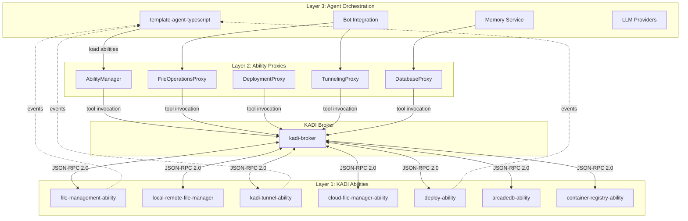

# Design Document

## Overview

This design implements the integration of 7 existing KADI abilities into the template-agent-typescript codebase by replacing custom file management and deployment implementations with broker-mediated ability invocations. The integration follows the agent's existing architectural patterns (provider system, `Result<T, E>` error handling, service layer) while leveraging KADI's distributed service-oriented architecture.

The design transforms template-agent from a partially autonomous agent with custom I/O implementations into a pure orchestration agent that delegates all file operations, deployments, and infrastructure concerns to specialized KADI abilities.

## Steering Document Alignment

### Technical Standards (tech.md)

**N/A** - No steering documents exist for this project. The design follows KADI architectural principles:
- **Broker-mediated communication**: All tool invocations via JSON-RPC 2.0 over WebSocket
- **Ed25519 authentication**: Zero-trust security for all broker connections
- **Network isolation**: Tools visible only within shared networks
- **Event-driven architecture**: Real-time progress updates via pub/sub

### Project Structure (structure.md)

**N/A** - No steering documents exist. The design follows template-agent's established patterns:
- **Provider pattern**: Interface → Implementation → Manager (from `src/providers/`)
- **`Result<T, E>` error handling**: Rust-inspired error handling (from `src/common/result.ts`)
- **Service layer architecture**: High-level orchestration services (from `src/memory/memory-service.ts`)
- **Tool registry pattern**: Extensible tool registration (from `src/tools/`)

## Code Reuse Analysis

### Existing Components to Leverage

- **KadiClient** (`src/index.ts:127-133`): Already properly configured for broker connection
  - Will be extended to load 7 abilities using `client.load(name, 'broker')`
  - Current networks: ['global', 'slack', 'discord'] → extend to include 'file-ops', 'deployment', 'tunnel'

- **`Result<T, E>` Type** (`src/common/result.ts`): Rust-inspired error handling
  - Will be used for all ability wrapper methods
  - Maintains consistency with existing codebase

- **Protocol Invocation Pattern** (`src/index.ts:283-328`): Existing pattern for `protocol.invokeTool()`
  - Example: fs_write_file invocation with timeout, target agent
  - Will be wrapped in higher-level ability proxy methods

- **Provider Manager Pattern** (`src/providers/provider-manager.ts:481 lines`):
  - Health checks, retry logic, circuit breaker, automatic fallback
  - Will inspire AbilityManager design for coordinating multiple abilities

- **Error Classification** (`src/providers/anthropic-provider.ts:302-334`):
  - Sophisticated error type detection (auth, rate limit, network, transient)
  - Will be adapted for ability-specific error types

- **Event Subscription** (`src/index.ts:174-188`): Existing pattern for subscribeToEvent()
  - Will be extended to subscribe to ability progress events
  - Example events: 'deploy.progress', 'file-manager.upload-progress', 'tunnel.created'

### Integration Points

- **KADI Broker Connection** (`src/index.ts:585`): `client.serve('broker')`
  - Already established, no changes needed
  - Abilities will connect to same broker instance

- **Tool Registry** (`src/tools/index.ts:54-82`): Existing extensible registration pattern
  - If agent needs to expose new tools that wrap abilities, use this pattern
  - Current tools (echo, list_tools) will coexist with ability invocations

- **Memory Service** (`src/memory/memory-service.ts:578 lines`): Graceful degradation pattern
  - ArcadeDB adapter will remain for Cypher queries
  - New arcadedb-ability will be used only for Docker operations (start/stop containers)
  - Maintains hybrid architecture

- **Bot Integration** (`src/bot/slack-bot.ts`, `src/bot/discord-bot.ts`):
  - Bots already use `protocol.invokeTool()` pattern
  - Will gain access to 7 new abilities for richer responses
  - Example: File sharing via cloud-file-manager-ability

### Files to Remove

1. **`src/file-management/file-manager-proxy.ts`** (535 lines)
   - Current methods: startFileServer, uploadToCloud, downloadFromCloud, uploadViaSSH, shareContainer
   - Replacement: Direct invocation of file-management-ability, local-remote-file-manager-ability, cloud-file-manager-ability

2. **`src/deployment/deploy-service.ts`** (422 lines)
   - Current methods: deployModelManager, generateAPIKey, registerOpenAIModels
   - Replacement: Direct invocation of deploy-ability tools

3. **`src/deployment/types.ts`**
   - Types moved to ability wrappers if needed

4. **`test/deployment/`** - Deployment tests (will be replaced with E2E ability tests)

5. **`test/file-management/`** - File management tests (will be replaced with E2E ability tests)

## Architecture

The integration follows a **3-layer architecture**:

### Layer 1: KADI Abilities (External Services)

7 independent services running as separate processes, each with KadiClient:

1. **kadi-tunnel-ability** - Self-hosted tunneling (Let's Encrypt SSL)
2. **local-remote-file-manager-ability** - Local file ops + S3 serving + tunneling
3. **arcadedb-ability** - Docker container management for ArcadeDB
4. **cloud-file-manager-ability** - Dropbox/Drive/Box integration
5. **container-registry-ability** - OCI registry operations
6. **deploy-ability** - Akash/Docker deployment orchestration
7. **file-management-ability** - SSH/SCP remote operations

Each ability:
- Connects to broker with `role: 'ability'`
- Registers tools with MCP-compliant JSON schemas
- Publishes progress events during long operations
- Handles Ed25519 authentication automatically

### Layer 2: Ability Proxy Wrappers (Agent-Side)

Optional thin wrappers in agent for type safety and convenience:

```
src/abilities/
├── ability-manager.ts      # Orchestrates loading, health checks, fallback
├── types.ts                # Shared AbilityError, AbilityOptions types
├── tunneling/
│   ├── tunneling-proxy.ts  # Wrapper for kadi-tunnel + local-remote tunneling
│   └── types.ts
├── file-operations/
│   ├── file-ops-proxy.ts   # Wrapper for file-management + local-remote + cloud
│   └── types.ts
├── deployment/
│   ├── deployment-proxy.ts # Wrapper for deploy-ability
│   └── types.ts
├── database/
│   ├── db-proxy.ts         # Wrapper for arcadedb-ability (Docker only)
│   └── types.ts
└── index.ts                # Barrel exports
```

### Layer 3: Agent Orchestration (High-Level Services)

Existing services (memory, providers, bot, tools) use abilities via Layer 2 proxies:

```typescript
// Example: Bot using file-operations proxy
const fileOps = abilityManager.getFileOperations();
const uploadResult = await fileOps.uploadToCloud({
  provider: 's3',
  localPath: '/tmp/image.png',
  remotePath: 's3://bucket/artwork.png'
});
```

### Modular Design Principles

- **Single File Responsibility**: Each ability proxy handles one domain (files, deployment, tunneling)
- **Component Isolation**: Proxies are independent, can be used individually
- **Service Layer Separation**:
  - Layer 1 (abilities) = I/O operations
  - Layer 2 (proxies) = Type safety + error handling
  - Layer 3 (agent services) = Orchestration + business logic
- **Utility Modularity**: Shared types/errors in `src/abilities/types.ts`

### Architecture Diagram



## Components and Interfaces

### Component 1: AbilityManager

**Purpose:** Orchestrates loading, health monitoring, and failover for all 7 abilities

**Interfaces:**
```typescript
class AbilityManager {
  constructor(client: KadiClient)

  // Load all abilities
  async loadAll(): Promise<Result<void, AbilityError>>

  // Load specific ability
  async loadAbility(name: string): Promise<Result<AbilityProxy, AbilityError>>

  // Get loaded ability proxy
  getFileOperations(): FileOperationsProxy | null
  getDeployment(): DeploymentProxy | null
  getTunneling(): TunnelingProxy | null
  getDatabase(): DatabaseProxy | null

  // Health monitoring
  async checkHealth(): Promise<Map<string, boolean>>

  // Graceful shutdown
  async dispose(): Promise<void>
}
```

**Dependencies:**
- KadiClient (for loading abilities)
- Event subscriptions for ability health events

**Reuses:**
- Provider Manager pattern (`src/providers/provider-manager.ts`)
- Health check logic
- Retry/fallback patterns

### Component 2: FileOperationsProxy

**Purpose:** Unified interface for all file operations across 3 abilities

**Interfaces:**
```typescript
class FileOperationsProxy {
  constructor(abilities: {
    fileManagement: any,      // file-management-ability
    localRemote: any,         // local-remote-file-manager-ability
    cloudFileManager: any     // cloud-file-manager-ability
  })

  // SSH/SCP operations (via file-management-ability)
  async uploadViaSSH(params: SSHUploadParams): Promise<Result<void, FileError>>
  async downloadViaSSH(params: SSHDownloadParams): Promise<Result<void, FileError>>
  async executeRemoteCommand(params: SSHCommandParams): Promise<Result<string, FileError>>

  // Local file serving (via local-remote-file-manager-ability)
  async startFileServer(params: FileServerParams): Promise<Result<FileServerInfo, FileError>>
  async stopFileServer(serverId: string): Promise<Result<void, FileError>>

  // Cloud operations (via cloud-file-manager-ability)
  async uploadToCloud(params: CloudUploadParams): Promise<Result<CloudFile, FileError>>
  async downloadFromCloud(params: CloudDownloadParams): Promise<Result<void, FileError>>
  async listCloudFiles(params: CloudListParams): Promise<Result<CloudFile[], FileError>>
}
```

**Dependencies:**
- 3 ability proxies (file-management, local-remote, cloud-file-manager)
- `Result<T, E>` for error handling

**Reuses:**
- Result type from `src/common/result.ts`
- FileError type pattern from `src/common/types.ts`
- Error classification from `src/providers/anthropic-provider.ts:302-334`

### Component 3: DeploymentProxy

**Purpose:** Wrapper for deploy-ability with typed methods

**Interfaces:**
```typescript
class DeploymentProxy {
  constructor(deployAbility: any)

  // Deploy Model Manager Gateway
  async deployModelManager(params: DeploymentParams): Promise<Result<DeploymentInfo, DeployError>>

  // Monitor deployment progress via events
  subscribeToProgress(callback: (progress: DeployProgress) => void): () => void

  // Check deployment status
  async getStatus(deploymentId: string): Promise<Result<DeploymentStatus, DeployError>>
}
```

**Dependencies:**
- deploy-ability proxy
- Event subscription for 'deploy.progress', 'deploy.completed', 'deploy.failed'

**Reuses:**
- Event subscription pattern from `src/index.ts:174-188`
- Result type

### Component 4: TunnelingProxy

**Purpose:** Unified interface for tunneling (prefers kadi-tunnel over ngrok/serveo)

**Interfaces:**
```typescript
class TunnelingProxy {
  constructor(abilities: {
    kadiTunnel: any,          // kadi-tunnel-ability (preferred)
    localRemote: any          // local-remote-file-manager-ability (fallback)
  })

  // Create tunnel (prefers kadi-tunnel)
  async createTunnel(params: TunnelParams): Promise<Result<TunnelInfo, TunnelError>>

  // List active tunnels
  async listTunnels(): Promise<Result<TunnelInfo[], TunnelError>>

  // Destroy tunnel
  async destroyTunnel(tunnelId: string): Promise<Result<void, TunnelError>>
}
```

**Dependencies:**
- kadi-tunnel-ability (primary)
- local-remote-file-manager-ability (fallback if kadi-tunnel unavailable)

**Reuses:**
- Fallback pattern from `src/providers/provider-manager.ts`

### Component 5: DatabaseProxy

**Purpose:** Wrapper for arcadedb-ability (Docker operations only, NOT queries)

**Interfaces:**
```typescript
class DatabaseProxy {
  constructor(arcadedbAbility: any)

  // Docker container management
  async startContainer(params: ContainerParams): Promise<Result<ContainerInfo, DBError>>
  async stopContainer(containerId: string): Promise<Result<void, DBError>>
  async backupDatabase(params: BackupParams): Promise<Result<string, DBError>>
}
```

**Dependencies:**
- arcadedb-ability proxy
- Does NOT replace existing ArcadeDBAdapter (that stays for Cypher queries)

**Reuses:**
- Result type
- Maintains coexistence with `src/memory/arcadedb-adapter.ts`

### Component 6: ContainerRegistryProxy (Optional)

**Purpose:** Wrapper for container-registry-ability

**Interfaces:**
```typescript
class ContainerRegistryProxy {
  constructor(containerRegistryAbility: any)

  async pushImage(params: ImagePushParams): Promise<Result<void, RegistryError>>
  async pullImage(params: ImagePullParams): Promise<Result<void, RegistryError>>
  async listImages(): Promise<Result<ImageInfo[], RegistryError>>
}
```

**Dependencies:**
- container-registry-ability proxy

**Reuses:**
- Result type

## Data Models

### AbilityError (Shared Error Type)

```typescript
export enum AbilityErrorType {
  CONNECTION_FAILED = 'CONNECTION_FAILED',    // Ability not reachable
  TOOL_NOT_FOUND = 'TOOL_NOT_FOUND',          // Tool doesn't exist
  TIMEOUT = 'TIMEOUT',                        // Invocation timeout
  INVALID_INPUT = 'INVALID_INPUT',            // Schema validation failed
  ABILITY_ERROR = 'ABILITY_ERROR',            // Ability-specific error
  NETWORK_ERROR = 'NETWORK_ERROR',            // Network issue
  UNKNOWN = 'UNKNOWN'                         // Catch-all
}

export interface AbilityError {
  type: AbilityErrorType;
  message: string;
  abilityName: string;
  toolName?: string;
  originalError?: any;
}
```

### FileServerInfo (Local File Serving)

```typescript
export interface FileServerInfo {
  serverId: string;          // Unique server identifier
  localUrl: string;          // http://localhost:8080
  tunnelUrl?: string;        // Public tunnel URL if enabled
  directory: string;         // Served directory path
  port: number;              // Server port
}
```

### DeploymentInfo (Model Manager Deployment)

```typescript
export interface DeploymentInfo {
  deploymentId: string;      // Unique deployment ID
  gatewayUrl: string;        // https://gateway.example.com
  apiKey: string;            // Generated API key
  status: 'PROVISIONING' | 'RUNNING' | 'FAILED';
  dropletId?: string;        // Digital Ocean droplet ID
  ipAddress?: string;        // Public IP address
}

export interface DeployProgress {
  deploymentId: string;
  stage: 'provisioning' | 'waiting' | 'configuring' | 'registering';
  message: string;
  percentage?: number;       // 0-100
}
```

### TunnelInfo (Secure Tunneling)

```typescript
export interface TunnelInfo {
  tunnelId: string;          // Unique tunnel identifier
  subdomain: string;         // t.kadi.build subdomain
  publicUrl: string;         // https://subdomain.t.kadi.build
  localPort: number;         // Local service port
  provider: 'kadi-tunnel' | 'ngrok' | 'serveo' | 'localtunnel';
  sslEnabled: boolean;       // Let's Encrypt certificate
}
```

### CloudFile (Cloud Storage)

```typescript
export interface CloudFile {
  id: string;                // Provider-specific ID
  name: string;              // File name
  path: string;              // Full path in cloud storage
  size: number;              // Bytes
  mimeType?: string;         // Content type
  modifiedAt: Date;          // Last modification time
  provider: 's3' | 'gcs' | 'azure' | 'dropbox' | 'drive' | 'box';
}
```

## Error Handling

### Error Scenarios

1. **Scenario: Ability Not Available**
   - **Handling:** AbilityManager detects during loadAll(), marks as unavailable
   - **User Impact:** Agent logs warning, continues with reduced functionality
   - **Recovery:** Periodic retry (every 30s) with exponential backoff

2. **Scenario: Tool Invocation Timeout**
   - **Handling:** Protocol.invokeTool() respects timeout parameter (default 30s)
   - **User Impact:** Error returned to caller with TIMEOUT error type
   - **Recovery:** Retry up to 3 times for idempotent operations

3. **Scenario: Network Failure During Long Operation**
   - **Handling:** Ability emits progress events; agent detects missing events
   - **User Impact:** Last known progress shown, "Connection lost" message
   - **Recovery:** Automatic reconnection, query status via separate tool

4. **Scenario: Invalid Tool Input**
   - **Handling:** KADI broker validates against JSON schema before invocation
   - **User Impact:** Immediate error with schema validation details
   - **Recovery:** Log error, fix input, retry

5. **Scenario: Ability Crashes Mid-Operation**
   - **Handling:** Broker detects WebSocket disconnect, removes from registry
   - **User Impact:** Tool invocation returns CONNECTION_FAILED error
   - **Recovery:** AbilityManager attempts to reload ability, falls back to alternative if available

6. **Scenario: Multiple Abilities Provide Same Tool**
   - **Handling:** Network membership determines visibility; use routing hints
   - **User Impact:** Transparent - correct ability invoked based on network
   - **Recovery:** N/A - designed behavior

### Error Propagation Pattern

```typescript
// Example: DeploymentProxy error handling
async deployModelManager(params: DeploymentParams): Promise<Result<DeploymentInfo, DeployError>> {
  try {
    const result = await this.deployAbility.deploy_model_manager(params);
    return ok(result);
  } catch (error: any) {
    // Classify error
    const errorType = this.classifyError(error);

    // Create typed error
    const deployError: DeployError = {
      type: errorType,
      message: error.message || 'Deployment failed',
      abilityName: 'deploy-ability',
      toolName: 'deploy_model_manager',
      originalError: error
    };

    // Log for debugging
    this.logger.error('Deployment failed', deployError);

    // Return Result.err
    return err(deployError);
  }
}
```

## Testing Strategy

### Unit Testing

**Scope:** Individual proxy classes with mocked abilities

**Test Files:**
- `test/abilities/file-operations-proxy.test.ts`
- `test/abilities/deployment-proxy.test.ts`
- `test/abilities/tunneling-proxy.test.ts`
- `test/abilities/ability-manager.test.ts`

**Key Tests:**
- ✓ Proxy methods correctly invoke ability tools
- ✓ Error classification works for various error types
- ✓ `Result<T, E>` pattern used consistently
- ✓ Timeout handling respects configuration
- ✓ Event subscriptions work correctly

**Mocking Strategy:**
```typescript
// Example: Mock ability proxy
const mockFileManagement = {
  upload_via_ssh: vi.fn().mockResolvedValue({ success: true }),
  download_via_ssh: vi.fn().mockResolvedValue({ success: true })
};

// Test
describe('FileOperationsProxy', () => {
  it('should upload file via SSH', async () => {
    const proxy = new FileOperationsProxy({ fileManagement: mockFileManagement });
    const result = await proxy.uploadViaSSH({ /* params */ });
    expect(result.success).toBe(true);
    expect(mockFileManagement.upload_via_ssh).toHaveBeenCalledWith(/* params */);
  });
});
```

### Integration Testing

**Scope:** Agent + Broker + Single Ability (no external services)

**Test Files:**
- `test/integration/file-management-integration.test.ts`
- `test/integration/deployment-integration.test.ts`
- `test/integration/ability-manager-integration.test.ts`

**Key Tests:**
- ✓ Agent can load ability via broker
- ✓ Tool invocation returns expected results
- ✓ Event pub/sub works correctly
- ✓ Network isolation works (tools only visible in correct networks)
- ✓ Ability reconnection after disconnect

**Setup Pattern:**
```typescript
// Example: Integration test setup
describe('File Management Integration', () => {
  let broker: BrokerProcess;
  let ability: AbilityProcess;
  let agent: KadiClient;

  beforeEach(async () => {
    broker = await startTestBroker({ port: 18080 });
    ability = await startAbility('file-management', { broker: 'ws://localhost:18080' });
    agent = new KadiClient({ broker: 'ws://localhost:18080', networks: ['global'] });
    await agent.connect();
  });

  afterEach(async () => {
    await agent.disconnect();
    await ability.kill();
    await broker.kill();
  });

  it('should upload file via SSH', async () => {
    const fileOps = await agent.load('file-management', 'broker');
    const result = await fileOps.upload_via_ssh({ /* params */ });
    expect(result).toBeDefined();
  });
});
```

### End-to-End Testing

**Scope:** Full system (agent + broker + all 7 abilities + external services)

**Test Files (per Requirement 11):**
- `test/e2e/kadi-tunnel.e2e.test.ts`
- `test/e2e/local-remote-file-manager.e2e.test.ts`
- `test/e2e/arcadedb.e2e.test.ts`
- `test/e2e/cloud-file-manager.e2e.test.ts`
- `test/e2e/container-registry.e2e.test.ts`
- `test/e2e/deploy.e2e.test.ts`
- `test/e2e/file-management.e2e.test.ts`
- `test/e2e/all-abilities.e2e.test.ts` (integration test)

**Key Tests:**
- ✓ All 7 abilities connect to broker successfully
- ✓ All ability tools are invocable from agent
- ✓ Tool invocations return correct results
- ✓ Progress events are published and received
- ✓ Network isolation works correctly
- ✓ Concurrent tool invocations work
- ✓ Performance: Tool invocation overhead &lt;100ms
- ✓ Failure scenarios: Ability crashes, network failures, timeouts

**E2E Test Structure:**
```typescript
describe('File Management E2E', () => {
  let testEnv: E2ETestEnvironment;

  beforeAll(async () => {
    testEnv = await setupE2EEnvironment({
      broker: { port: 18080 },
      abilities: ['file-management'],
      agent: { networks: ['global', 'file-ops'] }
    });
  });

  afterAll(async () => {
    await testEnv.teardown();
  });

  it('should complete full SSH upload workflow', async () => {
    // 1. Agent loads ability
    const fileOps = testEnv.abilityManager.getFileOperations();
    expect(fileOps).not.toBeNull();

    // 2. Upload file via SSH
    const result = await fileOps!.uploadViaSSH({
      host: 'test-server',
      username: 'test-user',
      localPath: '/tmp/test-file.txt',
      remotePath: '/home/test-user/test-file.txt'
    });

    // 3. Verify success
    expect(result.success).toBe(true);

    // 4. Verify file exists on remote server
    const verifyResult = await fileOps!.executeRemoteCommand({
      host: 'test-server',
      username: 'test-user',
      command: 'ls -la /home/test-user/test-file.txt'
    });
    expect(verifyResult.success).toBe(true);
    expect(verifyResult.data).toContain('test-file.txt');
  });

  it('should handle SSH connection failure gracefully', async () => {
    const fileOps = testEnv.abilityManager.getFileOperations();

    const result = await fileOps!.uploadViaSSH({
      host: 'invalid-host',
      username: 'test-user',
      localPath: '/tmp/test-file.txt',
      remotePath: '/home/test-user/test-file.txt'
    });

    expect(result.success).toBe(false);
    expect(result.error.type).toBe(FileErrorType.CONNECTION_FAILED);
  });
});
```

### Performance Testing

**Scope:** Measure broker overhead and concurrent operation performance

**Key Metrics:**
- Broker invocation overhead: &lt;100ms (Requirement: Performance NFR)
- Event delivery latency: &lt;50ms (Requirement: Performance NFR)
- Ability startup time: &lt;5s (Requirement: Performance NFR)
- Concurrent tool invocations: Support 10+ parallel calls

**Performance Test Example:**
```typescript
describe('Performance Tests', () => {
  it('should complete tool invocation with <100ms broker overhead', async () => {
    const iterations = 100;
    const overheads: number[] = [];

    for (let i = 0; i < iterations; i++) {
      const abilityStart = performance.now();
      await ability.echo({ message: 'test' });
      const abilityEnd = performance.now();
      const abilityTime = abilityEnd - abilityStart;

      const brokerStart = performance.now();
      await protocol.invokeTool({ toolName: 'echo', toolInput: { message: 'test' } });
      const brokerEnd = performance.now();
      const brokerTime = brokerEnd - brokerStart;

      overheads.push(brokerTime - abilityTime);
    }

    const avgOverhead = overheads.reduce((a, b) => a + b) / overheads.length;
    expect(avgOverhead).toBeLessThan(100); // <100ms requirement
  });
});
```

## Implementation Phases

### Phase 1: Ability Service Wrappers (Tasks 1-3)

**Goal:** Create KadiClient wrappers for all 7 abilities

**Deliverables:**
- 7 ability services with proper KadiClient configuration
- Tool registration for each ability
- Event emission for long operations
- Graceful shutdown handling

### Phase 2: Agent-Side Proxy Layer (Tasks 4-8)

**Goal:** Create typed proxy classes in agent codebase

**Deliverables:**
- AbilityManager for orchestration
- FileOperationsProxy (3 abilities)
- DeploymentProxy
- TunnelingProxy
- DatabaseProxy
- ContainerRegistryProxy

### Phase 3: Remove Old Implementations (Tasks 9-10)

**Goal:** Delete file-management and deployment code

**Deliverables:**
- Remove src/file-management/
- Remove src/deployment/
- Update bot integrations to use new proxies
- Update memory service to use DatabaseProxy for Docker ops

### Phase 4: E2E Testing (Tasks 11-18)

**Goal:** Comprehensive test coverage for all abilities

**Deliverables:**
- 7 E2E test suites (one per ability)
- Integration test (all abilities + agent)
- Performance tests
- Failure scenario tests

### Phase 5: Documentation & Deployment (Tasks 19-20)

**Goal:** Production-ready deployment

**Deliverables:**
- README updates with ability integration docs
- Deployment scripts for starting all abilities
- Monitoring/health check setup
- Migration guide from old implementation
