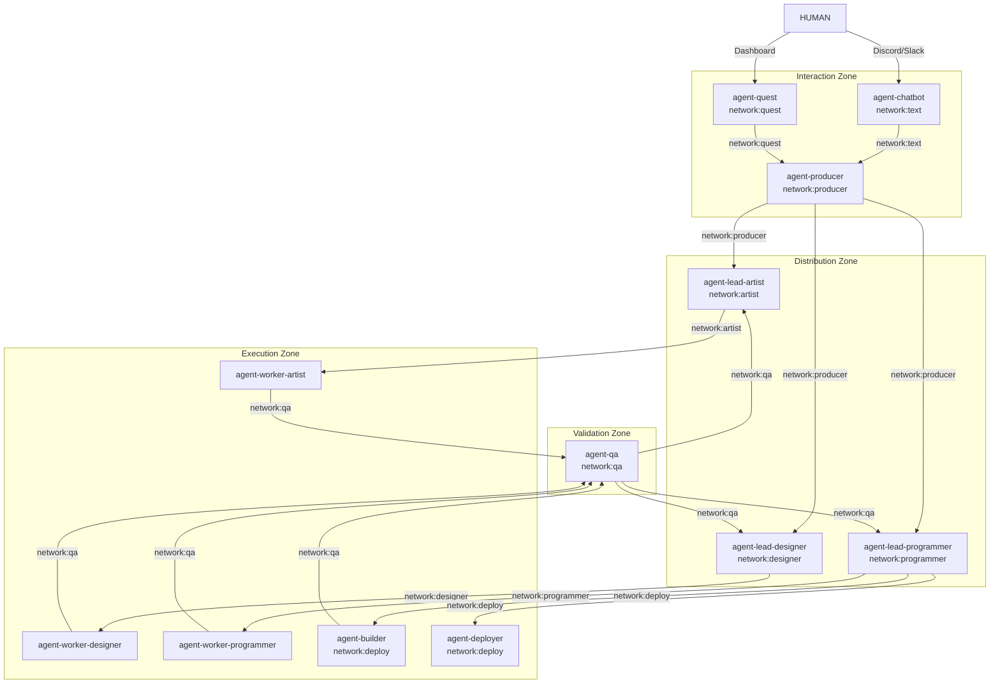

# M4 Design Document

## Overview

M4 transforms the KĀDI system from a single-orchestrator model (agent-producer handles everything) to a distributed agent hierarchy. The design introduces agent-lead (orchestration), agent-qa (validation), refactors mcp-client-quest into agent-quest (KADI event bridge + dashboard), adds agent-builder/agent-deployer as specialized workers, implements abilities as broker-registered tool providers, and establishes domain-driven network topology.

**Reference Documents:**
- `Docs/QUEST_WORKFLOW_V2.md` — 21-step workflow
- `Docs/ARCHITECTURE_V2.md` — component registry, networks, events, status machines
- `.spec-workflow/specs/M4/requirements.md` — 13 requirements

## Steering Document Alignment

### Technical Standards (tech.md)
- All agents built on `@kadi.build/core` v0.9.0+ and `agents-library` v0.1.0+
- TypeScript for all agent/ability projects
- KADI broker v0.11.0+ for per-tool network scoping
- Event-driven architecture via KADI pub/sub
- Git worktree isolation for parallel task execution

### Project Structure (structure.md)
- Each agent is a standalone npm project under `C:\GitHub\`
- Each ability is a standalone npm project under `C:\GitHub\`
- Shared types/utilities in `agents-library`
- MCP servers remain as passive tool providers on broker

## Code Reuse Analysis

### Existing Components to Leverage
- **agent-producer**: Slim down — keep quest discussion, creation, task planning. Extract orchestration to agent-lead.
- **agent-worker**: Already has role-based startup pattern (`AGENT_ROLE`). agent-worker-artist, agent-worker-designer, agent-worker-programmer follow this pattern. agent-builder, agent-deployer reuse same pattern.
- **mcp-client-quest**: Refactor to agent-quest — keep Express backend, React frontend, WebSocket server. Add KADI agent capabilities.
- **mcp-server-quest**: No changes to tool API. agent-lead calls same tools agent-producer used to call.
- **agents-library**: Extend with shared event types, retry utilities, rate limiting, connection management.
- **kadi-core**: Use existing `client.registerTool()` with `brokers.default.networks` for per-tool scoping.

### Integration Points
- **KADI Broker**: All agents register tools and pub/sub events through broker
- **mcp-server-quest**: Quest/task state persistence (JSON-based)
- **mcp-server-git**: Git operations (branch, worktree, commit, merge, diff)
- **mcp-server-github**: PR creation, webhook endpoint
- **GitHub API**: Webhook delivery for PR events

## Architecture

### Agent Hierarchy



### Design Principles
- **Single Responsibility**: Each agent has one clear role — no agent does two jobs
- **Domain-Driven Networks**: Network boundaries enforce separation of concerns
- **Broker-First Communication**: All inter-agent communication via KADI broker (events or tool calls)
- **Ephemeral Worktrees**: Workers create worktrees on task start, delete on task verified
- **Staging Branch Strategy**: Verified work accumulates in `quest/{quest-id}` branch, final PR to main

## Components and Interfaces

### agent-lead

- **Purpose:** Orchestration brain — task assignment, dependency management, verification, staging branch merge, PR creation
- **Interfaces:**
  - Subscribes: `quest.tasks_ready`, `task.validated`, `task.rejected_by_worker`, `pr.changes_requested`, `quest.merged`
  - Publishes: `task.assigned`, `task.failed`, `task.verified`, `quest.pr_created`, `quest.completed`
  - Calls: `quest_query_quest`, `quest_assign_task`, `quest_verify_task`, `quest_update_task`, `git_create_branch`, `git_delete_branch`, `git_worktree_remove`, `git_merge`, `github_create_pr`
- **Dependencies:** kadi-core, agents-library, mcp-server-quest (via broker), mcp-server-git (via broker), mcp-server-github (via broker)
- **Reuses:** agent-worker's role-based startup pattern (`AGENT_ROLE` env var, `npm run start:{role}`)
- **Networks:** producer, artist/designer/programmer (role-specific), git, qa, deploy

### agent-qa

- **Purpose:** Multi-tier validation — code review, visual validation, runtime validation, structured scoring
- **Interfaces:**
  - Subscribes: `task.review_requested`
  - Publishes: `task.validated`, `task.revision_needed`
  - Calls: `git_diff` (via broker), ability-vision (planned, via broker), ability-eval (planned, via broker), ability-file-management (via broker)
- **Dependencies:** kadi-core, agents-library, mcp-server-git (via broker)
- **Reuses:** mysql-agent's multi-tier validation pattern (syntax → schema → semantic)
- **Networks:** qa, vision, file

### agent-quest (refactored from mcp-client-quest)

- **Purpose:** Two-way bridge — KADI events ↔ WebSocket ↔ React frontend, GitHub webhook receiver
- **Interfaces:**
  - Subscribes: `task.verified`, `quest.pr_created`, `quest.completed` (for dashboard updates)
  - Publishes: `quest.approved`, `quest.rejected`, `quest.revision_requested`, `quest.merged`, `quest.pr_rejected`, `pr.changes_requested`
  - HTTP: Express routes for React frontend API + GitHub webhook endpoint
  - WebSocket: Real-time push to React dashboard
- **Dependencies:** kadi-core, agents-library, Express, WebSocket, ability-tunnel
- **Reuses:** mcp-client-quest's Express backend, React frontend, WebSocket server, file watcher
- **Networks:** quest, producer, infra

### agent-chatbot

- **Purpose:** Unified chat interface — bridges Discord (and later Slack) to agent-producer
- **Interfaces:**
  - Tools registered: `send_message`, `receive_message` (on network:text)
  - Subscribes: Discord message events (via Discord.js)
  - Publishes: Relays HUMAN messages to agent-producer via network:text
- **Dependencies:** kadi-core, agents-library, Discord.js
- **Reuses:** Existing mcp-server-discord/mcp-server-slack patterns (consolidated into one agent)
- **Networks:** text

### agent-builder

- **Purpose:** Specialized worker for build/compile tasks — MSBuild for DaemonAgent, npm/cargo for services
- **Interfaces:**
  - Subscribes: `task.assigned` (filtered by builder role)
  - Publishes: `task.review_requested`
  - Calls: `git_commit` (via broker), ability-cloud-file-manager (via broker)
- **Dependencies:** kadi-core, agents-library, MSBuild, mcp-server-git (via broker)
- **Reuses:** agent-worker's role-based startup, worktree lifecycle, commit-before-review pattern
- **Networks:** deploy, git, file

### agent-deployer

- **Purpose:** Specialized worker for deployment tasks — push artifacts to target environments
- **Interfaces:**
  - Subscribes: `task.assigned` (filtered by deployer role)
  - Publishes: `task.review_requested`
  - Calls: ability-container-registry (via broker), deploy-ability (library)
- **Dependencies:** kadi-core, agents-library
- **Reuses:** agent-worker's role-based startup pattern
- **Networks:** deploy, infra

### agent-producer (slimmed)

- **Purpose:** UX layer — HUMAN conversation, quest discussion, quest creation, task planning, status relay
- **Interfaces:**
  - Tools registered: `quest_approve`, `quest_reject`, `quest_request_revision`, `task_approve`, `task_request_revision`, `task_reject` (on network:producer)
  - Subscribes: `quest.approved`, `quest.revision_requested`, `quest.rejected`, `task.verified`, `quest.pr_created`, `quest.merged`
  - Publishes: `quest.tasks_ready`
  - Calls: `quest_list_quest`, `quest_create_quest`, `quest_request_quest_approval`, `quest_update_quest`, `quest_delete_quest`, `quest_plan_task`, `quest_analyze_task`, `quest_reflect_task`, `quest_split_task`, `send_message` (agent-chatbot)
- **Dependencies:** kadi-core, agents-library, mcp-server-quest (via broker)
- **Reuses:** Existing agent-producer codebase — remove orchestration handlers, keep quest/task planning
- **Networks:** producer, quest, text

### Abilities (broker-registered tool providers)

Per ARCHITECTURE_V2.md, abilities are scoped to networks and discoverable via broker. Existing repos are mapped where available; others are planned for M4.

| Ability | Network | Role | Used By | Implementation Status |
|---------|---------|------|---------|----------------------|
| ability-file-local | file | Local file system operations | agent-qa, agent-worker | Exists: `ability-file-management` (18 tools: list, move, copy, delete, create, watch files/folders) |
| ability-file-remote | file | Remote file transfer between agents/machines | agent-worker, agent-builder | Exists: `ability-local-remote-file-manager` (33 tools: upload, download, transfer, compress, tunnel, watch) |
| ability-file-cloud | file | Cloud file upload/download (artifact storage) | agent-builder, agent-deployer | Exists: `ability-cloud-file-manager` (15 tools: Dropbox, Google Drive, Box operations) |
| ability-vision | vision | Visual validation via LLM vision (screenshot analysis) | agent-qa | Planned — needed for art/scene validation (step 16.2, 16.3) |
| ability-voice | voice | Voice input/output for HUMAN interaction | agent-producer | Planned — Piper (TTS), Whisper (STT) |
| ability-memory | memory | Persistent memory storage | agent-producer, agent-lead | Exists: `ability-arcadedb` (14 tools: container lifecycle, database CRUD, backup/restore, import/export) |
| ability-deploy | deploy | Deploy artifacts to target environments (local/Akash/DigitalOcean) | agent-deployer | Exists: `deploy-ability` (library in kadi-deploy), `ability-container-registry` (8 tools: registry lifecycle, container management) |
| ability-secret | infra | Secret/credential management | All agents | Exists: `secret-ability` (23 tools: vault CRUD, encrypt/decrypt, key management, remote sharing) |
| ability-tunnel-public | infra | Expose local endpoints via public tunnel (GitHub webhooks) | agent-quest | Exists: `ability-tunnel` (6 tools: create/destroy tunnel, health check; supports ngrok, localtunnel) |
| ability-tunnel-private | infra | Secure internal tunnels between agents/services | agent-lead, agent-worker | Planned — frp, Caddy based private tunnels |
| ability-eval | qa | Code execution sandbox for validation (run tests, scripts) | agent-qa | Planned — sandboxed runtime for test execution |

## Data Models

### Quest (mcp-server-quest — existing, no changes)

```typescript
interface Quest {
  questId: string;
  title: string;
  description: string;
  status: 'draft' | 'pending_approval' | 'approved' | 'rejected' | 'in_progress' | 'completed' | 'cancelled';
  requirements: string;   // markdown content
  design: string;         // markdown content
  tasks: Task[];
  approvals: Approval[];
  createdAt: string;
  updatedAt: string;
}
```

### Task (mcp-server-quest — existing, no changes)

```typescript
interface Task {
  id: string;
  questId: string;
  title: string;
  description: string;
  status: 'pending' | 'assigned' | 'in_progress' | 'pending_approval' | 'completed' | 'failed' | 'rejected' | 'needs_revision';
  assignedTo: string;     // agent ID
  role: 'artist' | 'designer' | 'programmer' | 'builder' | 'deployer';
  dependencies: string[]; // task IDs that must complete first
  artifacts: {
    verified: boolean;
    score: number;
    feedback: string;
  };
  revisionCount: number;  // tracks QA revision cycles (max 3)
  branch: string;         // worktree branch name
  createdAt: string;
  updatedAt: string;
}
```

### Agent (mcp-server-quest — existing, no changes)

```typescript
interface Agent {
  agentId: string;
  name: string;
  role: 'artist' | 'designer' | 'programmer' | 'builder' | 'deployer';
  status: 'available' | 'busy' | 'offline';
  capabilities: string[];
  currentTaskId: string | null;
}
```

### Approval (mcp-server-quest — existing, no changes)

```typescript
interface Approval {
  id: string;
  questId: string;
  taskId?: string;
  decision: 'approved' | 'revision_requested' | 'rejected';
  comments: string;
  createdAt: string;
}
```

### KADI Event Payload (new — agents-library shared types)

```typescript
interface KadiEvent<T = unknown> {
  type: string;           // e.g., 'quest.approved', 'task.assigned'
  questId: string;
  taskId?: string;
  payload: T;
  timestamp: string;
  source: string;         // publishing agent ID
}

// Event-specific payloads
interface TaskAssignedPayload {
  agentId: string;
  feedback?: string;      // retry context from previous failure
}

interface TaskReviewRequestedPayload {
  branch: string;
  commitHash: string;
}

interface TaskValidatedPayload {
  score: number;
  severity: 'PASS' | 'WARN' | 'FAIL';
  feedback: string;
}

interface TaskVerifiedPayload {
  isQuestComplete: boolean;
}

interface QuestPrCreatedPayload {
  prUrl: string;
}

interface PrChangesRequestedPayload {
  prId: string;
  comments: string;
}
```

## Error Handling

### Error Scenarios

1. **Worker crashes mid-task**
   - **Handling:** Worker commits before QA review (step 15). Work is preserved in git. agent-lead detects offline via heartbeat, reassigns task to another available worker.
   - **User Impact:** Slight delay. HUMAN sees task reassigned in dashboard.

2. **QA revision loop exceeds max retries (3)**
   - **Handling:** agent-qa escalates to agent-lead. agent-lead marks task as failed and notifies agent-producer. agent-producer asks HUMAN for guidance via Discord.
   - **User Impact:** HUMAN receives Discord message with failure details and options (retry with different worker, modify task, skip).

3. **Git merge conflict on staging branch**
   - **Handling:** agent-lead serializes merges (one at a time). For non-overlapping changes, auto-resolve. For true conflicts, agent-lead attempts LLM-assisted resolution. If unresolvable, notify agent-producer → HUMAN.
   - **User Impact:** Most conflicts auto-resolved. True conflicts surface as Discord notification with diff details.

4. **LLM API rate limit**
   - **Handling:** Token bucket rate limiter in agents-library. Queue requests, retry after cooldown with exponential backoff. Shared rate limit state across agent instances.
   - **User Impact:** Slight delay in responses. No visible error.

5. **KADI broker connection drop**
   - **Handling:** Auto-reconnect with exponential backoff (1s, 2s, 4s, 8s, max 30s). Queue outgoing events during disconnection. Flush queued events on reconnect.
   - **User Impact:** Brief pause in dashboard updates. Resumes automatically.

6. **GitHub webhook delivery failure**
   - **Handling:** agent-lead falls back to polling PR status via mcp-server-github at configurable interval (default 30s). agent-quest retries webhook processing on transient errors.
   - **User Impact:** Slightly delayed PR status detection. No manual intervention needed.

7. **Worker rejects task (specialization mismatch)**
   - **Handling:** agent-worker publishes task.rejected_by_worker event. agent-lead receives it and reassigns to a worker with matching specialization.
   - **User Impact:** Transparent. Task is reassigned automatically.

## Testing Strategy

### Unit Testing
- **agent-lead**: Test dependency resolution logic (which tasks are unblocked when a task is verified), staging branch lifecycle, cross-role quest completion check
- **agent-qa**: Test validation strategy selection (code/art/build), score calculation, revision cycle counting, escalation trigger
- **agent-quest**: Test KADI event → WebSocket push mapping, webhook signature verification, approval button → event publishing
- **agents-library**: Test shared event types, retry utilities, rate limiter, connection manager
- **Abilities**: Test each ability's tool registration and core functionality in isolation

### Integration Testing
- **agent-producer → agent-lead handoff**: Verify quest.tasks_ready event triggers agent-lead to query tasks and assign
- **agent-worker → agent-qa → agent-lead pipeline**: Verify task.review_requested → task.validated → task.verified event chain
- **agent-quest → GitHub webhook**: Verify webhook receipt → KADI event publishing → dashboard update
- **Staging branch lifecycle**: Verify branch creation → worker merge → worktree cleanup → PR creation → branch deletion
- **Network scoping**: Verify tools are only visible on their assigned networks (e.g., agent-worker cannot see quest_verify_task)

### End-to-End Testing
- **Happy path**: HUMAN request → quest creation → approval → task planning → assignment → execution → QA validation → verification → PR → merge → completion
- **Revision path**: Task fails QA → revision_needed → worker retries → passes → verified
- **PR rejection path**: HUMAN closes PR → quest.pr_rejected → agent-producer asks HUMAN → rework or abandon
- **Multi-role quest**: Quest with artist + programmer tasks → both agent-leads assign → workers execute in parallel → staging branch accumulates both → single PR
