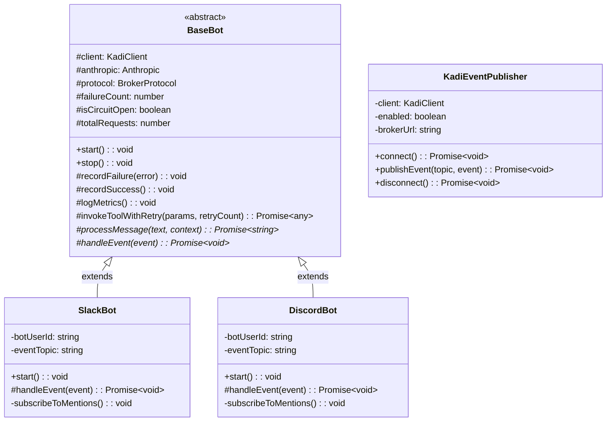
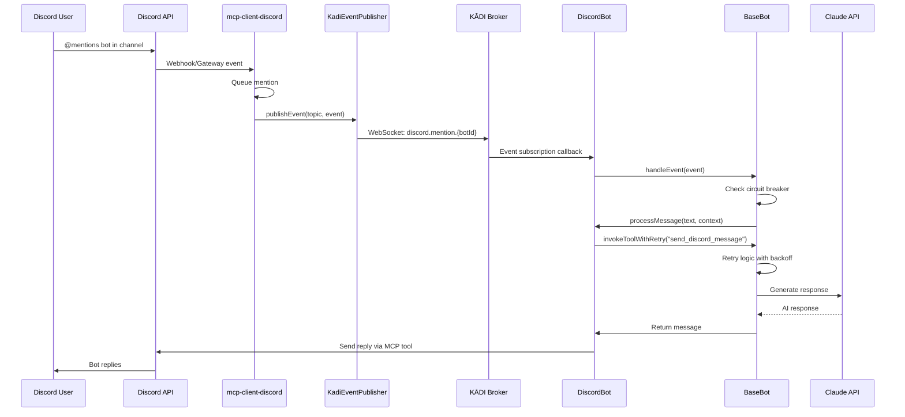
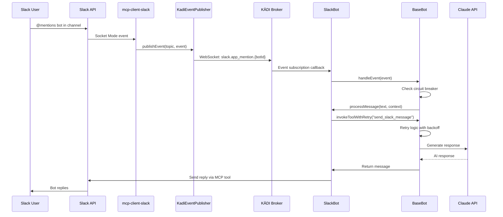

# Design Document: Discord/Slack Event-Based Unification

## Overview

This design implements a unified event-driven architecture for Discord and Slack bot integrations in template-agent-typescript. The design converts discord-bot.ts from polling to event subscription (matching slack-bot.ts), extracts shared publisher logic for MCP clients, and creates a common base class for bot implementations.

**Key Design Goals:**
1. **Event-Driven Discord**: Replace polling with KĀDI broker event subscriptions
2. **Code Reuse**: Extract common patterns from slack-bot.ts and mcp-client-slack
3. **Modularity**: Separate concerns across platform-specific and shared components
4. **Maintainability**: Single source of truth for circuit breaker, retry, and metrics logic

## Steering Document Alignment

### Technical Standards (tech.md)

*Note: No steering documents exist yet in .spec-workflow/steering/. Following general TypeScript best practices:*

- **TypeScript Strict Mode**: All new code uses strict type checking with Zod schemas
- **Error Handling**: Circuit breaker pattern with exponential backoff (existing pattern from slack-bot.ts)
- **Logging**: Structured logging with consistent format `[COMPONENT] Action: Details {metadata}`
- **Dependency Injection**: Constructor-based dependency injection for testability

### Project Structure (structure.md)

*Note: Following existing template-agent-typescript structure:*

```
template-agent-typescript/
├── src/
│   ├── base-bot.ts           # NEW: Abstract base class
│   ├── slack-bot.ts           # MODIFIED: Extends BaseBot
│   ├── discord-bot.ts         # MODIFIED: Event-driven, extends BaseBot
│   └── types/
│       ├── slack-events.ts    # EXISTING: SlackMentionEventSchema
│       └── discord-events.ts  # NEW: DiscordMentionEventSchema

mcp-client-discord/
├── src/
│   ├── index.ts               # MODIFIED: Add KadiEventPublisher
│   ├── kadi-publisher.ts      # NEW: Extracted from mcp-client-slack
│   └── types.ts               # MODIFIED: Add DiscordMentionEvent

mcp-client-slack/
└── src/
    ├── kadi-publisher.ts      # REFACTORED: Extract shared logic
    └── types.ts               # EXISTING: SlackMentionEvent
```

## Code Reuse Analysis

### Existing Components to Leverage

- **KadiEventPublisher (mcp-client-slack)**: Complete publisher implementation with retry logic, graceful degradation, and connection management. Will be extracted and generalized for both platforms.

- **Circuit Breaker Pattern (slack-bot.ts/discord-bot.ts)**: Both bots already implement identical circuit breaker logic (lines 102-117). Will be consolidated in BaseBot.

- **Retry Logic with Exponential Backoff**: Both bots have identical retry mechanisms (lines 151-184). Will be moved to BaseBot.

- **SlackMentionEventSchema**: Proven Zod schema pattern for event validation. Will be mirrored for Discord events.

### Integration Points

- **KĀDI Broker**: Both MCP clients will publish to separate topics (`slack.app_mention.{BOT_USER_ID}`, `discord.mention.{BOT_USER_ID}`)

- **Claude API**: Shared integration through BaseBot (existing anthropic client initialization pattern)

- **MCP Protocol**: Both bots use BrokerProtocol for tool invocation (existing pattern preserved)

## Architecture

### Event-Driven Pub/Sub Pattern

The architecture follows a clean separation between event publishers (MCP clients) and event subscribers (bot instances):

```mermaid
graph TB
    subgraph "MCP Clients (Publishers)"
        MCP_S[mcp-client-slack<br/>SlackManager + KadiEventPublisher]
        MCP_D[mcp-client-discord<br/>DiscordManager + KadiEventPublisher]
    end

    subgraph "KĀDI Broker"
        BROKER[Event Bus<br/>Topics: slack.app_mention.{botId}<br/>discord.mention.{botId}]
    end

    subgraph "template-agent-typescript (Subscribers)"
        BASE[BaseBot<br/>Circuit Breaker, Retry, Metrics, Claude API]
        SLACK[SlackBot<br/>extends BaseBot]
        DISCORD[DiscordBot<br/>extends BaseBot]
    end

    MCP_S -->|publishEvent| BROKER
    MCP_D -->|publishEvent| BROKER
    BROKER -->|subscribe| SLACK
    BROKER -->|subscribe| DISCORD
    SLACK -.->|inherits| BASE
    DISCORD -.->|inherits| BASE
```

### Class Hierarchy Design



### Modular Design Principles

- **Single File Responsibility**:
  - `base-bot.ts`: Abstract bot logic only (circuit breaker, retry, Claude API)
  - `slack-bot.ts`/`discord-bot.ts`: Platform-specific event handling and tool invocation
  - `kadi-publisher.ts`: KĀDI connection and event publishing only

- **Component Isolation**:
  - Publishers (MCP clients) have zero knowledge of subscribers (bots)
  - Bots subscribe to topics without knowing publisher implementation
  - BaseBot has no platform-specific code (Discord/Slack agnostic)

- **Service Layer Separation**:
  - Event publishing: KadiEventPublisher
  - Event subscription: BaseBot + platform bots
  - Tool invocation: BrokerProtocol (existing MCP layer)
  - AI processing: Anthropic client integration

## Components and Interfaces

### Component 1: BaseBot (Abstract Class)

**Purpose:** Provides shared bot logic for circuit breaker, retry, metrics, and Claude API integration. Platform-agnostic foundation for all bot implementations.

**Interfaces:**
```typescript
abstract class BaseBot {
  // Lifecycle methods
  abstract start(): void;
  abstract stop(): void;

  // Event processing (platform-specific implementation required)
  protected abstract handleEvent(event: any): Promise<void>;
  protected abstract processMessage(text: string, context: any): Promise<string>;

  // Shared utilities (implemented in BaseBot)
  protected recordFailure(error: any): void;
  protected recordSuccess(): void;
  protected logMetrics(): void;
  protected invokeToolWithRetry(params: ToolInvocationParams, retryCount?: number): Promise<any>;
  protected sleep(ms: number): Promise<void>;
}
```

**Dependencies:**
- `@kadi.build/core` (KadiClient)
- `@anthropic-ai/sdk` (Anthropic)

**Reuses:**
- Existing circuit breaker pattern from slack-bot.ts:102-117
- Existing retry logic from discord-bot.ts:151-184
- Existing metrics tracking from both bots

### Component 2: SlackBot (Concrete Implementation)

**Purpose:** Handles Slack-specific event subscription and tool invocation using Slack MCP tools.

**Interfaces:**
```typescript
class SlackBot extends BaseBot {
  constructor(client: KadiClient, anthropic: Anthropic, botUserId: string);

  start(): void; // Subscribes to slack.app_mention.{botUserId}
  stop(): void;  // Unsubscribes from events

  protected handleEvent(event: SlackMentionEvent): Promise<void>;
  protected processMessage(text: string, context: SlackContext): Promise<string>;

  private subscribeToMentions(): void;
}
```

**Dependencies:**
- BaseBot (parent class)
- SlackMentionEventSchema (types/slack-events.ts)
- MCP Slack tools: `send_slack_message`

**Reuses:**
- BaseBot's circuit breaker and retry logic
- Existing event subscription pattern from slack-bot.ts:189-197

### Component 3: DiscordBot (Concrete Implementation)

**Purpose:** Handles Discord-specific event subscription and tool invocation using Discord MCP tools.

**Interfaces:**
```typescript
class DiscordBot extends BaseBot {
  constructor(client: KadiClient, anthropic: Anthropic, botUserId: string);

  start(): void; // Subscribes to discord.mention.{botUserId}
  stop(): void;  // Unsubscribes from events

  protected handleEvent(event: DiscordMentionEvent): Promise<void>;
  protected processMessage(text: string, context: DiscordContext): Promise<string>;

  private subscribeToMentions(): void;
}
```

**Dependencies:**
- BaseBot (parent class)
- DiscordMentionEventSchema (types/discord-events.ts)
- MCP Discord tools: `send_discord_message`

**Reuses:**
- BaseBot's circuit breaker and retry logic
- SlackBot's event subscription pattern (adapted for Discord topics)

### Component 4: KadiEventPublisher (Shared Utility)

**Purpose:** Manages KĀDI broker connection and event publishing for MCP clients. Provides graceful degradation when broker is unavailable.

**Interfaces:**
```typescript
class KadiEventPublisher {
  constructor(config: { brokerUrl: string; clientName: string; networks: string[] });

  async connect(): Promise<void>;
  async publishEvent<T>(topic: string, event: T): Promise<void>;
  async disconnect(): Promise<void>;
}
```

**Dependencies:**
- `@kadi.build/core` (KadiClient)

**Reuses:**
- Existing implementation from mcp-client-slack/src/kadi-publisher.ts (lines 32-262)
- Will be parameterized to work for both Slack and Discord

### Component 5: DiscordMentionEventSchema (New Type)

**Purpose:** Zod schema for validating Discord mention events published to KĀDI broker.

**Interfaces:**
```typescript
export const DiscordMentionEventSchema = z.object({
  id: z.string(),           // Unique mention ID
  user: z.string(),         // Discord user ID
  username: z.string(),     // Discord username
  text: z.string(),         // Message text
  channel: z.string(),      // Discord channel ID
  channelName: z.string(),  // Discord channel name
  guild: z.string(),        // Discord guild ID
  ts: z.string(),           // Event timestamp
  bot_id: z.string(),       // Discord bot ID for routing
  timestamp: z.string().datetime(), // ISO 8601 publish time
});

export type DiscordMentionEvent = z.infer<typeof DiscordMentionEventSchema>;
```

**Dependencies:**
- `zod` for schema validation

**Reuses:**
- Pattern from SlackMentionEventSchema (types/slack-events.ts:22-46)
- Adds Discord-specific fields (username, channelName, guild)

## Data Models

### SlackMentionEvent (Existing)
```typescript
{
  id: string;           // Slack event timestamp (e.g., "1234567890.123456")
  user: string;         // Slack user ID (e.g., "U12345678")
  text: string;         // Message text with @mention removed
  channel: string;      // Slack channel ID (e.g., "C12345678")
  thread_ts: string;    // Thread timestamp for replies
  ts: string;           // Event timestamp from Slack
  bot_id: string;       // Slack bot user ID
  timestamp: string;    // ISO 8601 datetime when published to KĀDI
}
```

### DiscordMentionEvent (New)
```typescript
{
  id: string;           // Discord message ID (snowflake)
  user: string;         // Discord user ID (snowflake)
  username: string;     // Discord username (e.g., "john#1234")
  text: string;         // Message text with @mention removed
  channel: string;      // Discord channel ID (snowflake)
  channelName: string;  // Discord channel name (e.g., "general")
  guild: string;        // Discord guild ID (snowflake)
  ts: string;           // Message timestamp
  bot_id: string;       // Discord bot user ID
  timestamp: string;    // ISO 8601 datetime when published to KĀDI
}
```

### Circuit Breaker State (Shared in BaseBot)
```typescript
{
  failureCount: number;        // Current consecutive failures
  lastFailureTime: number;     // Timestamp of last failure
  isCircuitOpen: boolean;      // Circuit breaker state
  maxFailures: number;         // Threshold before opening circuit (default: 3)
  resetTimeMs: number;         // Time before attempting reset (default: 60000)
  totalRequests: number;       // Total requests made
  successCount: number;        // Successful requests
  timeoutCount: number;        // Timeout failures
}
```

## Event Flow Diagrams

### Discord Event Flow (End-to-End)



### Slack Event Flow (Existing, Now with BaseBot)



## Error Handling

### Error Scenarios

1. **Scenario: KĀDI Broker Connection Failure**
   - **Context**: MCP client cannot connect to broker on startup
   - **Handling**:
     - KadiEventPublisher retries 5 times with exponential backoff (1s, 2s, 4s, 8s, 16s)
     - After retries exhausted, publisher enters stub mode (graceful degradation)
     - MCP client continues operating with queue-based fallback
   - **User Impact**: Events not published to broker, but MCP tools (`get_discord_mentions`, `get_slack_mentions`) still work via queue

2. **Scenario: Event Subscription Failure**
   - **Context**: Bot cannot subscribe to KĀDI topic on startup
   - **Handling**:
     - Bot logs error and triggers circuit breaker
     - Does NOT fall back to polling (requirement violation)
     - Application fails fast with clear error message
   - **User Impact**: Bot does not start until broker connectivity is restored

3. **Scenario: Claude API Timeout**
   - **Context**: Claude API takes >60 seconds to respond
   - **Handling**:
     - BaseBot's `invokeToolWithRetry` catches timeout
     - Retries up to 3 times with exponential backoff
     - Records failure and increments circuit breaker counter
     - If 3 consecutive failures, opens circuit for 60 seconds
   - **User Impact**: Bot stops responding temporarily, user sees no reply

4. **Scenario: Event Publishing Failure**
   - **Context**: KadiEventPublisher fails to publish event (network error, broker down)
   - **Handling**:
     - Publisher logs error and throws exception (fail-fast, no retry)
     - MCP client catches exception and continues operating
     - Event lost but system remains stable
   - **User Impact**: Mention not delivered to bot in real-time, but available via queue fallback

5. **Scenario: Invalid Event Schema**
   - **Context**: Published event doesn't match DiscordMentionEventSchema or SlackMentionEventSchema
   - **Handling**:
     - Zod validation fails in bot's event handler
     - Bot logs validation error with details
     - Event discarded, circuit breaker NOT triggered (invalid data, not system failure)
   - **User Impact**: Single mention lost, bot continues processing other events

6. **Scenario: Circuit Breaker Open**
   - **Context**: Circuit breaker opened after 3 consecutive Claude API failures
   - **Handling**:
     - BaseBot stops processing new events for 60 seconds
     - Logs circuit breaker state every 10 requests
     - After reset time, attempts one request to test recovery
     - If successful, resets failure count and closes circuit
   - **User Impact**: Bot unresponsive for 60 seconds, then resumes if issue resolved

## Testing Strategy

### Unit Testing

**BaseBot Testing:**
- Mock KadiClient and test circuit breaker logic independently
- Test retry logic with simulated failures (timeout, network error, success on retry)
- Test metrics tracking (totalRequests, successCount, timeoutCount)
- Test abstract method contract enforcement

**SlackBot/DiscordBot Testing:**
- Mock BaseBot dependencies and test event subscription setup
- Test event handler with valid and invalid event payloads
- Test platform-specific tool invocation logic
- Test start/stop lifecycle methods

**KadiEventPublisher Testing:**
- Mock WebSocket connection and test connect/disconnect
- Test graceful degradation (stub mode) when broker unavailable
- Test event publishing with retry logic
- Test topic construction for different platforms

### Integration Testing

**End-to-End Event Flow:**
- Start local KĀDI broker
- Start mcp-client-discord with test Discord credentials
- Start DiscordBot instance subscribed to test topic
- Send test @mention through Discord
- Verify event published to broker
- Verify bot receives and processes event
- Verify reply sent back to Discord channel

**Multi-Bot Isolation:**
- Start two SlackBot instances with different bot IDs
- Publish events to both topics
- Verify each bot only receives events for its own bot ID
- Verify no cross-talk between bots

**Circuit Breaker Integration:**
- Simulate Claude API failures in test environment
- Verify circuit opens after 3 failures
- Verify bot stops processing during reset period
- Verify circuit closes after successful request

### End-to-End Testing

**User Scenarios:**

1. **Scenario: Discord User Mentions Bot**
   - User sends `@bot hello` in Discord channel
   - Bot receives event via KĀDI broker
   - Bot processes message through Claude API
   - Bot replies in same Discord channel
   - Verify reply is contextually relevant

2. **Scenario: Slack User Mentions Bot**
   - User sends `@bot help` in Slack channel
   - Bot receives event via KĀDI broker
   - Bot processes message through Claude API
   - Bot replies in Slack thread
   - Verify reply maintains thread context

3. **Scenario: Simultaneous Slack and Discord Mentions**
   - Send @mention to SlackBot and DiscordBot simultaneously
   - Both bots process events independently
   - Both bots reply without interference
   - Verify independent circuit breaker states

4. **Scenario: Broker Restart During Operation**
   - Bots running and processing events normally
   - Stop KĀDI broker (simulate crash)
   - Verify bots log connection errors
   - Restart KĀDI broker
   - Verify bots reconnect and resume processing

## Migration Strategy

### Phase 1: Extract Shared Publisher (Requirement 4)

**Files Modified:**
- `mcp-client-slack/src/kadi-publisher.ts` - Parameterize for reuse
- `mcp-client-discord/src/kadi-publisher.ts` - Copy and adapt

**Validation:**
- mcp-client-slack still publishes Slack events correctly
- Both publishers share identical connection/retry logic

### Phase 2: Add Discord Event Publishing (Requirement 2)

**Files Created:**
- `template-agent-typescript/src/types/discord-events.ts`
- `mcp-client-discord/src/kadi-publisher.ts`

**Files Modified:**
- `mcp-client-discord/src/index.ts` - Integrate KadiEventPublisher

**Validation:**
- Discord mentions published to `discord.mention.{botId}` topic
- Existing `get_discord_mentions` tool still works (queue fallback)

### Phase 3: Convert Discord Bot to Event-Driven (Requirement 1)

**Files Modified:**
- `template-agent-typescript/src/discord-bot.ts` - Remove polling, add subscription

**Validation:**
- DiscordBot receives events from KĀDI broker
- DiscordBot no longer polls every 10 seconds
- Event subscription failures trigger circuit breaker (no fallback to polling)

### Phase 4: Extract BaseBot (Requirement 3)

**Files Created:**
- `template-agent-typescript/src/base-bot.ts`

**Files Modified:**
- `template-agent-typescript/src/slack-bot.ts` - Extend BaseBot
- `template-agent-typescript/src/discord-bot.ts` - Extend BaseBot

**Validation:**
- Both bots share circuit breaker and retry logic
- Both bots maintain independent state
- Code duplication eliminated (DRY principle verified)

### Phase 5: Platform-Specific Topics (Requirement 5)

**Files Modified:**
- All bots and publishers use `{platform}.{event_type}.{bot_id}` pattern

**Validation:**
- Multiple bots on same platform have unique topics
- No event cross-talk between different bot instances
- Topic pattern documented in README files

## Performance Considerations

- **Event Latency**: <100ms from publish to subscription callback (KĀDI broker WebSocket overhead)
- **CPU Reduction**: Eliminating 10-second polling interval reduces idle CPU usage by ~90%
- **Memory**: BaseBot abstractions add minimal overhead (~1KB per bot instance)
- **Scalability**: Event-driven pattern allows unlimited subscribers per topic without N² polling conflicts

## Security Considerations

- **Bot ID Validation**: Ensure bot IDs in event topics are validated against expected format
- **Event Schema Validation**: All events validated with Zod before processing (prevent injection attacks)
- **Circuit Breaker**: Prevents DoS by limiting retry attempts when Claude API is slow
- **Graceful Degradation**: Stub mode in publisher prevents cascading failures when broker unavailable
