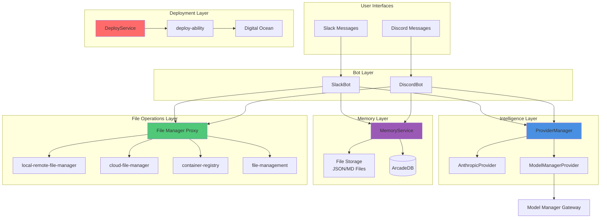
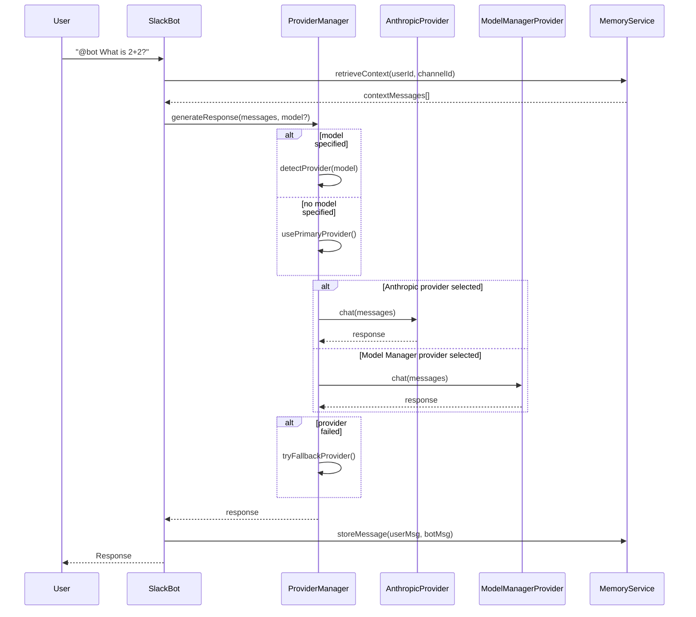

# Design Document

## Overview

This design document outlines the technical architecture for enhancing `template-agent-typescript` with four major capabilities:

1. **Multi-LLM Provider System**: Pluggable provider architecture supporting Anthropic Claude and OpenAI-compatible Model Manager Gateway
2. **Autonomous Infrastructure Management**: Self-deployment capabilities using deploy-ability library to Digital Ocean
3. **Hybrid Memory System**: Multi-layered memory using file-based storage (JSON/MD) for short-term conversation context and ArcadeDB for long-term persistent storage
4. **Comprehensive File Management**: Integration of four file management abilities via KADI MCP protocol

The design follows a modular, service-oriented architecture where each capability is implemented as an independent service with clean interfaces, enabling the agent to function even if specific subsystems fail (graceful degradation).

## Steering Document Alignment

### Technical Standards (tech.md)

**Not applicable** - No steering documents exist for this project. The design follows KADI ecosystem patterns:

- **MCP Protocol Integration**: File abilities accessed via KADI broker MCP protocol, not direct imports
- **Result Type Pattern**: All async operations return `Result<T, E>` for predictable error handling
- **Service Layer Architecture**: Clear separation between provider adapters, memory services, and bot logic
- **Event-Driven Communication**: KADI events for bot mentions, tool invocations, and system notifications

### Project Structure (structure.md)

**Not applicable** - No steering documents exist. The design extends the existing template structure:

```
template-agent-typescript/
├── src/
│   ├── index.ts                    # Main entry point (existing)
│   ├── providers/                  # NEW: LLM provider system
│   │   ├── base-provider.ts        # Provider interface
│   │   ├── anthropic-provider.ts   # Existing Anthropic integration
│   │   ├── model-manager-provider.ts # NEW: OpenAI-compatible gateway
│   │   └── provider-manager.ts     # Provider orchestration & fallback
│   ├── memory/                     # NEW: Hybrid memory system
│   │   ├── memory-service.ts       # Core memory service (orchestrates file + ArcadeDB)
│   │   ├── file-storage-adapter.ts # File-based storage for short-term memory (JSON/MD)
│   │   ├── arcadedb-adapter.ts     # ArcadeDB integration for long-term memory
│   │   └── types.ts                # Memory data models
│   ├── data/                       # NEW: Memory data directory
│   │   └── memory/                 # JSON files for conversation context
│   │       ├── {userId}/
│   │       │   ├── {channelId}.json  # Conversation messages
│   │       │   └── preferences.json  # User preferences
│   │       └── public/
│   │           └── knowledge.json    # Shared knowledge
│   ├── deployment/                 # NEW: Self-deployment system
│   │   ├── deploy-service.ts       # Deployment orchestration
│   │   └── digital-ocean-config.ts # Deployment configuration
│   ├── bot/                        # Existing bot implementations
│   │   ├── slack-bot.ts            # Enhanced with memory & multi-LLM
│   │   └── discord-bot.ts          # Enhanced with memory & multi-LLM
│   └── tools/                      # Existing KADI tools
├── .env                            # Configuration (enhanced)
└── package.json                    # Dependencies (enhanced)
```

## Code Reuse Analysis

### Existing Components to Leverage

- **KadiClient**: Broker connection, tool registration, event pub/sub
  - *How it will be used*: Access file management abilities via `client.load()` and `protocol.invokeTool()`
  - *Location*: `@kadi.build/core`

- **BaseBot**: Circuit breaker, retry logic, metrics collection, tool discovery
  - *How it will be used*: Extended by SlackBot and DiscordBot, provides resilience patterns
  - *Location*: `C:\p4\Personal\SD\agents-library\src\base-bot.ts`

- **ConversationManager**: Claude API multi-turn conversation handling
  - *How it will be extended*: Add provider selection logic, route to Anthropic or Model Manager
  - *Location*: `C:\p4\Personal\SD\agents-library\src\conversation-manager.ts`

- **ToolExecutor**: KADI tool execution with retry and error handling
  - *How it will be used*: Execute file operations through broker MCP protocol
  - *Location*: `C:\p4\Personal\SD\agents-library\src\tool-executor.ts`

- **Anthropic SDK Integration**: Currently hardcoded in index.ts (lines 208-229)
  - *How it will be refactored*: Extract to `AnthropicProvider` class implementing `LLMProvider` interface

### Integration Points

- **KADI Broker MCP Protocol**: File abilities accessed via broker, not direct package imports
  - *Integration*: Use `client.getBrokerProtocol().invokeTool()` pattern already established in index.ts (lines 310-318)

- **Environment Variables**: Extend existing configuration in `.env`
  - *Integration*: Add `MODEL_MANAGER_BASE_URL`, `MODEL_MANAGER_API_KEY`, `MEMORY_DATA_PATH`, `ARCADEDB_URL` to existing config

- **Slack/Discord Bot Event Handlers**: Enhance existing bot implementations
  - *Integration*: Inject MemoryService and ProviderManager into bot constructors

## Architecture

### High-Level System Architecture



### Modular Design Principles

- **Single File Responsibility**: Each provider/service in separate file with single concern
- **Component Isolation**: Memory, providers, deployment are independent modules with no cross-dependencies
- **Service Layer Separation**:
  - **Bot Layer**: Handles platform-specific events (Slack/Discord)
  - **Intelligence Layer**: Routes LLM requests to appropriate provider
  - **Memory Layer**: Persists and retrieves conversation context
  - **Operations Layer**: File and deployment capabilities
- **Utility Modularity**: Provider manager, memory service, deployment service are reusable across different bot implementations

### Provider Selection Flow



## Components and Interfaces

### Component 1: LLMProvider Interface

- **Purpose:** Define standard interface for all LLM provider adapters (Anthropic, Model Manager)
- **Interfaces:**
  ```typescript
  interface LLMProvider {
    name: string;
    chat(messages: Message[], options?: ChatOptions): Promise<Result<string, ProviderError>>;
    streamChat(messages: Message[], options?: ChatOptions): Promise<Result<AsyncIterator<string>, ProviderError>>;
    isHealthy(): Promise<boolean>;
    getAvailableModels(): Promise<Result<string[], ProviderError>>;
  }

  interface ChatOptions {
    model?: string;
    maxTokens?: number;
    temperature?: number;
    tools?: Tool[];
  }

  interface Message {
    role: 'user' | 'assistant' | 'system';
    content: string;
  }

  type Result<T, E> = { success: true; data: T } | { success: false; error: E };
  ```
- **Dependencies:** None (pure interface)
- **Reuses:** None (new component)

### Component 2: AnthropicProvider

- **Purpose:** Adapter for Anthropic Claude API implementing LLMProvider interface
- **Interfaces:** Implements `LLMProvider`
- **Dependencies:** `@anthropic-ai/sdk`, environment variable `ANTHROPIC_API_KEY`
- **Reuses:** Existing Anthropic SDK usage pattern from `index.ts` lines 208-229

### Component 3: ModelManagerProvider

- **Purpose:** Adapter for OpenAI-compatible Model Manager Gateway
- **Interfaces:** Implements `LLMProvider`
- **Dependencies:**
  - Environment variables: `MODEL_MANAGER_BASE_URL`, `MODEL_MANAGER_API_KEY`
  - HTTP client (fetch or axios)
- **Reuses:** None (new component)
- **Implementation Details:**
  ```typescript
  class ModelManagerProvider implements LLMProvider {
    name = 'model-manager';
    private baseURL: string;
    private apiKey: string;

    async chat(messages: Message[], options?: ChatOptions): Promise<Result<string, ProviderError>> {
      const response = await fetch(`${this.baseURL}/v1/chat/completions`, {
        method: 'POST',
        headers: {
          'Authorization': `Bearer ${this.apiKey}`,
          'Content-Type': 'application/json'
        },
        body: JSON.stringify({
          model: options?.model || 'gpt-4o-mini',
          messages: messages.map(m => ({ role: m.role, content: m.content })),
          max_tokens: options?.maxTokens,
          temperature: options?.temperature,
          tools: options?.tools
        })
      });

      if (!response.ok) {
        return { success: false, error: { code: response.status, message: await response.text() } };
      }

      const data = await response.json();
      return { success: true, data: data.choices[0].message.content };
    }
  }
  ```

### Component 4: ProviderManager

- **Purpose:** Orchestrate provider selection, health checking, and automatic fallback
- **Interfaces:**
  ```typescript
  class ProviderManager {
    constructor(providers: LLMProvider[], config: ProviderConfig);
    async chat(messages: Message[], model?: string): Promise<Result<string, ProviderError>>;
    async streamChat(messages: Message[], model?: string): Promise<Result<AsyncIterator<string>, ProviderError>>;
    getHealthStatus(): Promise<Map<string, boolean>>;
    private selectProvider(model?: string): LLMProvider;
    private handleProviderFailure(provider: LLMProvider, error: ProviderError): Promise<Result<string, ProviderError>>;
  }

  interface ProviderConfig {
    primaryProvider: string;      // 'anthropic' or 'model-manager'
    fallbackProvider?: string;     // Optional fallback
    retryAttempts: number;
    retryDelayMs: number;
    healthCheckIntervalMs: number;
  }
  ```
- **Dependencies:** All registered `LLMProvider` implementations
- **Reuses:** BaseBot's retry logic patterns

### Component 5: MemoryService

- **Purpose:** Hybrid memory orchestration using file-based storage (JSON/MD) for short-term memory and ArcadeDB for persistent long-term storage
- **Architecture:**
  - **File Storage Layer**: JSON files for active conversation context (last 20 messages per channel)
  - **ArcadeDB Layer**: Persistent storage for summarized history, user preferences, and public knowledge
  - **Handoff Mechanism**: When short-term memory exceeds threshold (20 messages), oldest messages are summarized by LLM and archived to ArcadeDB, then removed from JSON file
- **Interfaces:**
  ```typescript
  class MemoryService {
    constructor(memoryDataPath: string, arcadedbUrl: string);

    // Short-term memory (conversation context - stored in JSON files)
    async storeMessage(userId: string, channelId: string, message: Message): Promise<Result<void, MemoryError>>;
    async retrieveContext(userId: string, channelId: string, limit?: number): Promise<Result<Message[], MemoryError>>;

    // Long-term memory (summarized history - stored in ArcadeDB)
    async summarizeAndArchive(userId: string, channelId: string): Promise<Result<void, MemoryError>>;
    async searchLongTerm(userId: string, query: string): Promise<Result<MemoryEntry[], MemoryError>>;

    // Private memory (user preferences - stored in JSON files)
    async storePreference(userId: string, key: string, value: any): Promise<Result<void, MemoryError>>;
    async getPreference(userId: string, key: string): Promise<Result<any, MemoryError>>;

    // Public memory (shared knowledge - stored in JSON file)
    async storeKnowledge(key: string, value: any): Promise<Result<void, MemoryError>>;
    async getKnowledge(key: string): Promise<Result<any, MemoryError>>;

    // Internal: Hybrid orchestration
    private async checkArchiveThreshold(userId: string, channelId: string): Promise<void>;
    private async archiveToLongTerm(userId: string, channelId: string, messages: Message[]): Promise<Result<void, MemoryError>>;
  }

  interface MemoryEntry {
    id: string;
    userId: string;
    channelId?: string;
    type: 'short-term' | 'long-term' | 'private' | 'public';
    content: string;
    metadata: Record<string, any>;
    timestamp: Date;
    relevanceScore?: number;
  }
  ```
- **Dependencies:**
  - Node.js `fs/promises` (built-in file system operations)
  - `@kadi.build/arcadedb-ability`
  - Environment variables: `MEMORY_DATA_PATH`, `ARCADEDB_URL`
- **Reuses:** None (new component)
- **Memory Flow:**
  1. New messages appended to `{memoryDataPath}/{userId}/{channelId}.json`
  2. Context retrieval reads JSON file (fast, SSD-optimized)
  3. When file exceeds 20 messages, summarize oldest via LLM
  4. Archive summary to ArcadeDB, rewrite JSON with last 20 messages
  5. Long-term searches query ArcadeDB (semantic search)
- **File Structure:**
  ```
  ./data/memory/
  ├── user-123/
  │   ├── channel-456.json       # [Message[], Message[], ...] (last 20)
  │   └── preferences.json        # { key: value, ... }
  └── public/
      └── knowledge.json          # { key: value, ... }
  ```

### Component 6: FileStorageAdapter

- **Purpose:** Low-level file operations for short-term memory storage (JSON/MD files)
- **Interfaces:**
  ```typescript
  class FileStorageAdapter {
    constructor(dataPath: string);

    // JSON file operations for conversation messages
    async readJSON<T>(filePath: string): Promise<Result<T | null, FileError>>;
    async writeJSON<T>(filePath: string, data: T): Promise<Result<void, FileError>>;
    async appendToJSONArray<T>(filePath: string, item: T): Promise<Result<void, FileError>>;
    async trimJSONArray<T>(filePath: string, keepLast: number): Promise<Result<T[], FileError>>;

    // Directory operations
    async ensureDirectory(dirPath: string): Promise<Result<void, FileError>>;
    async listFiles(dirPath: string): Promise<Result<string[], FileError>>;
    async deleteFile(filePath: string): Promise<Result<void, FileError>>;

    // Markdown file operations (for long-form memory notes)
    async readMarkdown(filePath: string): Promise<Result<string, FileError>>;
    async writeMarkdown(filePath: string, content: string): Promise<Result<void, FileError>>;
    async appendToMarkdown(filePath: string, content: string): Promise<Result<void, FileError>>;
  }
  ```
- **Dependencies:** Node.js `fs/promises` (built-in)
- **Reuses:** None (new component)
- **File Locking Strategy:**
  - Use atomic write pattern: write to temp file → rename (atomic on POSIX)
  - For concurrent access: retry with exponential backoff on EEXIST errors
  - No external locking library needed for single-agent use case

### Component 7: ArcadeDBAdapter

- **Purpose:** Low-level database operations for ArcadeDB persistent storage
- **Interfaces:**
  ```typescript
  class ArcadeDBAdapter {
    constructor(dbUrl: string);
    async connect(): Promise<Result<void, DatabaseError>>;
    async disconnect(): Promise<Result<void, DatabaseError>>;
    async query(cypher: string, params?: Record<string, any>): Promise<Result<any[], DatabaseError>>;
    async createVertex(type: string, properties: Record<string, any>): Promise<Result<string, DatabaseError>>;
    async createEdge(from: string, to: string, type: string, properties?: Record<string, any>): Promise<Result<void, DatabaseError>>;
  }
  ```
- **Dependencies:** `@kadi.build/arcadedb-ability`
- **Reuses:** None (new component)

### Component 8: DeployService

- **Purpose:** Self-deployment orchestration for Model Manager Gateway to Digital Ocean
- **Interfaces:**
  ```typescript
  class DeployService {
    constructor(config: DeployConfig);
    async deployModelManager(): Promise<Result<DeploymentResult, DeployError>>;
    async generateAPIKey(gatewayUrl: string, adminKey: string): Promise<Result<string, DeployError>>;
    async registerOpenAIModels(gatewayUrl: string, adminKey: string, openaiKey: string): Promise<Result<string[], DeployError>>;
    async updateAgentConfig(gatewayUrl: string, apiKey: string): Promise<Result<void, DeployError>>;
  }

  interface DeployConfig {
    dropletRegion: string;          // 'nyc1', 'sfo3', etc.
    dropletSize: string;            // 's-2vcpu-2gb'
    containerImage: string;         // 'model-manager-agent:0.0.8'
    adminKey: string;               // Admin key for gateway
    openaiKey?: string;             // Optional for OpenAI model registration
  }

  interface DeploymentResult {
    gatewayUrl: string;
    apiKey: string;
    deploymentId: string;
    registeredModels: string[];
  }
  ```
- **Dependencies:**
  - `@kadi.build/deploy-ability`
  - `@kadi.build/kadi-secret` (for storing generated API key)
- **Reuses:** None (new component)

### Component 9: FileManagerProxy

- **Purpose:** Unified interface for accessing file management abilities via KADI broker
- **Interfaces:**
  ```typescript
  class FileManagerProxy {
    constructor(client: KadiClient);

    // Local-Remote File Manager
    async startFileServer(directory: string, port?: number): Promise<Result<FileServerInfo, FileError>>;
    async stopFileServer(serverId: string): Promise<Result<void, FileError>>;

    // Cloud File Manager
    async uploadToCloud(provider: string, localPath: string, remotePath: string): Promise<Result<void, FileError>>;
    async downloadFromCloud(provider: string, remotePath: string, localPath: string): Promise<Result<void, FileError>>;
    async listCloudFiles(provider: string, path: string): Promise<Result<CloudFile[], FileError>>;

    // Container Registry
    async shareContainer(containerName: string): Promise<Result<ContainerRegistryInfo, FileError>>;
    async stopRegistry(registryId: string): Promise<Result<void, FileError>>;

    // SSH/SCP File Management
    async uploadViaSSH(host: string, localPath: string, remotePath: string): Promise<Result<void, FileError>>;
    async downloadViaSSH(host: string, remotePath: string, localPath: string): Promise<Result<void, FileError>>;
    async executeRemoteCommand(host: string, command: string): Promise<Result<string, FileError>>;
  }

  interface FileServerInfo {
    serverId: string;
    localUrl: string;
    tunnelUrl: string;
  }

  interface ContainerRegistryInfo {
    registryId: string;
    registryUrl: string;
    loginCommand: string;
    pullCommand: string;
  }
  ```
- **Dependencies:**
  - `KadiClient` for broker access
  - File abilities accessed via `protocol.invokeTool()`, not direct imports
- **Reuses:** Existing tool invocation pattern from `index.ts` lines 310-318

## Data Models

### Memory Data Models

```typescript
// Short-term memory (conversation context)
interface ConversationMessage {
  id: string;
  userId: string;
  channelId: string;
  role: 'user' | 'assistant';
  content: string;
  timestamp: Date;
  metadata: {
    platform: 'slack' | 'discord';
    threadId?: string;
  };
}

// Long-term memory (summarized conversations)
interface ConversationSummary {
  id: string;
  userId: string;
  channelId: string;
  summary: string;
  messageCount: number;
  startDate: Date;
  endDate: Date;
  topics: string[];
  relevanceScore: number;
}

// Private memory (user preferences)
interface UserPreference {
  userId: string;
  key: string;
  value: any;
  updatedAt: Date;
}

// Public memory (shared knowledge)
interface PublicKnowledge {
  key: string;
  value: any;
  source: string;
  confidence: number;
  createdAt: Date;
  accessCount: number;
}
```

### Provider Data Models

```typescript
interface ProviderStatus {
  name: string;
  isHealthy: boolean;
  lastHealthCheck: Date;
  consecutiveFailures: number;
  averageResponseTime: number;
}

interface ProviderError {
  code: string;               // 'AUTH_FAILED', 'RATE_LIMIT', 'TIMEOUT', etc.
  message: string;
  provider: string;
  timestamp: Date;
  retryable: boolean;
}
```

### Deployment Data Models

```typescript
interface DeploymentConfig {
  platform: 'digital-ocean' | 'akash';
  region: string;
  resources: {
    cpu: number;
    memory: string;
    storage: string;
  };
  containerImage: string;
  environment: Record<string, string>;
}

interface DeploymentStatus {
  deploymentId: string;
  status: 'pending' | 'deploying' | 'running' | 'failed' | 'stopped';
  gatewayUrl?: string;
  apiKey?: string;
  createdAt: Date;
  lastUpdated: Date;
}
```

## Error Handling

### Error Scenarios

1. **Provider Unavailable (Network/API Failure)**
   - **Handling:** ProviderManager marks provider unhealthy, attempts fallback provider
   - **User Impact:** "Switching to backup AI provider..." message shown if fallback succeeds
   - **Code:** Return `{ success: false, error: { code: 'PROVIDER_UNAVAILABLE', retryable: true } }`

2. **Authentication Failure (Invalid API Key)**
   - **Handling:** ProviderManager marks provider unhealthy, logs error with obfuscated key
   - **User Impact:** "AI provider authentication failed. Please check configuration." message
   - **Code:** Return `{ success: false, error: { code: 'AUTH_FAILED', retryable: false } }`

3. **Rate Limit Exceeded**
   - **Handling:** ProviderManager implements exponential backoff (5s, 10s, 20s), marks provider temporarily unavailable
   - **User Impact:** "AI provider is rate limited. Retrying in X seconds..." message
   - **Code:** Return `{ success: false, error: { code: 'RATE_LIMIT', retryable: true } }`

4. **Memory File Read/Write Failure**
   - **Handling:** FileStorageAdapter retries with exponential backoff, falls back to in-memory for session, logs error
   - **User Impact:** Warning logged, conversations proceed without persistent memory (session-only context)
   - **Code:** Agent degrades gracefully, no user-facing error for non-critical memory failures

5. **File Operation Failure (Permission Denied, Not Found)**
   - **Handling:** FileManagerProxy returns detailed error with path and permission info
   - **User Impact:** "File operation failed: [specific error]. Check permissions and path."
   - **Code:** Return `{ success: false, error: { code: 'FILE_ERROR', message: details } }`

6. **Deployment Failure (Insufficient Resources, Invalid Config)**
   - **Handling:** DeployService validates configuration before deployment, rolls back on failure
   - **User Impact:** "Deployment failed: [specific reason]. Rolled back successfully."
   - **Code:** Return `{ success: false, error: { code: 'DEPLOY_FAILED', message: details } }`

7. **All Providers Failed**
   - **Handling:** ProviderManager returns aggregated error listing all provider failures
   - **User Impact:** "All AI providers unavailable. Please try again later. [Details: ...]"
   - **Code:** Return `{ success: false, error: { code: 'ALL_PROVIDERS_FAILED', providers: [...] } }`

## Testing Strategy

### Unit Testing

- **Provider Tests**: Mock HTTP responses for Model Manager, test Anthropic provider with test keys
- **Memory Tests**: Use temp directory for file storage unit tests, verify JSON read/write/append operations
- **Provider Manager Tests**: Mock provider responses, test fallback logic with controlled failures
- **File Proxy Tests**: Mock KADI protocol invocations, verify request formatting

### Integration Testing

- **End-to-End Provider Flow**: Real API calls to Model Manager test deployment and Anthropic with test keys
- **Memory Persistence**: Verify JSON files persist across service restarts, test ArcadeDB archival
- **Deployment Flow**: Use Digital Ocean test droplet, verify full deployment cycle
- **File Operations**: Use test directories and containers, verify tunnel creation and file transfers

### End-to-End Testing

- **Slack Bot with Multi-Provider**: Send test messages, verify provider switching and fallback
- **Discord Bot with Memory**: Have conversation, restart bot, verify context restored
- **Deployment Test**: Deploy Model Manager, generate API key, update agent config, make LLM request
- **File Sharing Test**: Start file server, verify public URL accessible, upload to cloud storage
