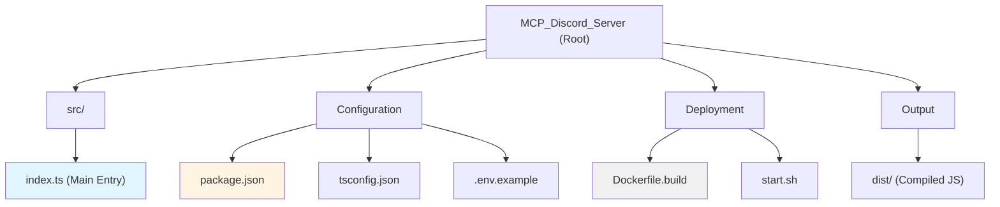

# MCP Discord Server - AI Context Documentation

**Last Updated:** 2025-11-24T18:36:16.000Z

## Changelog

### 2025-11-24
- Initial AI context documentation created
- Repository structure analyzed and documented
- Module architecture and interfaces catalogued

---

## Project Vision

MCP Discord Server is a TypeScript-based MCP (Model Context Protocol) server that provides Discord message sending capabilities for Claude Desktop and KADI agents. The project implements a stateless, REST-only architecture for sending messages to Discord channels through the Discord.js library, exposing standardized MCP tools for integration with AI agents.

**Core Purpose:** Enable AI agents (Claude Desktop, KADI agents) to send Discord messages via a clean MCP interface without requiring complex Discord Gateway event handling.

---

## Architecture Overview

### High-Level Architecture

```
[Claude Desktop / KADI Agent]
         ↓
   [KADI Broker (stdio)]
         ↓
   [MCP Discord Server]
         ↓
   [Discord REST API]
         ↓
   [Discord Channel]
```

### Technology Stack

- **Runtime:** Node.js 20+ (ES2022 target)
- **Language:** TypeScript 5.7+ (strict mode, ESNext modules)
- **MCP SDK:** @modelcontextprotocol/sdk ^1.0.4
- **Discord Library:** discord.js ^14.16.3
- **Validation:** Zod ^3.24.1
- **Environment:** dotenv ^16.4.7
- **Build Tool:** TypeScript Compiler (tsc)
- **Dev Tool:** tsx ^4.19.2 (watch mode)

### Design Principles

1. **Stateless Architecture** - No Gateway connection for events, pure REST API messaging
2. **Channel Name Resolution** - Automatic conversion of channel names to IDs with caching
3. **MCP-First Design** - Standard tool exposure via Model Context Protocol
4. **Type Safety** - Full TypeScript strict mode with Zod runtime validation
5. **Minimal Dependencies** - Only essential libraries for MCP + Discord integration

---

## Module Structure Diagram



---

## Module Index

| Module Path | Language | Responsibility | Entry Point | Status |
|-------------|----------|----------------|-------------|--------|
| **src/** | TypeScript | Core MCP server implementation | `index.ts` | Active |
| **Root Config** | JSON/Env | Project configuration and build settings | `package.json`, `tsconfig.json` | Active |
| **Deployment** | Shell/Docker | Build and execution scripts | `start.sh`, `Dockerfile.build` | Active |

---

## Core Components

### 1. MCP Server (`DiscordServerMCPServer`)

**Responsibilities:**
- MCP protocol handler registration (ListTools, CallTool)
- Tool execution routing and error handling
- Configuration loading and validation

**Exposed Tools:**
- `send_message` - Send messages to Discord channels (with optional reply)
- `send_reply` - Reply to specific messages in channels

### 2. Discord Client Manager (`DiscordClient`)

**Responsibilities:**
- Discord REST API client initialization and connection management
- Channel name-to-ID resolution with in-memory caching
- Message and reply sending via Discord.js

**Key Features:**
- Ready state management with timeout handling (10 seconds)
- Automatic channel cache for performance
- Guild-scoped or global channel search
- Support for channel names, #-prefixed names, and snowflake IDs

### 3. Configuration & Validation

**Environment Variables:**
- `DISCORD_TOKEN` (required) - Discord bot token from Developer Portal
- `DISCORD_GUILD_ID` (optional) - Restrict operations to specific guild
- `MCP_LOG_LEVEL` (default: info) - Logging level (debug/info/warn/error)

**Validation:** Zod schemas for configuration and tool inputs

---

## Running and Development

### Prerequisites

```bash
# Node.js 20+ required
node --version

# Install dependencies
npm install
```

### Development Workflow

```bash
# Development mode with hot-reload
npm run dev

# Type checking only
npm run type-check

# Build for production
npm run build

# Run production build
npm start
```

### Environment Setup

1. Copy `.env.example` to `.env`
2. Obtain Discord bot token from [Discord Developer Portal](https://discord.com/developers/applications)
3. Configure bot with required permissions:
   - View Channels
   - Send Messages
   - Read Message History
4. Configure Gateway Intents:
   - Guilds
   - Guild Messages
5. Invite bot to Discord server

### Docker Build

```bash
# Build Docker image (outputs dist/ directory)
docker build -f Dockerfile.build -t mcp-discord-build .

# Extract compiled files
docker cp $(docker create mcp-discord-build):/app/dist ./dist
```

### Integration with KADI Broker

Register in `kadi-broker/config/mcp-upstreams.json`:

```json
{
  "id": "discord-server",
  "name": "Discord Message Sender (MCP_Discord_Server)",
  "type": "stdio",
  "prefix": "discord_server",
  "enabled": true,
  "stdio": {
    "command": "node",
    "args": ["C:\\p4\\Personal\\SD\\MCP_Discord_Server\\dist\\index.js"],
    "env": {
      "DISCORD_TOKEN": "your_token",
      "DISCORD_GUILD_ID": "your_guild_id"
    }
  },
  "networks": ["discord"]
}
```

---

## Testing Strategy

### Current State

- **No automated tests currently implemented**
- Testing is manual via MCP tool invocation

### Recommended Test Coverage

1. **Unit Tests** (Recommended)
   - Configuration validation (Zod schemas)
   - Channel name resolution logic
   - Error handling paths

2. **Integration Tests** (Recommended)
   - Discord client connection
   - Message sending via REST API
   - MCP tool invocation end-to-end

3. **Test Framework Suggestions**
   - Vitest or Jest for unit tests
   - Mock Discord.js client for isolated testing
   - MCP SDK test utilities for protocol testing

---

## Coding Standards

### TypeScript Configuration

- **Target:** ES2022
- **Module:** ESNext (ES modules)
- **Strict Mode:** Enabled
- **Unused Variables/Parameters:** Error
- **No Implicit Returns:** Enforced
- **Source Maps:** Generated
- **Declarations:** Generated (.d.ts)

### Code Style

- **Import Style:** ES6 imports with `.js` extensions (for Node.js ESM compatibility)
- **Error Handling:** Try-catch with structured error responses
- **Logging:** Console logging with emoji indicators (🚀 ✅ ❌ 📤 📋)
- **Validation:** Zod schemas for all external inputs
- **Type Safety:** No `any` types, explicit type annotations

### File Organization

```
src/
├── index.ts          # Single-file implementation
│   ├── Configuration & Validation
│   ├── Input Schemas (Zod)
│   ├── DiscordClient class
│   ├── DiscordServerMCPServer class
│   └── Main entry point
```

---

## AI Usage Guidelines

### Understanding the Codebase

**Key Concepts:**
- **MCP Protocol:** Model Context Protocol for AI agent tool exposure
- **stdio Transport:** Communication via standard input/output streams
- **Discord Snowflakes:** 18-19 digit IDs for Discord entities
- **Channel Resolution:** Name-to-ID mapping with caching strategy

**Code Navigation:**
- Start with `main()` function (line 470) for entry point
- Review `DiscordServerMCPServer` class (line 246) for MCP integration
- Examine `DiscordClient` class (line 83) for Discord operations
- Check Zod schemas (lines 39-77) for data validation

### Modification Patterns

**Adding New MCP Tools:**

1. Define Zod input schema
2. Add tool definition in `ListToolsRequestSchema` handler (line 276)
3. Add case in `CallToolRequestSchema` handler (line 329)
4. Implement handler method (e.g., `handleSendMessage`)
5. Add DiscordClient method if needed

**Extending Discord Capabilities:**

```typescript
// Example: Add embed support
async sendEmbed(
  channel: string,
  embedData: EmbedData,
  guildId?: string
): Promise<{ id: string; channelId: string }> {
  await this.waitForReady();
  const channelId = await this.resolveChannelId(channel, guildId);

  const textChannel = await this.client.channels.fetch(channelId) as TextChannel;
  const embed = new EmbedBuilder().setTitle(embedData.title)...
  const message = await textChannel.send({ embeds: [embed] });

  return { id: message.id, channelId: message.channelId };
}
```

### Common Tasks

**Task:** Add message editing capability

1. Create `EditMessageInputSchema` with `channel`, `message_id`, `new_text`
2. Add `edit_message` tool to MCP tool list
3. Implement `handleEditMessage` in `DiscordServerMCPServer`
4. Add `editMessage` method in `DiscordClient` using `message.edit()`

**Task:** Add reaction support

1. Create `AddReactionInputSchema` with `channel`, `message_id`, `emoji`
2. Implement `addReaction` in `DiscordClient`
3. Fetch message, call `message.react(emoji)`

**Task:** Improve error messages

- Enhance error messages in catch blocks with context
- Add specific error types (ChannelNotFoundError, PermissionError)
- Include Discord API error codes in responses

### Debugging Tips

**Discord Client Not Ready:**
- Check `DISCORD_TOKEN` validity
- Verify bot is invited to server
- Increase timeout in `waitForReady()` if needed
- Add debug logging in `initialize()` method

**Channel Resolution Failing:**
- Log guild cache contents
- Verify channel exists in correct guild
- Check bot permissions in channel
- Clear channel cache and retry

**MCP Tool Errors:**
- Validate input against Zod schema manually
- Check MCP SDK version compatibility
- Test with MCP Inspector tool
- Review stdio communication logs

---

## Important File Paths

| Category | Path | Purpose |
|----------|------|---------|
| **Entry Point** | `C:\p4\Personal\SD\MCP_Discord_Server\src\index.ts` | Main TypeScript source |
| **Configuration** | `C:\p4\Personal\SD\MCP_Discord_Server\package.json` | Dependencies and scripts |
| **TypeScript Config** | `C:\p4\Personal\SD\MCP_Discord_Server\tsconfig.json` | Compiler settings |
| **Environment Template** | `C:\p4\Personal\SD\MCP_Discord_Server\.env.example` | Environment variable template |
| **Build Output** | `C:\p4\Personal\SD\MCP_Discord_Server\dist\index.js` | Compiled JavaScript |
| **Execution Script** | `C:\p4\Personal\SD\MCP_Discord_Server\start.sh` | Production startup script |
| **Docker Build** | `C:\p4\Personal\SD\MCP_Discord_Server\Dockerfile.build` | Build-only Docker image |
| **Documentation** | `C:\p4\Personal\SD\MCP_Discord_Server\README.md` | User-facing documentation |

---

## Related Resources

- [Model Context Protocol Documentation](https://modelcontextprotocol.io/)
- [Discord.js Guide](https://discordjs.guide/)
- [Discord Developer Portal](https://discord.com/developers/applications)
- [Zod Documentation](https://zod.dev/)
- [KADI Broker Integration Guide](../../kadi-broker/docs/)

---

## Known Issues & Limitations

1. **No Event Handling** - Stateless design means no listening to Discord events (messages, reactions)
2. **No Test Suite** - Manual testing only, no automated tests implemented
3. **No Rate Limiting** - No built-in rate limit handling for Discord API
4. **No Message Formatting** - Limited support for embeds, attachments, or rich formatting
5. **No Batch Operations** - Tools operate on single messages only
6. **Channel Cache Persistence** - Cache is in-memory only, cleared on restart

---

## Future Enhancements

### Priority 1 (High Impact)
- Add embed support for rich message formatting
- Implement message editing and deletion tools
- Add attachment sending capability
- Create comprehensive test suite

### Priority 2 (Medium Impact)
- Add rate limiting with queue management
- Implement message history retrieval
- Support for threads and forum channels
- Add reaction management tools

### Priority 3 (Nice to Have)
- Persistent channel cache (Redis/file-based)
- Batch message operations
- Channel and user search tools
- Message template system
