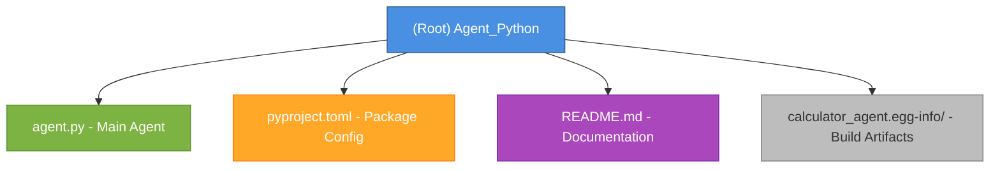

# Agent_Python - KADI Data Processing Agent

## Changelog

- **2025-11-06 23:59:32** - Initial AI context generation via adaptive initialization

---

## Project Vision

Agent_Python is a **Python-based KADI protocol agent** that provides statistical data processing capabilities for the ProtogameJS3D multi-agent system. It demonstrates cross-language agent communication using the KADI protocol with Ed25519 authentication, Pydantic schema validation, and event-driven architecture.

**Purpose:** Serve as a data processing microservice that can be invoked by any agent (Python, TypeScript, Go, Rust) in the KADI network to perform statistical analysis and data transformations.

**Design Philosophy:**
- Type-safe tool definitions using Pydantic
- Asynchronous event-driven architecture
- Language-agnostic communication via WebSocket/KADI protocol
- Cryptographically authenticated agent identity

---

## Architecture Overview

### System Architecture

```
┌─────────────────────────────────────────────────────────────┐
│                    KADI Broker (WebSocket)                  │
│                    ws://localhost:8080                      │
└─────────────────────────────────────────────────────────────┘
                            │
                            │ WebSocket + Ed25519 Auth
                            │
┌─────────────────────────────────────────────────────────────┐
│              Data Processing Agent (Python)                 │
├─────────────────────────────────────────────────────────────┤
│  Tools:                                                     │
│    • calculate_mean(numbers) → MeanOutput                   │
│    • calculate_median(numbers) → MedianOutput               │
│    • calculate_std_dev(numbers) → StdDevOutput              │
│    • find_min_max(numbers) → MinMaxOutput                   │
│    • calculate_sum(numbers) → SumOutput                     │
├─────────────────────────────────────────────────────────────┤
│  Events Published:                                          │
│    • data.analysis - Calculation results                    │
│    • data.error - Error conditions                          │
│    • agent.connected - Connection status                    │
├─────────────────────────────────────────────────────────────┤
│  Events Subscribed:                                         │
│    • data.analysis - Monitor all data operations            │
│    • data.error - Monitor all errors                        │
│    • agent.connected - Agent network status                 │
└─────────────────────────────────────────────────────────────┘
```

### Technology Stack

- **Runtime:** Python 3.10+
- **Protocol:** KADI (WebSocket-based agent communication)
- **Authentication:** Ed25519 cryptographic signatures
- **Schema Validation:** Pydantic v2.0+
- **Async Framework:** asyncio
- **WebSocket Library:** websockets v12.0+

---

## Module Structure



---

## Module Index

| Module/Component | Language | Type | Description |
|-----------------|----------|------|-------------|
| `agent.py` | Python | Main Agent | Data processing agent with 5 statistical tools |
| `pyproject.toml` | TOML | Config | Package metadata, dependencies, and dev tools |
| `calculator_agent.egg-info/` | Build | Artifacts | Generated package metadata (should be in .gitignore) |

---

## Running and Development

### Prerequisites

- Python 3.10 or higher
- KADI broker running at `ws://localhost:8080` (configurable via `KADI_BROKER_URL`)
- KADI core Python library installed from local path: `C:/p4/Personal/SD/kadi-core-py`

### Installation

```bash
# Install package in editable mode with dependencies
pip install -e .

# Or with development dependencies
pip install -e .[dev]
```

### Running the Agent

```bash
# Basic usage (connects to ws://localhost:8080)
python agent.py

# With custom broker URL
export KADI_BROKER_URL=ws://kadi.build:8080
python agent.py

# With custom networks
export KADI_NETWORK=global,data,analytics
python agent.py
```

### Development Tools

```bash
# Run tests (if tests directory exists)
pytest

# Type checking
mypy agent.py

# Code formatting
black agent.py

# Linting (if configured)
ruff check agent.py
```

---

## Testing Strategy

**Current Status:** No test files detected in repository.

**Recommended Testing Approach:**

1. **Unit Tests** (`tests/test_agent.py`):
   - Test each statistical function in isolation
   - Mock KADI client to avoid broker dependency
   - Validate Pydantic schema serialization/deserialization

2. **Integration Tests** (`tests/test_integration.py`):
   - Test with actual KADI broker connection
   - Verify event publishing and subscription
   - Cross-language tool invocation tests

3. **Edge Cases:**
   - Empty number arrays
   - Single-value arrays
   - Division by zero equivalents
   - Standard deviation with < 2 values
   - Large datasets (performance)

**Test Configuration:** Already configured in `pyproject.toml`:
- Framework: pytest with pytest-asyncio
- Mode: auto async mode
- Test path: `tests/` directory (not yet created)

---

## Coding Standards

### Python Style Guide

- **Formatter:** Black (line length: 100 characters, target: Python 3.10)
- **Type Hints:** Required (mypy strict mode enabled)
- **Async/Await:** All KADI operations must be async
- **Docstrings:** Google-style docstrings for all public functions

### Type Checking Configuration

From `pyproject.toml`:
```toml
[tool.mypy]
python_version = "3.10"
warn_return_any = true
warn_unused_configs = true
disallow_untyped_defs = true
```

### Schema Definitions

All tool inputs/outputs must use Pydantic models with:
- Field descriptions using `Field(..., description="...")`
- Type annotations for all fields
- Optional error fields for error handling

---

## AI Usage Guidelines

### Working with This Codebase

**1. Documentation Mismatch Alert:**
- `README.md` describes a "Calculator Agent" with add/multiply/subtract/divide tools
- `agent.py` implements a "Data Processing Agent" with statistical tools (mean/median/std_dev/min_max/sum)
- **Action for AI:** Recommend updating README.md to match actual implementation, or clarify if this is intentional versioning

**2. Tool Registration Pattern:**
```python
@client.tool(description="Tool description here")
async def tool_name(params: InputSchema) -> OutputSchema:
    # Implementation
    result = perform_calculation(params)

    # Always publish events for observability
    await client.publish_event('data.analysis', {...})

    return OutputSchema(result=result, ...)
```

**3. Error Handling:**
- Use try-except blocks for operations that can fail
- Return error information in output schema (not exceptions)
- Publish error events to `data.error` topic

**4. Event-Driven Design:**
- Every tool should publish completion events
- Subscribe to relevant events for cross-agent coordination
- Use descriptive event names with namespace prefixes (e.g., `data.*`, `agent.*`)

**5. Cross-Language Compatibility:**
- All tool schemas must serialize to JSON
- Use standard JSON types (no Python-specific objects)
- Follow KADI protocol conventions for tool naming

### Extending the Agent

**Adding New Tools:**
1. Define Pydantic input/output schemas
2. Implement async function with `@client.tool()` decorator
3. Add event publishing for observability
4. Update README.md tool list
5. Add corresponding tests

**Adding New Event Subscriptions:**
```python
def on_custom_event(event_data):
    """Handle custom event."""
    # Process event data
    pass

await client.subscribe_to_event('custom.event', on_custom_event)
```

---

## Key Dependencies

### Runtime Dependencies

- **kadi** (local file dependency: `C:/p4/Personal/SD/kadi-core-py`)
  - KADI protocol client library
  - Provides: KadiClient, tool decorators, event system

- **pydantic** (>=2.0.0)
  - Schema validation and serialization
  - Used for: Tool input/output type safety

- **websockets** (>=12.0)
  - WebSocket client library
  - Used by: KADI client for broker communication

### Development Dependencies

- **pytest** (>=7.0.0) - Testing framework
- **pytest-asyncio** (>=0.21.0) - Async test support
- **black** (>=23.0.0) - Code formatter
- **mypy** (>=1.0.0) - Static type checker

---

## Known Issues and Recommendations

### Critical Issues

1. **Documentation Mismatch**
   - README describes calculator agent (add/multiply/subtract/divide)
   - Code implements data processing agent (mean/median/std_dev/min_max/sum)
   - **Action:** Update README.md or explain versioning strategy

2. **Missing .gitignore**
   - No .gitignore file detected
   - Build artifacts (`calculator_agent.egg-info/`) not excluded
   - **Action:** Create `.gitignore` with:
     ```
     __pycache__/
     *.egg-info/
     dist/
     build/
     .pytest_cache/
     .mypy_cache/
     *.pyc
     ```

3. **Missing Tests**
   - Test path configured in pyproject.toml but no tests exist
   - **Action:** Create `tests/` directory with unit and integration tests

4. **Local Dependency Path**
   - KADI core uses absolute Windows path: `file://C:/p4/Personal/SD/kadi-core-py`
   - Not portable across machines/users
   - **Action:** Consider publishing KADI core to PyPI or using relative paths

### Recommended Improvements

1. **Environment Configuration**
   - Add `.env.example` file with configuration template
   - Document all environment variables

2. **Logging**
   - Add structured logging instead of print statements
   - Use Python's logging module with configurable levels

3. **Graceful Shutdown**
   - Implement proper cleanup on SIGTERM/SIGINT
   - Close WebSocket connections cleanly

4. **Health Checks**
   - Add health check endpoint for monitoring
   - Implement connection retry logic

5. **Metrics**
   - Add operation counters (total calculations, errors)
   - Export metrics for observability

---

## Related Resources

- **KADI Protocol:** https://gitlab.com/humin-game-lab/kadi
- **ProtogameJS3D:** Reference in README to parent project at `../../../`
- **Multi-Language Agents:** `../../../.claude/plan/multi-language-agents.md`

---

## Quick Reference

### Available Tools

```python
# Mean (average) calculation
calculate_mean(numbers: List[float]) -> MeanOutput

# Median value
calculate_median(numbers: List[float]) -> MedianOutput

# Standard deviation (requires >= 2 values)
calculate_std_dev(numbers: List[float]) -> StdDevOutput

# Min, max, and range
find_min_max(numbers: List[float]) -> MinMaxOutput

# Sum of all values
calculate_sum(numbers: List[float]) -> SumOutput
```

### Event Topics

- `data.analysis` - Published on successful operations
- `data.error` - Published on error conditions
- `agent.connected` - Published when agent connects to broker

### Configuration Environment Variables

- `KADI_BROKER_URL` - Broker WebSocket URL (default: `ws://localhost:8080`)
- `KADI_NETWORK` - Comma-separated network names (default: `global,data`)

---

**Last Updated:** 2025-11-06 23:59:32 UTC
