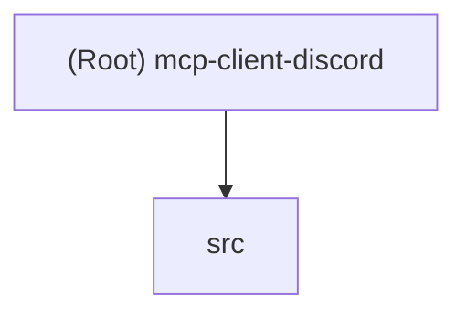

# mcp-client-discord

## Changelog

**2025-11-24T18:36:22-0600** - Initial AI context generation
- Created comprehensive documentation structure
- Analyzed codebase architecture and dependencies
- Generated module documentation for src/

---

## Project Vision

MCP Discord Client is a TypeScript-based Model Context Protocol (MCP) server that bridges Discord events with AI-powered autonomous response systems. It listens for Discord mentions in real-time via the Discord Gateway and queues them for processing by external AI agents (specifically template-agent-typescript) through the KADI broker architecture.

The project enables seamless integration between Discord communities and Claude AI, allowing natural conversational interactions where users can @mention a bot and receive intelligent, context-aware responses powered by Anthropic's Claude API.

## Architecture Overview

```mermaid
graph LR
    A[Discord User] -->|@mentions bot| B[Discord Gateway]
    B -->|WebSocket Event| C[DiscordManager]
    C -->|Queue Mention| D[MentionQueue]
    D -->|get_discord_mentions| E[MCP Server]
    E -->|STDIO Transport| F[KADI Broker]
    F -->|Tool Invocation| G[template-agent-typescript]
    G -->|Claude API| H[AI Processing]
    G -->|Response| I[mcp-server-discord]
    I -->|Reply| A
```

### Key Components

1. **Discord Gateway Client**: Real-time WebSocket connection using discord.js v14
2. **Mention Queue**: In-memory FIFO queue (max 100 mentions) with automatic overflow protection
3. **MCP Server**: Exposes standardized tools via Model Context Protocol
4. **STDIO Transport**: Inter-process communication with KADI broker
5. **Configuration Management**: Environment-based config with Zod validation

### Data Flow

1. User @mentions the Discord bot in a channel or DM
2. Discord Gateway receives `messageCreate` event via WebSocket
3. DiscordManager validates mention and extracts clean text
4. Mention object queued in MentionQueue with metadata (user, channel, timestamp)
5. template-agent-typescript polls `get_discord_mentions` tool via KADI broker
6. Mentions retrieved and removed from queue (FIFO batch retrieval)
7. Agent processes with Claude API and responds via mcp-server-discord

## Module Structure Diagram



## Module Index

| Module | Path | Language | Responsibility | Entry Point |
|--------|------|----------|----------------|-------------|
| Core Application | `src/` | TypeScript | Discord event listener and MCP server implementation | `src/index.ts` |

## Running and Development

### Prerequisites

- Node.js 20+ (uses ES2022 features)
- Discord Bot Token with Message Content Intent enabled
- npm or compatible package manager

### Environment Setup

1. **Clone and Install**
   ```bash
   git clone <repository-url>
   cd mcp-client-discord
   npm install
   ```

2. **Configure Environment**
   ```bash
   cp .env.example .env
   ```

   Edit `.env` with your credentials:
   ```env
   DISCORD_TOKEN=your_discord_bot_token_here
   DISCORD_GUILD_ID=your_guild_id_here  # Optional
   MCP_LOG_LEVEL=info  # debug | info | warn | error
   ```

3. **Get Discord Bot Token**
   - Visit [Discord Developer Portal](https://discord.com/developers/applications)
   - Create new application > Bot section
   - Enable "Message Content Intent" (required for reading message content)
   - Copy bot token
   - Generate invite URL with permissions: Send Messages, Read Messages, View Channels

### Build and Run

**Development Mode (Hot Reload)**
```bash
npm run dev
```

**Production Build**
```bash
npm run build
npm start
```

**Type Checking Only**
```bash
npm run type-check
```

**Docker Build**
```bash
docker build -f Dockerfile.build -t mcp-discord-client:build .
```

### KADI Broker Integration

Register in `kadi-broker/config/mcp-upstreams.json`:
```json
{
  "id": "discord-client",
  "name": "Discord Event Listener (mcp-client-discord)",
  "type": "stdio",
  "prefix": "discord_client",
  "enabled": true,
  "stdio": {
    "command": "node",
    "args": ["C:\\path\\to\\mcp-client-discord\\dist\\index.js"],
    "env": {
      "DISCORD_TOKEN": "your_token",
      "DISCORD_GUILD_ID": "your_guild_id"
    }
  },
  "networks": ["discord"]
}
```

## Testing Strategy

**Current State**: No automated tests implemented.

**Recommended Test Coverage**:

1. **Unit Tests** (Not implemented)
   - MentionQueue operations (add, getAndClear, size, overflow)
   - Config validation with Zod schemas
   - Message text cleaning logic
   - Tool input schema validation

2. **Integration Tests** (Not implemented)
   - Discord event handling with mock client
   - MCP tool invocation responses
   - STDIO transport communication

3. **Manual Testing**
   - @mention bot in Discord channel
   - Verify logs show queued mentions
   - Call `get_discord_mentions` via broker
   - Verify queue depletion and FIFO ordering

**Testing Framework Recommendations**:
- Jest or Vitest for unit tests
- Discord.js mocking with `@sapphire/pieces` test utilities
- MCP SDK test helpers for protocol validation

## Coding Standards

### TypeScript Configuration

- **Target**: ES2022
- **Module System**: ESNext with Node resolution
- **Strict Mode**: Enabled (all strict checks)
- **Unused Checks**: Enforced (noUnusedLocals, noUnusedParameters)
- **Output**: `dist/` directory with source maps and declarations

### Code Style

- **Imports**: ES6 module syntax with `.js` extensions for MCP SDK
- **Classes**: PascalCase (DiscordManager, MentionQueue)
- **Interfaces**: PascalCase with clear property documentation
- **Constants**: UPPER_SNAKE_CASE for environment variables
- **Functions**: camelCase with JSDoc comments for public APIs
- **Error Handling**: Try-catch with console.error logging

### Project Conventions

1. **Validation**: Use Zod schemas for all external inputs (env vars, tool params)
2. **Logging**: Emoji prefixes for visual parsing (🚀 startup, ❌ errors, 💬 mentions)
3. **Queue Safety**: Max size enforcement to prevent memory leaks
4. **Graceful Degradation**: Stub mode when Discord token invalid/missing

### Dependencies

**Production**:
- `@anthropic-ai/sdk`: Claude API client (not directly used, listed for reference)
- `@modelcontextprotocol/sdk`: MCP protocol implementation
- `discord.js`: Discord Gateway and API wrapper
- `dotenv`: Environment variable loading
- `zod`: Runtime schema validation

**Development**:
- `typescript`: Type checking and compilation
- `tsx`: Development hot-reload
- `@types/node`: Node.js type definitions

## AI Usage Guidelines

### When Working with This Codebase

**Preferred Tools for AI Agents**:
- Use `get_discord_mentions` tool to retrieve pending mentions
- Limit parameter (1-50) controls batch size
- Queue is automatically cleared on retrieval (FIFO)

**Understanding the System**:
1. This is a **listener-only** service - it does NOT send Discord messages
2. Message sending handled by separate `mcp-server-discord` service
3. Bot must be invited to channels with proper permissions
4. Message Content Intent required in Discord Developer Portal

**Common Integration Patterns**:
```typescript
// template-agent-typescript polling pattern
const result = await protocol.invokeTool({
  targetAgent: 'discord-client',
  toolName: 'discord_client_get_discord_mentions',
  toolInput: { limit: 5 },
  timeout: 10000
});

const { mentions, count } = JSON.parse(result.content[0].text);
```

**Response Format**:
```json
{
  "mentions": [
    {
      "id": "message_id",
      "user": "user_id",
      "username": "display_name",
      "text": "clean message text",
      "channel": "channel_id",
      "channelName": "channel_name",
      "guild": "guild_id",
      "ts": "2025-11-24T18:36:22.000Z"
    }
  ],
  "count": 1,
  "retrieved_at": "2025-11-24T18:36:22.000Z"
}
```

### Modification Guidelines

**Safe to Modify**:
- Queue max size (currently 100)
- Log level filtering logic
- Mention text preprocessing
- Tool input validation ranges

**Requires Careful Testing**:
- Discord event handler logic (affects all message processing)
- MCP protocol handler signatures (must match SDK types)
- Queue data structure (impacts memory usage)
- Configuration schema (breaks existing deployments)

**Do Not Change Without Coordination**:
- MCP tool names (`get_discord_mentions`)
- Tool output JSON structure (breaks template-agent-typescript integration)
- STDIO transport mechanism (broker expects specific format)
- Discord Intent requirements (breaks Gateway connection)

### Troubleshooting with AI

**"Discord client not ready" errors**:
- Check DISCORD_TOKEN validity (length > 50, not placeholder)
- Verify bot invited to server
- Confirm internet connectivity

**"Channel not found" errors**:
- Verify bot has View Channels permission
- Check channel-specific permission overrides

**Empty mention queue**:
- Confirm Message Content Intent enabled in Dev Portal
- Verify bot is not filtering out messages (check author.bot logic)
- Check if mentions are being consumed faster than produced

**MCP tool not found**:
- Ensure server started successfully (check logs for "mcp-client-discord ready")
- Verify KADI broker configuration matches tool name
- Check STDIO transport connection established
