# Quest Workflow Architecture

## Complete Quest Workflow Diagram

```mermaid
%%{init: {'theme':'base', 'themeVariables': { 'primaryColor':'#1a1a1a','primaryTextColor':'#000','primaryBorderColor':'#000','lineColor':'#000','secondaryColor':'#2a2a2a','tertiaryColor':'#3a3a3a','noteBkgColor':'#fff','noteTextColor':'#000','noteBorderColor':'#000','actorBorder':'#000','actorBkg':'#e0e0e0','actorTextColor':'#000','actorLineColor':'#000','signalColor':'#000','signalTextColor':'#000','labelBoxBkgColor':'#e0e0e0','labelBoxBorderColor':'#000','labelTextColor':'#000','loopTextColor':'#000','activationBorderColor':'#000','activationBkgColor':'#d0d0d0','sequenceNumberColor':'#000'}}}%%
sequenceDiagram
    participant Human
    participant Discord Bot
    participant Agent Producer
    participant MCP Quest
    participant KĀDI Bus
    participant Worker Agent
    participant Git

    %% Quest Creation Phase
    rect rgb(200, 220, 255)
        Note over Human,MCP Quest: Phase 1: Quest Creation
        Human->>Discord Bot: Create quest with tasks
        Discord Bot->>MCP Quest: quest_create()
        MCP Quest-->>Discord Bot: Quest created
        Discord Bot-->>Human: Quest created successfully
    end

    %% Task Assignment Phase
    rect rgb(220, 255, 200)
        Note over Human,MCP Quest: Phase 2: Task Assignment
        Human->>Discord Bot: Assign tasks to agents
        Discord Bot->>MCP Quest: quest_assign_tasks()
        MCP Quest-->>Discord Bot: Tasks assigned
        Discord Bot-->>Human: Tasks assigned to agents
    end

    %% Task Execution Phase
    rect rgb(255, 240, 200)
        Note over Human,Git: Phase 3: Task Execution
        Human->>Discord Bot: Execute tasks
        Discord Bot->>Agent Producer: task_execution tool
        Agent Producer->>MCP Quest: quest_update_task_status(in_progress)
        MCP Quest-->>Agent Producer: Status updated
        Agent Producer->>KĀDI Bus: Publish task.assigned event
        KĀDI Bus->>Worker Agent: task.assigned event
        Worker Agent->>Worker Agent: Execute task in worktree
        Worker Agent->>Git: Commit changes
        Git-->>Worker Agent: Changes committed
    end

    %% Task Completion Phase
    rect rgb(255, 220, 220)
        Note over Worker Agent,Discord Bot: Phase 4: Task Completion & Verification
        Worker Agent->>KĀDI Bus: Publish task.completed event
        KĀDI Bus->>Agent Producer: task.completed event
        Agent Producer->>Agent Producer: task-completion handler
        Agent Producer->>MCP Quest: quest_update_task_status(completed)
        MCP Quest-->>Agent Producer: Status updated
        Agent Producer->>Agent Producer: Wait 1000ms for DB write
        Agent Producer->>MCP Quest: quest_verify_task(LLM scoring)
        MCP Quest-->>Agent Producer: Verification score (0-100)

        alt Score >= 80
            Agent Producer->>KĀDI Bus: Publish task.ready_for_approval
            KĀDI Bus->>Agent Producer: task.ready_for_approval event
            Agent Producer->>Agent Producer: task-completion-notifier handler
            Agent Producer->>Discord Bot: Send approval notification
            Discord Bot-->>Human: Task ready for approval (score: X/100)
        else Score < 80
            Agent Producer->>Discord Bot: Send retry notification
            Discord Bot-->>Human: Task needs revision (score: X/100)
        end
    end

    %% Human Approval Phase
    rect rgb(230, 200, 255)
        Note over Human,MCP Quest: Phase 5: Human Approval
        Human->>Discord Bot: "approve task {id}"
        Discord Bot->>Agent Producer: task-approval handler
        Agent Producer->>MCP Quest: quest_get_task_details()
        MCP Quest-->>Agent Producer: Task details with verification
        Agent Producer->>Agent Producer: Verify score >= 80
        Agent Producer->>MCP Quest: quest_submit_task_result()
        MCP Quest-->>Agent Producer: Task finalized
        Agent Producer->>MCP Quest: quest_get_details()
        MCP Quest-->>Agent Producer: Quest details
        Agent Producer->>Agent Producer: Check if all tasks completed
    end

    %% Git Merge Phase
    rect rgb(200, 255, 255)
        Note over Agent Producer,Git: Phase 6: Git Merge (Quest Complete)
        alt All tasks completed
            Agent Producer->>Agent Producer: triggerGitWorkflow()
            loop For each worker agent
                Agent Producer->>Git: git_merge(worktree → main)
                Git-->>Agent Producer: Merge result
            end
            Agent Producer->>Git: git_push(origin main)
            Git-->>Agent Producer: Push result
            Agent Producer->>Discord Bot: Quest completed notification
            Discord Bot-->>Human: All tasks completed & merged!
        else Tasks remaining
            Agent Producer->>Discord Bot: Task approved notification
            Discord Bot-->>Human: Task approved (X/Y tasks done)
        end
    end

    %% Task Failure Handling
    rect rgb(255, 200, 200)
        Note over Worker Agent,Human: Error Handling: Task Failure
        Worker Agent->>KĀDI Bus: Publish task.failed event
        KĀDI Bus->>Agent Producer: task.failed event
        Agent Producer->>Agent Producer: task-failure handler
        Agent Producer->>Discord Bot: Send failure notification
        Discord Bot-->>Human: Task failed - retry/skip/abort?
        Human->>Discord Bot: "retry task {id}"
        Discord Bot->>Agent Producer: task-failure-response handler
        Agent Producer->>KĀDI Bus: Republish task.assigned event
        KĀDI Bus->>Worker Agent: task.assigned event (retry)
    end
```



## Component Responsibilities

### Agent Producer (Event-Driven Orchestrator)

**Handlers (Subscribe to KĀDI Events):**
- `task-completion.ts` - Handles task.completed events
- `task-failure.ts` - Handles task.failed events
- `task-approval.ts` - Handles human approval commands
- `task-completion-notifier.ts` - Handles task.ready_for_approval events

**Tools (Called by Discord Bot LLM):**
- `task-execution.ts` - Triggers task execution by publishing task.assigned events

### MCP-Server-Quest (State Management)

**Quest Management Tools:**
- `quest_create` - Create new quest
- `quest_get_details` - Get quest details
- `quest_get_status` - Get quest status

**Task Management Tools:**
- `quest_assign_tasks` - Assign tasks to agents
- `quest_get_task_details` - Get task details
- `quest_update_task_status` - Update task status (assigned → in_progress → completed)
- `quest_submit_task_result` - Finalize task completion
- `quest_verify_task` - Verify task with LLM scoring

**Task Planning Tools:**
- `quest_plan_task` - Plan task implementation
- `quest_analyze_task` - Analyze task requirements
- `quest_split_tasks` - Split complex tasks

### KĀDI Event Bus (Communication Layer)

**Events Published:**
- `task.assigned` - Agent Producer → Worker Agent (trigger execution)
- `task.completed` - Worker Agent → Agent Producer (task done)
- `task.failed` - Worker Agent → Agent Producer (task error)
- `task.ready_for_approval` - Agent Producer → Agent Producer (score >= 80)

**Network:** All events use 'utility' network for cross-agent communication

### Worker Agent (Task Executor)

**Responsibilities:**
- Subscribe to task.assigned events
- Execute tasks in dedicated git worktree
- Commit changes to worktree branch
- Publish task.completed or task.failed events

## Key Design Patterns

### 1. Event-Driven Architecture
- All agent communication uses KĀDI pub/sub
- Loose coupling between components
- Asynchronous, non-blocking workflow

### 2. LLM Orchestration
- Discord bot LLM decides which tools to call
- No hardcoded intent detection
- Natural language understanding for commands

### 3. State Machine
Task status transitions:
```
pending → assigned → in_progress → completed
                                 ↘ failed
```

### 4. Human-in-the-Loop
- LLM verification (score 0-100)
- Human approval required for score >= 80
- Human decision on failures (retry/skip/abort)

### 5. Git Worktree Isolation
- Each worker agent has dedicated worktree
- Isolated branches prevent conflicts
- Merge to main only after human approval

## Critical Race Condition Fix

**Problem:** `quest_verify_task` was loading fresh quest data but saving old quest object, overwriting status changes.

**Solution:** Use freshly loaded quest object throughout verification:
```typescript
// Load fresh data
const freshQuest = await QuestModel.load(quest.questId);
const freshTask = freshQuest.tasks.find(t => t.id === taskId);

// Verify status
if (freshTask.status !== 'completed') {
  throw new Error('Task must be completed to verify');
}

// Modify and save fresh object (not old one!)
freshTask.artifacts.verified = true;
await QuestModel.save(freshQuest);  // ✅ Save fresh object
```

## Git Push Issue & Workaround

**Problem:** Worker agent branches have grafted/shallow history, causing push failures:
```
fatal: did not receive expected object 7612f09c...
error: remote unpack failed: index-pack failed
```

**Current Workaround:** Create fresh commits instead of merging:
```bash
git checkout main
git checkout agent-playground-artist -- .
git add .
git commit -m "feat: ..."
git push origin main
```

**Proper Solution:** Ensure worktrees are created from full repository with proper history:
```bash
git worktree add C:\GitHub\agent-playground-artist -b agent-playground-artist main
```
