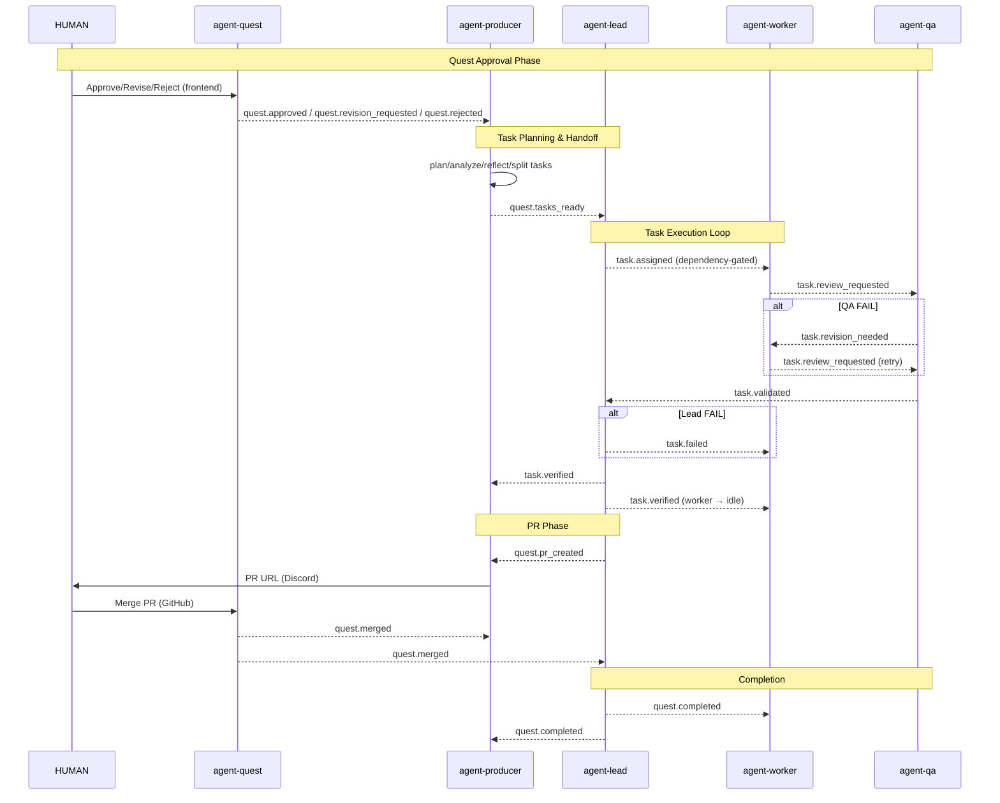

# Architecture v2

## 1. Component Registry

### Agents (KADI Network Participants — can pub/sub events + call tools)

| Component | Type | Role | Instances | Startup |
|-----------|------|------|-----------|---------|
| agent-producer | Agent | UX layer — HUMAN conversation, quest discussion, status relay | 1 | `npm run start` |
| agent-lead | Agent | Brain — task assignment, verification, git merge, PR | 3 | `npm run start:artist`, `start:designer`, `start:programmer` |
| agent-worker | Agent | Executor — code/art execution in worktrees | N | `npm run start:artist`, `start:designer`, `start:programmer` |
| agent-builder | Agent | Specialized worker — build/compile tasks (MSBuild, npm, cargo) | 1 | `npm run start:builder` |
| agent-deployer | Agent | Specialized worker — deployment tasks | 1 | `npm run start:deployer` |
| agent-qa | Agent | Validator — code review, visual validation, structured scoring | 1 | `npm run start` |
| agent-quest | Agent | Dashboard bridge — KADI ↔ WebSocket ↔ React frontend, GitHub webhook receiver | 1 | `npm run start` |
| agent-chatbot | Agent | Unified chat interface — Discord + Slack bridge | 1 | `npm run start` |
| agent-maintainer | Agent | System health monitoring, agent lifecycle management | 1 | `npm run start` |

### MCP Servers (Passive tool providers — registered on broker, cannot pub/sub)

| Component | Type | Role | Port |
|-----------|------|------|------|
| mcp-server-quest | MCP Server | Quest/task state management, CRUD operations | 3100 |
| mcp-server-git | MCP Server | Git operations (branch, worktree, commit, merge, diff) | 3400 |
| mcp-server-github | MCP Server | GitHub PR operations | 3600 |

### Abilities (Tool providers — registered on broker via stdio/native/broker mode, discoverable via network)

| Component | Type | Role | Used By |
|-----------|------|------|---------|
| ability-file-local | Ability | Local file system operations | agent-qa, agent-worker |
| ability-file-remote | Ability | Remote file transfer (between agents/machines) | agent-worker, agent-builder |
| ability-file-cloud | Ability | Cloud file upload/download (artifact storage) | agent-builder, agent-deployer |
| ability-vision | Ability | Visual validation via LLM vision (screenshot analysis) | agent-qa |
| ability-voice | Ability | Voice input/output for HUMAN interaction | agent-producer |
| ability-memory | Ability | Persistent memory storage (ArcadeDB?) | agent-producer, agent-lead |
| ability-deploy | Ability | Deploy artifacts to target environments (local/Akash/DigitalOcean) | agent-deployer |
| ability-secret | Ability | Secret/credential management | All agents |
| ability-tunnel-public | Ability | Expose local endpoints via public tunnel (for GitHub webhooks) | agent-quest |
| ability-tunnel-private | Ability | Secure internal tunnels between agents/services | agent-lead, agent-worker |
| ability-eval | Ability | Code execution sandbox for validation (run tests, scripts) | agent-qa |

---

## 2. Network Topology & Tool Registration

### KADI Networks

Networks follow domain-driven design — each network is a bounded context. Components only register tools to networks where consumers need them.

#### Interaction Zone

| Network | Purpose | Tool Providers | Tool Consumers |
|---------|---------|----------------|----------------|
| global | Testing & debugging via Claude Desktop (claude.ai) | claude.ai (Claude Desktop) | claude.ai (Claude Desktop) |
| text | Chat interface (Discord/Slack) | agent-chatbot | agent-producer |
| producer | agent-producer's tools (quest/task approval, rejection, revision) | agent-producer | agent-quest, agent-chatbot |
| quest | Quest dashboard, HUMAN approval UI, webhook receiver | agent-quest, mcp-server-quest | agent-producer, agent-lead |

#### Distribution Zone

| Network | Purpose | Tool Providers | Tool Consumers |
|---------|---------|----------------|----------------|
| artist | Artist role task assignment + execution | agent-lead-artist, agent-worker-artist | agent-lead-artist, agent-worker-artist |
| designer | Designer role task assignment + execution | agent-lead-designer, agent-worker-designer | agent-lead-designer, agent-worker-designer |
| programmer | Programmer role task assignment + execution | agent-lead-programmer, agent-worker-programmer | agent-lead-programmer, agent-worker-programmer |

#### Validation Zone

| Network | Purpose | Tool Providers | Tool Consumers |
|---------|---------|----------------|----------------|
| qa | QA validation, scoring | agent-qa, ability-eval | agent-lead |

#### Infrastructure Zone

| Network | Purpose | Tool Providers | Tool Consumers |
|---------|---------|----------------|----------------|
| git | Git operations (branch, worktree, commit, merge, diff) | mcp-server-git, mcp-server-github | agent-lead, agent-worker, agent-builder |
| deploy | Build + deploy pipeline | ability-deploy, agent-builder, agent-deployer | agent-lead |
| file | File operations (local, remote, cloud) | ability-file-local, ability-file-remote, ability-file-cloud | agent-worker, agent-builder, agent-qa |
| infra | Secrets, tunnels | ability-secret, ability-tunnel-public, ability-tunnel-private | All agents |

#### Perception Zone

| Network | Purpose | Tool Providers | Tool Consumers |
|---------|---------|----------------|----------------|
| vision | Visual analysis (screenshots, art validation) | ability-vision | agent-qa |
| voice | Voice input/output | ability-voice | agent-producer |
| memory | Persistent memory storage | ability-memory | agent-producer, agent-lead |

#### Maintenance Zone

| Network | Purpose | Tool Providers | Tool Consumers |
|---------|---------|----------------|----------------|
| maintainer | Agent health monitoring, lifecycle management | agent-maintainer | agent-maintainer (self-monitoring) |

### Tool → Network Scoping

Tools registered on kadi-broker are scoped to specific networks. Only agents on that network can discover and call the tool.

#### mcp-server-quest Tools (network: quest)

| Tool | Called By | Workflow Step |
|------|----------|--------------|
| quest_list_quest | agent-producer | 3 |
| quest_create_quest | agent-producer | 4 |
| quest_request_quest_approval | agent-producer | 7 |
| quest_update_quest | agent-producer | 9.2 |
| quest_delete_quest | agent-producer | 9.3 |
| quest_list_agent | agent-producer | 9.1 |
| quest_plan_task | agent-producer | 9.1 |
| quest_analyze_task | agent-producer | 9.1 |
| quest_reflect_task | agent-producer | 9.1 |
| quest_split_task | agent-producer | 9.1 |
| quest_query_quest | agent-lead | 11, 17.3 |
| quest_assign_task | agent-lead | 13 |
| quest_verify_task | agent-lead | 17 |
| quest_update_task | agent-lead | 17.2 |

#### mcp-server-git Tools (network: git)

| Tool | Called By | Workflow Step |
|------|----------|--------------|
| git_create_branch | agent-lead | 12 |
| git_delete_branch | agent-lead | 21.2 |
| git_worktree_add | agent-worker | 14 |
| git_worktree_remove | agent-lead | 17.2 |
| git_commit | agent-worker, agent-builder | 15 |
| git_merge | agent-lead | 17.2 |
| git_diff | agent-qa | 16.1 |

#### mcp-server-github Tools (network: git)

| Tool | Called By | Workflow Step |
|------|----------|--------------|
| github_create_pr | agent-lead | 17.3 |

#### agent-producer Tools (network: producer)

| Tool | Called By | Workflow Step |
|------|----------|--------------|
| quest_approve | agent-quest, agent-chatbot | 9.1 |
| quest_request_revision | agent-quest, agent-chatbot | 9.2 |
| quest_reject | agent-quest, agent-chatbot | 9.3 |
| task_approve | agent-quest, agent-chatbot | 22.1 |
| task_request_revision | agent-quest, agent-chatbot | 22.2 |
| task_reject | agent-quest, agent-chatbot | 22.3 |

#### agent-chatbot Tools (network: text)

| Tool | Called By | Workflow Step |
|------|----------|--------------|
| send_message | agent-producer | 5, 18, 19 |
| receive_message | agent-producer | 1, 12 |

#### Diagnostic Tools (network: global)

| Tool | Called By | Workflow Step |
|------|----------|--------------|
| echo | Any component | Diagnostics |
| list_tools | Any component | Discovery |

---

## 3. KADI Event Flow

### Event Catalog

| Event | Publisher | Subscriber(s) | Payload | Workflow Step |
|-------|-----------|---------------|---------|--------------|
| quest.approved | agent-quest | agent-producer | `{ questId }` | 9.1 |
| quest.revision_requested | agent-quest | agent-producer | `{ questId, comments }` | 9.2 |
| quest.rejected | agent-quest | agent-producer | `{ questId }` | 9.3 |
| quest.tasks_ready | agent-producer | agent-lead (all roles) | `{ questId }` | 11 |
| task.assigned | agent-lead | agent-worker / agent-builder / agent-deployer | `{ questId, taskId, agentId, feedback? }` | 13, 17.2 |
| task.rejected_by_worker | agent-worker | agent-lead | `{ questId, taskId, reason }` | 14.2 |
| task.review_requested | agent-worker / agent-builder | agent-qa | `{ questId, taskId, branch, commitHash }` | 15 |
| task.revision_needed | agent-qa | agent-worker | `{ questId, taskId, feedback, severity, score }` | 16.5 |
| task.validated | agent-qa | agent-lead | `{ questId, taskId, score, severity }` | 16.6 |
| task.failed | agent-lead | agent-worker | `{ questId, taskId, reason }` | 17.1 |
| task.verified | agent-lead | agent-producer, agent-worker | `{ questId, taskId, isQuestComplete }` | 17.2 |
| quest.pr_created | agent-lead | agent-producer | `{ questId, prUrl }` | 17.3 |
| pr.changes_requested | agent-quest | agent-lead | `{ questId, prId, comments }` | 19.1 |
| quest.pr_rejected | agent-quest | agent-lead, agent-producer | `{ questId, prId }` | 19.2 |
| quest.merged | agent-quest | agent-producer, agent-lead | `{ questId, prId }` | 21 |
| quest.completed | agent-lead | All agents | `{ questId }` | Completion |

### Event Flow Diagram



### Event → Network Mapping

| Event | Network | Rationale |
|-------|---------|-----------|
| quest.approved | quest | HUMAN action via agent-quest frontend |
| quest.revision_requested | quest | HUMAN action via agent-quest frontend |
| quest.rejected | quest | HUMAN action via agent-quest frontend |
| quest.tasks_ready | producer | agent-producer → agent-lead handoff |
| task.assigned | artist / designer / programmer | Role-specific, agent-lead → agent-worker |
| task.rejected_by_worker | artist / designer / programmer | Role-specific, agent-worker → agent-lead |
| task.review_requested | qa | Worker → agent-qa |
| task.revision_needed | qa | agent-qa → agent-worker |
| task.validated | qa | agent-qa → agent-lead |
| task.failed | artist / designer / programmer | Role-specific, agent-lead → agent-worker |
| task.verified | producer | agent-lead → agent-producer |
| quest.pr_created | producer | agent-lead → agent-producer |
| pr.changes_requested | quest | agent-quest webhook → agent-lead |
| quest.pr_rejected | quest | agent-quest webhook → agent-lead, agent-producer |
| quest.merged | quest | agent-quest webhook → agent-producer, agent-lead |
| quest.completed | global | agent-lead → all agents |

---

## 4. Status State Machines

### Quest Status (current codebase)

```typescript
type QuestStatus = 'draft' | 'pending_approval' | 'approved' | 'rejected' | 'in_progress' | 'completed' | 'cancelled';
```

```
draft → pending_approval → approved → in_progress → completed
              ↓                                         ↓
           rejected                                  cancelled
```

| Status | Trigger | Changed By | Workflow Step |
|--------|---------|------------|--------------|
| draft | quest_create_quest | agent-producer | 4 |
| pending_approval | quest_request_quest_approval | agent-producer | 7 |
| approved | HUMAN clicks "approve" | agent-quest (event) | 9.1 |
| rejected | HUMAN clicks "reject" | agent-quest (event) | 9.3 |
| in_progress | First task.assigned published | agent-lead | 13 |
| completed | All tasks verified + PR merged | agent-lead | Completion |
| cancelled | HUMAN cancels quest | agent-quest (event) | — |

NOTE: v2 may need additional statuses: `planning` (agent-producer running plan/analyze/reflect/split), `pr_created` (PR submitted to GitHub), `merged` (PR merged by HUMAN). To be evaluated during implementation.

### Task Status (current codebase)

```typescript
type TaskStatus = 'pending' | 'assigned' | 'in_progress' | 'pending_approval' | 'completed' | 'failed' | 'rejected' | 'needs_revision';
```

```
pending → assigned → in_progress → pending_approval → completed
              ↓           ↓              ↓
          rejected      failed      needs_revision
         (by worker)                     ↓
              ↓                    (retry → in_progress)
         (reassign)
```

| Status | Trigger | Changed By | Workflow Step |
|--------|---------|------------|--------------|
| pending | quest_split_task | agent-producer | 9.1 |
| assigned | quest_assign_task | agent-lead | 13 |
| in_progress | Worker starts execution | agent-worker | 14 |
| pending_approval | Worker commits + requests review | agent-worker | 15 |
| needs_revision | QA score = FAIL | agent-qa | 16.5 |
| failed | Max retries exceeded or lead rejection | agent-lead | 17.1 |
| rejected | Worker specialization mismatch | agent-worker | 14.2 |
| completed | Lead verifies + merges to staging | agent-lead | 17.2 |

NOTE: v2 may need additional statuses: `review_requested` (submitted to agent-qa), `validated` (agent-qa passed), `verified` (agent-lead confirmed). To be evaluated during implementation.

### Approval Decision (current codebase)

```typescript
type ApprovalDecisionType = 'approved' | 'revision_requested' | 'rejected';
```

Used by both quest approval (step 9) and task approval flows in agent-quest's frontend.

### Agent Status (current codebase)

```typescript
type AgentStatus = 'available' | 'busy' | 'offline';
```

| Status | Trigger | Changed By | Workflow Step |
|--------|---------|------------|--------------|
| available | Initial state / task completed / quest completed | agent-lead | 17.2, Completion |
| busy | task.assigned event received, worker starts | agent-worker (self) | 14 |
| offline | Agent disconnected / crashed | agent-maintainer (detection) | — |
