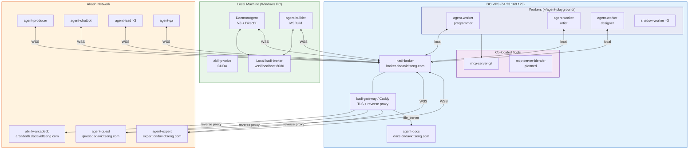
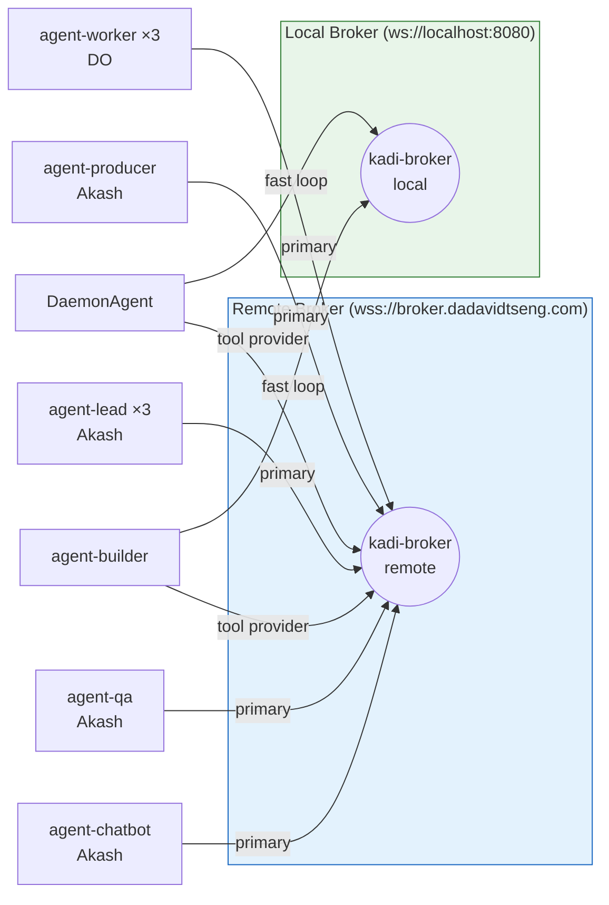
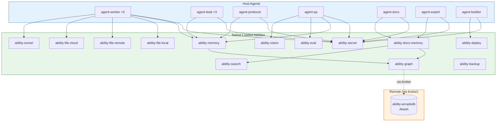
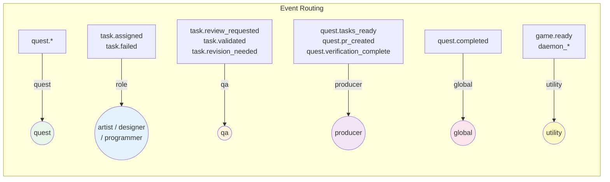
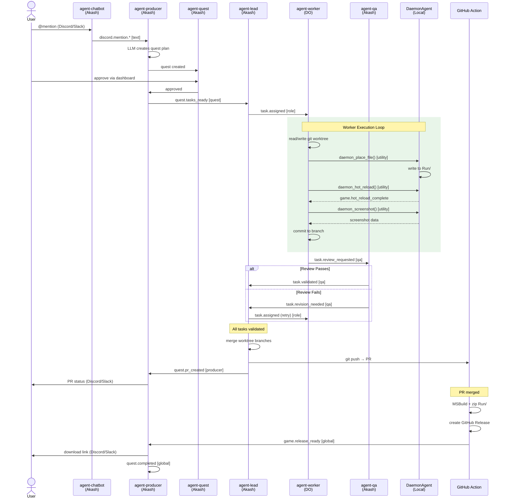
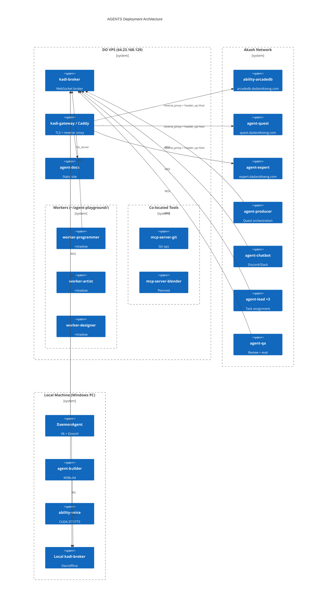

# Network Topology & Deployment Map

> Last updated: 2026-03-28
> Supersedes the M4 quick-reference version.
> Canonical architecture: `Docs/ARCHITECTURE_V2.md`

---

## 0. System Overview



---

## 1. Broker Topology

Two kadi-broker instances serve different purposes:

| Broker | URL | Location | Purpose |
|--------|-----|----------|---------|
| **Remote** | `wss://broker.dadavidtseng.com/kadi` | DO VPS | Production hub. All deployed agents (Akash, DO, local) connect here for cross-deployment communication. |
| **Local** | `ws://localhost:8080/kadi` | Developer machine | Development/testing. Low-latency local-to-local (e.g., agent-builder ↔ DaemonAgent). Offline-capable. |

**Dual-broker pattern**: agent-builder and DaemonAgent connect to **both** brokers:
- Local broker → fast `game.ready` loop (sub-ms latency, same machine)
- Remote broker → agent-worker on DO can invoke `rebuild_game` / `restart_game` tools

Most agents declare both in `agent.json`:
```json
{
  "brokers": {
    "default": "wss://broker.dadavidtseng.com/kadi",
    "local": "ws://localhost:8080/kadi"
  }
}
```



---

## 2. Deployment Targets

### 2.1 DO VPS (`64.23.168.129`)

Stable, always-on infrastructure and worker compute.

| Service | Subdomain | Type |
|---------|-----------|------|
| **kadi-broker** | `broker.dadavidtseng.com` | WebSocket broker |
| **kadi-gateway** (Caddy) | `*.dadavidtseng.com` | TLS + reverse proxy + static files |
| **agent-docs** (static) | `docs.dadavidtseng.com` | Caddy `file_server` (CI rsyncs `dist/`) |
| **agent-worker-programmer** | — | Connects to remote broker |
| **agent-worker-artist** | — | Connects to remote broker |
| **agent-worker-designer** | — | Connects to remote broker |
| **agent-shadow-worker** (×3) | — | Co-located with workers, watches git worktrees |
| **mcp-server-git** | — | Git operations for workers |
| **mcp-server-blender** | — | Headless Blender (planned) |

**Shared filesystem**: `~/agent-playground/`
```
~/agent-playground/
  programmer/   ← git worktree (DaemonAgent clone)
  artist/       ← git worktree (DaemonAgent clone)
  designer/     ← git worktree (DaemonAgent clone)
```

Workers need shared filesystem for `git show` cross-worktree collaboration.
Akash containers have isolated filesystems — no shared volumes between pods.

### 2.2 Akash Network

Compute workloads, frequently redeployed (iterating on agent logic).

| Service | Reverse Proxy via kadi-gateway? | Subdomain |
|---------|-------------------------------|-----------|
| **ability-arcadedb** | Yes | `arcadedb.dadavidtseng.com` |
| **agent-quest** (dashboard) | Yes | `quest.dadavidtseng.com` |
| **agent-expert** (web UI + LLM) | Yes | `expert.dadavidtseng.com` |
| **agent-producer** | No (broker-only) | — |
| **agent-chatbot** | No (broker + Discord/Slack APIs) | — |
| **agent-lead** (×3 roles) | No (broker-only, event-driven) | — |
| **agent-qa** | No (broker-only, event-driven) | — |

**Reverse proxy pattern** (for Akash services with web UIs):
```
kadi-gateway (Caddy on DO)
  → reverse_proxy http://<akash-ingress-url> {
      header_up Host <akash-ingress-url>
    }
```
Akash nginx ingress checks Host headers — `header_up Host` rewrites them so the ingress accepts traffic from custom domains.

### 2.3 Local Machine (Windows PC)

Hardware-bound services that need local GPU, MSBuild, or DirectX.

| Service | Connects to | Purpose |
|---------|-------------|---------|
| **DaemonAgent** (game engine) | Both brokers | V8 runtime, DirectX rendering, tool provider |
| **agent-builder** | Both brokers | MSBuild, game rebuild/restart/shutdown |
| **ability-voice** | Local broker | CUDA-accelerated Whisper STT + Piper TTS |
| **Local kadi-broker** | — | Dev/offline, low-latency local loop |

### 2.4 Native-Loaded Abilities (no standalone process)

These run inside their host agent's process via `client.loadNative()`:

| Ability | Tools | Loaded by |
|---------|-------|-----------|
| **ability-secret** | 26 | Every agent (vault/key management) |
| **ability-graph** | 16 | ability-docs-memory, ability-memory |
| **ability-search** | 8 | ability-docs-memory |
| **ability-docs-memory** | 4 | agent-docs, agent-expert |
| **ability-memory** | 7 | agent-worker, agent-lead, agent-producer, agent-qa |
| **ability-backup** | 5 | Scheduled tasks (invokes arcadedb tools via broker) |
| **ability-eval** | 9 | agent-qa (review scoring) |
| **ability-vision** | 5 | agent-qa (visual review) |
| **ability-file-local** | 8 | agent-worker (local filesystem ops) |
| **ability-file-remote** | 17 | agent-worker (SSH/SCP) |
| **ability-file-cloud** | 15 | agent-worker (Dropbox/GDrive) |
| **ability-tunnel** | 8 | agent-worker (expose local services) |
| **ability-deploy** | 10 | agent-builder (container management) |



---

## 3. Network Zones

| Zone | Networks | Purpose |
|------|----------|---------|
| Interaction | global, text, quest, producer | Human-facing interfaces |
| Distribution | artist, designer, programmer | Role-specific task assignment + execution |
| Validation | qa, eval, vision | QA validation and scoring |
| Infrastructure | git, deploy, file, infra | Shared services and operations |
| Perception | vision, voice | Sensory capabilities |
| Utility | utility | DaemonAgent + agent-builder tools |
| Maintenance | maintainer | Agent health monitoring |

```mermaid
graph TB
    subgraph INTERACTION["Interaction Zone"]
        direction LR
        N_GLOBAL[global]
        N_TEXT[text]
        N_QUEST[quest]
        N_PRODUCER[producer]
    end

    subgraph DISTRIBUTION["Distribution Zone"]
        direction LR
        N_ARTIST[artist]
        N_DESIGNER[designer]
        N_PROGRAMMER[programmer]
    end

    subgraph VALIDATION["Validation Zone"]
        direction LR
        N_QA[qa]
        N_EVAL[eval]
        N_VISION_NET[vision]
    end

    subgraph INFRA["Infrastructure Zone"]
        direction LR
        N_GIT[git]
        N_DEPLOY[deploy]
        N_FILE[file]
        N_INFRA[infra]
    end

    subgraph UTILITY_ZONE["Utility Zone"]
        N_UTILITY[utility]
    end

    AP[agent-producer] --> N_PRODUCER & N_QUEST & N_TEXT
    AC[agent-chatbot] --> N_TEXT
    AQ_DASH[agent-quest] --> N_QUEST & N_GLOBAL
    AL[agent-lead ×3] --> N_PRODUCER & N_QUEST & N_GIT & N_QA
    AL --> N_ARTIST & N_DESIGNER & N_PROGRAMMER
    WK[agent-worker ×3] --> N_GIT & N_QA & N_FILE & N_UTILITY
    WK --> N_ARTIST & N_DESIGNER & N_PROGRAMMER
    QA_AGENT[agent-qa] --> N_QA & N_EVAL & N_VISION_NET
    DA[DaemonAgent] --> N_UTILITY & N_GLOBAL
    AB_AGENT[agent-builder] --> N_UTILITY & N_DEPLOY & N_GIT

    style INTERACTION fill:#e8f5e9,stroke:#2e7d32
    style DISTRIBUTION fill:#e3f2fd,stroke:#1565c0
    style VALIDATION fill:#fff3e0,stroke:#e65100
    style INFRA fill:#f3e5f5,stroke:#6a1b9a
    style UTILITY_ZONE fill:#fce4ec,stroke:#c62828
```



---

## 4. Agent → Network Membership

| Agent | Location | Networks |
|-------|----------|----------|
| agent-producer | Akash | producer, quest, text, global |
| agent-chatbot | Akash | text |
| agent-quest | Akash | quest, global |
| agent-lead-artist | Akash | producer, artist, git, qa, quest, file, global |
| agent-lead-designer | Akash | producer, designer, git, qa, quest, file, global |
| agent-lead-programmer | Akash | producer, programmer, git, qa, deploy, quest, file, global |
| agent-worker-artist | DO | artist, git, qa, file, utility, quest, global |
| agent-worker-designer | DO | designer, git, qa, file, utility, quest, global |
| agent-worker-programmer | DO | programmer, git, qa, file, utility, quest, global |
| agent-shadow-worker (×3) | DO | global |
| agent-qa | Akash | qa, eval, vision |
| agent-builder | Local | utility, deploy, git, file |
| DaemonAgent | Local | utility, global |
| agent-docs | DO (static) | global |
| agent-expert | Akash | global |

---

## 5. Agent/Ability Tool Registry

### 5.1 Agents (tools registered on broker)

| Agent | Tools | Description |
|-------|-------|-------------|
| **agent-builder** | `shutdown_game`, `restart_game`, `rebuild_game` | MSBuild + DaemonAgent lifecycle |
| **agent-chatbot** | `discord_send_message`, `discord_send_reply`, `slack_send_message`, `slack_send_reply` | Platform messaging |
| **agent-docs** | `agents-docs-config`, `agents-docs-pipeline`, `agents-docs-readme-generate`, `agents-docs-readme-lint`, `agents-docs-search`, `agents-docs-page`, `agents-docs-reindex`, `agents-docs-index-status`, `agents-docs-status`, `agents-docs-sync`, `agents-docs-task-status` | Documentation pipeline |
| **agent-expert** | `ask-agents`, `show-example`, `explain-agent`, `write-tdd`, `getting-started` | AGENTS knowledge base |
| **agent-producer** | `echo`, `list_tools`, `quest_approve`, `quest_request_revision`, `quest_reject`, `task_approve`, `task_request_revision`, `task_reject`, `task_execution` | Quest orchestration |
| **DaemonAgent** | `daemon_create_script`, `daemon_modify_script`, `daemon_remove_script`, `daemon_place_asset`, `daemon_remove_asset`, `daemon_hot_reload`, `daemon_screenshot`, `daemon_status` | Game engine runtime (planned) |

### 5.2 Abilities (native-loaded tools)

| Ability | Tool Count | Key Tools |
|---------|-----------|-----------|
| **ability-arcadedb** | 17 | `arcade-query`, `arcade-command`, `arcade-batch`, `arcade-backup`, `arcade-restore` |
| **ability-graph** | 16 | `graph-store`, `graph-query`, `graph-recall`, `graph-context`, `graph-relate` |
| **ability-search** | 8 | `search-index`, `search-query`, `search-similar` |
| **ability-docs-memory** | 4 | `docs-search`, `docs-page`, `docs-reindex`, `docs-index-status` |
| **ability-memory** | 7 | `memory-store`, `memory-recall`, `memory-context`, `memory-forget`, `memory-relate` |
| **ability-eval** | 9 | `eval_code_diff`, `eval_test_results`, `eval_visual`, `eval_task_completion` |
| **ability-vision** | 5 | `vision_analyze`, `vision_ocr`, `vision_describe_ui`, `vision_compare` |
| **ability-secret** | 26 | `get`, `set`, `list`, `encrypt`, `decrypt`, `vault.fromJson`, `key.init` |
| **ability-file-local** | 8 | `list_files_and_folders`, `create_file`, `read_file`, `watch_folder` |
| **ability-file-remote** | 17 | `send_file_to_remote_server`, `create_tunnel`, `destroy_tunnel` |
| **ability-file-cloud** | 15 | `cloud_upload_file`, `cloud_download_file`, `cloud_search_files` |
| **ability-tunnel** | 8 | `tunnel_create`, `tunnel_destroy`, `tunnel_list`, `tunnel_status` |
| **ability-backup** | 5 | `backup-database`, `backup-list`, `backup-restore`, `backup-schedule` |
| **ability-voice** | 8 | `transcribe`, `synthesize`, `speak`, `start_listening` |
| **ability-deploy** | 10 | `deploy_to_akash`, `deploy_to_local`, `start_registry`, `list_containers` |

---

## 6. KADI Event Catalog

### 6.1 Quest Lifecycle Events

| Event | Publisher | Subscriber(s) | Network |
|-------|-----------|---------------|---------|
| `discord.mention.*` | agent-chatbot | agent-producer | text |
| `slack.app_mention.*` | agent-chatbot | agent-producer | text |
| `quest.tasks_ready` | agent-producer | agent-lead (×3) | quest |
| `task.assigned` | agent-lead | agent-worker (filtered by role) | programmer / artist / designer |
| `task.review_requested` | agent-worker | agent-qa | qa |
| `task.validated` | agent-qa | agent-lead | qa |
| `task.revision_needed` | agent-qa / agent-lead | agent-lead / agent-worker | qa |
| `task.failed` | agent-worker | agent-lead, agent-producer | quest |
| `task.rejected` | agent-worker | agent-producer | quest |
| `quest.cascade_needed` | agent-lead | agent-lead | quest |
| `quest.verification_complete` | agent-lead | agent-producer | producer |
| `quest.pr_created` | agent-lead | agent-producer | producer |
| `conflict.escalation` | agent-lead | agent-producer | producer |
| `quest.merged` | (GitHub webhook) | agent-lead, agent-producer | quest |
| `quest.pr_rejected` | (GitHub webhook) | agent-producer | quest |
| `quest.completed` | agent-producer | all (broadcast) | global |

### 6.2 DaemonAgent Events

| Event | Publisher | Subscriber(s) | Network |
|-------|-----------|---------------|---------|
| `game.ready` | DaemonAgent | agent-builder | utility |
| `game.hot_reload_complete` | DaemonAgent | agent-worker (caller) | utility |
| `game.release_ready` | GitHub Action (planned) | agent-producer | global |
| `backup.completed` | agent-shadow-worker | — | global |
| `backup.failed` | agent-shadow-worker | — | global |

### 6.3 Event → Network Routing Rules



- Quest lifecycle (`quest.*`) → network: **quest**
- Task assignment/failure (`task.assigned`, `task.failed`) → network: **role-specific** (artist/designer/programmer)
- QA events (`task.review_requested`, `task.validated`, `task.revision_needed`) → network: **qa**
- Handoff events (`quest.tasks_ready`, `quest.pr_created`, `quest.verification_complete`) → network: **producer**
- PR events (`pr.changes_requested`, `quest.pr_rejected`, `quest.merged`) → network: **quest**
- Completion (`quest.completed`) → network: **global**
- DaemonAgent tools/events → network: **utility**

---

## 7. Quest Workflow with DaemonAgent

### 7.1 Full Sequence



```
User @mentions bot (Discord/Slack)
  │
  ▼
agent-chatbot (Akash)
  ──publish──▶ discord.mention.* / slack.app_mention.*
              network: text
  ▼
agent-producer (Akash)
  ──subscribe──▶ creates quest plan (LLM)
  ▼
User approves via agent-quest dashboard (quest.dadavidtseng.com)
  ▼
agent-producer
  ──publish──▶ quest.tasks_ready
              network: quest
  ▼
agent-lead-{role} (Akash)
  ──subscribe──▶ splits tasks, assigns to workers
  ──publish──▶ task.assigned
              network: programmer / artist / designer
  ▼
agent-worker-{role} (DO)
  ──subscribe──▶ executes task via tool-calling loop
  │
  │  Worker execution loop:
  │  ┌──────────────────────────────────────────────────────┐
  │  │ a. Read existing code from git worktree (local disk) │
  │  │ b. Write new/modified code to worktree               │
  │  │ c. git show other workers' changes if needed         │
  │  │ d. If DaemonAgent task:                              │
  │  │    → invoke daemon_place_file(path, content)         │
  │  │    → invoke daemon_hot_reload()                      │
  │  │    → invoke daemon_screenshot() for visual check     │
  │  │    (DaemonAgent on local PC receives via broker)     │
  │  │ e. Commit to worktree branch                         │
  │  └──────────────────────────────────────────────────────┘
  │
  ──publish──▶ task.review_requested
              network: qa
  ▼
agent-qa (Akash)
  ──subscribe──▶ reviews (LLM + ability-eval + ability-vision)
  ├──publish──▶ task.validated    → agent-lead
  └──publish──▶ task.revision_needed → agent-lead → re-assign worker

  ▼ (all tasks validated)
agent-lead
  → merges worktree branches on DO
  → git push to GitHub remote
  ──publish──▶ quest.pr_created
              network: producer
  ▼
agent-producer → relays PR status to user (Discord/Slack)
  ▼ (PR merged)
quest.completed (network: global)
```

### 7.2 DaemonAgent Build & Release (Planned)

```
quest.completed
  ▼
GitHub Action (DaemonAgent repo, on push to main)
  → Windows runner: MSBuild DaemonAgent + Engine
  → zip Run/ folder
  → create GitHub Release (vX.Y.Z)
  → publish game.release_ready { url, version }
     (small script connects to remote broker)
  ▼
agent-producer ──subscribe──▶ game.release_ready
  → relays download link to user via Discord/Slack

Meanwhile on local PC:
  DaemonAgent does git pull → gets merged changes permanently
```

### 7.3 DaemonAgent Tool Provider

DaemonAgent registers tools on the remote broker, enabling remote workers to interact with the live game engine:

```
DaemonAgent (Local, Windows PC)
  ├── Connects to: wss://broker.dadavidtseng.com/kadi + ws://localhost:8080/kadi
  ├── Networks: utility, global
  ├── Tools:
  │   ├── daemon_create_script(path, content)   → writes to Run/Data/Scripts/
  │   ├── daemon_modify_script(path, content)   → modifies Run/Data/Scripts/
  │   ├── daemon_remove_script(path)            → deletes from Run/Data/Scripts/
  │   ├── daemon_place_asset(path, data)        → writes to Run/Data/Models|Textures|Audio/
  │   ├── daemon_remove_asset(path)             → deletes asset
  │   ├── daemon_hot_reload()                   → triggers V8 hot-reload
  │   ├── daemon_screenshot()                   → captures current frame
  │   └── daemon_status()                       → returns engine state
  └── Publishes: game.ready, game.hot_reload_complete
```

---

## 8. Deployment Diagram



---

## 9. Deployment Strategy Heuristics

| Heuristic | Target | Examples |
|-----------|--------|---------|
| Stable, always-on, shared filesystem | DO VPS | workers, broker, gateway, docs |
| Compute-heavy, frequently redeployed | Akash | producer, lead, qa, expert |
| Hardware-bound (GPU, MSBuild, DirectX) | Local | DaemonAgent, agent-builder, ability-voice |
| No standalone process | Native-loaded | ability-secret, ability-graph, ability-eval, etc. |

Once Akash agents stabilize, they can migrate to DO for lower latency and simpler ops.

---

## 10. Resource Estimates (DO VPS, 4GB / 60GB)

| Process | RAM (est.) |
|---------|-----------|
| kadi-broker | ~80 MB |
| Caddy | ~30 MB |
| agent-worker ×3 | ~150 MB each = 450 MB |
| agent-shadow-worker ×3 | ~50 MB each = 150 MB |
| mcp-server-git | ~50 MB |
| OS + misc | ~500 MB |
| **Total** | **~1.3 GB** |

DaemonAgent repo clone (3 worktrees): ~500 MB–1 GB disk. 60 GB disk is sufficient.
4 GB RAM provides ~2.7 GB headroom. Monitor if workers buffer large LLM responses.

---

## 11. DNS & Reverse Proxy

Wildcard DNS: `*.dadavidtseng.com → 64.23.168.129` (Gandi)

| Subdomain | Target | Caddy Config |
|-----------|--------|-------------|
| `broker.dadavidtseng.com` | kadi-broker (Docker, kadi-net) | `reverse_proxy kadi-broker:8080` |
| `rabbit.dadavidtseng.com` | RabbitMQ (Docker, kadi-net) | `reverse_proxy kadi-rabbit:15672` |
| `docs.dadavidtseng.com` | Static files (`/srv/docs`) | `file_server` + `encode gzip` |
| `arcadedb.dadavidtseng.com` | Akash ingress | `reverse_proxy` + `header_up Host` |
| `quest.dadavidtseng.com` | Akash ingress (planned) | `reverse_proxy` + `header_up Host` |
| `expert.dadavidtseng.com` | Akash ingress (planned) | `reverse_proxy` + `header_up Host` |

Caddy auto-provisions HTTPS via Let's Encrypt for all subdomains.
