# KADI Architecture: Tools, Abilities, Agents, and Integration

> **Comprehensive guide to understanding KADI Broker's architectural concepts and component relationships**

Last Updated: 2025-11-25

---

## Table of Contents

1. [Core Definitions](#core-definitions)
2. [Conceptual Hierarchy](#conceptual-hierarchy)
3. [Component Relationships](#component-relationships)
4. [KADI Broker's Role](#kadi-brokers-role)
5. [Protocol Translation](#protocol-translation)
6. [Real-World Examples](#real-world-examples)
7. [Complete System Flow](#complete-system-flow)

---

## Core Definitions

### 1. **Tool** 🔧
**Definition:** A simple, standalone endpoint with no flexibility or intelligence.

**Characteristics:**
- ✅ **Stateless** - No memory between invocations
- ✅ **Single-purpose** - Does one thing only
- ✅ **No logic** - Minimal to no decision-making
- ✅ **Direct execution** - Input → Process → Output

**Examples:**
- `get_current_time()` - Returns current timestamp
- `read_file(path)` - Reads file content
- `http_get(url)` - Makes HTTP GET request
- `calculate_sum(a, b)` - Returns a + b

```typescript
// Example: Simple Tool
function getCurrentTime(): string {
  return new Date().toISOString();
}
```

**Think of it as:** A single function call, like a REST API endpoint

---

### 2. **Ability** 🧠
**Definition:** Intelligent wrapper around tools that stays inside a bigger application.

**Characteristics:**
- ✅ **Wraps tools** - Composes multiple tools together
- ✅ **Contains logic** - Decision-making and conditional flows
- ✅ **Context-aware** - Uses state and history
- ✅ **Part of application** - Not standalone, embedded in larger system

**Examples:**
- `analyze_codebase()` - Uses `read_file`, `search_pattern`, `count_lines` tools with logic
- `git_smart_commit()` - Uses `git_status`, `git_add`, `git_commit` with validation logic
- `format_and_validate()` - Uses `format_text`, `validate_json` with error handling

```typescript
// Example: Ability wrapping tools
async function analyzeCodebase(repoPath: string) {
  // Intelligence: Multi-step workflow
  const files = await listFiles(repoPath);        // Tool 1
  const jsFiles = files.filter(f => f.endsWith('.js')); // Logic

  let totalLines = 0;
  for (const file of jsFiles) {
    const content = await readFile(file);         // Tool 2
    totalLines += content.split('\n').length;     // Logic
  }

  // Intelligence: Decision making
  if (totalLines > 10000) {
    return { size: 'large', recommendation: 'Consider splitting' };
  }
  return { size: 'small', recommendation: 'Good size' };
}
```

**Think of it as:** A smart function that orchestrates multiple tools with business logic

---

### 3. **Agent** 🤖
**Definition:** A standalone application that wraps abilities and tools, can communicate with other agents.

**Characteristics:**
- ✅ **Standalone process** - Runs independently
- ✅ **Wraps abilities** - Contains multiple abilities
- ✅ **Network-capable** - Communicates with broker and other agents
- ✅ **Autonomous** - Can operate without constant supervision
- ✅ **Stateful** - Maintains session and context

**Examples:**
- `slack-notification-agent` - Standalone app with abilities to send/receive Slack messages
- `git-automation-agent` - Standalone app with abilities to manage git workflows
- `text-processing-agent` - Standalone app with abilities to format, validate, transform text

```typescript
// Example: Agent structure
class TextProcessingAgent {
  // Agent wraps multiple abilities
  abilities = {
    formatText: this.formatTextAbility,
    validateJson: this.validateJsonAbility,
    analyzeText: this.analyzeTextAbility
  };

  // Each ability wraps tools
  async formatTextAbility(text: string, style: string) {
    // Uses tools: toUpperCase, toLowerCase, trim
    const trimmed = this.trimTool(text);
    switch(style) {
      case 'upper': return this.toUpperCaseTool(trimmed);
      case 'lower': return this.toLowerCaseTool(trimmed);
    }
  }

  // Agent communicates via broker
  async connectToBroker(brokerUrl: string) {
    // Register all abilities with broker
    // Listen for tool invocation requests
  }
}
```

**Think of it as:** A microservice or standalone application in your system

---

### 4. **KADI Broker** 🌐
**Definition:** The central hub that federates tools/abilities from multiple agents and MCP servers.

**Characteristics:**
- ✅ **Service mesh** - Routes messages between agents
- ✅ **Tool registry** - Maintains unified catalog of all tools/abilities
- ✅ **Protocol translator** - Bridges KADI and MCP protocols
- ✅ **Network isolation** - Provides multi-tenancy
- ✅ **Discovery service** - Enables dynamic tool discovery

**Think of it as:** API Gateway + Service Mesh for AI agents

---

### 5. **MCP Server** 📡
**Definition:** External tool provider following Model Context Protocol standard.

**Characteristics:**
- ✅ **Standard protocol** - Implements MCP specification
- ✅ **Tool provider** - Exposes tools via `tools/list` and `tools/call`
- ✅ **Stateless** - No session management (broker handles this)
- ✅ **Spawned by broker** - Lifecycle managed by KADI Broker

**Examples:**
- `@modelcontextprotocol/server-github` - GitHub API tools
- `mcp-server-slack` - Slack messaging tools
- `mcp-server-filesystem` - File system operations

**Think of it as:** Third-party service that speaks MCP protocol

---

### 6. **MCP Client** 💻
**Definition:** Application that consumes tools via Model Context Protocol.

**Characteristics:**
- ✅ **Tool consumer** - Invokes tools, doesn't provide them
- ✅ **MCP protocol** - Sends `tools/call` requests
- ✅ **LLM-powered** - Usually backed by AI models (Claude, GPT)

**Examples:**
- **Claude Desktop** - Anthropic's official app
- **Cursor** - AI code editor
- Custom applications using MCP SDK

**Think of it as:** The "frontend" or client application using AI capabilities

---

## Conceptual Hierarchy

```mermaid
graph TD
    A[Tool 🔧] -->|"wrapped by"| B[Ability 🧠]
    B -->|"wrapped by"| C[Agent 🤖]
    C -->|"registers with"| D[KADI Broker 🌐]

    E[MCP Server 📡] -->|"provides tools to"| D
    D -->|"exposes unified tools to"| F[MCP Client 💻]

    style A fill:#e3f2fd
    style B fill:#fff3e0
    style C fill:#f3e5f5
    style D fill:#c8e6c9
    style E fill:#ffebee
    style F fill:#fce4ec

    classDef toolClass fill:#e3f2fd,stroke:#1976d2,stroke-width:2px
    classDef abilityClass fill:#fff3e0,stroke:#f57c00,stroke-width:2px
    classDef agentClass fill:#f3e5f5,stroke:#7b1fa2,stroke-width:2px

    class A toolClass
    class B abilityClass
    class C agentClass
```

### Hierarchy Explanation

1. **Bottom Layer: Tools** 🔧
   - Simplest building blocks
   - Pure functions, no intelligence
   - Example: `getCurrentTime()`, `readFile()`

2. **Middle Layer: Abilities** 🧠
   - Compose multiple tools
   - Add business logic and intelligence
   - Example: `smartCommit()` uses git tools + validation logic

3. **Top Layer: Agents** 🤖
   - Standalone applications
   - Package multiple abilities
   - Communicate via network
   - Example: `git-automation-agent` exposes git abilities

4. **Infrastructure: KADI Broker** 🌐
   - Federates all agents and MCP servers
   - Provides unified tool registry
   - Handles routing and discovery

---

## Component Relationships

### Relationship Diagram

```mermaid
graph TB
    subgraph "MCP Ecosystem"
        MC[MCP Client<br/>Claude Desktop]
        MS1[MCP Server<br/>GitHub]
        MS2[MCP Server<br/>Slack]
    end

    subgraph "KADI Broker Layer"
        KB[KADI Broker<br/>Tool Registry & Router]
        TR[Tool Registry]
        NR[Network Router]
        PT[Protocol Translator]
    end

    subgraph "KADI Agent Ecosystem"
        A1[Agent: Git Automation<br/>🤖 Standalone App]
        A2[Agent: Text Processing<br/>🤖 Standalone App]

        subgraph "Agent 1 Internals"
            AB1[Ability: Smart Commit<br/>🧠 Intelligent Wrapper]
            AB2[Ability: Auto PR<br/>🧠 Intelligent Wrapper]
            T1[Tool: git_status<br/>🔧 Simple Function]
            T2[Tool: git_commit<br/>🔧 Simple Function]
            T3[Tool: git_push<br/>🔧 Simple Function]
        end

        subgraph "Agent 2 Internals"
            AB3[Ability: Format & Validate<br/>🧠 Intelligent Wrapper]
            T4[Tool: format_text<br/>🔧 Simple Function]
            T5[Tool: validate_json<br/>🔧 Simple Function]
        end
    end

    MC -->|MCP Protocol| KB
    MS1 -->|stdio/tools| KB
    MS2 -->|stdio/tools| KB

    KB --> TR
    KB --> NR
    KB --> PT

    A1 -->|KADI Protocol| KB
    A2 -->|KADI Protocol| KB

    AB1 --> T1
    AB1 --> T2
    AB2 --> T2
    AB2 --> T3
    AB3 --> T4
    AB3 --> T5

    A1 -.wraps.- AB1
    A1 -.wraps.- AB2
    A2 -.wraps.- AB3

    style MC fill:#fce4ec
    style MS1 fill:#ffebee
    style MS2 fill:#ffebee
    style KB fill:#c8e6c9
    style A1 fill:#f3e5f5
    style A2 fill:#f3e5f5
    style AB1 fill:#fff3e0
    style AB2 fill:#fff3e0
    style AB3 fill:#fff3e0
    style T1 fill:#e3f2fd
    style T2 fill:#e3f2fd
    style T3 fill:#e3f2fd
    style T4 fill:#e3f2fd
    style T5 fill:#e3f2fd
```

---

## KADI Broker's Role

### 1. Tool Federation

The broker creates a **unified tool registry** from multiple sources:

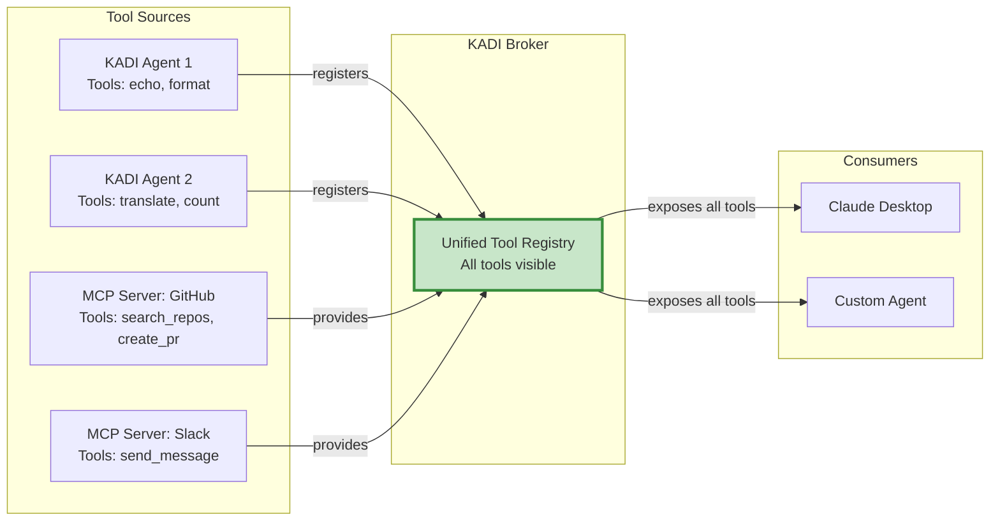

**Without Broker:**
- Claude Desktop can only connect to ONE MCP server at a time
- Agents can't discover each other's tools
- No cross-protocol communication

**With Broker:**
- ✅ All tools visible in one place
- ✅ Cross-agent communication
- ✅ KADI agents can call MCP tools and vice versa

---

### 2. Protocol Translation

The broker translates between **KADI Protocol** and **MCP Protocol**:

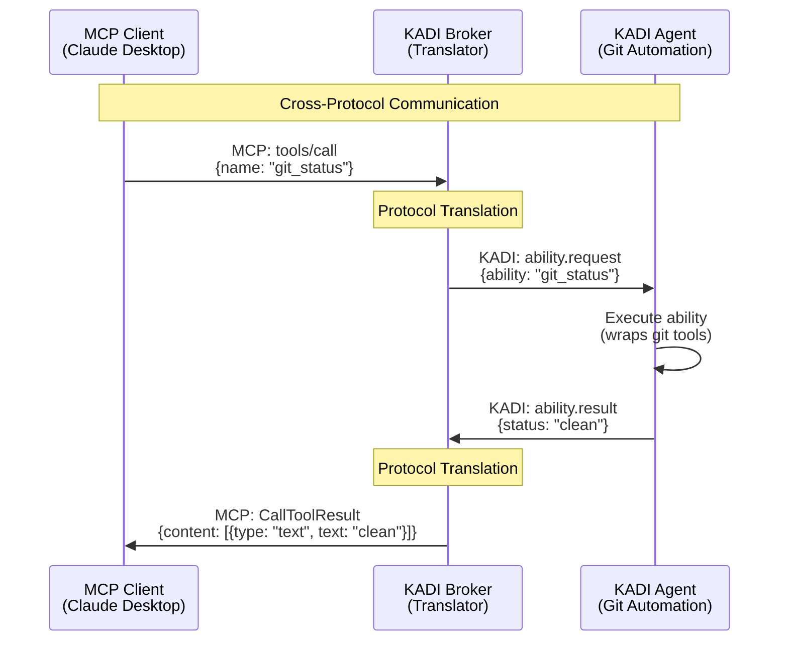

**Protocol Mapping:**

| KADI Protocol | MCP Protocol | Purpose |
|---------------|--------------|---------|
| `ability.request` | `tools/call` | Invoke a function |
| `ability.result` | `CallToolResult` | Return result |
| `ability.list` | `tools/list` | Discover functions |
| `session.hello` | `initialize` | Start session |

---

### 3. Network Isolation

The broker provides **logical networks** for multi-tenancy:

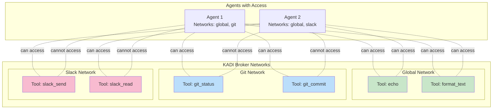

**Benefits:**
- 🔒 **Security:** Isolate sensitive tools (production vs dev)
- 👥 **Multi-tenancy:** Different teams see different tools
- 🎯 **Focus:** Reduce tool clutter, only see relevant tools

---

## Protocol Translation

### KADI Protocol → MCP Protocol

```mermaid
sequenceDiagram
    participant KA as KADI Agent<br/>(Provides Ability)
    participant KB as KADI Broker<br/>(Translator)
    participant MC as MCP Client<br/>(Claude Desktop)

    Note over KA,MC: Agent registers ability → Exposed as MCP tool

    KA->>KB: KADI: agent.register<br/>{<br/>  abilities: [{<br/>    name: "git_status",<br/>    input: ZodSchema,<br/>    output: ZodSchema<br/>  }]<br/>}

    KB->>KB: Store in Tool Registry<br/>Convert Zod → JSON Schema

    MC->>KB: MCP: tools/list
    KB->>MC: MCP: ListToolsResult<br/>{<br/>  tools: [{<br/>    name: "git_status",<br/>    description: "...",<br/>    inputSchema: JSONSchema<br/>  }]<br/>}

    MC->>KB: MCP: tools/call<br/>{name: "git_status", args: {...}}
    KB->>KA: KADI: ability.request<br/>{ability: "git_status", params: {...}}

    KA->>KB: KADI: ability.result<br/>{result: {...}}
    KB->>MC: MCP: CallToolResult<br/>{content: [text: "..."]}
```

---

### MCP Protocol → KADI Protocol

```mermaid
sequenceDiagram
    participant MS as MCP Server<br/>(GitHub)
    participant KB as KADI Broker<br/>(Translator)
    participant KA as KADI Agent<br/>(Custom Agent)

    Note over MS,KA: MCP upstream → Available as KADI ability

    KB->>MS: MCP: initialize
    MS->>KB: MCP: InitializeResult

    KB->>MS: MCP: tools/list
    MS->>KB: MCP: ListToolsResult<br/>{<br/>  tools: [{<br/>    name: "search_repositories",<br/>    inputSchema: {...}<br/>  }]<br/>}

    KB->>KB: Register with prefix<br/>"gh_search_repositories"<br/>in Tool Registry

    KA->>KB: KADI: ability.list
    KB->>KA: KADI: ability.list.result<br/>{<br/>  abilities: [{<br/>    name: "gh_search_repositories",<br/>    ...<br/>  }]<br/>}

    KA->>KB: KADI: ability.request<br/>{ability: "gh_search_repositories"}
    KB->>MS: MCP: tools/call<br/>{name: "search_repositories"}

    MS->>KB: MCP: CallToolResult
    KB->>KA: KADI: ability.result
```

---

## Real-World Examples

### Example 1: Git Automation Agent

```mermaid
graph TB
    subgraph "Git Automation Agent 🤖"
        A[Agent Process<br/>Standalone Application]

        subgraph "Abilities 🧠"
            AB1[Smart Commit Ability<br/>Intelligence: Validates changes,<br/>generates commit messages]
            AB2[Auto PR Ability<br/>Intelligence: Creates PR with<br/>summary, links issues]
        end

        subgraph "Tools 🔧"
            T1[git_status Tool<br/>Returns: file status]
            T2[git_diff Tool<br/>Returns: diff text]
            T3[git_commit Tool<br/>Action: commits files]
            T4[git_push Tool<br/>Action: pushes to remote]
        end
    end

    A -.wraps.- AB1
    A -.wraps.- AB2

    AB1 -->|uses| T1
    AB1 -->|uses| T2
    AB1 -->|uses| T3

    AB2 -->|uses| T1
    AB2 -->|uses| T2
    AB2 -->|uses| T3
    AB2 -->|uses| T4

    style A fill:#f3e5f5,stroke:#7b1fa2,stroke-width:3px
    style AB1 fill:#fff3e0,stroke:#f57c00,stroke-width:2px
    style AB2 fill:#fff3e0,stroke:#f57c00,stroke-width:2px
    style T1 fill:#e3f2fd,stroke:#1976d2
    style T2 fill:#e3f2fd,stroke:#1976d2
    style T3 fill:#e3f2fd,stroke:#1976d2
    style T4 fill:#e3f2fd,stroke:#1976d2
```

**Code Structure:**

```typescript
// AGENT: Standalone application
class GitAutomationAgent {
  private broker: KadiClient;

  async connect() {
    this.broker = new KadiClient({
      name: 'git-automation-agent',
      networks: ['global', 'git']
    });

    // Register abilities with broker
    this.registerAbilities();
  }

  // ABILITY: Intelligent wrapper around tools
  async smartCommitAbility(params: { repoPath: string }) {
    // Step 1: Use TOOL to get status
    const status = await this.gitStatusTool(params.repoPath);

    // INTELLIGENCE: Decision making
    if (status.files.length === 0) {
      throw new Error('No changes to commit');
    }

    // Step 2: Use TOOL to get diff
    const diff = await this.gitDiffTool(params.repoPath);

    // INTELLIGENCE: Generate commit message
    const message = this.generateCommitMessage(diff);

    // Step 3: Use TOOL to commit
    const result = await this.gitCommitTool({
      repoPath: params.repoPath,
      message: message
    });

    return result;
  }

  // TOOL: Simple, standalone function
  private async gitStatusTool(repoPath: string): Promise<GitStatus> {
    // Just returns status, no intelligence
    return execGitCommand('git status --porcelain', repoPath);
  }

  // TOOL: Simple, standalone function
  private async gitCommitTool(params: {
    repoPath: string;
    message: string;
  }): Promise<void> {
    // Just commits, no intelligence
    return execGitCommand(`git commit -m "${params.message}"`, params.repoPath);
  }
}
```

---

### Example 2: Slack Notification System

```mermaid
graph TB
    subgraph "Components"
        MC[MCP Client<br/>Slack Event Listener<br/>🔧 Simple tool: reads mentions]
        KB[KADI Broker<br/>🌐 Routes messages]
        A[KADI Agent<br/>🤖 Processes with Claude API]
        MS[MCP Server<br/>Slack Message Sender<br/>🔧 Simple tool: sends messages]
    end

    subgraph "Flow"
        S1[1. User @mentions bot in Slack]
        S2[2. MCP Client queues mention]
        S3[3. Agent polls for mentions]
        S4[4. Agent processes with Claude]
        S5[5. Agent sends reply via MCP Server]
    end

    S1 -->|Socket Mode| MC
    MC -->|get_slack_mentions tool| KB
    KB --> A
    A -->|🧠 Ability: process_mention<br/>Intelligence: Claude API call| A
    A -->|slack_send_message tool| KB
    KB --> MS
    MS -->|Web API| S5

    style MC fill:#ffebee
    style KB fill:#c8e6c9
    style A fill:#f3e5f5
    style MS fill:#ffebee
```

**Component Breakdown:**

| Component | Type | What it Does | Intelligence Level |
|-----------|------|--------------|-------------------|
| `mcp-client-slack` | Tool 🔧 | Reads @mentions from Slack | None - just queues events |
| `KADI Broker` | Infrastructure 🌐 | Routes tool calls | None - just routing |
| `Agent_TypeScript` | Agent 🤖 | Wraps ability to process mentions | Contains main logic |
| `process_mention` ability | Ability 🧠 | Calls Claude API, formats response | High - AI-powered |
| `mcp-server-slack` | Tool 🔧 | Sends message to Slack | None - just API call |

---

### Example 3: Complete Development Workflow

```mermaid
sequenceDiagram
    participant User as User<br/>(Claude Desktop)
    participant Broker as KADI Broker
    participant Git as Git Agent<br/>🤖 Abilities
    participant Slack as Slack MCP Server<br/>🔧 Tools
    participant GH as GitHub MCP Server<br/>🔧 Tools

    Note over User,GH: User: "Commit my changes and notify the team"

    User->>Broker: tools/call: git_smart_commit<br/>(MCP Protocol)
    Broker->>Git: ability.request: git_smart_commit<br/>(KADI Protocol)

    Note over Git: Ability Intelligence:
    Git->>Git: 🔧 Tool: git_status
    Git->>Git: 🔧 Tool: git_diff
    Git->>Git: 🧠 Generate commit message
    Git->>Git: 🔧 Tool: git_commit
    Git->>Git: 🔧 Tool: git_push

    Git->>Broker: ability.result: Success
    Broker->>User: CallToolResult: Committed

    User->>Broker: tools/call: gh_create_pull_request
    Broker->>GH: tools/call: create_pull_request<br/>(MCP Protocol)
    GH->>Broker: CallToolResult: PR #123 created
    Broker->>User: CallToolResult: PR created

    User->>Broker: tools/call: slack_send_message
    Broker->>Slack: tools/call: send_message<br/>(MCP Protocol)
    Slack->>Broker: CallToolResult: Message sent
    Broker->>User: CallToolResult: Team notified

    rect rgb(200, 230, 201)
        Note over User,GH: One unified interface,<br/>multiple backends working together
    end
```

---

## Complete System Flow

### Architecture Overview

```mermaid
graph TB
    subgraph "Client Layer"
        U1[Claude Desktop<br/>MCP Client 💻]
        U2[Cursor IDE<br/>MCP Client 💻]
        U3[Custom App<br/>MCP Client 💻]
    end

    subgraph "KADI Broker Layer 🌐"
        KB[KADI Broker<br/>Central Hub]

        subgraph "Broker Components"
            TR[Tool Registry<br/>Unified Catalog]
            PT[Protocol Translator<br/>KADI ↔ MCP]
            NR[Network Router<br/>Access Control]
            IM[Invocation Manager<br/>Request Routing]
        end
    end

    subgraph "KADI Agent Layer"
        A1[Git Agent 🤖<br/>Standalone App]
        A2[Text Agent 🤖<br/>Standalone App]
        A3[Custom Agent 🤖<br/>Standalone App]

        subgraph "Agent 1 Structure"
            A1B1[Smart Commit 🧠<br/>Ability]
            A1B2[Auto PR 🧠<br/>Ability]
            A1T1[git_status 🔧<br/>Tool]
            A1T2[git_commit 🔧<br/>Tool]
        end
    end

    subgraph "MCP Server Layer"
        M1[GitHub MCP 📡<br/>search_repos 🔧]
        M2[Slack MCP 📡<br/>send_message 🔧]
        M3[Filesystem MCP 📡<br/>read_file 🔧]
    end

    U1 -->|MCP Protocol| KB
    U2 -->|MCP Protocol| KB
    U3 -->|MCP Protocol| KB

    KB --> TR
    KB --> PT
    KB --> NR
    KB --> IM

    A1 -->|KADI Protocol| KB
    A2 -->|KADI Protocol| KB
    A3 -->|KADI Protocol| KB

    M1 -->|stdio/HTTP| KB
    M2 -->|stdio/HTTP| KB
    M3 -->|stdio/HTTP| KB

    A1B1 --> A1T1
    A1B1 --> A1T2
    A1B2 --> A1T1

    style KB fill:#c8e6c9,stroke:#388e3c,stroke-width:4px
    style TR fill:#a5d6a7
    style PT fill:#a5d6a7
    style NR fill:#a5d6a7
    style IM fill:#a5d6a7

    style A1 fill:#f3e5f5,stroke:#7b1fa2,stroke-width:2px
    style A2 fill:#f3e5f5,stroke:#7b1fa2,stroke-width:2px
    style A3 fill:#f3e5f5,stroke:#7b1fa2,stroke-width:2px

    style A1B1 fill:#fff3e0,stroke:#f57c00,stroke-width:2px
    style A1B2 fill:#fff3e0,stroke:#f57c00,stroke-width:2px

    style A1T1 fill:#e3f2fd,stroke:#1976d2
    style A1T2 fill:#e3f2fd,stroke:#1976d2
```

---

## Summary Table

| Concept | Layer | Complexity | Intelligence | Example |
|---------|-------|------------|--------------|---------|
| **Tool** 🔧 | Foundation | Simple | None | `getCurrentTime()`, `readFile()` |
| **Ability** 🧠 | Business Logic | Medium | High | `smartCommit()`, `analyzeCode()` |
| **Agent** 🤖 | Application | Complex | Orchestration | `git-automation-agent` |
| **KADI Broker** 🌐 | Infrastructure | Very Complex | Routing only | Central hub |
| **MCP Server** 📡 | External | Simple | None | GitHub, Slack servers |
| **MCP Client** 💻 | Consumer | Medium | AI-powered | Claude Desktop |

---

## Key Takeaways

1. **Tool → Ability → Agent** is a natural progression from simple to complex
2. **KADI Broker** federates everything into one unified system
3. **MCP Servers** provide external tools following MCP standard
4. **MCP Clients** (like Claude Desktop) consume tools via MCP protocol
5. **Protocol translation** enables KADI agents and MCP components to work together seamlessly

---

## Next Steps

- Read `kadi-broker/CLAUDE.md` for broker implementation details
- Read `template-agent-typescript/README.md` for agent development
- Explore `mcp-server-slack/` and `mcp-client-slack/` for MCP integration examples

---

**Document Version:** 1.0
**Last Updated:** 2025-11-25
**Maintained By:** KADI Project Team
