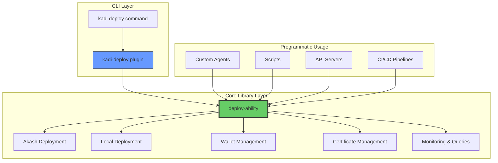
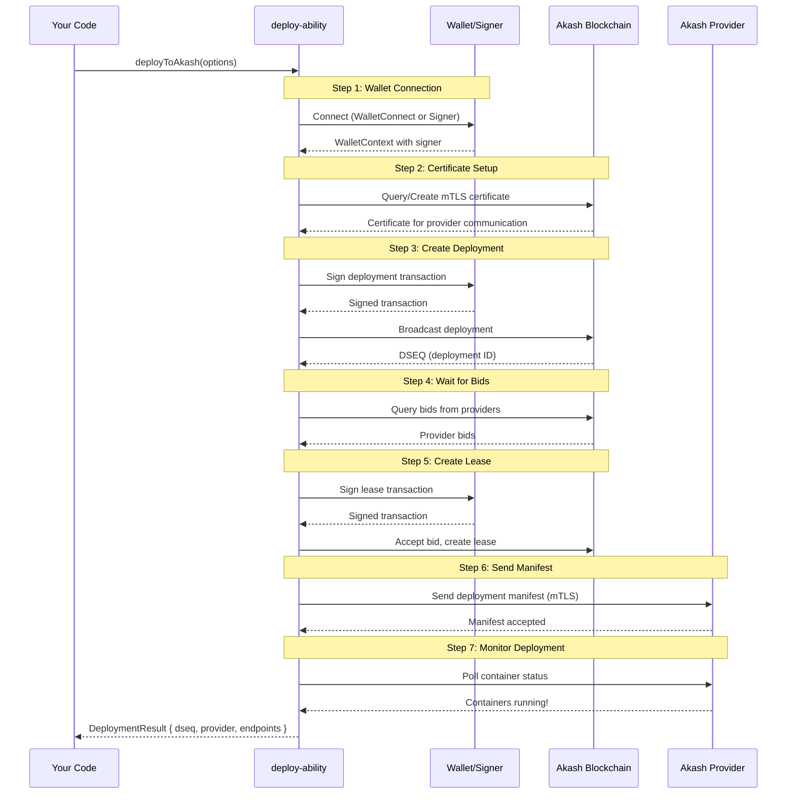

# deploy-ability

> **Programmatic deployment library for KADI** - Deploy applications to Akash Network, local Docker, or other platforms with a delightful TypeScript API

[](https://www.typescriptlang.org/)
[](https://www.typescriptlang.org/)
[](LICENSE)

---

## Why deploy-ability?

`deploy-ability` extracts the core deployment logic from `kadi-deploy` into a **pure TypeScript library** with zero CLI dependencies. This enables:

**Programmatic Deployments** - Use from Node.js, APIs, agents, anywhere
**Type-Safe** - Complete TypeScript support with zero `any` types
**Delightful API** - Simple for common tasks, powerful for advanced use cases
**Flexible Wallet Support** - Human approval (WalletConnect) or autonomous signing (agents)
**Well-Documented** - Comprehensive JSDoc with IntelliSense
**Production-Ready** - Handles Akash Network complexity elegantly

### Before: kadi-deploy (CLI Only)

```bash
# Can only deploy via CLI
kadi deploy --profile production
```

### After: deploy-ability (Programmatic!)

```typescript
import { deployToAkash } from 'deploy-ability';

// Deploy from your code!
const result = await deployToAkash({
  projectRoot: process.cwd(),
  profile: 'production',
  network: 'mainnet'
});

console.log(`Deployed! DSEQ: ${result.dseq}`);
```

---

## Architecture

### The Big Picture



**Key Benefits:**
- **Single Source of Truth** - One library, many entry points
- **Pluggable** - CLI, programmatic, or custom integrations
- **Reusable** - Share deployment logic across your entire stack
- **Testable** - Core logic independent of CLI

### Deployment Flow (Akash Network)



---

## Installation

```bash
npm install deploy-ability
```

**Requirements:**
- Node.js >= 18
- TypeScript >= 5.0 (optional, but recommended)

---

## Quick Start

### Deploy to Akash Network

```typescript
import { deployToAkash } from 'deploy-ability';

const result = await deployToAkash({
  projectRoot: process.cwd(),
  profile: 'production',
  network: 'mainnet'
});

if (result.success) {
  console.log(`Deployed! DSEQ: ${result.data.dseq}`);
  console.log(`Provider: ${result.data.providerUri}`);
  console.log(`Endpoints:`, result.data.endpoints);
}
```

### Deploy to Local Docker

```typescript
import { deployToLocal } from 'deploy-ability';

const result = await deployToLocal({
  projectRoot: process.cwd(),
  profile: 'local-dev',
  engine: 'docker'
});

if (result.success) {
  console.log('Deployed locally!');
  console.log('Services:', result.data.services);
}
```

---

## Core Concepts

### Storage Configuration

Understand the difference between **memory** (RAM), **ephemeralStorage** (temporary disk), and **persistentVolumes** (permanent disk) when configuring your deployments.

**Quick summary:**
- **memory**: Application runtime RAM (cleared on crash)
- **ephemeralStorage**: Container root filesystem (cleared on restart)
- **persistentVolumes**: Data that survives restarts (databases, uploads, models)

**[Read the full Storage Configuration Guide →](docs/STORAGE.md)**

---

### Placement Attributes

Control **where** your deployment runs geographically using placement attributes like region, datacenter type, timezone, and country.

**Common use cases:**
- Data residency (GDPR compliance)
- Latency optimization (deploy close to users)
- Infrastructure quality (datacenter vs home providers)

**[Read the full Placement Attributes Guide →](docs/PLACEMENT.md)**

---

### Understanding Signers

A **signer** is an interface that can sign blockchain transactions **without exposing private keys**. Think of it as a secure API to your wallet.

**Two wallet patterns:**

**1. Human Approval (WalletConnect)** - User scans QR code and approves each transaction
**2. Autonomous Signing (Agents)** - Agent has signer and signs automatically

```typescript
// Signer interface (simplified)
interface OfflineSigner {
  getAccounts(): Promise<Account[]>;
  signDirect(address: string, signDoc: SignDoc): Promise<Signature>;
}
```

**Why "Offline"?** The term "OfflineSigner" from Cosmos means the private keys stay in the wallet (hardware or software) and never travel over the network. It can sign "offline" without broadcasting.

---

## Basic Usage

### Human Users (WalletConnect)

For applications where users approve deployments from their mobile Keplr wallet:

```typescript
import { connectWallet, deployToAkash } from 'deploy-ability';
import QRCode from 'qrcode-terminal';

// Step 1: Connect wallet via WalletConnect
const walletResult = await connectWallet(
  'your-walletconnect-project-id',
  'mainnet',
  {
    onUriGenerated: (uri) => {
      QRCode.generate(uri, { small: true });
      console.log('Scan this QR code with Keplr mobile');
    },
    timeoutMs: 120000 // 2 minutes
  }
);

if (!walletResult.success) {
  console.error('Connection failed:', walletResult.error.message);
  process.exit(1);
}

// Step 2: Deploy (user approves each transaction on their phone)
const result = await deployToAkash({
  wallet: walletResult.data,
  projectRoot: './my-app',
  profile: 'production',
  network: 'mainnet'
});

if (result.success) {
  console.log(`Deployed! DSEQ: ${result.data.dseq}`);
}
```

---

### Agent-Controlled Wallets

For autonomous agents that deploy without human interaction:

```typescript
import { createWalletContextFromSigner, deployToAkash } from 'deploy-ability';
import { DirectSecp256k1HdWallet } from '@cosmjs/proto-signing';

class SelfDeployingAgent {
  private signer: OfflineSigner;

  async initialize() {
    // Agent loads its OWN mnemonic from encrypted storage
    const mnemonic = await this.secrets.getEncryptedMnemonic();

    // Create signer from mnemonic
    this.signer = await DirectSecp256k1HdWallet.fromMnemonic(mnemonic, {
      prefix: 'akash'
    });
  }

  async deploySelf() {
    // Create wallet context from agent's signer
    const walletResult = await createWalletContextFromSigner(
      this.signer,
      'mainnet'
    );

    if (!walletResult.success) {
      throw new Error(`Wallet setup failed: ${walletResult.error.message}`);
    }

    // Deploy autonomously (no human approval needed!)
    const result = await deployToAkash({
      wallet: walletResult.data,
      projectRoot: __dirname,
      profile: 'production',
      network: 'mainnet'
    });

    if (result.success) {
      console.log(`Self-deployed! DSEQ: ${result.data.dseq}`);
    }
  }
}
```

**Security Warning:** Only use your OWN mnemonic for agent wallets! Never give your mnemonic to third-party agents.

---

## Error Handling

deploy-ability uses a **Result type pattern** for predictable error handling:

```typescript
type Result<T, E> =
  | { success: true; data: T }
  | { success: false; error: E };
```

### Pattern 1: Check Success

```typescript
const result = await deployToAkash(options);

if (result.success) {
  console.log('Deployed:', result.data.dseq);
} else {
  console.error('Failed:', result.error.message);
  console.error('Code:', result.error.code);
  console.error('Context:', result.error.context);
}
```

### Pattern 2: Throw on Failure

```typescript
const result = await deployToAkash(options);

if (!result.success) {
  throw result.error; // DeploymentError
}

const deployment = result.data; // TypeScript knows this is safe!
```

### Common Error Codes

| Code | Type | Meaning |
|------|------|---------|
| `WALLET_NOT_FOUND` | WalletError | Keplr not installed |
| `CONNECTION_REJECTED` | WalletError | User rejected connection |
| `APPROVAL_TIMEOUT` | WalletError | User didn't approve in time |
| `INSUFFICIENT_FUNDS` | WalletError | Not enough AKT for deployment |
| `CERTIFICATE_NOT_FOUND` | CertificateError | No certificate on-chain |
| `CERTIFICATE_EXPIRED` | CertificateError | Certificate needs regeneration |
| `NO_BIDS_RECEIVED` | DeploymentError | No providers bid on deployment |
| `RPC_ERROR` | DeploymentError | Blockchain RPC failure |

---

## Security Best Practices

### Safe Patterns

**1. WalletConnect for Third-Party Services**

```typescript
// GOOD - User approves each transaction
const wallet = await connectWallet(projectId, 'mainnet', { ... });
await thirdPartyService.deploy({ wallet: wallet.data });
// User sees and approves every transaction on their phone
```

**2. Agent Uses Its Own Wallet**

```typescript
// GOOD - Agent uses its own funds
class DeploymentAgent {
  async deploy(userProject) {
    const mnemonic = await this.secrets.getOwnMnemonic(); // Agent's wallet!
    const wallet = await createWalletFromMnemonic(mnemonic, 'mainnet');
    await deployToAkash({ wallet: wallet.data, ...userProject });
    // Agent pays, user pays agent separately (credit card, etc.)
  }
}
```

**3. CI/CD from Secure Secrets**

```typescript
// GOOD - Mnemonic in GitHub Secrets
const mnemonic = process.env.DEPLOYMENT_WALLET_MNEMONIC; // GitHub Secret
const wallet = await createWalletFromMnemonic(mnemonic, 'mainnet');
```

---

### Dangerous Patterns

**1. Never Give Mnemonic to Third Parties**

```typescript
// DANGEROUS - They can steal all your funds!
const thirdPartyAgent = new SomeoneElsesAgent();
await thirdPartyAgent.deploy({
  mnemonic: myMnemonic,  // They now control your wallet!
  project: './my-app'
});
```

**2. Never Hardcode Mnemonics**

```typescript
// DANGEROUS - Committed to git!
const mnemonic = "word1 word2 word3..."; // In source code!
```

---

## Migration from kadi-deploy

### Before (kadi-deploy internals)

```typescript
// Was never meant to be public API
import { AkashDeployer } from 'kadi-deploy/src/targets/akash/akash.js';
```

### After (deploy-ability)

```typescript
// Clean public API
import { deployToAkash } from 'deploy-ability';
```

### Migration Steps

1. **Replace imports**
   ```typescript
   // Before
   import { checkWallet } from 'kadi-deploy/src/targets/akash/wallet.js';

   // After
   import { connectWallet } from 'deploy-ability';
   ```

2. **Update function signatures**
   ```typescript
   // Before (kadi-deploy - CLI context required)
   const wallet = await checkWallet(logger, 'mainnet', projectId);

   // After (deploy-ability - pure functions)
   const wallet = await connectWallet(projectId, 'mainnet', {
     onUriGenerated: (uri) => console.log(uri)
   });
   ```

3. **Handle Result types**
   ```typescript
   // deploy-ability uses Result<T, E> pattern
   if (!wallet.success) {
     console.error(wallet.error.message);
     return;
   }

   const myWallet = wallet.data;
   ```

---

## Documentation

- **[Storage Configuration Guide](docs/STORAGE.md)** - Understanding memory, ephemeral storage, and persistent volumes
- **[Placement Attributes Guide](docs/PLACEMENT.md)** - Geographic placement and provider selection
- **[Detailed Examples](docs/EXAMPLES.md)** - CI/CD integration, API servers, and more
- **[API Reference](https://github.com/kadi-framework/deploy-ability)** - Complete TypeScript API documentation

---

## Contributing

Contributions welcome! Please read [CONTRIBUTING.md](CONTRIBUTING.md) first.

## License

MIT © KADI Framework

---

## Resources

- **Akash Network**: https://akash.network/
- **Akash Console**: https://console.akash.network/
- **KADI Framework**: https://github.com/kadi-framework
- **Keplr Wallet**: https://www.keplr.app/
- **WalletConnect**: https://walletconnect.com/
- **CosmJS Documentation**: https://cosmos.github.io/cosmjs/

---

**Built with ❤️ by the KADI team**
