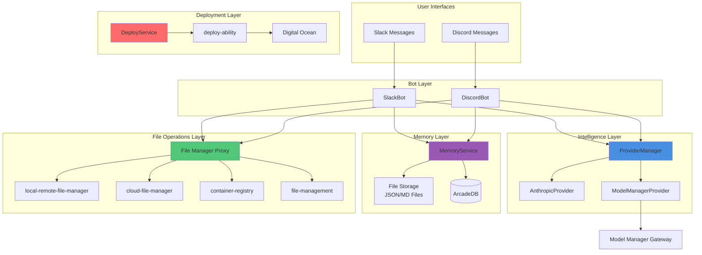

# Template Agent TypeScript - Enhanced Edition

**Production-ready TypeScript agent template with multi-LLM support, hybrid memory system, and autonomous deployment capabilities.**

This enhanced version extends the base KĀDI template with four major capabilities:
1. **Multi-LLM Provider System** - Support for Anthropic Claude and OpenAI-compatible Model Manager Gateway
2. **Hybrid Memory System** - Multi-layered memory (short-term JSON files + long-term ArcadeDB)
3. **Comprehensive File Management** - Integration with four file management abilities via KADI protocol
4. **Autonomous Deployment** - Self-deployment to Digital Ocean infrastructure

## ✨ Key Features

- ✅ **Multi-Provider Intelligence** - Route requests to Claude (Anthropic) or GPT models (Model Manager) with automatic fallback
- ✅ **Persistent Memory** - Hybrid storage using JSON files for active context and ArcadeDB for long-term history
- ✅ **File Operations** - Local file server, cloud uploads, container registry, and SSH/SCP transfers
- ✅ **Self-Deployment** - Programmatic deployment to Digital Ocean with API key management
- ✅ **Slack & Discord Bots** - Event-driven bot implementations with conversation memory
- ✅ **Graceful Degradation** - System continues operating even when subsystems fail
- ✅ **Type-Safe Architecture** - Full TypeScript support with Result<T, E> error handling
- ✅ **Production-Ready** - Comprehensive tests, health checks, and monitoring

## 📋 Table of Contents

- [Quick Start](#quick-start)
- [Environment Variables](#environment-variables)
- [Architecture](#architecture)
- [Multi-LLM Provider System](#multi-llm-provider-system)
- [Hybrid Memory System](#hybrid-memory-system)
- [File Management](#file-management)
- [Deployment Service](#deployment-service)
- [Bot Integration](#bot-integration)
- [Development](#development)
- [Testing](#testing)
- [API Reference](#api-reference)
- [Troubleshooting](#troubleshooting)

## 🚀 Quick Start

### Prerequisites

- Node.js 18.0 or higher
- KADI broker running at `ws://localhost:8080` (optional for standalone use)
- Anthropic API key
- Model Manager Gateway URL and API key (optional)
- ArcadeDB instance (optional, gracefully degrades to file-only)

### Installation

```bash
# Clone the repository
git clone <repository-url>
cd template-agent-typescript

# Install dependencies
npm install

# Configure environment
cp .env.template .env
# Edit .env with your configuration

# Build the project
npm run build

# Run in development mode
npm run dev
```

### First Run

```typescript
import { ProviderManager } from './providers/provider-manager.js';
import { AnthropicProvider } from './providers/anthropic-provider.js';
import { MemoryService } from './memory/memory-service.js';

// Initialize providers
const anthropicProvider = new AnthropicProvider(process.env.ANTHROPIC_API_KEY);
const providerManager = new ProviderManager([anthropicProvider], {
  primaryProvider: 'anthropic',
  retryAttempts: 3,
  retryDelayMs: 1000
});

// Initialize memory
const memoryService = new MemoryService('./data/memory', process.env.ARCADEDB_URL);
await memoryService.initialize();

// Make a request
const response = await providerManager.chat([
  { role: 'user', content: 'Hello, world!' }
]);

console.log(response.success ? response.data : response.error);
```

## 🔧 Environment Variables

Create a `.env` file with the following configuration:

### Required Variables

```env
# Agent Configuration
AGENT_NAME=template-typescript-agent
AGENT_VERSION=0.0.1

# LLM Providers
ANTHROPIC_API_KEY=sk-ant-your-key-here

# Memory Storage
MEMORY_DATA_PATH=./data/memory
```

### Optional Variables

```env
# Model Manager Gateway (for GPT models)
MODEL_MANAGER_BASE_URL=https://your-model-manager.example.com
MODEL_MANAGER_API_KEY=kadi_live_your-key-here

# ArcadeDB (long-term memory)
ARCADEDB_URL=http://localhost:2480

# Slack Bot Integration
ENABLE_SLACK_BOT=true
SLACK_BOT_USER_ID=U01234ABCD

# Discord Bot Integration
ENABLE_DISCORD_BOT=true
DISCORD_BOT_USER_ID=960573427859726356

# KADI Broker
KADI_BROKER_URL=ws://localhost:8080
KADI_NETWORK=global,text,slack,discord

# Deployment
DIGITAL_OCEAN_TOKEN=dop_v1_your-token-here

# Security
NODE_TLS_REJECT_UNAUTHORIZED=0  # Only for development
```

### Environment Variable Reference

| Variable | Required | Default | Description |
|----------|----------|---------|-------------|
| `ANTHROPIC_API_KEY` | Yes | - | Anthropic Claude API key |
| `MODEL_MANAGER_BASE_URL` | No | - | Model Manager Gateway URL |
| `MODEL_MANAGER_API_KEY` | No | - | Model Manager API key |
| `MEMORY_DATA_PATH` | Yes | `./data/memory` | Directory for JSON memory files |
| `ARCADEDB_URL` | No | - | ArcadeDB connection URL |
| `ENABLE_SLACK_BOT` | No | `false` | Enable Slack bot |
| `ENABLE_DISCORD_BOT` | No | `false` | Enable Discord bot |
| `KADI_BROKER_URL` | No | `ws://localhost:8080` | KADI broker WebSocket URL |

See `.env.template` for complete configuration options with descriptions.

## 🏗️ Architecture

### High-Level System Architecture



### Modular Design Principles

- **Single Responsibility**: Each provider/service in separate file with single concern
- **Component Isolation**: Memory, providers, deployment are independent modules
- **Service Layer Separation**: Bot → Intelligence → Memory → Operations
- **Graceful Degradation**: System continues operating when subsystems fail

## 🤖 Multi-LLM Provider System

### Overview

The provider system abstracts LLM interactions behind a unified interface, enabling:
- Dynamic provider selection based on model name
- Automatic fallback on provider failure
- Health monitoring and circuit breaker pattern
- Support for both streaming and non-streaming responses

### Provider Selection

```typescript
// Automatic provider selection based on model name
const response = await providerManager.chat(messages, {
  model: 'claude-3-5-sonnet',  // Routes to Anthropic
  maxTokens: 1000
});

const gptResponse = await providerManager.chat(messages, {
  model: 'gpt-4o-mini',  // Routes to Model Manager
  maxTokens: 1000
});

// No model specified - uses primary provider
const defaultResponse = await providerManager.chat(messages);
```

### User-Facing Model Selection

Users can specify models in their messages using bracket notation:

**Slack/Discord Examples:**
```
@bot [claude-3-5-sonnet] What is the capital of France?
@bot [gpt-4o-mini] Explain quantum computing
@bot [claude-3-haiku] Quick question about TypeScript
```

The bot automatically:
1. Extracts the model name from brackets
2. Routes to appropriate provider
3. Falls back to alternative provider if primary fails

### Supported Models

**Anthropic (claude-* models):**
- `claude-3-5-sonnet` - Most capable, best for complex tasks
- `claude-3-opus` - Previous flagship model
- `claude-3-sonnet` - Balanced performance
- `claude-3-haiku` - Fast and cost-effective

**Model Manager (OpenAI-compatible):**
- `gpt-4o` - GPT-4 Optimized
- `gpt-4o-mini` - Fast and efficient
- `gpt-4-turbo` - Turbo variant
- Any custom models registered in your Model Manager

### Fallback Configuration

```typescript
const providerManager = new ProviderManager(
  [anthropicProvider, modelManagerProvider],
  {
    primaryProvider: 'anthropic',
    fallbackProvider: 'model-manager',
    retryAttempts: 3,
    retryDelayMs: 1000,
    healthCheckIntervalMs: 60000
  }
);
```

### Health Monitoring

```typescript
// Check provider health status
const healthStatus = await providerManager.getHealthStatus();
// Returns: Map<string, boolean>
// { 'anthropic' => true, 'model-manager' => true }

// Get available models
const models = await anthropicProvider.getAvailableModels();
if (models.success) {
  console.log('Available:', models.data);
}
```

### Error Handling

All provider operations return `Result<T, E>` for predictable error handling:

```typescript
const result = await providerManager.chat(messages);

if (result.success) {
  console.log('Response:', result.data);
} else {
  console.error('Error:', result.error.code, result.error.message);
  // Error codes: AUTH_FAILED, RATE_LIMIT, TIMEOUT, PROVIDER_UNAVAILABLE
}
```

## 💾 Hybrid Memory System

### Architecture

The memory system uses a **hybrid architecture** optimized for both speed and persistence:

- **Short-term Memory**: JSON files for active conversation context (last 20 messages)
- **Long-term Memory**: ArcadeDB for persistent summarized history
- **Automatic Archival**: When conversations exceed 20 messages, oldest messages are summarized and archived

### File Structure

```
./data/memory/
├── user-123/
│   ├── channel-456.json       # Conversation messages (last 20)
│   └── preferences.json        # User preferences
├── user-789/
│   ├── channel-012.json
│   └── preferences.json
└── public/
    └── knowledge.json          # Shared knowledge base
```

### Basic Usage

```typescript
import { MemoryService } from './memory/memory-service.js';

// Initialize memory service
const memoryService = new MemoryService(
  './data/memory',              // JSON file path
  'http://localhost:2480'       // ArcadeDB URL (optional)
);
await memoryService.initialize();

// Store a message
await memoryService.storeMessage('user-123', 'channel-456', {
  role: 'user',
  content: 'What is TypeScript?',
  timestamp: Date.now()
});

// Retrieve conversation context
const context = await memoryService.retrieveContext('user-123', 'channel-456', 10);
if (context.success) {
  console.log('Last 10 messages:', context.data);
}
```

### Automatic Archival

When a conversation exceeds 20 messages:
1. System detects threshold
2. Oldest 10 messages are summarized using LLM
3. Summary is stored in ArcadeDB
4. JSON file is rewritten with last 20 messages
5. Old messages are removed from file storage

This happens automatically in the background without blocking new messages.

### User Preferences

```typescript
// Store user preference
await memoryService.storePreference('user-123', 'theme', 'dark');
await memoryService.storePreference('user-123', 'language', 'en');

// Retrieve preference
const theme = await memoryService.getPreference('user-123', 'theme');
if (theme.success) {
  console.log('User theme:', theme.data); // 'dark'
}
```

### Public Knowledge

```typescript
// Store shared knowledge
await memoryService.storeKnowledge('api-endpoint', 'https://api.example.com');

// Retrieve knowledge
const endpoint = await memoryService.getKnowledge('api-endpoint');
if (endpoint.success) {
  console.log('API endpoint:', endpoint.data);
}
```

### Long-term Search (ArcadeDB)

```typescript
// Search long-term memory
const results = await memoryService.searchLongTerm('user-123', 'quantum computing');
if (results.success) {
  results.data.forEach(entry => {
    console.log('Found:', entry.content, 'Score:', entry.relevanceScore);
  });
}
```

### Graceful Degradation

If ArcadeDB is unavailable:
- System continues with file-based storage only
- No archival occurs (messages stay in JSON files)
- Warning logged but no user-facing errors
- System automatically reconnects when database becomes available

## 📁 File Management

### Overview

The File Manager Proxy provides unified access to four file management abilities via KADI broker:

1. **local-remote-file-manager** - Start local file server with public tunnel
2. **cloud-file-manager** - Upload/download files to cloud storage
3. **container-registry** - Share Docker containers via temporary registry
4. **file-management** - SSH/SCP file operations

### Local File Server

```typescript
import { FileManagerProxy } from './deployment/file-manager-proxy.js';

const fileManager = new FileManagerProxy(kadiClient);

// Start file server with public URL
const server = await fileManager.startFileServer('./public', 8080);
if (server.success) {
  console.log('Local URL:', server.data.localUrl);     // http://localhost:8080
  console.log('Public URL:', server.data.tunnelUrl);   // https://xyz.tunnelservice.com
}

// Stop server
await fileManager.stopFileServer(server.data.serverId);
```

### Cloud File Upload/Download

```typescript
// Upload to cloud storage
const upload = await fileManager.uploadToCloud(
  'aws-s3',                          // Provider: aws-s3, gcs, azure
  './local/file.txt',                // Local path
  'bucket-name/remote/path/file.txt' // Remote path
);

// Download from cloud
const download = await fileManager.downloadFromCloud(
  'aws-s3',
  'bucket-name/remote/path/file.txt',
  './local/downloaded.txt'
);

// List cloud files
const files = await fileManager.listCloudFiles('aws-s3', 'bucket-name/path/');
if (files.success) {
  files.data.forEach(file => {
    console.log(file.name, file.size, file.lastModified);
  });
}
```

### Container Registry

```typescript
// Share Docker container
const registry = await fileManager.shareContainer('my-app:latest');
if (registry.success) {
  console.log('Registry URL:', registry.data.registryUrl);
  console.log('Login:', registry.data.loginCommand);
  console.log('Pull:', registry.data.pullCommand);
}

// Stop registry
await fileManager.stopRegistry(registry.data.registryId);
```

### SSH/SCP Operations

```typescript
// Upload file via SCP
await fileManager.uploadViaSSH(
  'user@remote-host.com',
  './local/file.txt',
  '/remote/path/file.txt'
);

// Download file via SCP
await fileManager.downloadViaSSH(
  'user@remote-host.com',
  '/remote/path/file.txt',
  './local/downloaded.txt'
);

// Execute remote command
const result = await fileManager.executeRemoteCommand(
  'user@remote-host.com',
  'docker ps -a'
);
if (result.success) {
  console.log('Command output:', result.data);
}
```

## 🚀 Deployment Service

### Overview

The DeployService enables programmatic deployment of Model Manager Gateway to Digital Ocean infrastructure.

### Full Deployment Flow

```typescript
import { DeployService } from './deployment/deploy-service.js';

const deployService = new DeployService({
  dropletRegion: 'sfo3',
  dropletSize: 's-2vcpu-2gb',
  containerImage: 'model-manager-agent:0.0.8',
  adminKey: process.env.ADMIN_KEY,
  openaiKey: process.env.OPENAI_API_KEY
});

// Deploy Model Manager Gateway
const deployment = await deployService.deployModelManager();
if (deployment.success) {
  const { gatewayUrl, apiKey, deploymentId, registeredModels } = deployment.data;

  console.log('Gateway URL:', gatewayUrl);
  console.log('API Key:', apiKey);
  console.log('Deployment ID:', deploymentId);
  console.log('Models:', registeredModels);

  // Update agent configuration to use new gateway
  await deployService.updateAgentConfig(gatewayUrl, apiKey);
}
```

### Generate API Key

```typescript
// Generate new API key for existing gateway
const apiKey = await deployService.generateAPIKey(
  'https://gateway.example.com',
  adminKey
);

if (apiKey.success) {
  console.log('New API key:', apiKey.data);
}
```

### Register Models

```typescript
// Register OpenAI models with gateway
const models = await deployService.registerOpenAIModels(
  'https://gateway.example.com',
  adminKey,
  openaiKey
);

if (models.success) {
  console.log('Registered models:', models.data);
  // ['gpt-4o', 'gpt-4o-mini', 'gpt-4-turbo']
}
```

## 🤖 Bot Integration

### Slack Bot

```typescript
import { SlackBot } from './bot/slack-bot.js';

const slackBot = new SlackBot(
  kadiClient,
  providerManager,
  memoryService,
  {
    botUserId: process.env.SLACK_BOT_USER_ID,
    enableTools: true,
    maxTokens: 2000
  }
);

// Bot automatically:
// 1. Subscribes to Slack mention events
// 2. Retrieves conversation context from memory
// 3. Generates response using configured provider
// 4. Stores conversation in memory
// 5. Replies to Slack thread
```

### Discord Bot

```typescript
import { DiscordBot } from './bot/discord-bot.js';

const discordBot = new DiscordBot(
  kadiClient,
  providerManager,
  memoryService,
  {
    botUserId: process.env.DISCORD_BOT_USER_ID,
    enableTools: true,
    maxTokens: 2000
  }
);

// Similar to Slack bot but for Discord platform
```

### Bot Features

- **Event-Driven Architecture**: Subscribe to @mention events via KADI event bus
- **Conversation Memory**: Automatic context retrieval and storage
- **Model Selection**: Users can specify model with `[model-name]` syntax
- **Tool Execution**: Supports tool calls via KADI broker
- **Circuit Breaker**: Prevents cascading failures
- **Retry Logic**: Exponential backoff on transient errors

## 💻 Development

### Scripts

```bash
# Development with hot-reload
npm run dev

# Build TypeScript to JavaScript
npm run build

# Run production build
npm start

# Type checking
npm run type-check

# Linting
npm run lint

# Run tests
npm test

# Test coverage
npm run coverage
```

### Project Structure

```
template-agent-typescript/
├── src/
│   ├── index.ts                      # Main entry point
│   ├── providers/                    # LLM provider system
│   │   ├── types.ts                  # Provider interfaces
│   │   ├── anthropic-provider.ts     # Anthropic Claude
│   │   ├── model-manager-provider.ts # Model Manager Gateway
│   │   └── provider-manager.ts       # Provider orchestration
│   ├── memory/                       # Hybrid memory system
│   │   ├── memory-service.ts         # Core memory service
│   │   ├── file-storage-adapter.ts   # JSON file operations
│   │   ├── arcadedb-adapter.ts       # ArcadeDB integration
│   │   └── types.ts                  # Memory data models
│   ├── deployment/                   # Self-deployment system
│   │   ├── deploy-service.ts         # Deployment orchestration
│   │   ├── file-manager-proxy.ts     # File operations proxy
│   │   └── digital-ocean-config.ts   # Deployment configuration
│   ├── bot/                          # Bot implementations
│   │   ├── slack-bot.ts              # Slack integration
│   │   └── discord-bot.ts            # Discord integration
│   └── __tests__/                    # Test files
│       ├── unit/                     # Unit tests
│       └── integration/              # Integration tests
├── data/                             # Runtime data
│   └── memory/                       # Memory JSON files
├── docs/                             # Documentation
│   ├── architecture.md               # Architecture details
│   └── deployment-guide.md           # Deployment instructions
├── package.json
├── tsconfig.json
├── vitest.config.ts
├── .env.template
└── README.md
```

## 🧪 Testing

### Running Tests

```bash
# Run all tests
npm test

# Run unit tests only
npm test -- src/__tests__/unit

# Run integration tests only
npm test -- src/__tests__/integration

# Run specific test file
npm test -- src/__tests__/integration/provider-flow.test.ts

# Run with coverage
npm run coverage
```

### Test Configuration

Tests use separate environment configuration in `.env.test`:

```env
# Test Environment Configuration
TEST_MEMORY_DATA_PATH=./test-data/memory
TEST_ARCADEDB_URL=http://localhost:2480
ANTHROPIC_API_KEY=sk-ant-test-key
MODEL_MANAGER_BASE_URL=https://test-gateway.example.com
MODEL_MANAGER_API_KEY=test-key
```

### Test Coverage

Current test coverage:
- **Unit Tests**: Provider system, memory operations, file adapters
- **Integration Tests**: End-to-end provider flows, memory persistence, bot conversations
- **Performance Tests**: Message storage throughput, context retrieval speed

Target: >80% code coverage across all modules.

## 📖 API Reference

### ProviderManager

```typescript
class ProviderManager {
  constructor(providers: LLMProvider[], config: ProviderConfig);

  async chat(
    messages: Message[],
    options?: ChatOptions
  ): Promise<Result<string, ProviderError>>;

  async streamChat(
    messages: Message[],
    options?: ChatOptions
  ): Promise<Result<AsyncIterator<string>, ProviderError>>;

  async getHealthStatus(): Promise<Map<string, boolean>>;

  dispose(): void;
}

interface ChatOptions {
  model?: string;
  maxTokens?: number;
  temperature?: number;
  tools?: Tool[];
}
```

### MemoryService

```typescript
class MemoryService {
  constructor(memoryDataPath: string, arcadedbUrl?: string, providerManager?: ProviderManager);

  async initialize(): Promise<Result<void, MemoryError>>;

  async storeMessage(
    userId: string,
    channelId: string,
    message: ConversationMessage
  ): Promise<Result<void, MemoryError>>;

  async retrieveContext(
    userId: string,
    channelId: string,
    limit?: number
  ): Promise<Result<ConversationMessage[], MemoryError>>;

  async storePreference(
    userId: string,
    key: string,
    value: any
  ): Promise<Result<void, MemoryError>>;

  async getPreference(
    userId: string,
    key: string
  ): Promise<Result<any, MemoryError>>;

  async searchLongTerm(
    userId: string,
    query: string
  ): Promise<Result<MemoryEntry[], MemoryError>>;
}

interface ConversationMessage {
  role: 'user' | 'assistant';
  content: string;
  timestamp: number;
  metadata?: Record<string, any>;
}
```

### FileManagerProxy

```typescript
class FileManagerProxy {
  constructor(client: KadiClient);

  async startFileServer(
    directory: string,
    port?: number
  ): Promise<Result<FileServerInfo, FileError>>;

  async uploadToCloud(
    provider: string,
    localPath: string,
    remotePath: string
  ): Promise<Result<void, FileError>>;

  async shareContainer(
    containerName: string
  ): Promise<Result<ContainerRegistryInfo, FileError>>;

  async uploadViaSSH(
    host: string,
    localPath: string,
    remotePath: string
  ): Promise<Result<void, FileError>>;
}
```

### DeployService

```typescript
class DeployService {
  constructor(config: DeployConfig);

  async deployModelManager(): Promise<Result<DeploymentResult, DeployError>>;

  async generateAPIKey(
    gatewayUrl: string,
    adminKey: string
  ): Promise<Result<string, DeployError>>;

  async registerOpenAIModels(
    gatewayUrl: string,
    adminKey: string,
    openaiKey: string
  ): Promise<Result<string[], DeployError>>;
}

interface DeploymentResult {
  gatewayUrl: string;
  apiKey: string;
  deploymentId: string;
  registeredModels: string[];
}
```

See [docs/architecture.md](./docs/architecture.md) for detailed API documentation.

## 🔍 Troubleshooting

### Provider Issues

**Problem**: `AUTH_FAILED` error from provider

**Solution**:
1. Check API key is correct in `.env`
2. Verify API key has not expired
3. Check account has sufficient credits
4. For Model Manager, verify base URL is correct

**Problem**: `RATE_LIMIT` errors

**Solution**:
1. Provider manager automatically retries with exponential backoff
2. Consider upgrading API tier for higher limits
3. Use fallback provider configuration

### Memory Issues

**Problem**: Messages not persisting

**Solution**:
1. Check `MEMORY_DATA_PATH` directory has write permissions
2. Verify disk space is available
3. Check logs for file write errors

**Problem**: ArcadeDB connection fails

**Solution**:
1. Verify `ARCADEDB_URL` is correct
2. Check ArcadeDB is running: `curl http://localhost:2480`
3. System automatically degrades to file-only mode

### Bot Issues

**Problem**: Bot not responding to mentions

**Solution**:
1. Verify `ENABLE_SLACK_BOT=true` in `.env`
2. Check `SLACK_BOT_USER_ID` matches your bot's user ID
3. Confirm mcp-client-slack is running and publishing events
4. Check KADI broker logs for event routing

**Problem**: Circuit breaker opening frequently

**Solution**:
1. Check network connectivity to KADI broker
2. Verify provider health: `await providerManager.getHealthStatus()`
3. Review timeout settings in bot configuration
4. Check provider API rate limits

### Deployment Issues

**Problem**: Deployment fails with `DEPLOY_FAILED`

**Solution**:
1. Check Digital Ocean API token is valid
2. Verify droplet size and region are available
3. Check account has sufficient resources
4. Review deployment service logs for detailed error

**Problem**: Container image not found

**Solution**:
1. Verify container image name and tag
2. Check image is pushed to accessible registry
3. Confirm authentication credentials for private registries

### Common Error Codes

| Code | Description | Retryable | Solution |
|------|-------------|-----------|----------|
| `AUTH_FAILED` | Invalid API key | No | Check credentials in `.env` |
| `RATE_LIMIT` | API rate limit exceeded | Yes | Wait or upgrade tier |
| `TIMEOUT` | Request timeout | Yes | Increase timeout setting |
| `PROVIDER_UNAVAILABLE` | Provider service down | Yes | Enable fallback provider |
| `VALIDATION_ERROR` | Invalid input data | No | Check input format |
| `FILE_ERROR` | File operation failed | Yes | Check permissions |
| `DATABASE_ERROR` | ArcadeDB connection failed | Yes | Verify database status |

## 📄 License

MIT License - See LICENSE file for details.

## 🙏 Acknowledgments

Built on the **KĀDI (Knowledge Agent Development Infrastructure)** protocol, enabling seamless multi-language agent communication in distributed AI systems.

## 🔗 Related Documentation

- [Architecture Details](./docs/architecture.md) - Comprehensive architecture documentation
- [Deployment Guide](./docs/deployment-guide.md) - Step-by-step deployment instructions
- [API Reference](./docs/api-reference.md) - Complete API documentation
- [Original Template README](./docs/README.md) - Base template documentation

---

**Ready to enhance your agent?** See the deployment guide to get started! 🚀
