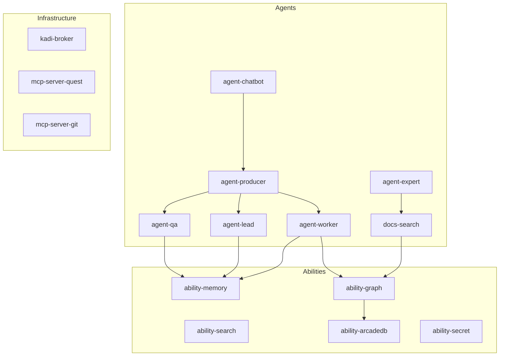

# AGENTS Documentation

**Multi-Agent Orchestration Platform** — build, deploy, and orchestrate AI agents with tools, abilities, and distributed messaging.

## What is AGENTS?

AGENTS is a monorepo containing a complete multi-agent system for software development orchestration. It includes:

- **Agents** — Specialized AI agents (producer, worker, lead, QA, chatbot, quest, expert)
- **Abilities** — Reusable capability modules (graph, search, memory, ArcadeDB, secrets, vision, eval, file ops)
- **Infrastructure** — Broker-based messaging, MCP servers, deployment tooling
- **Engine** — Daemon Engine (C++20 game engine with DirectX 11, V8 scripting)
- **DaemonAgent** — Dual-language game project (C++20 + TypeScript)

## Architecture Overview

## Quick Links

| Category | Packages |
|----------|----------|
| **Agents** | [producer](/docs/agents/agent-producer/), [worker](/docs/agents/agent-worker/), [lead](/docs/agents/agent-lead/), [qa](/docs/agents/agent-qa/), [chatbot](/docs/agents/agent-chatbot/), [quest](/docs/agents/agent-quest/), [expert](/docs/agents/agent-expert/) |
| **Abilities** | [graph](/docs/abilities/ability-graph/), [search](/docs/abilities/ability-search/), [memory](/docs/abilities/ability-memory/), [arcadedb](/docs/abilities/ability-arcadedb/), [secret](/docs/abilities/ability-secret/) |
| **MCP Servers** | [quest](/docs/packages/mcp-server-quest/), [git](/docs/packages/mcp-server-git/) |
| **Engine** | [Daemon Engine](/docs/engine/), [DaemonAgent](/docs/daemon-agent/) |
