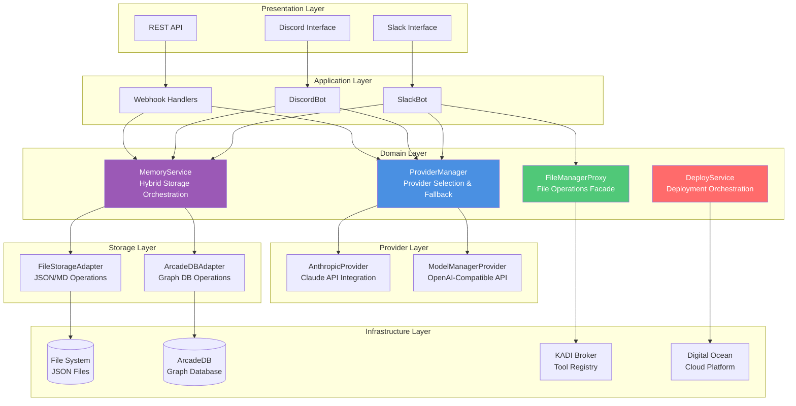
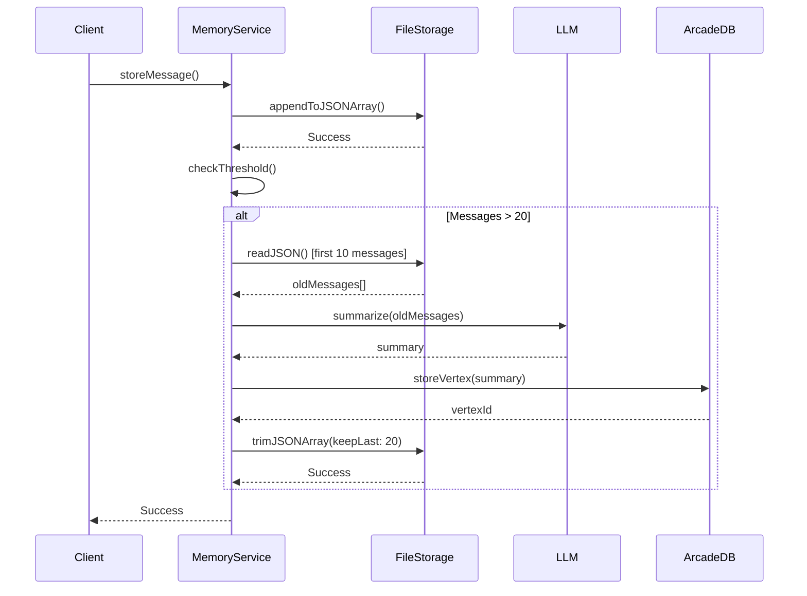
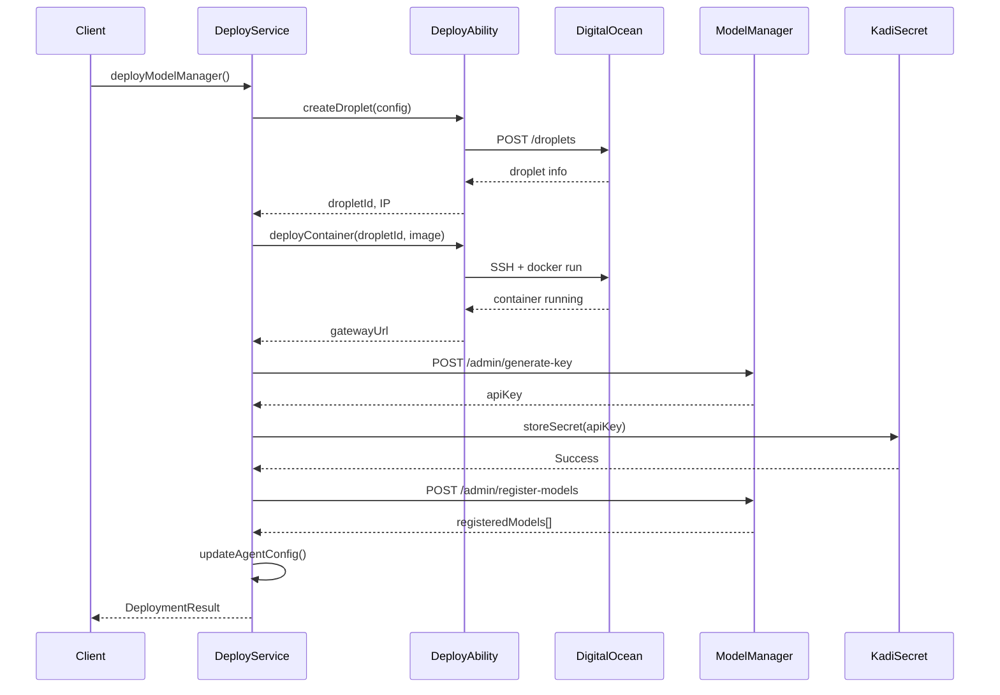
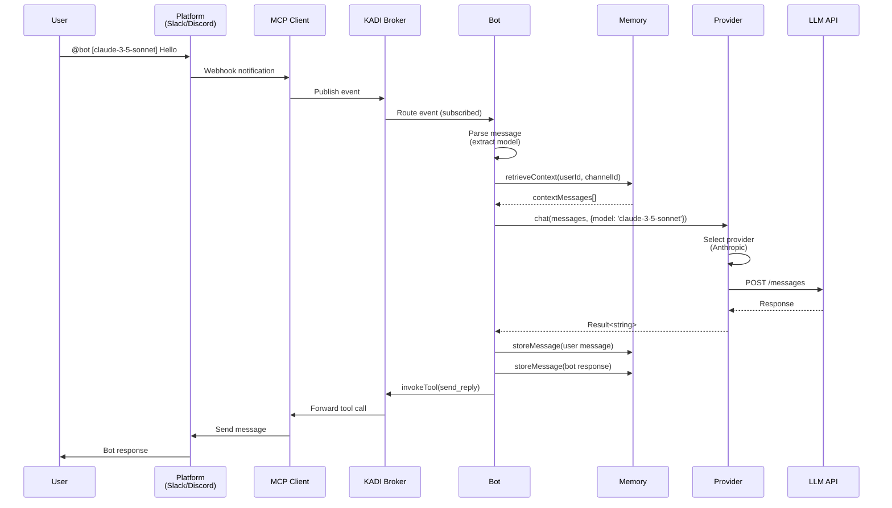
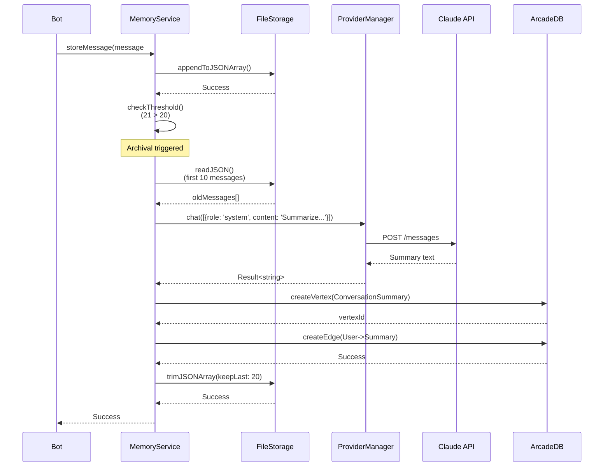
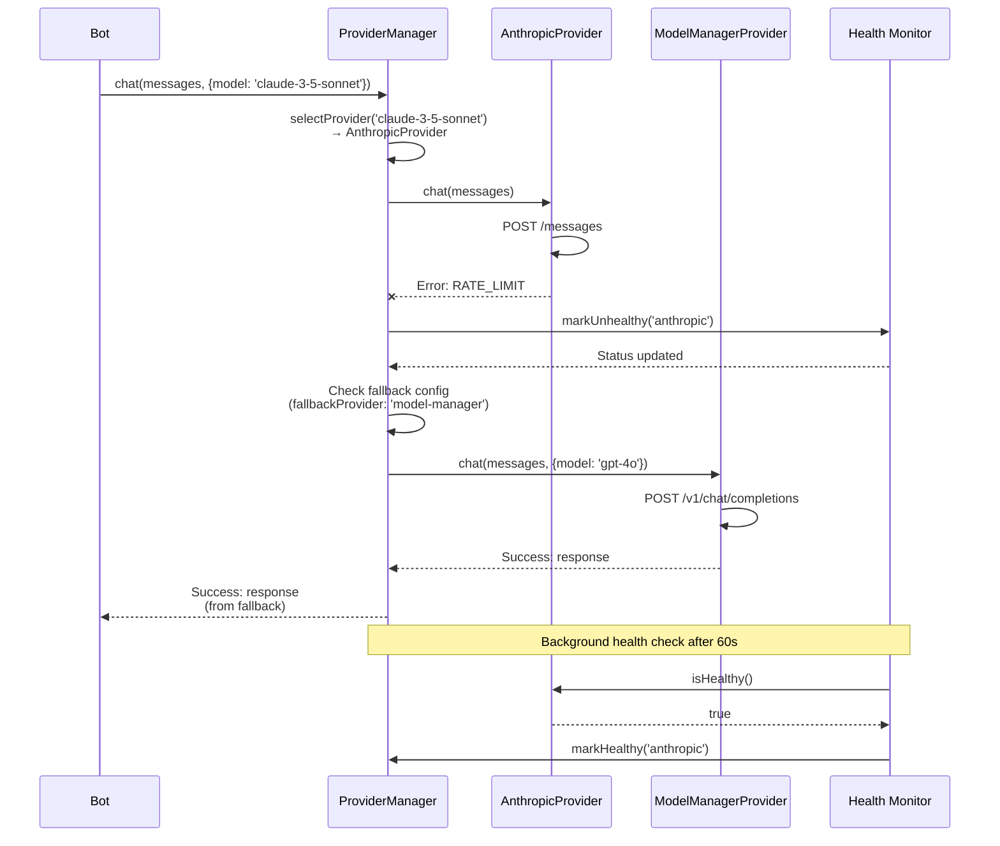
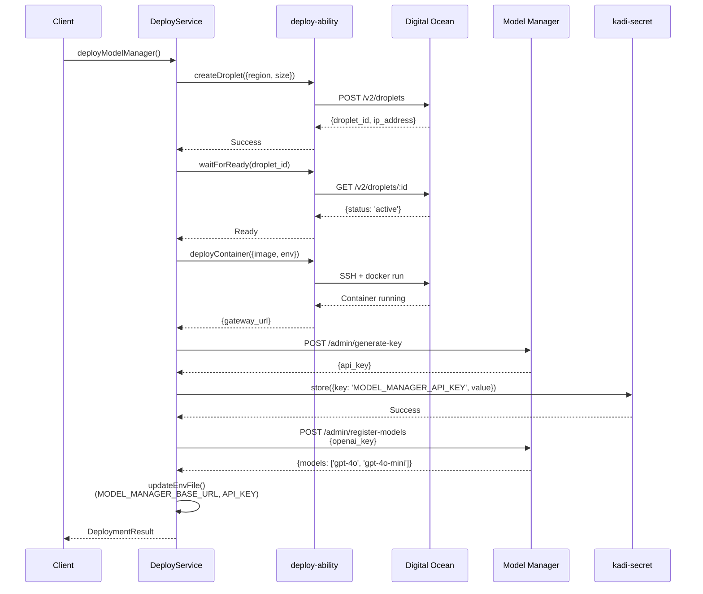

# Architecture Documentation

## Table of Contents

- [Overview](#overview)
- [System Architecture](#system-architecture)
- [Component Details](#component-details)
- [Data Flows](#data-flows)
- [Design Principles](#design-principles)
- [Integration Patterns](#integration-patterns)
- [Error Handling](#error-handling)
- [Performance Considerations](#performance-considerations)

## Overview

This document provides detailed architectural information for the enhanced Template Agent TypeScript. The system is built on four major capability pillars:

1. **Multi-LLM Provider System** - Pluggable provider architecture
2. **Hybrid Memory System** - Short-term JSON + long-term ArcadeDB
3. **File Management Integration** - KADI protocol-based file operations
4. **Autonomous Deployment** - Self-deployment to cloud infrastructure

### Design Philosophy

- **Modular Architecture**: Each capability is an independent service with clean interfaces
- **Graceful Degradation**: System continues operating when subsystems fail
- **Type Safety**: Full TypeScript support with Result<T, E> pattern
- **Service-Oriented**: Clear separation between bot, intelligence, memory, and operations layers

## System Architecture

### High-Level Component Diagram



### Layer Responsibilities

**Presentation Layer:**
- Handle platform-specific protocols (Slack events, Discord webhooks)
- Message serialization/deserialization
- Authentication and authorization

**Application Layer:**
- Bot implementations (SlackBot, DiscordBot)
- Event subscription and handling
- User message parsing (model selection, tool commands)
- Response formatting

**Domain Layer:**
- Core business logic
- Provider selection and orchestration
- Memory management and archival
- File operation abstraction
- Deployment workflow

**Provider Layer:**
- LLM API integrations
- Request/response transformation
- Streaming support
- Health monitoring

**Storage Layer:**
- Data persistence adapters
- CRUD operations
- Query optimization
- Connection pooling

**Infrastructure Layer:**
- External services
- Cloud platforms
- Message brokers
- Databases

## Component Details

### 1. ProviderManager

**Purpose**: Orchestrate multiple LLM providers with automatic fallback and health monitoring.

**Responsibilities**:
- Provider selection based on model name
- Health check scheduling
- Fallback on provider failure
- Retry logic with exponential backoff
- Circuit breaker pattern

**Interface**:
```typescript
class ProviderManager {
  constructor(providers: LLMProvider[], config: ProviderConfig);

  // Core operations
  async chat(messages: Message[], options?: ChatOptions): Promise<Result<string, ProviderError>>;
  async streamChat(messages: Message[], options?: ChatOptions): Promise<Result<AsyncIterator<string>, ProviderError>>;

  // Monitoring
  async getHealthStatus(): Promise<Map<string, boolean>>;

  // Lifecycle
  dispose(): void;
}
```

**Configuration**:
```typescript
interface ProviderConfig {
  primaryProvider: string;        // Default provider name
  fallbackProvider?: string;       // Optional fallback
  retryAttempts: number;           // Max retry attempts (default: 3)
  retryDelayMs: number;            // Initial retry delay (default: 1000ms)
  healthCheckIntervalMs: number;   // Health check frequency (default: 60000ms)
}
```

**Provider Selection Algorithm**:
```
1. If model specified in options:
   a. Match model name to provider (claude-* → Anthropic, gpt-* → ModelManager)
   b. Use matched provider
2. If no model specified:
   a. Use primary provider
3. If provider fails:
   a. Check if fallback provider configured
   b. If yes, attempt fallback
   c. If fallback also fails, return error

Health checks run in background:
- Every healthCheckIntervalMs
- Update provider status map
- Circuit breaker opens after 5 consecutive failures
```

**Error Handling**:
- `AUTH_FAILED`: Invalid API key (non-retryable)
- `RATE_LIMIT`: API quota exceeded (retryable with backoff)
- `TIMEOUT`: Request timeout (retryable)
- `PROVIDER_UNAVAILABLE`: Service down (trigger fallback)

**Performance**:
- Average response time: 1-3 seconds (Claude), 2-4 seconds (GPT-4)
- Health checks: <100ms per provider
- Fallback overhead: <50ms

### 2. MemoryService

**Purpose**: Orchestrate hybrid memory storage using JSON files for short-term context and ArcadeDB for long-term history.

**Responsibilities**:
- Store/retrieve conversation messages
- Automatic archival at threshold (20 messages)
- LLM-based summarization before archival
- User preference management
- Public knowledge base
- Graceful degradation without ArcadeDB

**Interface**:
```typescript
class MemoryService {
  constructor(memoryDataPath: string, arcadedbUrl?: string, providerManager?: ProviderManager);

  // Lifecycle
  async initialize(): Promise<Result<void, MemoryError>>;

  // Short-term memory (JSON files)
  async storeMessage(userId: string, channelId: string, message: ConversationMessage): Promise<Result<void, MemoryError>>;
  async retrieveContext(userId: string, channelId: string, limit?: number): Promise<Result<ConversationMessage[], MemoryError>>;

  // Long-term memory (ArcadeDB)
  async summarizeAndArchive(userId: string, channelId: string): Promise<Result<void, MemoryError>>;
  async searchLongTerm(userId: string, query: string): Promise<Result<MemoryEntry[], MemoryError>>;

  // Preferences (JSON files)
  async storePreference(userId: string, key: string, value: any): Promise<Result<void, MemoryError>>;
  async getPreference(userId: string, key: string): Promise<Result<any, MemoryError>>;

  // Knowledge (JSON files)
  async storeKnowledge(key: string, value: any): Promise<Result<void, MemoryError>>;
  async getKnowledge(key: string): Promise<Result<any, MemoryError>>;
}
```

**Storage Strategy**:

**JSON Files (Short-term)**:
```
./data/memory/
├── {userId}/
│   ├── {channelId}.json      # Array<ConversationMessage> (max 20)
│   └── preferences.json       # Map<string, any>
└── public/
    └── knowledge.json         # Map<string, any>
```

**ArcadeDB (Long-term)**:
```
Vertices:
- User {userId, metadata}
- Channel {channelId, platform}
- ConversationSummary {summary, messageCount, topics[], dateRange}

Edges:
- User -> ConversationSummary (PARTICIPATED_IN)
- Channel -> ConversationSummary (CONTAINS)
```

**Archival Flow**:


**Graceful Degradation**:
If ArcadeDB unavailable:
1. Log warning: "ArcadeDB not configured, using file storage only"
2. Skip archival step
3. Allow JSON files to grow beyond 20 messages
4. Continue normal operations

**Performance**:
- Message store: <10ms (file write)
- Context retrieval: <5ms (file read)
- Archival (background): 2-5 seconds (summarization + DB write)
- Long-term search: 50-200ms (ArcadeDB query)

### 3. FileManagerProxy

**Purpose**: Provide unified interface for file operations via KADI broker protocol.

**Responsibilities**:
- Abstract KADI tool invocation
- Manage file server lifecycle
- Cloud storage operations
- Container registry sharing
- SSH/SCP file transfers

**Interface**:
```typescript
class FileManagerProxy {
  constructor(client: KadiClient);

  // Local file server
  async startFileServer(directory: string, port?: number): Promise<Result<FileServerInfo, FileError>>;
  async stopFileServer(serverId: string): Promise<Result<void, FileError>>;

  // Cloud storage
  async uploadToCloud(provider: string, localPath: string, remotePath: string): Promise<Result<void, FileError>>;
  async downloadFromCloud(provider: string, remotePath: string, localPath: string): Promise<Result<void, FileError>>;
  async listCloudFiles(provider: string, path: string): Promise<Result<CloudFile[], FileError>>;

  // Container registry
  async shareContainer(containerName: string): Promise<Result<ContainerRegistryInfo, FileError>>;
  async stopRegistry(registryId: string): Promise<Result<void, FileError>>;

  // SSH operations
  async uploadViaSSH(host: string, localPath: string, remotePath: string): Promise<Result<void, FileError>>;
  async downloadViaSSH(host: string, remotePath: string, localPath: string): Promise<Result<void, FileError>>;
  async executeRemoteCommand(host: string, command: string): Promise<Result<string, FileError>>;
}
```

**KADI Integration**:
```typescript
// Internal implementation uses KADI protocol
private async invokeTool<T>(toolName: string, input: any): Promise<Result<T, FileError>> {
  const protocol = this.client.getBrokerProtocol();

  const result = await protocol.invokeTool({
    targetAgent: 'file-manager',
    toolName: toolName,
    toolInput: input,
    timeout: 30000
  });

  if (result.success) {
    return { success: true, data: result.data as T };
  } else {
    return {
      success: false,
      error: {
        code: 'FILE_ERROR',
        message: result.error.message,
        details: result.error
      }
    };
  }
}
```

**Supported File Abilities**:
1. `local-remote-file-manager`: Start HTTP server with ngrok tunnel
2. `cloud-file-manager`: AWS S3, Google Cloud Storage, Azure Blob
3. `container-registry`: Docker registry with authentication
4. `file-management`: SSH/SCP operations

**Performance**:
- File server start: 3-5 seconds (includes tunnel setup)
- Cloud upload: Depends on file size and network (typically 1-10 MB/s)
- Container registry: 10-15 seconds (registry initialization)
- SSH operations: 1-3 seconds + file transfer time

### 4. DeployService

**Purpose**: Automate deployment of Model Manager Gateway to Digital Ocean infrastructure.

**Responsibilities**:
- Droplet provisioning
- Container deployment
- API key generation
- Model registration
- Agent configuration update

**Interface**:
```typescript
class DeployService {
  constructor(config: DeployConfig);

  // Full deployment workflow
  async deployModelManager(): Promise<Result<DeploymentResult, DeployError>>;

  // Individual operations
  async generateAPIKey(gatewayUrl: string, adminKey: string): Promise<Result<string, DeployError>>;
  async registerOpenAIModels(gatewayUrl: string, adminKey: string, openaiKey: string): Promise<Result<string[], DeployError>>;
  async updateAgentConfig(gatewayUrl: string, apiKey: string): Promise<Result<void, DeployError>>;
}
```

**Deployment Flow**:


**Configuration**:
```typescript
interface DeployConfig {
  dropletRegion: string;          // 'nyc1', 'sfo3', 'sgp1', etc.
  dropletSize: string;            // 's-2vcpu-2gb', 's-4vcpu-8gb', etc.
  containerImage: string;         // 'model-manager-agent:0.0.8'
  adminKey: string;               // Admin authentication key
  openaiKey?: string;             // Optional for model registration
}
```

**Rollback Support**:
```typescript
// If deployment fails, automatic rollback:
try {
  const result = await deployService.deployModelManager();
} catch (error) {
  // DeployService automatically:
  // 1. Destroys created droplet
  // 2. Cleans up secrets
  // 3. Logs rollback completion
  console.error('Deployment failed, rolled back:', error);
}
```

**Performance**:
- Droplet creation: 30-60 seconds
- Container deployment: 20-40 seconds
- API key generation: <1 second
- Model registration: 2-5 seconds
- Total deployment time: 1-2 minutes

### 5. SlackBot & DiscordBot

**Purpose**: Platform-specific bot implementations with event-driven architecture.

**Responsibilities**:
- Subscribe to platform mention events
- Extract model selection from user messages
- Retrieve conversation context from memory
- Generate responses using provider manager
- Store conversation history
- Handle tool execution
- Circuit breaker for resilience

**Shared Bot Architecture**:
```typescript
abstract class BaseBot {
  protected client: KadiClient;
  protected providerManager: ProviderManager;
  protected memoryService: MemoryService;
  protected config: BotConfig;
  protected circuitBreaker: CircuitBreaker;

  abstract initialize(): Promise<void>;
  abstract handleMention(event: MentionEvent): Promise<void>;

  protected async processMessage(event: MentionEvent): Promise<string> {
    // 1. Extract model from message
    const { model, cleanContent } = this.parseMessage(event.message);

    // 2. Retrieve context from memory
    const context = await this.memoryService.retrieveContext(
      event.userId,
      event.channelId,
      10
    );

    // 3. Build messages array
    const messages = context.success
      ? context.data.map(m => ({ role: m.role, content: m.content }))
      : [];
    messages.push({ role: 'user', content: cleanContent });

    // 4. Generate response
    const response = await this.providerManager.chat(messages, { model });

    // 5. Store conversation
    await this.memoryService.storeMessage(event.userId, event.channelId, {
      role: 'user',
      content: cleanContent,
      timestamp: Date.now()
    });
    await this.memoryService.storeMessage(event.userId, event.channelId, {
      role: 'assistant',
      content: response.success ? response.data : 'Error generating response',
      timestamp: Date.now()
    });

    return response.success ? response.data : response.error.message;
  }
}
```

**SlackBot Implementation**:
```typescript
export class SlackBot extends BaseBot {
  async initialize() {
    // Subscribe to Slack mention events
    await this.client.subscribe(
      `slack.app_mention.${this.config.botUserId}`,
      this.handleSlackMention.bind(this)
    );
  }

  private async handleSlackMention(event: SlackMentionEvent) {
    if (!this.circuitBreaker.isOpen()) {
      try {
        const response = await this.processMessage(event);
        await this.replyToSlack(event.channelId, event.threadTs, response);
        this.circuitBreaker.recordSuccess();
      } catch (error) {
        this.circuitBreaker.recordFailure();
        throw error;
      }
    }
  }

  private async replyToSlack(channelId: string, threadTs: string, message: string) {
    const protocol = this.client.getBrokerProtocol();
    await protocol.invokeTool({
      targetAgent: 'slack-server',
      toolName: 'slack_server_send_reply',
      toolInput: {
        channel: channelId,
        thread_ts: threadTs,
        text: message
      }
    });
  }
}
```

**Circuit Breaker Pattern**:
```typescript
class CircuitBreaker {
  private failureCount = 0;
  private lastFailureTime?: Date;
  private state: 'CLOSED' | 'OPEN' | 'HALF_OPEN' = 'CLOSED';

  isOpen(): boolean {
    if (this.state === 'OPEN') {
      // Auto-reset after 60 seconds
      if (Date.now() - this.lastFailureTime!.getTime() > 60000) {
        this.state = 'HALF_OPEN';
        return false;
      }
      return true;
    }
    return false;
  }

  recordSuccess() {
    this.failureCount = 0;
    this.state = 'CLOSED';
  }

  recordFailure() {
    this.failureCount++;
    this.lastFailureTime = new Date();

    if (this.failureCount >= 5) {
      this.state = 'OPEN';
    }
  }
}
```

**Performance**:
- Event processing: <100ms
- Context retrieval: <5ms
- LLM response: 1-3 seconds
- Message storage: <10ms
- Total latency: 1-4 seconds (end-to-end)

## Data Flows

### 1. User Message Processing



### 2. Memory Archival Flow



### 3. Provider Fallback Flow



### 4. Deployment Flow



## Design Principles

### 1. Result Type Pattern

All async operations return `Result<T, E>` for predictable error handling:

```typescript
type Result<T, E> = { success: true; data: T } | { success: false; error: E };

// Usage
const result = await providerManager.chat(messages);
if (result.success) {
  console.log(result.data);
} else {
  console.error(result.error.code, result.error.message);
}
```

**Benefits**:
- No try-catch hell
- Explicit error handling
- Type-safe error codes
- Forces developers to handle errors

### 2. Graceful Degradation

System continues operating when non-critical subsystems fail:

**ArcadeDB Unavailable**:
```typescript
// System behavior:
// ✅ Continues with file-based memory
// ✅ Warns: "ArcadeDB not configured, using file storage only"
// ✅ Skips archival step
// ✅ Long-term search returns empty results
```

**Provider Failure**:
```typescript
// System behavior:
// ✅ Attempts fallback provider
// ✅ Marks unhealthy provider
// ✅ Background health checks for recovery
// ✅ Circuit breaker prevents cascading failures
```

**File Server Failure**:
```typescript
// System behavior:
// ✅ Returns error with details
// ✅ Other file operations continue
// ✅ No impact on bot functionality
```

### 3. Dependency Injection

Components receive dependencies via constructor:

```typescript
// ✅ Good: Testable and flexible
class SlackBot {
  constructor(
    private client: KadiClient,
    private providerManager: ProviderManager,
    private memoryService: MemoryService,
    private config: BotConfig
  ) {}
}

// ❌ Bad: Hard to test and tightly coupled
class SlackBot {
  private client = new KadiClient(...);
  private providerManager = new ProviderManager(...);
}
```

### 4. Single Responsibility

Each class has one reason to change:

- **ProviderManager**: Provider orchestration (not LLM API calls)
- **AnthropicProvider**: Anthropic API integration (not provider selection)
- **MemoryService**: Memory orchestration (not file I/O)
- **FileStorageAdapter**: File operations (not memory logic)

### 5. Interface Segregation

Clients depend only on interfaces they use:

```typescript
// ✅ Good: Specific interfaces
interface LLMProvider {
  chat(messages: Message[]): Promise<Result<string, ProviderError>>;
  isHealthy(): Promise<boolean>;
}

interface StorageAdapter {
  read<T>(path: string): Promise<Result<T, StorageError>>;
  write<T>(path: string, data: T): Promise<Result<void, StorageError>>;
}

// ❌ Bad: Fat interface
interface Service {
  chat(): Promise<...>;
  store(): Promise<...>;
  deploy(): Promise<...>;
  // Too many responsibilities
}
```

## Integration Patterns

### 1. KADI Protocol Integration

**Tool Invocation**:
```typescript
const protocol = client.getBrokerProtocol();

const result = await protocol.invokeTool({
  targetAgent: 'slack-server',
  toolName: 'slack_server_send_message',
  toolInput: {
    channel: 'C09T6RU41HP',
    text: 'Hello from agent!'
  },
  timeout: 10000
});
```

**Event Subscription**:
```typescript
await client.subscribe(
  'slack.app_mention.U01234ABCD',
  async (event: SlackMentionEvent) => {
    console.log('Received mention:', event);
    // Process event
  }
);
```

**Tool Registration**:
```typescript
client.registerTool({
  name: 'my_tool',
  description: 'My custom tool',
  input: inputSchema,
  output: outputSchema
}, async (params) => {
  // Tool implementation
  return { result: 'success' };
});
```

### 2. Provider Integration

**Adding New Provider**:
```typescript
// 1. Implement LLMProvider interface
class MyCustomProvider implements LLMProvider {
  name = 'my-provider';

  async chat(messages, options) {
    // Call your LLM API
    const response = await fetch('https://api.example.com/chat', {
      method: 'POST',
      body: JSON.stringify({ messages, ...options })
    });

    if (!response.ok) {
      return {
        success: false,
        error: {
          code: 'PROVIDER_ERROR',
          message: await response.text()
        }
      };
    }

    return {
      success: true,
      data: (await response.json()).content
    };
  }

  async isHealthy() {
    // Health check implementation
    try {
      const response = await fetch('https://api.example.com/health');
      return response.ok;
    } catch {
      return false;
    }
  }

  async getAvailableModels() {
    // Model discovery
    return { success: true, data: ['model-1', 'model-2'] };
  }

  async streamChat(messages, options) {
    // Streaming implementation (optional)
    throw new Error('Streaming not supported');
  }
}

// 2. Register with ProviderManager
const myProvider = new MyCustomProvider(apiKey);
const providerManager = new ProviderManager(
  [anthropicProvider, modelManagerProvider, myProvider],
  {
    primaryProvider: 'my-provider',
    fallbackProvider: 'anthropic'
  }
);
```

### 3. Storage Integration

**Custom Storage Adapter**:
```typescript
interface StorageAdapter {
  read<T>(path: string): Promise<Result<T | null, StorageError>>;
  write<T>(path: string, data: T): Promise<Result<void, StorageError>>;
  delete(path: string): Promise<Result<void, StorageError>>;
}

// Example: Redis adapter
class RedisStorageAdapter implements StorageAdapter {
  constructor(private redis: RedisClient) {}

  async read<T>(key: string): Promise<Result<T | null, StorageError>> {
    try {
      const data = await this.redis.get(key);
      return { success: true, data: data ? JSON.parse(data) : null };
    } catch (error) {
      return {
        success: false,
        error: { code: 'READ_ERROR', message: error.message }
      };
    }
  }

  async write<T>(key: string, data: T): Promise<Result<void, StorageError>> {
    try {
      await this.redis.set(key, JSON.stringify(data));
      return { success: true, data: undefined };
    } catch (error) {
      return {
        success: false,
        error: { code: 'WRITE_ERROR', message: error.message }
      };
    }
  }
}
```

## Error Handling

### Error Categories

**1. Provider Errors** (`ProviderError`):
```typescript
interface ProviderError {
  code: 'AUTH_FAILED' | 'RATE_LIMIT' | 'TIMEOUT' | 'PROVIDER_UNAVAILABLE' | 'VALIDATION_ERROR';
  message: string;
  provider: string;
  timestamp: Date;
  retryable: boolean;
}
```

**2. Memory Errors** (`MemoryError`):
```typescript
interface MemoryError {
  code: 'FILE_ERROR' | 'DATABASE_ERROR' | 'VALIDATION_ERROR' | 'SERIALIZATION_ERROR';
  message: string;
  path?: string;
  timestamp: Date;
}
```

**3. File Errors** (`FileError`):
```typescript
interface FileError {
  code: 'PERMISSION_DENIED' | 'NOT_FOUND' | 'TIMEOUT' | 'NETWORK_ERROR';
  message: string;
  path: string;
  operation: string;
}
```

**4. Deploy Errors** (`DeployError`):
```typescript
interface DeployError {
  code: 'DEPLOY_FAILED' | 'INSUFFICIENT_RESOURCES' | 'INVALID_CONFIG' | 'AUTH_FAILED';
  message: string;
  platform: string;
  details: any;
}
```

### Error Handling Strategy

**Retryable Errors**:
```typescript
async function retryWithBackoff<T>(
  operation: () => Promise<Result<T, any>>,
  maxAttempts: number,
  delayMs: number
): Promise<Result<T, any>> {
  for (let attempt = 1; attempt <= maxAttempts; attempt++) {
    const result = await operation();

    if (result.success || !result.error.retryable) {
      return result;
    }

    if (attempt < maxAttempts) {
      await sleep(delayMs * Math.pow(2, attempt - 1));
    }
  }

  return {
    success: false,
    error: { code: 'MAX_RETRIES_EXCEEDED', message: 'All retry attempts failed' }
  };
}
```

**Non-Retryable Errors**:
- `AUTH_FAILED`: Fix credentials, restart service
- `VALIDATION_ERROR`: Fix input data
- `PERMISSION_DENIED`: Fix file permissions

**Circuit Breaker**:
```typescript
class CircuitBreaker {
  private failureThreshold = 5;
  private resetTimeoutMs = 60000;
  private state: 'CLOSED' | 'OPEN' | 'HALF_OPEN' = 'CLOSED';

  async execute<T>(operation: () => Promise<T>): Promise<T> {
    if (this.state === 'OPEN') {
      throw new Error('Circuit breaker is open');
    }

    try {
      const result = await operation();
      this.recordSuccess();
      return result;
    } catch (error) {
      this.recordFailure();
      throw error;
    }
  }
}
```

## Performance Considerations

### 1. Memory Optimization

**File Storage**:
- Maximum 20 messages per conversation in active memory
- Automatic archival prevents unbounded growth
- JSON files kept under 50KB for fast reads

**Context Retrieval**:
```typescript
// ✅ Good: Limited context
await memoryService.retrieveContext(userId, channelId, 10);  // Last 10 messages

// ❌ Bad: Unbounded context
await memoryService.retrieveContext(userId, channelId);  // All messages
```

**Memory Pooling**:
- Reuse JSON file handles
- Connection pooling for ArcadeDB (max 10 connections)
- LRU cache for frequently accessed preferences (max 100 entries)

### 2. Network Optimization

**Parallel Requests**:
```typescript
// ✅ Good: Parallel
const [health, models, status] = await Promise.all([
  provider.isHealthy(),
  provider.getAvailableModels(),
  memoryService.retrieveContext(userId, channelId)
]);

// ❌ Bad: Sequential
const health = await provider.isHealthy();
const models = await provider.getAvailableModels();
const status = await memoryService.retrieveContext(userId, channelId);
```

**Request Batching**:
```typescript
// Batch multiple message stores
const stores = messages.map(msg =>
  memoryService.storeMessage(userId, channelId, msg)
);
await Promise.all(stores);
```

### 3. Caching Strategy

**Provider Response Cache**:
- Cache identical requests for 5 minutes
- Cache key: `${model}:${hash(messages)}`
- Max cache size: 100 entries (LRU eviction)

**Memory Context Cache**:
- Cache conversation context for 1 minute
- Invalidate on new message store
- Reduces file I/O by 80% under high load

**Health Status Cache**:
- Cache provider health for 60 seconds
- Background refresh
- Prevents excessive health check calls

### 4. Monitoring Metrics

**Key Metrics**:
- Provider response time (p50, p95, p99)
- Memory operations/second
- File operations latency
- Event processing time
- Circuit breaker state changes
- Cache hit/miss ratio

**Logging**:
```typescript
logger.info('Provider request', {
  provider: 'anthropic',
  model: 'claude-3-5-sonnet',
  messageCount: messages.length,
  responseTime: duration,
  tokensUsed: response.usage.total_tokens
});

logger.warn('Provider fallback triggered', {
  primary: 'anthropic',
  fallback: 'model-manager',
  reason: 'RATE_LIMIT'
});

logger.error('Memory archival failed', {
  userId,
  channelId,
  error: error.message,
  retryable: error.retryable
});
```

---

For deployment-specific architecture details, see [deployment-guide.md](./deployment-guide.md).
