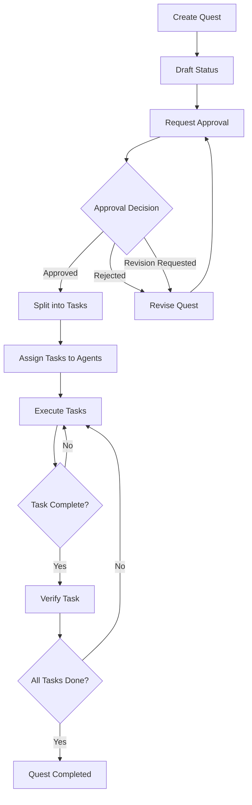

# Quest Workflow Guide

## Overview

The Quest system provides a structured workflow for managing software development projects from requirements to completion. This guide explains the complete workflow, best practices, and how to use the system effectively.

## Workflow Sequence



## Detailed Workflow Phases

### Phase 1: Quest Creation

**Tools:**
- `quest_create` - Create new quest with requirements and design
- `quest_create_from_template` - Use predefined templates

**Best Practices:**
- Write clear, detailed requirements
- Include acceptance criteria
- Specify technical constraints
- Define success metrics

**Example:**
```typescript
await quest_create({
  questName: "User Authentication System",
  description: "Implement JWT-based authentication",
  requirements: "# Requirements\n- User login/logout\n- Token refresh\n- Password reset",
  design: "# Design\n- JWT tokens\n- Redis for sessions\n- bcrypt for passwords",
  conversationContext: {
    platform: "discord",
    channelId: "123456",
    userId: "user-789"
  }
});
```

### Phase 2: Approval Workflow

**Tools:**
- `quest_request_approval` - Submit quest for review
- `quest_submit_approval` - Approve/reject quest
- `quest_approval_status` - Check approval status
- `quest_revise` - Update quest after feedback

**Approval States:**
- `draft` → `pending_approval` → `approved`
- `draft` → `pending_approval` → `rejected`
- `draft` → `pending_approval` → `revision_requested` → `draft`

**Best Practices:**
- Request approval only when quest is complete
- Provide clear approval criteria
- Address all feedback in revisions
- **VERBAL APPROVAL NOT ACCEPTED** - must use tools

### Phase 3: Task Planning

**Tools:**
- `quest_split_tasks` - Break quest into executable tasks
- `quest_analyze_task` - Analyze task feasibility
- `quest_reflect_task` - Review and improve approach
- `quest_update_task` - Modify task details

**Task Structure:**
```typescript
{
  name: "Implement login endpoint",
  description: "Create POST /auth/login endpoint",
  implementationGuide: "- Validate credentials\n- Generate JWT\n- Return token",
  verificationCriteria: "- Returns 200 with token\n- Returns 401 for invalid credentials",
  dependencies: ["task-id-1"],
  relatedFiles: [
    { path: "src/auth/login.ts", type: "CREATE" },
    { path: "src/auth/jwt.ts", type: "REFERENCE" }
  ]
}
```

**Best Practices:**
- Keep tasks atomic (1-2 days of work)
- Define clear dependencies
- Specify verification criteria
- Include related files

### Phase 4: Task Execution

**Tools:**
- `quest_assign_tasks` - Assign tasks to agents
- `quest_get_task_details` - Get task information
- `quest_update_task_status` - Update progress
- `quest_submit_task_result` - Submit completed work

**Task Lifecycle:**
```
pending → in_progress → completed
pending → in_progress → failed
```

**Best Practices:**
- Update status regularly
- Document implementation decisions
- Test thoroughly before submission
- Include artifacts (code, docs, tests)

### Phase 5: Verification & Completion

**Tools:**
- `quest_verify_task` - Verify task completion
- `quest_log_implementation` - Document implementation
- `quest_get_status` - Check overall progress

**Verification Criteria:**
- All requirements met
- Tests passing
- Code quality standards met
- Documentation complete

### Phase 6: Maintenance

**Tools:**
- `quest_clear_completed` - Archive old quests
- `quest_delete_quest` - Remove draft/rejected quests
- `quest_cancel_quest` - Cancel active quests

## Agent Management

### Registration & Monitoring

**Tools:**
- `quest_register_agent` - Register new agent
- `quest_agent_heartbeat` - Send status updates (every 30s)
- `quest_unregister_agent` - Graceful shutdown
- `quest_list_agents` - View all agents

**Agent Lifecycle:**
```typescript
// Registration
await quest_register_agent({
  agentId: "agent-001",
  name: "TypeScript Agent",
  role: "developer",
  capabilities: ["TypeScript", "React", "Node.js"],
  maxConcurrentTasks: 3
});

// Heartbeat (every 30 seconds)
await quest_agent_heartbeat({
  agentId: "agent-001",
  status: "busy",
  currentTasks: ["task-123", "task-456"],
  timestamp: new Date().toISOString()
});

// Shutdown
await quest_unregister_agent({
  agentId: "agent-001",
  reason: "normal shutdown"
});
```

## Advanced Features

### Task Analysis & Reflection

**Workflow:**
1. `quest_analyze_task` - Deep analysis before implementation
2. Implement the task
3. `quest_reflect_task` - Critical review and improvement

**Benefits:**
- Identify risks early
- Optimize approach
- Improve code quality
- Learn from experience

### Implementation Logging

**Tool:** `quest_log_implementation`

**Purpose:**
- Create searchable knowledge base
- Document technical decisions
- Share solutions across team
- Enable code reuse

**Artifacts:**
- API endpoints
- Components
- Functions
- Classes
- Integrations

### Task Search

**Tool:** `quest_query_tasks`

**Search Modes:**
- UUID exact match
- Keyword fuzzy search
- Filter by status, agent, quest

## Dashboard

**URL:** `http://localhost:3001` (default)

**Features:**
- Real-time quest status
- Task progress tracking
- Agent availability
- Approval workflow
- WebSocket updates

## Best Practices Summary

### Quest Creation
✅ Write detailed requirements
✅ Include acceptance criteria
✅ Specify technical constraints
❌ Don't skip design phase

### Approval Process
✅ Use tools for all approvals
✅ Address all feedback
✅ Keep revision history
❌ Don't accept verbal approvals

### Task Planning
✅ Keep tasks atomic
✅ Define clear dependencies
✅ Specify verification criteria
❌ Don't create overly complex tasks

### Task Execution
✅ Update status regularly
✅ Document decisions
✅ Test thoroughly
❌ Don't skip verification

### Agent Management
✅ Send heartbeats every 30s
✅ Unregister on shutdown
✅ Monitor agent health
❌ Don't ignore offline agents

## Common Workflows

### Creating a New Feature

1. Create quest with requirements
2. Request approval
3. Split into tasks
4. Analyze critical tasks
5. Assign to agents
6. Execute and verify
7. Log implementation
8. Complete quest

### Handling Rejections

1. Review rejection feedback
2. Revise requirements/design
3. Request approval again
4. Continue workflow

### Managing Failed Tasks

1. Review failure reason
2. Update task details
3. Reassign or retry
4. Verify completion

## Troubleshooting

### Quest Stuck in Pending Approval
- Check approval history: `quest_approval_status`
- Verify approvers are notified
- Follow up in conversation channel

### Task Dependencies Blocking Progress
- Review dependency graph
- Check if dependencies are completed
- Consider updating dependencies

### Agent Not Receiving Tasks
- Verify agent is registered: `quest_list_agents`
- Check agent status (available vs busy)
- Verify maxConcurrentTasks not exceeded

## Support

For issues or questions:
- Check dashboard for real-time status
- Review quest details: `quest_get_details`
- Check task status: `quest_get_task_details`
- Monitor agent health: `quest_list_agents`

---

**Last Updated:** 2026-01-26
**Version:** 1.0.0
