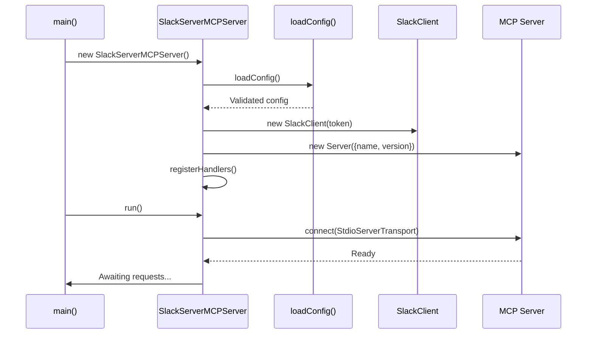

# src/ - Core MCP Server Implementation

[Root Directory](../CLAUDE.md) > **src**

---

## Module Responsibilities

This module contains the complete MCP Slack Server implementation in a single, self-contained file. It provides:

- MCP protocol handling (stdio transport)
- Slack Web API client wrapper
- Channel name resolution with caching
- Input validation via Zod schemas
- Tool registration and execution (`send_message`, `send_reply`)

---

## Entry and Startup

**Entry Point:** `index.ts`

### Startup Flow



### Initialization Process

1. **Configuration Loading** (`loadConfig()`)
   - Load environment variables via `dotenv`
   - Validate with `ConfigSchema` (Zod)
   - Fail fast if `SLACK_BOT_TOKEN` missing or invalid

2. **Slack Client Initialization**
   - Create `WebClient` with bot token
   - Initialize empty channel cache (`Map<string, string>`)

3. **MCP Server Registration**
   - Register `ListToolsRequestSchema` handler
   - Register `CallToolRequestSchema` handler
   - Expose `send_message` and `send_reply` tools

4. **Transport Connection**
   - Connect to stdio transport
   - Await incoming MCP requests

---

## External Interfaces

### MCP Tools

#### 1. `send_message`

**Purpose:** Send a message to a Slack channel or thread

**Input Schema (Zod):**
```typescript
{
  channel: string;    // Channel ID or name (e.g., "#general", "C09T6RU41HP")
  text: string;       // Message text
  thread_ts?: string; // Optional thread timestamp
}
```

**Success Response:**
```json
{
  "success": true,
  "message": "Message sent successfully",
  "timestamp": "1234567890.123456",
  "channel": "C09T6RU41HP"
}
```

**Error Response:**
```json
{
  "success": false,
  "error": "Failed to resolve channel '#invalid': Channel not found"
}
```

**Implementation:** `handleSendMessage()` method

---

#### 2. `send_reply`

**Purpose:** Reply to an existing message in a thread

**Input Schema (Zod):**
```typescript
{
  channel: string;   // Channel ID (e.g., "C09T6RU41HP")
  thread_ts: string; // Thread timestamp to reply to
  text: string;      // Reply text
}
```

**Success Response:**
```json
{
  "success": true,
  "message": "Reply sent successfully",
  "timestamp": "1234567890.654321",
  "channel": "C09T6RU41HP",
  "thread_ts": "1234567890.123456"
}
```

**Error Response:**
```json
{
  "success": false,
  "error": "Failed to send message: channel_not_found"
}
```

**Implementation:** `handleSendReply()` method (delegates to `SlackClient.sendReply()`)

---

### Slack API Endpoints Used

| Endpoint | Method | Purpose |
|----------|--------|---------|
| `conversations.list` | GET | Resolve channel names to IDs |
| `chat.postMessage` | POST | Send message to channel/thread |

**Authentication:** Bot User OAuth Token (`xoxb-...`)

---

## Key Dependencies and Configuration

### Production Dependencies

```json
{
  "@modelcontextprotocol/sdk": "^1.0.4",  // MCP protocol implementation
  "@slack/web-api": "^7.11.0",            // Official Slack client
  "dotenv": "^16.4.7",                    // Environment variable loader
  "zod": "^3.24.1"                        // Schema validation
}
```

### Development Dependencies

```json
{
  "@types/node": "^22.10.2",   // Node.js type definitions
  "tsx": "^4.19.2",            // TypeScript execution engine
  "typescript": "^5.7.2"       // TypeScript compiler
}
```

### Configuration Schema

**Environment Variables:**

```typescript
const ConfigSchema = z.object({
  SLACK_BOT_TOKEN: z.string().startsWith('xoxb-'),
  MCP_LOG_LEVEL: z.enum(['debug', 'info', 'warn', 'error']).default('info'),
});
```

**Validation:** Performed at startup; fails with error if invalid.

---

## Data Models

### Internal Types

#### Config
```typescript
type Config = {
  SLACK_BOT_TOKEN: string;  // Slack bot OAuth token
  MCP_LOG_LEVEL: 'debug' | 'info' | 'warn' | 'error';
};
```

#### SendMessageInput
```typescript
type SendMessageInput = {
  channel: string;
  text: string;
  thread_ts?: string;
};
```

#### SendReplyInput
```typescript
type SendReplyInput = {
  channel: string;
  thread_ts: string;
  text: string;
};
```

#### SlackMessageResult
```typescript
type SlackMessageResult = {
  ts: string;      // Message timestamp (ID)
  channel: string; // Channel ID
};
```

### Channel Cache

**Type:** `Map<string, string>`
**Purpose:** Cache channel name → ID mappings to reduce API calls

**Example:**
```typescript
channelCache = {
  "general" → "C09T6RU41HP",
  "random" → "C09T6RU42QJ",
  "support" → "C09T6RU43KL"
}
```

**Invalidation:** Cache persists for server lifetime (reset on restart)

---

## Class Architecture

### SlackClient

**Responsibilities:**
- Slack Web API interaction
- Channel name resolution
- Channel cache management
- Message sending with thread support

**Public Methods:**

```typescript
class SlackClient {
  constructor(token: string);

  async sendMessage(
    channel: string,
    text: string,
    thread_ts?: string
  ): Promise<{ ts: string; channel: string }>;

  async sendReply(
    channel: string,
    thread_ts: string,
    text: string
  ): Promise<{ ts: string; channel: string }>;
}
```

**Private Methods:**

```typescript
private async resolveChannelId(channel: string): Promise<string>;
```

**Channel Resolution Logic:**
1. If channel starts with `C` or `D` → assume ID, return as-is
2. Strip `#` prefix from name
3. Check cache for cached mapping
4. If miss: call `conversations.list` API
5. Build cache from response
6. Lookup name in cache
7. Throw error if not found

---

### SlackServerMCPServer

**Responsibilities:**
- MCP server lifecycle management
- Tool registration
- Request routing
- Error handling

**Public Methods:**

```typescript
class SlackServerMCPServer {
  constructor();
  async run(): Promise<void>;
}
```

**Private Methods:**

```typescript
private registerHandlers(): void;
private async handleSendMessage(args: unknown): Promise<MCPResponse>;
private async handleSendReply(args: unknown): Promise<MCPResponse>;
```

**Handler Registration:**
- `ListToolsRequestSchema` → Returns tool definitions
- `CallToolRequestSchema` → Routes to appropriate handler

---

## Testing and Quality

### Current State

**Test Coverage:** 0% (no tests exist)

**Quality Checks:**
- TypeScript strict mode enabled
- Zod runtime validation
- Explicit error handling with structured responses

### Recommended Test Coverage

**Unit Tests:**

1. **Configuration Loading**
   ```typescript
   describe('loadConfig', () => {
     it('should throw error if SLACK_BOT_TOKEN missing');
     it('should throw error if token does not start with xoxb-');
     it('should default MCP_LOG_LEVEL to "info"');
   });
   ```

2. **Channel Resolution**
   ```typescript
   describe('SlackClient.resolveChannelId', () => {
     it('should return ID unchanged if starts with C or D');
     it('should strip # prefix from channel names');
     it('should cache channel ID after first lookup');
     it('should throw error for non-existent channels');
   });
   ```

3. **Tool Input Validation**
   ```typescript
   describe('SendMessageInputSchema', () => {
     it('should validate required fields');
     it('should accept optional thread_ts');
     it('should reject invalid types');
   });
   ```

**Integration Tests:**

1. **Slack API Mocking** (using `nock` or `msw`)
   ```typescript
   describe('SlackClient.sendMessage', () => {
     it('should call chat.postMessage with correct parameters');
     it('should handle Slack API errors gracefully');
   });
   ```

2. **MCP Protocol Compliance**
   ```typescript
   describe('MCP Server', () => {
     it('should list available tools');
     it('should execute send_message tool');
     it('should return error for unknown tools');
   });
   ```

---

## FAQ

### Why is channel resolution cached?

To reduce API calls and improve performance. The `conversations.list` endpoint is rate-limited and returns large payloads. Caching avoids repeated lookups for the same channel names.

**Trade-off:** Cache doesn't invalidate if channels are renamed. Restart server to refresh cache.

---

### Why separate `send_message` and `send_reply` tools?

**Historical Reason:** Separate tools provide clearer intent in agent workflows.

**Implementation Note:** Both tools use the same underlying `sendMessage()` method. The `send_reply` tool enforces `thread_ts` as required.

**Alternative Approach:** Could merge into single tool with optional `thread_ts`. Kept separate for API clarity.

---

### How does error handling work?

**Strategy:** All errors are caught and returned as JSON responses:

```typescript
{
  "success": false,
  "error": "Human-readable error message"
}
```

**Logging:** Errors are also logged to stderr with `❌` prefix.

**No Exceptions:** Tool handlers never throw exceptions to MCP layer; always return structured responses.

---

### Can this server receive Slack events?

**No.** This server is send-only (stateless design). For receiving events:

- Use **MCP_Slack_Client** (companion project)
- Implements Socket Mode or Events API
- Provides `get_mentions` tool for reading incoming messages

---

### How to add support for attachments or rich formatting?

**Extension Point:** Modify `SendMessageInputSchema` to accept additional fields:

```typescript
const SendMessageInputSchema = z.object({
  channel: z.string(),
  text: z.string(),
  thread_ts: z.string().optional(),

  // New fields:
  blocks: z.array(z.any()).optional(),  // Block Kit UI
  attachments: z.array(z.any()).optional(),
});
```

Update `SlackClient.sendMessage()` to pass these to `chat.postMessage()`.

---

## Related Files

| File | Purpose |
|------|---------|
| `../package.json` | Dependency versions and npm scripts |
| `../tsconfig.json` | TypeScript compiler settings |
| `../.env.example` | Environment variable template |
| `../Dockerfile.build` | Container build instructions |
| `../start.sh` | Production startup script |

---

## Changelog

- **2025-11-24**: Initial module documentation generated
